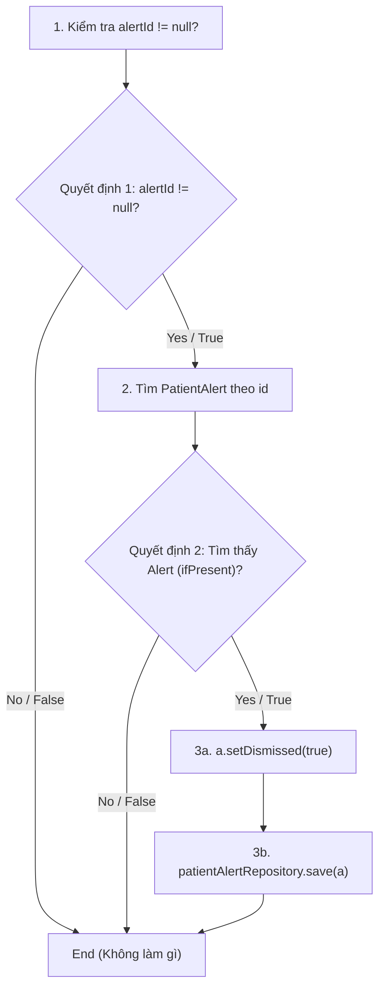
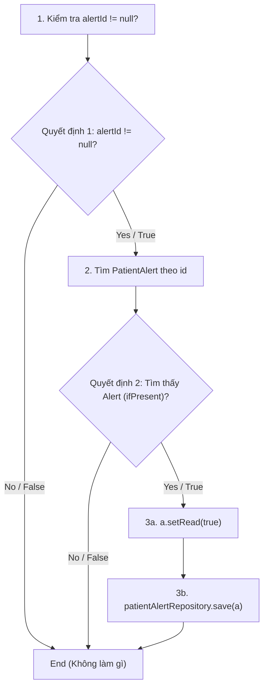
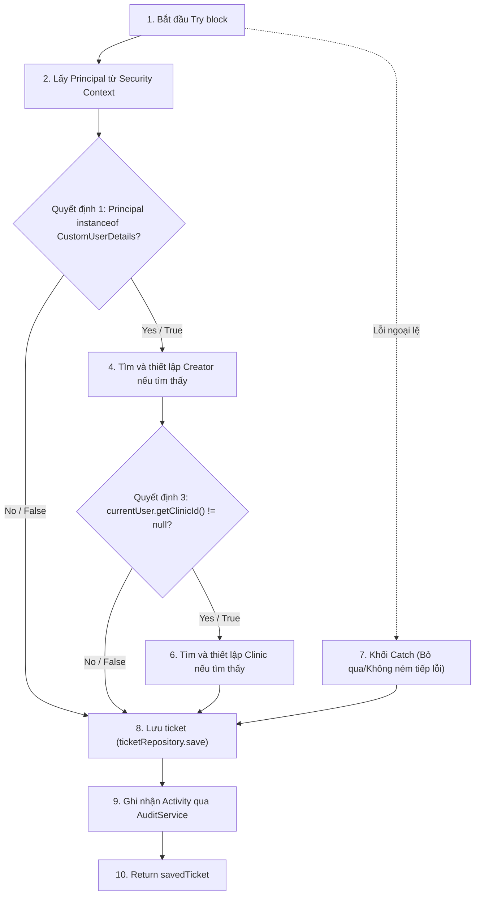
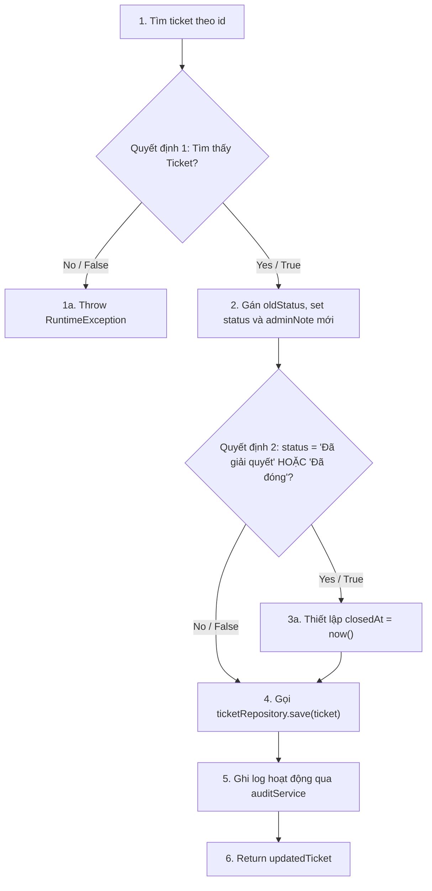
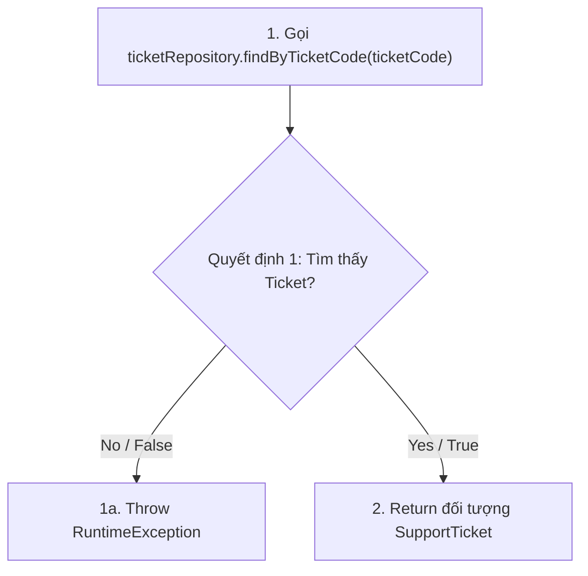
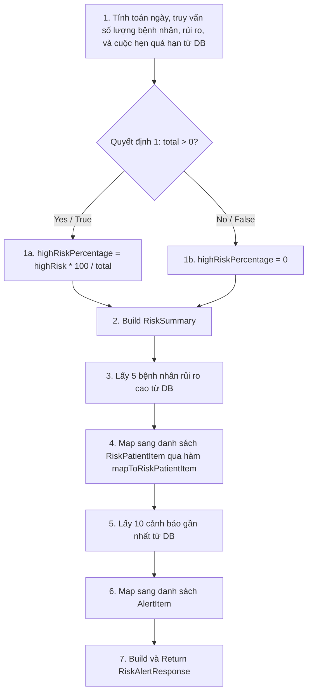

# ĐẶC TẢ KIỂM THỬ HỘP TRẮNG TOÀN DIỆN (COMPREHENSIVE WHITE-BOX TESTING SPECIFICATION)
## PHÂN HỆ: RISK ALERTS & SUPPORT TICKETS

Tài liệu này cung cấp thiết kế kiểm thử hộp trắng chi tiết cho **6 phương thức** thuộc `RiskAlertServiceImpl` và `SupportTicketServiceImpl` đáp ứng đầy đủ các tiêu chuẩn kiểm thử:
1. **Control Flow Testing (Kiểm thử dòng điều khiển)**
   - **Statement Testing** (Bao phủ câu lệnh)
   - **Branch / Decision Testing** (Bao phủ nhánh / quyết định)
   - **Branch Condition Testing** (Bao phủ điều kiện đơn)
   - **Branch Condition Combination Testing** (Bao phủ tổ hợp điều kiện)
2. **Data Flow Testing (Kiểm thử dòng dữ liệu)**
   - Định nghĩa các điểm xác định biến (**Def**) và sử dụng biến (**Use**).
   - Thiết kế các đường đi dòng dữ liệu (**DU-path**).

---

## 🗺️ DANH SÁCH 6 PHƯƠNG THỨC KIỂM THỬ
1. `dismissAlert(Long alertId)` (trong `RiskAlertServiceImpl`)
2. `markAlertAsRead(Long alertId)` (trong `RiskAlertServiceImpl`)
3. `createTicket(SupportTicket ticket)` (trong `SupportTicketServiceImpl`)
4. `updateTicketStatus(Long id, String status, String adminNote)` (trong `SupportTicketServiceImpl`)
5. `getTicketByCode(String ticketCode)` (trong `SupportTicketServiceImpl`)
6. `getRiskAlertDashboard(Long clinicId)` (trong `RiskAlertServiceImpl`)

---

## 1. Phương thức `dismissAlert(Long alertId)`

### 1.1. Mã nguồn & Đồ thị dòng điều khiển (CFG)
```java
@Override
@Transactional
public void dismissAlert(Long alertId) {
    if (alertId != null) { // Node 1 (Quyết định 1)
        patientAlertRepository.findById(alertId).ifPresent(a -> { // Node 2 (Quyết định 2)
            a.setDismissed(true); // Node 3a
            patientAlertRepository.save(a); // Node 3b
        });
    }
}
```



### 1.2. Control Flow Testing

#### A. Statement & Branch/Decision Testing
Thiết kế các ca kiểm thử để đi qua toàn bộ các nút lệnh (Nodes) và nhánh rẽ (True/False):

| Mã TC | Dữ liệu đầu vào (Input) | Nhánh đi qua (Path) | Độ bao phủ câu lệnh | Độ bao phủ nhánh | Kết quả mong đợi |
| :--- | :--- | :--- | :--- | :--- | :--- |
| **TC-WB-DA-01** | `alertId` = `null` | `Dec1(No)` | Node 1 | Nhánh `False` (Dec1) | Hàm kết thúc ngay lập tức, không thao tác repository |
| **TC-WB-DA-02** | `alertId` = 999 (Không tồn tại trong DB) | `Dec1(Yes) -> Node 2 -> Dec2(No)` | Node 1, Node 2 | Nhánh `True` (Dec1), `False` (Dec2) | Tìm kiếm DB rỗng, không thay đổi cờ dismissed |
| **TC-WB-DA-03** | `alertId` = 1 (Tồn tại trong DB) | `Dec1(Yes) -> Node 2 -> Dec2(Yes) -> Node 3a -> Node 3b` | Toàn bộ Nodes | Nhánh `True` (Dec1), `True` (Dec2) | Đặt cờ `dismissed = true` và lưu lại vào DB |

### 1.3. Data Flow Testing (Kiểm thử dòng dữ liệu)
| Biến | Điểm định nghĩa (Def) | Điểm sử dụng (Use) | Loại sử dụng | DU-path kiểm tra | Mã TC kiểm tra |
| :--- | :--- | :--- | :--- | :--- | :--- |
| `alertId` | Khai báo tham số đầu vào | `alertId != null` và `findById(alertId)` | C-use (Điều kiện & Tham số) | `Tham số -> Dec1`, `Tham số -> Node 2` | TC-WB-DA-01, TC-WB-DA-02, TC-WB-DA-03 |
| `a` | Lấy từ `ifPresent` | `a.setDismissed(true)` và `save(a)` | C-use | `Node 2 -> Node 3a`, `Node 2 -> Node 3b` | TC-WB-DA-03 |

---

## 2. Phương thức `markAlertAsRead(Long alertId)`

### 2.1. Mã nguồn & Đồ thị dòng điều khiển (CFG)
```java
@Override
@Transactional
public void markAlertAsRead(Long alertId) {
    if (alertId != null) { // Node 1 (Quyết định 1)
        patientAlertRepository.findById(alertId).ifPresent(a -> { // Node 2 (Quyết định 2)
            a.setRead(true); // Node 3a
            patientAlertRepository.save(a); // Node 3b
        });
    }
}
```



### 2.2. Control Flow Testing

#### A. Statement & Branch/Decision Testing
| Mã TC | Dữ liệu đầu vào (Input) | Nhánh đi qua (Path) | Độ bao phủ câu lệnh | Độ bao phủ nhánh | Kết quả mong đợi |
| :--- | :--- | :--- | :--- | :--- | :--- |
| **TC-WB-MAR-01** | `alertId` = `null` | `Dec1(No)` | Node 1 | Nhánh `False` (Dec1) | Hàm kết thúc ngay lập tức |
| **TC-WB-MAR-02** | `alertId` = 999 (Không tồn tại) | `Dec1(Yes) -> Node 2 -> Dec2(No)` | Node 1, Node 2 | Nhánh `True` (Dec1), `False` (Dec2) | Không thay đổi cờ read |
| **TC-WB-MAR-03** | `alertId` = 1 (Tồn tại) | `Dec1(Yes) -> Node 2 -> Dec2(Yes) -> Node 3a -> Node 3b` | Toàn bộ Nodes | Nhánh `True` (Dec1), `True` (Dec2) | Đặt cờ `read = true` và lưu vào DB |

### 2.3. Data Flow Testing
| Biến | Điểm định nghĩa (Def) | Điểm sử dụng (Use) | Loại sử dụng | DU-path kiểm tra | Mã TC kiểm tra |
| :--- | :--- | :--- | :--- | :--- | :--- |
| `alertId` | Khai báo tham số đầu vào | `alertId != null` và `findById(alertId)` | C-use | `Tham số -> Dec1`, `Tham số -> Node 2` | TC-WB-MAR-01, TC-WB-MAR-02, TC-WB-MAR-03 |
| `a` | Lấy từ `ifPresent` | `a.setRead(true)` và `save(a)` | C-use | `Node 2 -> Node 3a`, `Node 2 -> Node 3b` | TC-WB-MAR-03 |

---

## 3. Phương thức `createTicket(SupportTicket ticket)`

### 3.1. Mã nguồn & Đồ thị dòng điều khiển (CFG)
```java
@Override
@Transactional
public SupportTicket createTicket(SupportTicket ticket) {
    try { // Node 1
        Object rawPrincipal = SecurityContextHolder.getContext().getAuthentication().getPrincipal(); // Node 2
        if (rawPrincipal instanceof CustomUserDetails currentUser) { // Node 3 (Quyết định 1)
            userRepository.findById(currentUser.getId()).ifPresent(ticket::setCreator); // Node 4 (Quyết định 2)
            if (currentUser.getClinicId() != null) { // Node 5 (Quyết định 3)
                clinicRepository.findById(currentUser.getClinicId()).ifPresent(ticket::setClinic); // Node 6 (Quyết định 4)
            }
        }
    } catch (Exception e) { // Node 7 (Catch)
        // Fallback for test contexts
    }

    SupportTicket savedTicket = ticketRepository.save(Objects.requireNonNull(ticket)); // Node 8
    
    auditService.recordActivity( // Node 9
        "CREATE_TICKET",
        "SUPPORT",
        "Yêu cầu hỗ trợ mới: " + savedTicket.getSubject(),
        "SUCCESS"
    );
    
    return savedTicket; // Node 10
}
```



### 3.2. Control Flow Testing

#### A. Statement & Branch/Decision Testing
| Mã TC | Trạng thái bảo mật (Security Context) | Nhánh đi qua (Path) | Độ bao phủ câu lệnh | Độ bao phủ nhánh | Kết quả mong đợi |
| :--- | :--- | :--- | :--- | :--- | :--- |
| **TC-WB-CT-01** | Khách vãng lai (`rawPrincipal` là `String` hoặc `Anonymous`) | `1 -> 2 -> Dec1(No) -> 8 -> 9 -> 10` | Toàn bộ trừ Node 4, 5, 6, 7 | `False` (Dec1) | Lưu ticket không kèm theo thông tin creator và clinic, ghi nhận audit thành công |
| **TC-WB-CT-02** | Đăng nhập hợp lệ, có `clinicId` | `1 -> 2 -> Dec1(Yes) -> 4 -> Dec3(Yes) -> 6 -> 8 -> 9 -> 10` | Toàn bộ trừ Node 7 | `True` (Dec1), `True` (Dec3) | Lưu ticket và điền thông tin Creator & Clinic |
| **TC-WB-CT-03** | Đăng nhập hợp lệ, `clinicId` bằng `null` | `1 -> 2 -> Dec1(Yes) -> 4 -> Dec3(No) -> 8 -> 9 -> 10` | Toàn bộ trừ Node 6, 7 | `True` (Dec1), `False` (Dec3) | Lưu ticket và điền thông tin Creator, bỏ trống Clinic |
| **TC-WB-CT-04** | Security Context ném Exception (ví dụ: `NullPointerException` khi lấy Authentication) | `1 -> 7 (Catch) -> 8 -> 9 -> 10` | Node 1, 7, 8, 9, 10 | Đi vào khối Catch | Bắt lỗi ở try-catch, tiếp tục lưu ticket thành công |

### 3.3. Data Flow Testing
| Biến | Điểm định nghĩa (Def) | Điểm sử dụng (Use) | Loại sử dụng | DU-path kiểm tra | Mã TC kiểm tra |
| :--- | :--- | :--- | :--- | :--- | :--- |
| `ticket` | Khai báo tham số đầu vào | `setCreator()`, `setClinic()`, `save(ticket)` | C-use | `Tham số -> Node 4`, `Tham số -> Node 6`, `Tham số -> Node 8` | TC-WB-CT-01, TC-WB-CT-02, TC-WB-CT-03 |
| `rawPrincipal` | Dòng `SecurityContextHolder.getContext()...getPrincipal()` | `rawPrincipal instanceof CustomUserDetails` | C-use (Điều kiện) | `Node 2 -> Dec1` | TC-WB-CT-01, TC-WB-CT-02 |
| `currentUser` | Gán tự động khi khớp kiểu (Dòng 35) | `currentUser.getId()`, `currentUser.getClinicId()` | C-use | `Dec1 -> Node 4`, `Dec1 -> Dec3`, `Dec1 -> Node 6` | TC-WB-CT-02, TC-WB-CT-03 |
| `savedTicket` | Lấy từ kết quả `ticketRepository.save()` | `savedTicket.getSubject()`, và trả về | C-use | `Node 8 -> Node 9`, `Node 8 -> Node 10` | TC-WB-CT-01 |

---

## 4. Phương thức `updateTicketStatus(Long id, String status, String adminNote)`

### 4.1. Mã nguồn & Đồ thị dòng điều khiển (CFG)
```java
@Override
@Transactional
public SupportTicket updateTicketStatus(Long id, String status, String adminNote) {
    SupportTicket ticket = ticketRepository.findById(Objects.requireNonNull(id)) // Node 1
        .orElseThrow(() -> new RuntimeException("Không tìm thấy yêu cầu hỗ trợ")); // Node 1a (Quyết định 1)
    
    String oldStatus = ticket.getStatus(); // Node 2
    ticket.setStatus(status);
    ticket.setAdminNote(adminNote);
    
    if ("Đã giải quyết".equals(status) || "Đã đóng".equals(status)) { // Node 3 (Quyết định 2)
        ticket.setClosedAt(LocalDateTime.now()); // Node 3a
    }
    
    SupportTicket updatedTicket = ticketRepository.save(ticket); // Node 4
    
    auditService.recordActivity( // Node 5
"UPDATE_TICKET_STATUS",
        "SUPPORT",
        String.format("Cập nhật trạng thái yêu cầu %s: %s -> %s", ticket.getTicketCode(), oldStatus, status),
        "SUCCESS"
    );
    
    return updatedTicket; // Node 6
}
```



### 4.2. Control Flow Testing

#### A. Statement & Branch/Decision Testing
| Mã TC | Dữ liệu đầu vào (Input) | Nhánh đi qua (Path) | Độ bao phủ câu lệnh | Độ bao phủ nhánh | Kết quả mong đợi |
| :--- | :--- | :--- | :--- | :--- | :--- |
| **TC-WB-UTS-01** | `id` = 999 (Không tồn tại) | `1 -> 1a` | Node 1, Node 1a | Nhánh `False` (Dec1) | Ném ra `RuntimeException("Không tìm thấy yêu cầu hỗ trợ")` |
| **TC-WB-UTS-02** | `id` = 1 (Tồn tại), `status` = "Đang xử lý" | `1 -> 2 -> Dec2(No) -> 4 -> 5 -> 6` | Toàn bộ trừ Node 3a | Nhánh `True` (Dec1), `False` (Dec2) | Cập nhật ticket bình thường, không gán thời gian đóng, ghi log thành công |
| **TC-WB-UTS-03** | `id` = 1 (Tồn tại), `status` = "Đã giải quyết" | `1 -> 2 -> Dec2(Yes) -> 3a -> 4 -> 5 -> 6` | Toàn bộ Nodes | Nhánh `True` (Dec1), `True` (Dec2) | Thiết lập `closedAt`, cập nhật trạng thái thành "Đã giải quyết", lưu vào DB |
| **TC-WB-UTS-04** | `id` = 1 (Tồn tại), `status` = "Đã đóng" | `1 -> 2 -> Dec2(Yes) -> 3a -> 4 -> 5 -> 6` | Toàn bộ Nodes | Nhánh `True` (Dec1), `True` (Dec2) | Thiết lập `closedAt`, cập nhật trạng thái thành "Đã đóng", lưu vào DB |

#### B. Branch Condition Testing (Kiểm thử điều kiện nhánh)
Xét quyết định phức tạp **Quyết định 2**: `"Đã giải quyết".equals(status) || "Đã đóng".equals(status)`
Gồm 2 điều kiện đơn:
- $C_1$: `"Đã giải quyết".equals(status)`
- $C_2$: `"Đã đóng".equals(status)`

Để bao phủ điều kiện, ta cần cả hai điều kiện đơn nhận các giá trị chân trị $\{T, F\}$:
- Ca 1: `status` = "Đã giải quyết" $\rightarrow C_1 = True$ (Không đánh giá $C_2$ do short-circuit).
- Ca 2: `status` = "Đã đóng" $\rightarrow C_1 = False$, $C_2 = True$.
- Ca 3: `status` = "Đang xử lý" $\rightarrow C_1 = False$, $C_2 = False$.

#### C. Branch Condition Combination Testing (Kiểm thử tổ hợp điều kiện nhánh)
| Tổ hợp | $C_1$ | $C_2$ | Kết quả Quyết định | Ca kiểm thử tương ứng |
| :--- | :--- | :--- | :--- | :--- |
| **Combo 1** | True | Not Evaluated | True | `status` = "Đã giải quyết" |
| **Combo 2** | False | True | True | `status` = "Đã đóng" |
| **Combo 3** | False | False | False | `status` = "Đang xử lý" |

### 4.3. Data Flow Testing
| Biến | Điểm định nghĩa (Def) | Điểm sử dụng (Use) | Loại sử dụng | DU-path kiểm tra | Mã TC kiểm tra |
| :--- | :--- | :--- | :--- | :--- | :--- |
| `ticket` | Tìm thấy ở DB (Dòng 60-61) | `getStatus()`, `setStatus()`, `save(ticket)`,... | C-use | `Node 1 -> Node 2`, `Node 1 -> Node 4` | TC-WB-UTS-02 |
| `oldStatus` | Gán từ `ticket.getStatus()` | Điền vào chuỗi log `recordActivity` | C-use | `Node 2 -> Node 5` | TC-WB-UTS-02 |

---

## 5. Phương thức `getTicketByCode(String ticketCode)`

### 5.1. Mã nguồn & Đồ thị dòng điều khiển (CFG)
```java
@Override
public SupportTicket getTicketByCode(String ticketCode) {
    return ticketRepository.findByTicketCode(ticketCode) // Node 1
        .orElseThrow(() -> new RuntimeException("Không tìm thấy mã yêu cầu " + ticketCode)); // Node 1a (Quyết định 1)
}
```



### 5.2. Control Flow Testing

#### A. Statement & Branch/Decision Testing
| Mã TC | Dữ liệu đầu vào (Input) | Nhánh đi qua (Path) | Kết quả mong đợi |
| :--- | :--- | :--- | :--- |
| **TC-WB-GTBC-01** | `ticketCode` = "TC-999" (Không tồn tại) | `1 -> 1a` | Ném ra `RuntimeException("Không tìm thấy mã yêu cầu TC-999")` |
| **TC-WB-GTBC-02** | `ticketCode` = "TC-001" (Tồn tại) | `1 -> 2` | Trả về thông tin của đối tượng `SupportTicket` tương ứng |

### 5.3. Data Flow Testing
| Biến | Điểm định nghĩa (Def) | Điểm sử dụng (Use) | Loại sử dụng | DU-path kiểm tra | Mã TC kiểm tra |
| :--- | :--- | :--- | :--- | :--- | :--- |
| `ticketCode` | Khai báo tham số đầu vào | `findByTicketCode(ticketCode)` và chuỗi ngoại lệ | C-use | `Tham số -> Node 1`, `Tham số -> Node 1a` | TC-WB-GTBC-01, TC-WB-GTBC-02 |

---

## 6. Phương thức `getRiskAlertDashboard(Long clinicId)`

### 6.1. Mã nguồn & Đồ thị dòng điều khiển (CFG)
```java
@Override
public RiskAlertResponse getRiskAlertDashboard(Long clinicId) {
    LocalDateTime now = LocalDateTime.now(); // Node 1
    LocalDateTime thirtyDaysAgo = now.minusDays(30);

    // Summary
    long total = patientRepository.countByClinicIdAndIsDeletedFalse(clinicId);
    long highRisk = patientRepository.countByClinicIdAndRiskLevelAndIsDeletedFalse(clinicId, "Rủi ro cao");
long midRisk = patientRepository.countByClinicIdAndRiskLevelAndIsDeletedFalse(clinicId, "Trung bình");
    long stableCount = patientRepository.countByClinicIdAndRiskLevelAndIsDeletedFalse(clinicId, "Ổn định");
    
    List<Long> unmonitoredIds = healthMetricRepository.findPatientIdsInClinicWithNoMetricsSince(clinicId, thirtyDaysAgo);
    long unmonitoredCount = unmonitoredIds.size();
    
    long overdueCount = appointmentRepository.countOverdueByClinicId(clinicId, now);

    RiskAlertResponse.RiskSummary summary = RiskAlertResponse.RiskSummary.builder()
            .totalPatients(total)
            .highRiskCount(highRisk)
            .mediumRiskCount(midRisk)
            .stableCount(stableCount)
            .unmonitoredCount(unmonitoredCount)
            .overdueAppointments(overdueCount)
            .highRiskPercentage(total > 0 ? (double) highRisk * 100 / total : 0) // Node 1a (Quyết định 1)
            .build(); // Node 2

    // High Risk Patients (top 5)
    Pageable topFive = PageRequest.of(0, 5);
    Page<Patient> highRiskPage = patientRepository.findByClinicIdAndFilters(clinicId, null, null, "Rủi ro cao", null, null, topFive); // Node 3
    
    List<RiskAlertResponse.RiskPatientItem> patientItems = highRiskPage.getContent().stream()
            .map(p -> mapToRiskPatientItem(p, clinicId))
            .collect(Collectors.toList()); // Node 4

    // Recent Alerts
    Pageable topTen = PageRequest.of(0, 10);
    List<PatientAlert> recentAlerts = patientAlertRepository.findRecentAlertsByClinic(clinicId, topTen); // Node 5
    
    List<RiskAlertResponse.AlertItem> alertItems = recentAlerts.stream()
            .map(this::mapToAlertItem)
            .collect(Collectors.toList()); // Node 6

    return RiskAlertResponse.builder()
            .summary(summary)
            .highRiskPatients(patientItems)
            .recentAlerts(alertItems)
            .build(); // Node 7
}
```



#### Chi tiết lô-gic hàm bổ trợ `mapToRiskPatientItem`
Hàm bổ trợ này chứa nhiều lô-gic rẽ nhánh quan trọng cần bao phủ kiểm thử:
- Quyết định M1: `lastMetric != null` ? (Gán dữ liệu Metric Status hoặc "Chưa có dữ liệu").
- Quyết định M2: `doctorId != null` ? (Nếu có thì truy cập `userRepository` để lấy tên, nếu không thì hiển thị "Chưa phân công").
- Quyết định M3: `nextApp != null` ? (Lấy thời gian hẹn từ danh sách).
- Quyết định M4: `nextApp != null && nextApp.getAppointmentTime().isBefore(now)` ? (Đặt cờ quá hạn cuộc hẹn `appointmentOverdue`).

### 6.2. Control Flow Testing

#### A. Statement & Branch/Decision Testing
| Mã TC | Trạng thái cơ sở dữ liệu | Nhánh đi qua (Path) | Kết quả mong đợi |
| :--- | :--- | :--- | :--- |
| **TC-WB-RAD-01** | `total` = 0 (Phòng khám chưa có bệnh nhân nào) | `Dec1(No) -> 1b -> 2 -> 3 -> 4 -> 5 -> 6 -> 7` | Trả về Dashboard với tỉ lệ rủi ro cao là `0%` |
| **TC-WB-RAD-02** | `total` > 0 (Có bệnh nhân), bệnh nhân rủi ro cao có đầy đủ bác sĩ, đo chỉ số y tế, và cuộc hẹn chưa quá hạn | `Dec1(Yes) -> 1a -> 2 -> 3 -> 4 -> 5 -> 6 -> 7` | Trả về tỉ lệ phần trăm chính xác. Danh sách rủi ro cao đầy đủ bác sĩ và thông số, cờ quá hạn cuộc hẹn là `false` |
| **TC-WB-RAD-03** | `total` > 0, bệnh nhân không được gán bác sĩ (`doctorId` = `null`), chưa đo chỉ số y tế (`lastMetric` = `null`), cuộc hẹn kế tiếp đã quá hạn | `Dec1(Yes) -> 1a -> 2 -> 3 -> 4 -> 5 -> 6 -> 7` | Trả về tỉ lệ chính xác. Bác sĩ của bệnh nhân rủi ro cao là "Chưa phân công", thông số cuối là "Chưa có dữ liệu", cờ quá hạn cuộc hẹn là `true` |

### 6.3. Data Flow Testing
| Biến | Điểm định nghĩa (Def) | Điểm sử dụng (Use) | Loại sử dụng | DU-path kiểm tra | Mã TC kiểm tra |
| :--- | :--- | :--- | :--- | :--- | :--- |
| `clinicId` | Tham số đầu vào | Điền vào các câu truy vấn repository | C-use | `Tham số -> Node 1`, `Tham số -> Node 3`, `Tham số -> Node 4` | TC-WB-RAD-01, TC-WB-RAD-02 |
| `total` | Đếm số lượng từ repo (Dòng 42) | So sánh `total > 0` và làm mẫu số chia | C-use & Điều kiện | `Node 1 -> Dec1`, `Node 1 -> Node 1a` | TC-WB-RAD-01, TC-WB-RAD-02 |
| `highRisk` | Đếm từ repo (Dòng 43) | Tính tỉ lệ phần trăm | C-use | `Node 1 -> Node 1a` | TC-WB-RAD-02 |