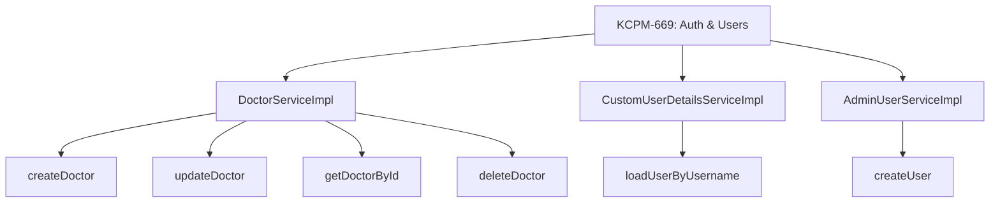
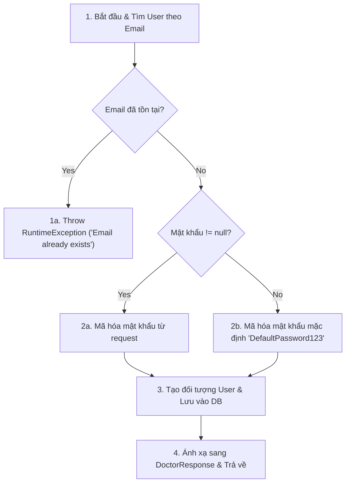
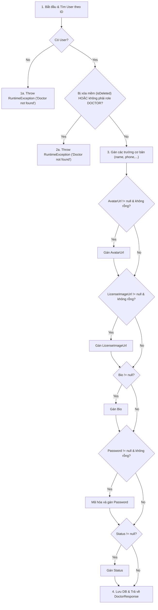
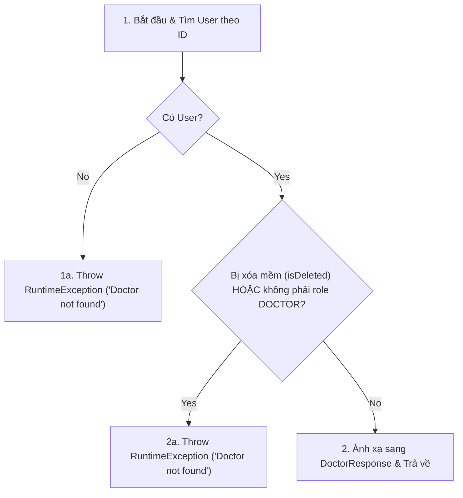
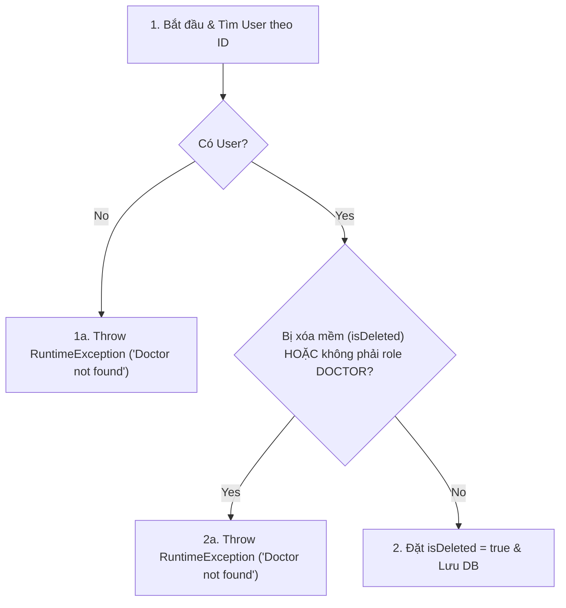
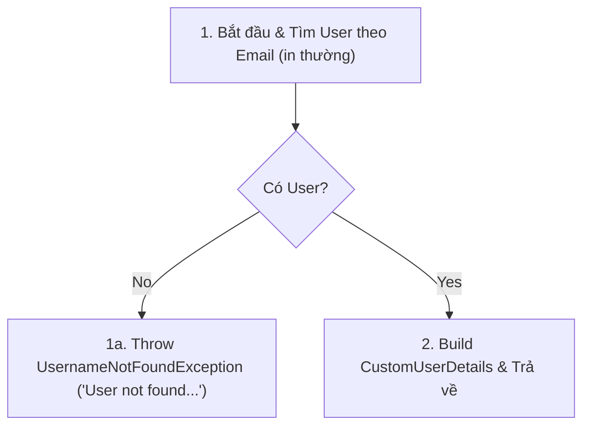
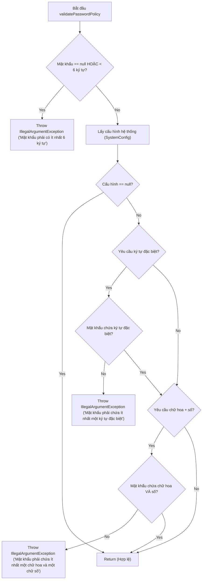
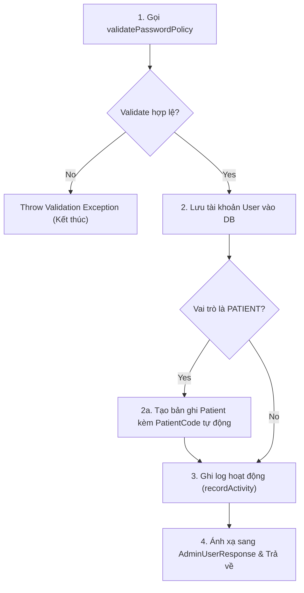

# ĐẶC TẢ KỊCH BẢN KIỂM THỬ (TEST SPECIFICATION) - PHÂN HỆ AUTH & USER

Tài liệu này đặc tả các kịch bản kiểm thử hộp trắng (White Box Testing) cho **6 phương thức (methods)** thuộc phân hệ **Authentication & User Management** theo Task **KCPM-669** phục vụ môn học Kiểm thử phần mềm.

Tài liệu được viết dưới định dạng Markdown (`.md`), áp dụng kỹ thuật vẽ đồ thị dòng điều khiển (Control Flow Graph - CFG) để thiết kế các ca kiểm thử đạt độ bao phủ tối đa (Statement, Branch, Path Coverage).

---

## 🗺️ Đồ thị Dòng công việc (Workflow Overview)



---

## 1. Kiểm thử lớp `DoctorServiceImpl`

### 1.1. Hàm `createDoctor(CreateDoctorRequest request)`

#### Mã nguồn:
```java
public DoctorResponse createDoctor(CreateDoctorRequest request) {
    if (userRepository.findByEmail(request.getEmail()).isPresent()) {
        throw new RuntimeException("Email already exists"); // (1)
    }
    User user = User.builder()
            .email(request.getEmail())
            .password(passwordEncoder.encode(request.getPassword() != null ? request.getPassword() : "DefaultPassword123")) // (2)
            .role(UserRole.DOCTOR)
            .fullName(request.getName())
            .phone(request.getPhone())
            .specialization(request.getSpecialty())
            .degree(request.getDegree())
            .experience(request.getExperience())
            .licenseNumber(request.getLicenseNumber())
            .status("ACTIVE")
            .avatarUrl(request.getAvatarUrl())
            .licenseImageUrl(request.getLicenseImageUrl())
            .bio(request.getBio())
            .build();
    User savedUser = userRepository.save(user); // (3)
    return mapToDoctorResponse(savedUser); // (4)
}
```

#### Đồ thị dòng điều khiển (CFG):



#### Các ca kiểm thử hộp trắng (White Box Test Cases):

| Mã TC | Mô tả ca kiểm thử | Dữ liệu đầu vào (Input) | Nhánh đi qua (Path Coverage) | Kết quả mong đợi (Expected Output) |
| :--- | :--- | :--- | :--- | :--- |
| **TC-WB-CD-01** | Trùng email bác sĩ | Email: `doctor@example.com` (Đã tồn tại trong DB) | `1 -> 1a (Kết thúc)` | Ném ra `RuntimeException("Email already exists")` |
| **TC-WB-CD-02** | Tạo thành công (có truyền mật khẩu) | Email chưa tồn tại, mật khẩu = `securePassword123` | `1 -> 2 -> 2a -> 3 -> 4` | Lưu thành công và mã hóa mật khẩu đã truyền |
| **TC-WB-CD-03** | Tạo thành công (mật khẩu bị null) | Email chưa tồn tại, mật khẩu = `null` | `1 -> 2 -> 2b -> 3 -> 4` | Lưu thành công và sử dụng mật khẩu mặc định |

---

### 1.2. Hàm `updateDoctor(Long id, CreateDoctorRequest request)`

#### Mã nguồn:
```java
public DoctorResponse updateDoctor(Long id, CreateDoctorRequest request) {
    User user = userRepository.findById(id)
            .orElseThrow(() -> new RuntimeException("Doctor not found")); // (1)
    if (user.isDeleted() || !UserRole.DOCTOR.equals(user.getRole())) {
        throw new RuntimeException("Doctor not found"); // (2)
    }

    user.setFullName(request.getName());
    user.setPhone(request.getPhone());
    user.setSpecialization(request.getSpecialty());
    user.setDegree(request.getDegree());
    user.setExperience(request.getExperience());
    user.setLicenseNumber(request.getLicenseNumber());
    if (request.getAvatarUrl() != null && !request.getAvatarUrl().isEmpty()) user.setAvatarUrl(request.getAvatarUrl());
    if (request.getLicenseImageUrl() != null && !request.getLicenseImageUrl().isEmpty()) user.setLicenseImageUrl(request.getLicenseImageUrl());
    if (request.getBio() != null) user.setBio(request.getBio());
    if (request.getPassword() != null && !request.getPassword().isEmpty()) user.setPassword(passwordEncoder.encode(request.getPassword()));
    if (request.getStatus() != null) user.setStatus(request.getStatus());

    User savedUser = userRepository.save(user); // (3)
    return mapToDoctorResponse(savedUser); // (4)
}
```

#### Đồ thị dòng điều khiển (CFG):



#### Các ca kiểm thử hộp trắng (White Box Test Cases):

| Mã TC | Mô tả ca kiểm thử | Dữ liệu đầu vào (Input) | Nhánh đi qua (Path Coverage) | Kết quả mong đợi (Expected Output) |
| :--- | :--- | :--- | :--- | :--- |
| **TC-WB-UD-01** | Bác sĩ không tồn tại | `id` = 999 (không có trong DB) | `1 -> 1a` | Ném ra `RuntimeException("Doctor not found")` |
| **TC-WB-UD-02** | Bác sĩ đã bị xóa mềm | Bác sĩ tồn tại nhưng `isDeleted` = `true` | `1 -> 2 -> 2a` | Ném ra `RuntimeException("Doctor not found")` |
| **TC-WB-UD-03** | ID thuộc role khác | ID tồn tại nhưng có role là `PATIENT` | `1 -> 2 -> 2a` | Ném ra `RuntimeException("Doctor not found")` |
| **TC-WB-UD-04** | Cập nhật thông tin thành công (đầy đủ các trường thay đổi) | Truyền đầy đủ request với avatar, license image, bio, password, status mới | `1 -> 2 -> 3 -> Các nhánh Yes -> 4` | Cập nhật tất cả các trường dữ liệu và mã hóa mật khẩu mới |
| **TC-WB-UD-05** | Cập nhật thông tin thành công (các trường bổ sung bị null/rỗng) | Request chỉ có name, phone, specialty,... còn avatar, license image, bio, password, status = `null` | `1 -> 2 -> 3 -> Các nhánh No -> 4` | Chỉ cập nhật các trường cơ bản, giữ nguyên các thông tin cũ |

---

### 1.3. Hàm `getDoctorById(Long id)`

#### Mã nguồn:
```java
public DoctorResponse getDoctorById(Long id) {
    User user = userRepository.findById(id)
            .orElseThrow(() -> new RuntimeException("Doctor not found")); // (1)
    if (user.isDeleted() || !UserRole.DOCTOR.equals(user.getRole())) {
        throw new RuntimeException("Doctor not found"); // (2)
    }
    return mapToDoctorResponse(user); // (3)
}
```

#### Đồ thị dòng điều khiển (CFG):



#### Các ca kiểm thử hộp trắng (White Box Test Cases):

| Mã TC | Mô tả ca kiểm thử | Dữ liệu đầu vào (Input) | Nhánh đi qua (Path Coverage) | Kết quả mong đợi (Expected Output) |
| :--- | :--- | :--- | :--- | :--- |
| **TC-WB-GD-01** | Không tìm thấy ID | `id` = 999 (không có trong DB) | `1 -> 1a` | Ném ra `RuntimeException("Doctor not found")` |
| **TC-WB-GD-02** | Bác sĩ đã bị xóa | `isDeleted` = `true` | `1 -> 2 -> 2a` | Ném ra `RuntimeException("Doctor not found")` |
| **TC-WB-GD-03** | Không đúng vai trò | Vai trò là `PATIENT` | `1 -> 2 -> 2a` | Ném ra `RuntimeException("Doctor not found")` |
| **TC-WB-GD-04** | Tìm thấy thành công | Bác sĩ hoạt động hợp lệ | `1 -> 2 -> 3` | Trả về `DoctorResponse` chứa thông tin bác sĩ |

---

### 1.4. Hàm `deleteDoctor(Long id)`

#### Mã nguồn:
```java
public void deleteDoctor(Long id) {
    User user = userRepository.findById(id)
            .orElseThrow(() -> new RuntimeException("Doctor not found")); // (1)
    if (user.isDeleted() || !UserRole.DOCTOR.equals(user.getRole())) {
        throw new RuntimeException("Doctor not found"); // (2)
    }
    user.setDeleted(true); // (3)
    userRepository.save(user); // (4)
}
```

#### Đồ thị dòng điều khiển (CFG):



#### Các ca kiểm thử hộp trắng (White Box Test Cases):

| Mã TC | Mô tả ca kiểm thử | Dữ liệu đầu vào (Input) | Nhánh đi qua (Path Coverage) | Kết quả mong đợi (Expected Output) |
| :--- | :--- | :--- | :--- | :--- |
| **TC-WB-DD-01** | Bác sĩ không tồn tại | `id` = 999 (không có trong DB) | `1 -> 1a` | Ném ra `RuntimeException("Doctor not found")` |
| **TC-WB-DD-02** | Bác sĩ đã bị xóa trước đó | Bác sĩ có cờ `isDeleted` = `true` | `1 -> 2 -> 2a` | Ném ra `RuntimeException("Doctor not found")` |
| **TC-WB-DD-03** | ID thuộc role khác | ID có role là `ADMIN` | `1 -> 2 -> 2a` | Ném ra `RuntimeException("Doctor not found")` |
| **TC-WB-DD-04** | Xóa mềm thành công | Bác sĩ hoạt động hợp lệ | `1 -> 2 -> 3` | Đối tượng User được gán `isDeleted` = `true` và lưu lại |

---

## 2. Kiểm thử lớp `CustomUserDetailsServiceImpl`

### 2.1. Hàm `loadUserByUsername(String email)`

#### Mã nguồn:
```java
public UserDetails loadUserByUsername(String email) throws UsernameNotFoundException {
    User user = userRepository.findByEmail(email.toLowerCase())
            .orElseThrow(() -> new UsernameNotFoundException("User not found with email: " + email)); // (1)

    return CustomUserDetails.builder()
            .id(user.getId())
            .email(user.getEmail())
            .fullName(user.getFullName())
            .password(user.getPassword())
            .clinicId(user.getClinicId())
            .role(user.getRole().name())
            .avatarUrl(user.getAvatarUrl())
            .authorities(Collections.singletonList(new SimpleGrantedAuthority("ROLE_" + user.getRole().name())))
            .build(); // (2)
}
```

#### Đồ thị dòng điều khiển (CFG):



#### Các ca kiểm thử hộp trắng (White Box Test Cases):

| Mã TC | Mô tả ca kiểm thử | Dữ liệu đầu vào (Input) | Nhánh đi qua (Path Coverage) | Kết quả mong đợi (Expected Output) |
| :--- | :--- | :--- | :--- | :--- |
| **TC-WB-LU-01** | Tìm kiếm email không tồn tại | Email: `nonexistent@example.com` | `1 -> 1a` | Ném ra `UsernameNotFoundException` |
| **TC-WB-LU-02** | Tìm kiếm thành công (Hoa/Thường) | Email: `DOCTOR@example.com` (Được lưu dưới dạng lowercase trong DB) | `1 -> 2` | Trả về `CustomUserDetails` chính xác và có quyền hạn `ROLE_DOCTOR` |

---

## 3. Kiểm thử lớp `AdminUserServiceImpl`

### 3.1. Hàm `createUser(CreateUserRequest request)`

#### Mã nguồn phụ thuộc - Hàm `validatePasswordPolicy(String password)`:
```java
private void validatePasswordPolicy(String password) {
    if (password == null || password.length() < 6) {
        throw new IllegalArgumentException("Mật khẩu phải có ít nhất 6 ký tự"); // (A)
    }

    SystemConfig config = systemConfigRepository.findFirstByOrderByIdAsc().orElse(null);
    if (config == null) return; // (B)

    if (config.isSpecialCharRequired()) {
        if (!password.matches(".*[!@#$%^&*()_+\\-=\\[\\]{};':\",.<>/?].*")) {
            throw new IllegalArgumentException("Mật khẩu phải chứa ít nhất một ký tự đặc biệt"); // (C)
        }
    }

    if (config.isUpperNumberRequired()) {
        if (!password.matches(".*[A-Z].*") || !password.matches(".*[0-9].*")) {
            throw new IllegalArgumentException("Mật khẩu phải chứa ít nhất một chữ hoa và một chữ số"); // (D)
        }
    }
}
```

#### Đồ thị dòng điều khiển (CFG) của `validatePasswordPolicy`:



#### Đồ thị dòng điều khiển (CFG) của `createUser`:



#### Các ca kiểm thử hộp trắng (White Box Test Cases):

| Mã TC | Mô tả ca kiểm thử | Dữ liệu đầu vào (Input) | Nhánh đi qua (Path Coverage) | Kết quả mong đợi (Expected Output) |
| :--- | :--- | :--- | :--- | :--- |
| **TC-WB-CU-01** | Mật khẩu quá ngắn | Password: `123` | `DecisionA: Yes` | Ném ra `IllegalArgumentException` ("Mật khẩu phải có ít nhất 6 ký tự") |
| **TC-WB-CU-02** | Thiếu ký tự đặc biệt | Password: `Password123` (Cấu hình yêu cầu ký tự đặc biệt) | `DecisionCReq: Yes -> DecisionCMatch: No` | Ném ra `IllegalArgumentException` ("Mật khẩu phải chứa ít nhất một ký tự đặc biệt") |
| **TC-WB-CU-03** | Thiếu chữ hoa/số | Password: `p@ssword` (Cấu hình yêu cầu chữ hoa + số) | `DecisionDReq: Yes -> DecisionDMatch: No` | Ném ra `IllegalArgumentException` ("Mật khẩu phải chứa ít nhất một chữ hoa và một chữ số") |
| **TC-WB-CU-04** | Cấu hình hệ thống rỗng | Password: `123456`, SystemConfig = `null` | `DecisionB: Yes` | Bỏ qua các bước kiểm tra phức tạp, tạo User thành công |
| **TC-WB-CU-05** | Tạo User là PATIENT | Role: `PATIENT`, Password hợp lệ | `DecisionVal: Yes -> DecisionRole: Yes` | Tạo thành công User + Bệnh nhân mới, ghi log "Tạo mới" |
| **TC-WB-CU-06** | Tạo User là DOCTOR | Role: `DOCTOR`, Password hợp lệ | `DecisionVal: Yes -> DecisionRole: No` | Tạo thành công User mới (không tạo Bệnh nhân), ghi log "Tạo mới" |
