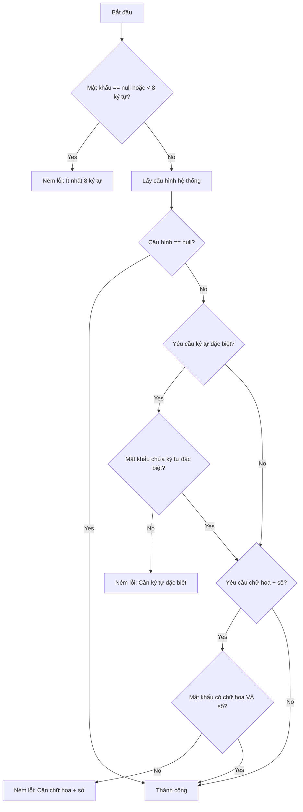

# TÀI LIỆU ĐẶC TẢ YÊU CẦU PHẦN MỀM (SOFTWARE REQUIREMENTS SPECIFICATION - SRS)
## HỆ THỐNG QUẢN LÝ BỆNH MÃN TÍNH TRỰC TUYẾN - DAMDIEP HEALTHCARE (CDM)

---

## 1. GIỚI THIỆU
Tài liệu Đặc tả Yêu cầu Phần mềm (Software Requirements Specification - SRS) này mô tả chi tiết các yêu cầu chức năng, phi chức năng, và kiến trúc hệ thống của **Hệ thống Quản lý Bệnh Mãn Tính Trực Tuyến DamDiep Healthcare**. Hệ thống được xây dựng nhằm hỗ trợ theo dõi, điều trị và chăm sóc sức khỏe chủ động cho bệnh nhân mắc các bệnh mãn tính (Tiểu đường, Tăng huyết áp, Tim mạch,...) thông qua sự kết nối chặt chẽ giữa Bệnh nhân, Bác sĩ và Cơ sở Y tế.

### 1.1 Mục đích tài liệu
Tài liệu SRS này được biên soạn nhằm các mục đích cụ thể sau:
*   **Xác định yêu cầu nghiệp vụ:** Định nghĩa rõ ràng và chi tiết toàn bộ các tính năng, luồng nghiệp vụ, và ràng buộc kỹ thuật của hệ thống DamDiep Healthcare.
*   **Cơ sở cam kết và phát triển:** Làm tài liệu tham chiếu chính thức và thống nhất giữa các bên liên quan, bao gồm Khách hàng (Phòng khám/Bệnh viện), Đội ngũ Phát triển Phần mềm (Developers), Đội ngũ Kiểm thử chất lượng (QA/QC), và Quản trị dự án (PM).
*   **Cơ sở thiết kế & Kiểm thử:** Cung cấp đầu vào chi tiết cho quá trình thiết kế cơ sở dữ liệu, thiết kế giao diện (UI/UX), xây dựng các kịch bản kiểm thử (Test Cases - bao gồm BVA & White-box), và tài liệu hướng dẫn sử dụng sau này.

### 1.2 Phạm vi hệ thống
Hệ thống DamDiep Healthcare là một nền tảng quản lý y tế kỹ thuật số chuyên sâu về bệnh mãn tính, vận hành trên mô hình **Client-Server** (Frontend React SPA / Backend Spring Boot REST API) với các đặc điểm phạm vi như sau:
*   **Sản phẩm cung cấp:**
    *   Cung cấp ứng dụng Web Responsive tối ưu trên cả máy tính (Desktop) cho Bác sĩ, Quản lý phòng khám, Quản trị viên và thiết bị di động (Mobile Web) cho Bệnh nhân.
    *   Hệ thống Backend xử lý dữ liệu tập trung, tích hợp các dịch vụ thông báo thời gian thực và phân tích dữ liệu tự động.
*   **Các phân hệ cốt lõi:**
    1.  **Quản lý Hồ sơ & Bệnh án điện tử:** Lưu trữ thông tin bệnh lý, lịch sử khám bệnh, toa thuốc số hóa.
    2.  **Theo dõi Chỉ số Sức khỏe:** Bệnh nhân cập nhật chỉ số hàng ngày (Đường huyết, Huyết áp, Nhịp tim, Cân nặng, SpO2) kèm hình ảnh minh chứng. Hệ thống tự động vẽ biểu đồ trực quan và đưa ra phân tích xu hướng tăng/giảm.
    3.  **Cảnh báo Tự động (Rule-based & AI-driven):** Tự động phân loại mức độ nguy cơ, phát hiện bất thường vượt ngưỡng mặc định hoặc bất thường kéo dài 3 ngày liên tiếp để thông báo khẩn cấp cho cả bệnh nhân và bác sĩ điều trị.
    4.  **Kết nối Real-time (Thời gian thực):** Kênh chat tương tác trực tiếp (gửi tin nhắn, hình ảnh, file tài liệu điều trị) giữa Bác sĩ và Bệnh nhân thông qua giao thức WebSocket (STOMP).
    5.  **Nhắc lịch & Quản lý thuốc:** Hệ thống lập lịch tự động (Scheduler) gửi thông báo nhắc nhở uống thuốc định kỳ, nhắc lịch tái khám tự động qua Zalo Notification (Zalo OA).
    6.  **Báo cáo & Phân tích (Analytics & Reports):** Cung cấp Dashboard đo lường hiệu suất bác sĩ, tỷ lệ bệnh nhân nguy cơ cao, tỷ lệ tuân thủ điều trị và hỗ trợ xuất báo cáo dữ liệu định dạng Excel server-side cho Quản lý phòng khám.
*   **Phạm vi ngoài hệ thống (Out of Scope):**
    *   Hệ thống không thay thế chẩn đoán lâm sàng trực tiếp của bác sĩ trong các trường hợp cấp cứu khẩn cấp.
    *   Việc tích hợp Zalo OA trong giai đoạn này sử dụng môi trường thử nghiệm và cấu hình quản trị (UI + Stub Service), việc kết nối API Zalo chính thức cần tài khoản Zalo Official Account đã được xác thực từ phía đối tác.

### 1.3 Đối tượng sử dụng
| Đối tượng | Vai trò & Mục đích sử dụng tài liệu |
| :--- | :--- |
| **Đội ngũ Quản lý Dự án (PM)** | Giám sát tiến độ phát triển, kiểm soát phạm vi yêu cầu (Scope) và lập kế hoạch bàn giao sản phẩm. |
| **Đội ngũ Thiết kế & Phát triển (UI/UX, Devs)** | Sử dụng làm tiêu chuẩn để thiết kế giao diện người dùng, lập trình cơ sở dữ liệu, xây dựng các API Backend và tích hợp giao diện Frontend. |
| **Đội ngũ kiểm thử (QA/QC)** | Sử dụng đặc tả yêu cầu chức năng để viết tài liệu kịch bản kiểm thử (Test Plan, Test Cases) nhằm đối chiếu và xác minh chất lượng phần mềm. |
| **Khách hàng & Đối tác (Cơ sở Y tế)** | Đọc hiểu và nghiệm thu các tính năng, đảm bảo hệ thống đáp ứng đúng yêu cầu vận hành thực tế tại phòng khám. |
| **Đội ngũ Vận hành & Hỗ trợ kỹ thuật** | Nắm bắt cấu hình hệ thống, ngưỡng cảnh báo, log kiểm toán (Audit Logs) để bảo trì và hỗ trợ người dùng cuối. |

### 1.4 Thuật ngữ và từ viết tắt
| Thuật ngữ / Viết tắt | Định nghĩa đầy đủ | Giải thích chi tiết |
| :--- | :--- | :--- |
| **SRS** | Software Requirements Specification | Tài liệu Đặc tả Yêu cầu Phần mềm. |
| **CDM** | Chronic Disease Management | Quản lý Bệnh Mãn Tính. |
| **UI / UX** | User Interface / User Experience | Giao diện người dùng / Trải nghiệm người dùng. |
| **API** | Application Programming Interface | Giao diện lập trình ứng dụng, phương thức kết nối giữa Frontend và Backend. |
| **Zalo OA** | Zalo Official Account | Trang thông tin chính thức của doanh nghiệp/phòng khám trên nền tảng Zalo, dùng để tương tác và gửi thông báo tự động cho bệnh nhân. |
| **WebSocket / STOMP** | Simple Text Oriented Messaging Protocol | Giao thức truyền tải thông điệp dạng văn bản hướng dòng, hỗ trợ truyền thông tin thời gian thực hai chiều giữa Client và Server. |
| **SpO2** | Saturation of Peripheral Oxygen | Độ bão hòa oxy trong máu ngoại vi (chỉ số sức khỏe quan trọng của bệnh nhân phổi/tim mạch). |
| **Audit Log** | Audit Log | Nhật ký kiểm toán ghi lại lịch sử thao tác dữ liệu (Ai sửa, sửa gì, khi nào, IP nào) để phục vụ bảo mật và truy vết. |
| **Scheduler** | Task Scheduler | Bộ lập lịch tác vụ tự động chạy ngầm trên máy chủ theo thời gian thiết lập trước (Cron expression). |
| **RESTful API** | Representational State Transfer | Kiến trúc thiết kế API phổ biến dựa trên các giao thức HTTP tiêu chuẩn. |
| **Apache POI** | Apache POI | Thư viện Java hỗ trợ đọc và ghi các định dạng tệp tin của Microsoft Office (được dùng để xuất file Excel ở server-side). |

---

## 2. TỔNG QUAN HỆ THỐNG
### 2.1 Mô tả tổng quát
Hệ thống đóng vai trò như một cầu nối liên tục giữa bác sĩ và bệnh nhân, cho phép:
*   **Đối với bệnh nhân:** Cập nhật các chỉ số sức khỏe thường xuyên, nhận thông báo nhắc nhở, theo dõi phác đồ điều trị và có thể trao đổi trực tiếp với bác sĩ phụ trách.
*   **Đối với bác sĩ / nhân viên y tế:** Theo dõi hồ sơ sức khỏe điện tử của bệnh nhân, phân tích các biểu đồ chỉ số sinh tồn (Clinical Analytics Dashboard), đưa ra chỉ định kịp thời và quản lý danh sách bệnh nhân một cách khoa học.
*   **Đối với quản trị viên (Admin):** Quản lý tài khoản (bác sĩ, bệnh nhân), phân quyền hệ thống và theo dõi thống kê tổng quan toàn hệ thống.

### 2.2 Kiến trúc hệ thống
Hệ thống được xây dựng dựa trên mô hình kiến trúc **Client-Server** kết hợp với **Kiến trúc ba lớp (Three-Tier Architecture)** ở phía máy chủ:
1.  **Tầng Trình diễn (Presentation Tier / Client-side):** Ứng dụng trang đơn (Single Page Application - SPA) chạy trên trình duyệt web, tương tác với Backend qua RESTful API và WebSocket.
2.  **Tầng Xử lý nghiệp vụ (Application Tier / Server-side):** Spring Boot Application xử lý các logic nghiệp vụ, bảo mật, xác thực người dùng và kết nối cơ sở dữ liệu.
3.  **Tầng Dữ liệu (Data Tier):** Hệ quản trị cơ sở dữ liệu quan hệ PostgreSQL lưu trữ toàn bộ dữ liệu của hệ thống.

### 2.3 Công nghệ sử dụng
*   **Frontend (Client-side):**
    *   Ngôn ngữ & Thư viện lõi: TypeScript, React 19, Vite.
    *   Thiết kế & Giao diện: Tailwind CSS, Framer Motion, Lucide React.
    *   Quản lý trạng thái & Gọi API: React Query (@tanstack/react-query), Axios.
    *   Biểu đồ: Recharts.
    *   Kết nối thời gian thực: SockJS-client, StompJS.
    *   Thành phần hỗ trợ: html2canvas, jspdf, exceljs.
*   **Backend (Server-side):**
    *   Ngôn ngữ & Framework: Java 17, Spring Boot 3.2.4 (Spring Web, Spring Data JPA, Spring Security, Spring WebSocket).
    *   Bảo mật & Xác thực: Spring Security, JSON Web Token (JJWT), BCrypt.
    *   Tài liệu API: Springdoc OpenAPI (Swagger UI).
    *   Tiện ích: Lombok, Apache POI.
*   **Database & Deployment:**
    *   Hệ quản trị CSDL: PostgreSQL.
    *   ORM (Object-Relational Mapping): Hibernate.

---

## 3. YÊU CẦU CHỨC NĂNG (FUNCTIONAL REQUIREMENTS)
| Mã YC | Nhóm / Tên chức năng | Mô tả chức năng chi tiết | Đối tượng | Ưu tiên |
| :--- | :--- | :--- | :--- | :--- |
| **F-01** | **HỆ THỐNG & CHUNG (COMMON & SYSTEM)** | | | |
| F-01.1 | Đăng ký & Đăng nhập | Đăng ký tài khoản mới, đăng nhập và xác thực phiên hoạt động bằng JWT Token. | Tất cả | Cao |
| F-01.2 | Quản lý tài khoản (Profile) | Xem thông tin cá nhân và cập nhật mật khẩu mới (Change Password). | Tất cả | Cao |
| F-01.3 | Quản lý tệp tin (File Upload) | Tải lên ảnh đại diện, ảnh bệnh án và tải xuống (Download) các tệp tin y tế. | Tất cả | Trung bình |
| F-01.4 | Hệ thống Thông báo (Notification) | Xem danh sách thông báo, số lượng chưa đọc, đánh dấu đã đọc (từng cái/tất cả) và xóa thông báo. | Tất cả | Cao |
| F-01.5 | Trợ lý ảo AI (AI Chat) | Chatbot AI hỗ trợ giải đáp nhanh các thắc mắc về y tế hoặc hướng dẫn sử dụng. | Tất cả | Thấp |
| **F-02** | **PHÂN HỆ BỆNH NHÂN (PATIENT)** | | | |
| F-02.1 | Bảng điều khiển (Patient Dashboard) | Xem tổng quan các chỉ số đo gần nhất, lịch trình uống thuốc/tái khám và nhận các cảnh báo sức khỏe (Alerts). Có thể ẩn (dismiss) cảnh báo. | Bệnh nhân | Cao |
| F-02.2 | Quản lý Hồ sơ y tế cá nhân | Cập nhật thông tin chi tiết, quản lý danh bạ khẩn cấp (Emergency Contacts) và tải báo cáo sức khỏe (Download Report). | Bệnh nhân | Trung bình |
| F-02.3 | Quản lý Chỉ số sức khỏe (Health Metric) | Nhập các chỉ số sinh tồn. Xem thống kê (Summary), biểu đồ phân tích xu hướng (Chart) và lịch sử đo (History). | Bệnh nhân | Cao |
| F-02.4 | Đặt lịch khám (Appointment) | Xem danh sách bác sĩ, đặt lịch hẹn mới, xem lịch sử/lịch sắp tới. Hủy hẹn hoặc cài đặt nhắc nhở (Reminder). | Bệnh nhân | Cao |
| F-02.5 | Quản lý Đơn thuốc (Prescription) | Xem toa thuốc đang kích hoạt (Active), lịch sử toa thuốc, lịch uống thuốc trong ngày (Today Schedule) và ghi nhận (log) việc đã uống thuốc. | Bệnh nhân | Cao |
| F-02.6 | Yêu cầu cấp lại thuốc (Refill) | Gửi yêu cầu xin cấp lại đơn thuốc khi thuốc sắp hết. | Bệnh nhân | Trung bình |
| F-02.7 | Đăng ký dịch vụ Y tế (Service) | Xem danh sách, đăng ký tham gia (Subscribe) hoặc hủy đăng ký các dịch vụ y tế từ phòng khám. | Bệnh nhân | Trung bình |
| F-02.8 | Nhắn tin Bác sĩ (Patient Message) | Xem danh sách hội thoại, gửi/nhận tin nhắn theo thời gian thực (Real-time) với bác sĩ điều trị. | Bệnh nhân | Cao |
| F-02.9 | Gửi Yêu cầu hỗ trợ (Support Ticket) | Tạo Ticket báo cáo lỗi hoặc yêu cầu sự trợ giúp từ bộ phận chăm sóc khách hàng của phòng khám. | Bệnh nhân | Trung bình |
| **F-03** | **PHÂN HỆ BÁC SĨ (DOCTOR)** | | | |
| F-03.1 | Bảng điều khiển (Doctor Dashboard) | Xem thống kê (Stats) tổng quan về lịch khám và số bệnh nhân đang quản lý. | Bác sĩ | Cao |
| F-03.2 | Quản lý Bệnh nhân | Xem danh sách bệnh nhân đang phụ trách, xem chi tiết hồ sơ bệnh án và lịch sử chỉ số của từng người. | Bác sĩ | Cao |
| F-03.3 | Quản lý Lịch khám bệnh | Tiếp nhận các lịch hẹn từ bệnh nhân, xử lý (xác nhận/từ chối) và cập nhật thông tin sau khám. | Bác sĩ | Cao |
| F-03.4 | Cảnh báo Rủi ro (Risk Alert) | Màn hình hiển thị danh sách các bệnh nhân có nguy cơ cao (High-risk patients) do chỉ số vượt ngưỡng. Bác sĩ có thể đọc hoặc ẩn (dismiss) cảnh báo. | Bác sĩ | Cao |
| F-03.5 | Kê đơn thuốc | Tạo và cấp phát đơn thuốc mới cho bệnh nhân sau khi thăm khám, thống kê các đơn thuốc đã kê. | Bác sĩ | Cao |
| F-03.6 | Tư vấn nhắn tin (Doctor Message) | Trả lời tin nhắn từ bệnh nhân, xem trạng thái tin nhắn (đã đọc/chưa đọc). | Bác sĩ | Cao |
| **F-04** | **PHÂN HỆ QUẢN TRỊ & PHÒNG KHÁM (CLINIC)** | | | |
| F-04.1 | Bảng điều khiển Phòng khám | Xem tổng quan hoạt động toàn hệ thống phòng khám, các báo cáo phân tích số liệu lâm sàng. | Clinic Manager | Cao |
| F-04.2 | Quản lý Tài khoản / Người dùng | Thêm, sửa, xóa, khóa/mở khóa các tài khoản Bác sĩ, Bệnh nhân. Phân quyền truy cập. | Clinic Manager | Cao |
| F-04.3 | Quản lý Dịch vụ y tế (Medical Service) | Thêm, sửa, xóa các gói khám/dịch vụ y tế. Bật/tắt trạng thái hoạt động (Toggle status) và xem thống kê đăng ký. | Clinic Manager | Cao |
| F-04.4 | Xử lý Hỗ trợ khách hàng (Support Ticket) | Tra cứu Ticket (theo mã code, theo người tạo), cập nhật trạng thái xử lý (Đang chờ, Đã xử lý, Đóng) và xem thống kê Ticket. | Clinic Manager | Trung bình |
| F-04.5 | Kết xuất Báo cáo (Clinic Report) | Trích xuất các báo cáo, danh sách dữ liệu ra định dạng Excel / PDF để lưu trữ ngoại tuyến. | Clinic Manager | Thấp |
| **F-05** | **PHÂN HỆ QUẢN TRỊ HỆ THỐNG (ADMIN)** | | | |
| F-05.1 | Bảng điều khiển Admin (Dashboard) | Xem tổng quan dữ liệu toàn hệ thống, lọc dữ liệu thống kê theo thời gian (Ngày/Tuần/Tháng). | Admin | Cao |
| F-05.2 | Quản lý danh sách Phòng khám | Thêm mới, chỉnh sửa thông tin, xem thống kê và Bật/Tắt (Toggle status) hoạt động các phòng khám trên toàn hệ thống. | Admin | Cao |
| F-05.3 | Quản lý Tài khoản (User Management) | Quản lý toàn bộ Bác sĩ, Quản lý phòng khám, Bệnh nhân. Thêm, sửa, xóa vĩnh viễn (Delete) hoặc Khóa/Mở khóa tài khoản. | Admin | Cao |
| F-05.4 | Báo cáo toàn hệ thống (System Reports) | Đánh giá hiệu suất hoạt động của các phòng khám (Performance Filter) và kết xuất báo cáo cấp cao. | Admin | Trung bình |
| F-05.5 | Nhật ký hệ thống (Audit Logs) | Theo dõi lịch sử thao tác của người dùng (Module, Keyword, User Name) để rà soát bảo mật. | Admin | Trung bình |
| F-05.6 | Cấu hình hệ thống (System Config) | Cập nhật các cấu hình thông số kỹ thuật chung của hệ thống, cấp lại khóa API (Regenerate API Key). | Admin | Cao |

---

## 4. YÊU CẦU PHI CHỨC NĂNG (NON-FUNCTIONAL REQUIREMENTS)
*   **NFR-01 (Hiệu năng - Thời gian phản hồi):** Tốc độ tải dữ liệu và các thao tác CRUD cơ bản phải nhanh chóng. Tiêu chí đo lường: `< 2 giây` cho request thông thường. `< 5 giây` khi xuất file báo cáo dung lượng lớn (Excel/PDF).
*   **NFR-02 (Hiệu năng - Độ trễ thời gian thực):** Nhắn tin và nhận cảnh báo (WebSocket) không bị giật lag. Tiêu chí đo lường: Độ trễ mạng `< 500 ms`.
*   **NFR-03 (Hiệu năng - Khả năng chịu tải):** Hệ thống có khả năng phục vụ nhiều người cùng lúc mà không bị sập. Tiêu chí đo lường: Tối thiểu `1.000 RPS` (Requests/giây) và `500` người dùng truy cập đồng thời.
*   **NFR-04 (Bảo mật - Xác thực & Phiên làm việc):** 100% API nghiệp vụ phải yêu cầu đăng nhập. Sử dụng JWT Token, tự động vô hiệu hóa (timeout) sau `24 giờ`.
*   **NFR-05 (Bảo mật - Bảo mật dữ liệu):** Mật khẩu người dùng không được lưu dưới dạng văn bản thô (plain-text). Mã hóa một chiều bằng thuật toán mạnh `BCrypt`.
*   **NFR-06 (Bảo mật - Phòng chống tấn công):** Hệ thống phải phòng tránh các lỗi bảo mật phổ biến. Sử dụng JPA/Hibernate tham số hóa để chống SQL Injection, thư viện React và cơ chế lọc dữ liệu để chống XSS.
*   **NFR-07 (Giao diện - Tính đáp ứng):** Ứng dụng phải hiển thị tốt trên mọi loại thiết bị của Bác sĩ và Bệnh nhân. Hiển thị chuẩn trên cả Mobile, Tablet và PC (sử dụng Tailwind CSS). Giao diện tối ưu và tuân thủ quy tắc 3-Click (truy cập mọi chức năng chính trong vòng tối đa 3 lần click chuột), 100% bằng Tiếng Việt.
*   **NFR-08 (Sẵn sàng - Uptime):** Đảm bảo hệ thống hoạt động liên tục không gián đoạn. Đạt Uptime `99.9%` (chỉ dừng bảo trì ngoài giờ hành chính).
*   **NFR-09 (Tin cậy - Toàn vẹn dữ liệu):** Không bị sai lệch dữ liệu y tế khi có sự cố. Đảm bảo `100% Transaction Rollback` cho các luồng thanh toán, kê đơn, đặt lịch hẹn.
*   **NFR-10 (Bảo trì - Kiến trúc tiêu chuẩn):** Code gọn gàng, dễ bảo trì và mở rộng. Tuân thủ kiến trúc mô hình `MVC (3-Layer)` và hướng đối tượng.
*   **NFR-11 (Mở rộng - Tài liệu hệ thống):** Phải có tài liệu API để sau này viết Mobile App tích hợp dễ dàng. Tự động sinh tài liệu 100% qua `Swagger UI` (Springdoc).

---

## 5. DANH SÁCH USE CASE
*   **UC-01 (Tất cả):** Đăng nhập hệ thống (Sử dụng JWT tương ứng theo 4 Role).
*   **UC-02 (Tất cả):** Quản lý thông tin cá nhân (Xem, sửa thông tin, tải avatar, đổi mật khẩu).
*   **UC-03 (Bệnh nhân):** Cập nhật & Theo dõi sức khỏe (Bệnh nhân nhập số đo sinh tồn để vẽ biểu đồ).
*   **UC-04 (Bệnh nhân, Bác sĩ):** Quản lý Lịch khám bệnh (Bệnh nhân tạo lịch hẹn; Bác sĩ duyệt/từ chối và cập nhật kết quả).
*   **UC-05 (Bệnh nhân, Bác sĩ):** Quản lý Đơn thuốc (Bác sĩ cấp đơn thuốc điện tử; Bệnh nhân xem đơn, ghi nhận lịch uống thuốc).
*   **UC-06 (Bệnh nhân, Bác sĩ):** Tương tác & Nhắn tin (Nhắn tin tư vấn trực tuyến thời gian thực).
*   **UC-07 (Bác sĩ):** Nhận cảnh báo rủi ro (Nhận Alert khi chỉ số của bệnh nhân bất thường).
*   **UC-08 (Bệnh nhân):** Tư vấn trợ lý AI (Bệnh nhân chat với AI để hỏi thông tin y tế).
*   **UC-09 (Clinic Manager):** Bảng điều khiển Phòng khám (Xem biểu đồ hoạt động, doanh thu phòng khám).
*   **UC-10 (Clinic Manager, Bệnh nhân):** Quản lý Dịch vụ Y tế (Quản lý các gói khám; Bệnh nhân đăng ký gói).
*   **UC-11 (Clinic Manager, Bệnh nhân):** Xử lý Yêu cầu hỗ trợ (Bệnh nhân gửi Ticket hỗ trợ; Quản lý phòng khám xử lý).
*   **UC-12 (Clinic Manager):** Kết xuất Báo cáo phòng khám (Xuất số liệu thống kê ra Excel/PDF).
*   **UC-13 (Admin):** Quản lý Người dùng (Quản trị viên thêm/sửa/xóa/khóa tài khoản).

---

## 6. PHẦN BỔ SUNG: ĐẶC TẢ CHI TIẾT CÁC NGƯỠNG NGHIỆP VỤ PHỤC VỤ KIỂM THỬ (BVA & WHITE-BOX TESTING)

Để phục vụ cho bài tập thực hành kiểm thử (tìm lỗi bằng kiểm thử BVA và White-box rồi tiến hành sửa đổi mã nguồn), dưới đây là tài liệu đặc tả các ngưỡng nghiệp vụ của hệ thống. 

> [!NOTE]
> **Lưu ý quan trọng cho Sinh viên:** 
> Một số ngưỡng nghiệp vụ dưới đây đã được cố ý thiết kế khác biệt so với logic hiện tại trong mã nguồn. Nhiệm vụ của bạn là viết kịch bản kiểm thử dựa trên tài liệu đặc tả này, chạy kiểm thử để phát hiện các lỗi sai biệt (failures), sau đó tiến hành sửa code (hoặc sửa tài liệu tùy đề bài) cho khớp và đúng chuẩn.

### 6.1 Logic phân loại Chỉ số Sức khỏe (Health Metrics Classification)
Được cài đặt tại: `PatientHealthMetricServiceImpl.evaluateStatus(MetricType type, BigDecimal value, BigDecimal secondary)`

Hệ thống phân loại các chỉ số đo sức khỏe của bệnh nhân theo các quy tắc ngưỡng sau:

#### A. Chỉ số Đường huyết (BLOOD_SUGAR) - Đơn vị: mmol/L
*   **LOW (Thấp):** $v < 4.0$
*   **NORMAL (Bình thường):** $4.0 \le v \le 6.0$
*   **BORDERLINE_HIGH (Cận cao):** $6.0 < v \le 7.2$
*   **HIGH (Cao):** $v > 7.2$
*   **Bảng phân tích biên BVA dự kiến:**
    *   Ngưỡng biên $4.0$: Các giá trị cần kiểm thử gồm $3.9$ (LOW), $4.0$ (NORMAL), $4.1$ (NORMAL).
    *   Ngưỡng biên $6.0$: Các giá trị cần kiểm thử gồm $5.9$ (NORMAL), $6.0$ (NORMAL), $6.1$ (BORDERLINE_HIGH).
    *   Ngưỡng biên $7.2$: Các giá trị cần kiểm thử gồm $7.1$ (BORDERLINE_HIGH), $7.2$ (BORDERLINE_HIGH), $7.3$ (HIGH).

#### B. Chỉ số HbA1c (HBA1C) - Đơn vị: %
*   **NORMAL (Bình thường):** $v < 5.5$
*   **BORDERLINE_HIGH (Cận cao):** $5.5 \le v \le 6.5$
*   **HIGH (Cao):** $v > 6.5$
*   **Bảng phân tích biên BVA dự kiến:**
    *   Ngưỡng biên $5.5$: Các giá trị cần kiểm thử gồm $5.4$ (NORMAL), $5.5$ (BORDERLINE_HIGH), $5.6$ (BORDERLINE_HIGH).
    *   Ngưỡng biên $6.5$: Các giá trị cần kiểm thử gồm $6.4$ (BORDERLINE_HIGH), $6.5$ (BORDERLINE_HIGH), $6.6$ (HIGH).

#### C. Chỉ số Nhịp tim (HEART_RATE) - Đơn vị: bpm (Nhịp/phút)
*   **LOW (Thấp):** $v < 65$
*   **NORMAL (Bình thường):** $65 \le v \le 95$
*   **HIGH (Cao):** $v > 95$
*   **Bảng phân tích biên BVA dự kiến:**
    *   Ngưỡng biên $65$: Các giá trị cần kiểm thử gồm $64$ (LOW), $65$ (NORMAL), $66$ (NORMAL).
    *   Ngưỡng biên $95$: Các giá trị cần kiểm thử gồm $94$ (NORMAL), $95$ (NORMAL), $96$ (HIGH).

#### D. Chỉ số Nồng độ Oxy trong máu (SPO2) - Đơn vị: %
*   **LOW (Thấp - Nguy hiểm):** $v < 91$
*   **BORDERLINE_LOW (Cận thấp):** $91 \le v < 95$
*   **NORMAL (Bình thường):** $v \ge 95$
*   **Bảng phân tích biên BVA dự kiến:**
    *   Ngưỡng biên $91$: Các giá trị cần kiểm thử gồm $90$ (LOW), $91$ (BORDERLINE_LOW), $92$ (BORDERLINE_LOW).
    *   Ngưỡng biên $95$: Các giá trị cần kiểm thử gồm $94$ (BORDERLINE_LOW), $95$ (NORMAL), $96$ (NORMAL).

#### E. Chỉ số Huyết áp (BLOOD_PRESSURE) - Đơn vị: mmHg
Đầu vào gồm 2 giá trị: Huyết áp tâm thu ($sys$) và Huyết áp tâm trương ($dia$).
*   **NORMAL (Bình thường):** $sys \le 120$ **VÀ** $dia \le 80$
*   **BORDERLINE_HIGH (Tiền cao huyết áp):** $sys \le 145$ **VÀ** $dia \le 95$ (Không đồng thời thỏa mãn điều kiện NORMAL)
*   **HIGH (Cao huyết áp):** $sys > 145$ **HOẶC** $dia > 95$
*   **Bảng phân tích biên BVA và logic White-box (Quyết định):**
    *   Cặp giá trị biên $(120, 80)$: Kết quả mong đợi là `NORMAL`
    *   Cặp giá trị biên $(121, 80)$: Kết quả mong đợi là `BORDERLINE_HIGH`
    *   Cặp giá trị biên $(120, 81)$: Kết quả mong đợi là `BORDERLINE_HIGH`
    *   Cặp giá trị biên $(145, 95)$: Kết quả mong đợi là `BORDERLINE_HIGH`
    *   Cặp giá trị biên $(146, 95)$: Kết quả mong đợi là `HIGH`
    *   Cặp giá trị biên $(145, 96)$: Kết quả mong đợi là `HIGH`

---

### 6.2 Chính sách xác thực Mật khẩu (Password Policy Validation)
Được cài đặt tại: `AdminUserServiceImpl.validatePasswordPolicy(String password)`

Logic kiểm tra mật khẩu hợp lệ bao gồm các rẽ nhánh và các giá trị kiểm thử theo yêu cầu đặc tả mới:

1.  **Độ dài tối thiểu:** Mật khẩu phải có độ dài từ `8` ký tự trở lên (nếu `password == null` hoặc độ dài `< 8` $\rightarrow$ ném ra `IllegalArgumentException("Mật khẩu phải có ít nhất 8 ký tự")`).
    *   *Biên độ dài BVA:* `7` ký tự (không hợp lệ), `8` ký tự (hợp lệ nếu cấu hình hệ thống trống), `9` ký tự (hợp lệ).
2.  **Cấu hình hệ thống (SystemConfig):**
    *   Nếu cấu hình hệ thống không tồn tại (`SystemConfig == null`), mật khẩu chỉ cần thỏa mãn độ dài tối thiểu $\ge 8$ ký tự.
    *   Nếu `SystemConfig.requireSpecialChar == true`: Mật khẩu phải chứa ít nhất 1 ký tự đặc biệt từ tập hợp `[!@#$%^&*(),.?":{}|<>]`. Nếu không thỏa mãn $\rightarrow$ ném ra `IllegalArgumentException("Mật khẩu phải chứa ít nhất một ký tự đặc biệt")`.
    *   Nếu `SystemConfig.requireUppercaseAndNumber == true`: Mật khẩu phải chứa ít nhất 1 chữ cái in hoa (`[A-Z]`) và ít nhất 1 chữ số (`[0-9]`). Nếu không thỏa mãn $\rightarrow$ ném ra `IllegalArgumentException("Mật khẩu phải chứa ít nhất một chữ hoa và một chữ số")`.

**Sơ đồ dòng điều khiển phục vụ kiểm thử hộp trắng (CFG - Control Flow Graph):**

---

### 6.3 Logic đặt lịch và hủy lịch hẹn (Appointment Lifecycle)
Được cài đặt tại: `PatientAppointmentServiceImpl.create` và `PatientAppointmentServiceImpl.cancel`

#### A. Ràng buộc thời gian khi đặt lịch mới:
*   Thời gian bắt đầu lịch hẹn ($t_{appt}$) phải lớn hơn thời gian hiện tại ($t_{now}$) ít nhất là `3 giờ`:
    $$t_{appt} \ge t_{now} + 3\text{ hours}$$
    Nếu không thỏa mãn $\rightarrow$ ném ra `IllegalArgumentException("Thời gian hẹn phải sau thời điểm hiện tại ít nhất 3 giờ")`.
*   Thời gian bắt đầu lịch hẹn phải nằm trong phạm vi tối đa `15 ngày` kể từ thời điểm hiện tại:
    $$t_{appt} \le t_{now} + 15\text{ days}$$
    Nếu không thỏa mãn $\rightarrow$ ném ra `IllegalArgumentException("Chỉ được phép đặt lịch hẹn trước tối đa 15 ngày")`.
*   **Bảng phân tích biên BVA dự kiến:**
    *   Ngưỡng biên dưới ($3\text{ giờ}$): $t_{now} + 2\text{h } 59\text{m}$ (không hợp lệ), $t_{now} + 3\text{h } 00\text{m}$ (hợp lệ), $t_{now} + 3\text{h } 01\text{m}$ (hợp lệ).
    *   Ngưỡng biên trên ($15\text{ ngày}$): $t_{now} + 14\text{d } 23\text{h}$ (hợp lệ), $t_{now} + 15\text{d } 00\text{h}$ (hợp lệ), $t_{now} + 15\text{d } 01\text{h}$ (không hợp lệ).

#### B. Ràng buộc trạng thái khi hủy lịch hẹn:
Logic chuyển đổi trạng thái của cuộc hẹn tuân theo các quy tắc nghiêm ngặt:
*   Chỉ được phép hủy lịch hẹn khi trạng thái hiện tại là `PENDING` (Chờ duyệt) hoặc `CONFIRMED` (Đã xác nhận).
*   Nếu trạng thái hiện tại là `COMPLETED` (Đã hoàn thành) hoặc `CANCELLED` (Đã hủy) $\rightarrow$ hệ thống ném ra `IllegalStateException("Không thể hủy lịch hẹn ở trạng thái hiện tại")`.
*   **Kiểm thử hộp trắng (White-box - Nhánh & Đường đi):**
    *   *Path 1:* Trạng thái = `PENDING` $\rightarrow$ Chuyển trạng thái sang `CANCELLED` (Hủy thành công).
    *   *Path 2:* Trạng thái = `CONFIRMED` $\rightarrow$ Chuyển trạng thái sang `CANCELLED` (Hủy thành công).
    *   *Path 3:* Trạng thái = `COMPLETED` $\rightarrow$ Ném lỗi `IllegalStateException`.
    *   *Path 4:* Trạng thái = `CANCELLED` $\rightarrow$ Ném lỗi `IllegalStateException`.

---

### 6.4 Quản lý trạng thái và phản hồi Yêu cầu Hỗ trợ (Support Ticket Flow)
Được cài đặt tại: `SupportTicketServiceImpl.updateStatus(Long id, TicketStatus status)`

Mỗi yêu cầu hỗ trợ (Support Ticket) có các thuộc tính và trạng thái được thiết kế để kiểm thử như sau:
*   **Quy tắc định dạng Mã yêu cầu (Ticket Code):**
    *   Mã yêu cầu tự động sinh có định dạng: `TC-XXXXX` (với `XXXXX` là số nguyên tự tăng từ `10000` đến `99999`).
    *   Độ dài mã bắt buộc là `8` ký tự. Nếu kiểm tra không đúng định dạng $\rightarrow$ ném ra `IllegalArgumentException("Mã yêu cầu hỗ trợ không hợp lệ")`.
*   **Logic chuyển đổi trạng thái xử lý:**
    *   Các trạng thái của Ticket: `PENDING` (Chờ tiếp nhận), `IN_PROGRESS` (Đang xử lý), `RESOLVED` (Đã giải quyết), `CLOSED` (Đã đóng).
    *   Quy tắc chuyển đổi:
        *   `PENDING` có thể chuyển sang $\rightarrow$ `IN_PROGRESS` hoặc `CANCELLED`.
        *   `IN_PROGRESS` chỉ có thể chuyển sang $\rightarrow$ `RESOLVED`.
        *   `RESOLVED` chỉ có thể chuyển sang $\rightarrow$ `CLOSED`.
        *   Bất kỳ trạng thái nào khác cố gắng chuyển đổi không đúng quy trình sẽ ném ra `RuntimeException("Chuyển đổi trạng thái ticket không hợp lệ")`.
    *   **Logic kiểm thử hộp trắng:** Nhắm đến việc bao phủ tất cả các nhánh chuyển đổi hợp lệ và không hợp lệ của máy trạng thái (State Machine).
