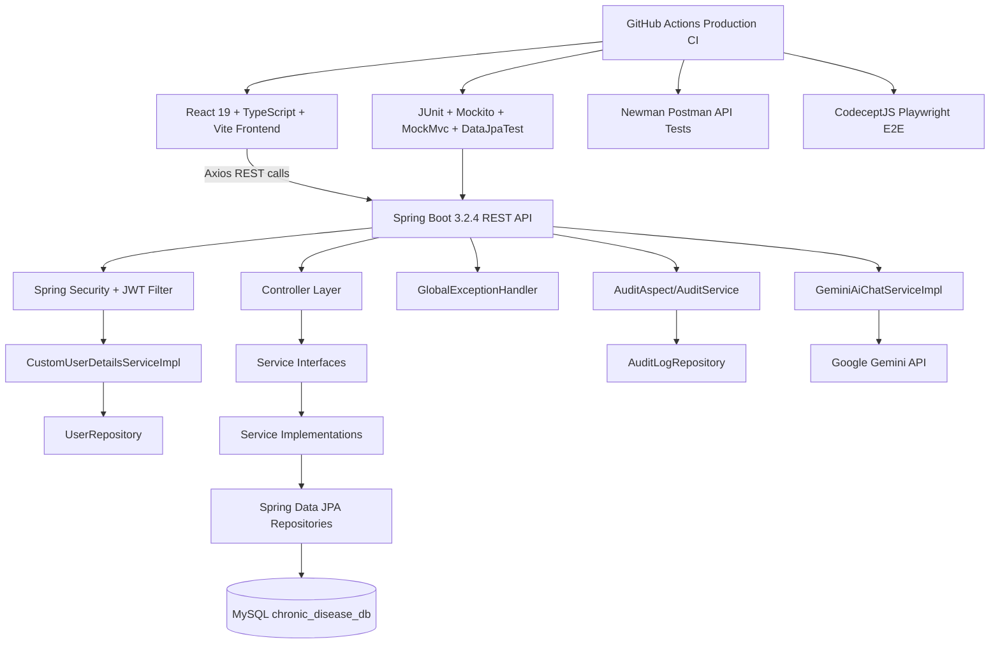
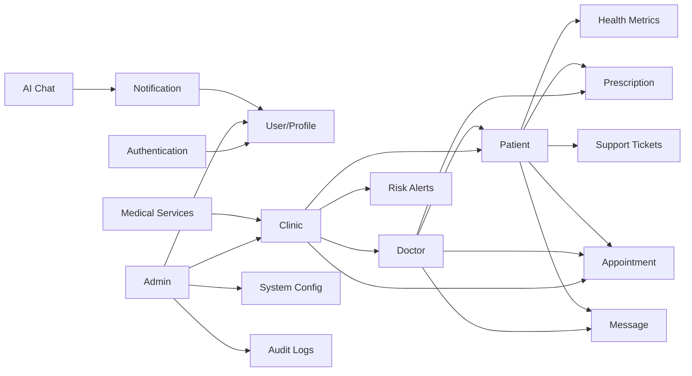
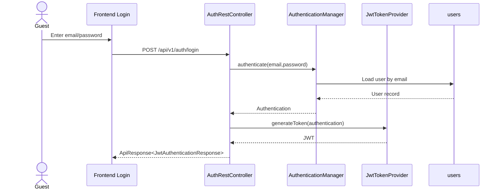

# PHAN TIEP TUC THEO WORKFLOW `createdoc.md`

> Scope note: This chapter is generated from repository evidence only. Items not confidently inferred from source code are marked **Need Confirmation**.

## A. Project Analysis Baseline Before Chapter Generation

### A.1 Dependency Graph



Evidence: `backend/pom.xml` declares Spring Boot Web, Data JPA, Security, Validation, AOP, WebFlux, JJWT, Springdoc, MySQL connector, H2 test database, JaCoCo and Surefire. `frontend/package.json` declares React, Vite, TypeScript, Axios, React Query, Recharts, Excel/PDF libraries and CodeceptJS Playwright. `backend/src/main/resources/application.yml` configures MySQL, JWT, Swagger and Gemini. `.github/workflows/production-ci.yml` defines backend, frontend, Postman, E2E, Docker and Jira failure handling jobs.

### A.2 Module Relationship Graph



### A.3 Detected Business Modules

| Module | Controllers | Services | Entities / Tables | Repositories | Tests |
|---|---|---|---|---|---|
| Authentication | `AuthRestController` | `CustomUserDetailsServiceImpl`, `JwtTokenProvider`, Spring `AuthenticationManager` | `User` / `users` | `UserRepository` | security service and integration tests |
| User/Profile | `UserProfileController`, part of `AdminController` | `AdminUserServiceImpl`, `PatientProfileServiceImpl` | `User`, `Patient`, `EmergencyContact` | `UserRepository`, `PatientRepository`, `EmergencyContactRepository` | user, DTO, mapper and profile tests |
| Admin | `AdminController` | `AdminDashboardServiceImpl`, `AdminClinicServiceImpl`, `AdminUserServiceImpl`, `AdminConfigServiceImpl` | `Clinic`, `User`, `SystemConfig`, `AuditLog` | clinic/user/config/audit repositories | admin controller/security/service tests |
| Clinic | `ClinicDashboardController`, `ClinicReportController`, `RiskAlertController` | clinic dashboard, patient, doctor, report and risk services | `Clinic`, `Patient`, `Appointment`, `PatientAlert`, `HealthMetric` | clinic/patient/appointment/alert repositories | clinic controller/security/service tests |
| Doctor | `DoctorController`, `DashboardController`, `DoctorPatientController`, `DoctorAppointmentController`, `DoctorMessageController`, `PrescriptionController` | doctor dashboard, patient, appointment, message, prescription services | `User`, `Patient`, `Appointment`, `Conversation`, `Message`, `Prescription`, `PrescriptionItem` | user/patient/appointment/conversation/message/prescription repositories | doctor controller/service/security tests |
| Patient | patient dashboard/profile/metric/appointment/prescription/message controllers | patient dashboard, profile, metric, appointment, prescription, message services | `Patient`, `HealthMetric`, `Appointment`, `Prescription`, `MedicationSchedule`, `MedicationLog`, `Conversation`, `Message`, `PatientAlert` | patient/metric/appointment/prescription/schedule/log/message repositories | patient controller/service/DTO tests |
| Notification | `NotificationController` | `NotificationServiceImpl` | `Notification` / `notifications` | `NotificationRepository` | notification controller/service tests |
| Medical Service | `MedicalServiceController` | `MedicalServiceServiceImpl` | `MedicalService`, `medical_service_features` | `MedicalServiceRepository` | medical service tests |
| Support Ticket | `SupportTicketController` | `SupportTicketServiceImpl` | `SupportTicket` / `support_tickets` | `SupportTicketRepository` | support ticket tests |
| AI Chat | `AiChatController` | `GeminiAiChatServiceImpl` | none detected | none detected | AI chat controller/service tests |
| Audit | `AuditAspect`, `AuditService`, admin audit endpoint | `AuditService`, `AdminDashboardServiceImpl.getAuditLogs` | `AuditLog` / `audit_logs` | `AuditLogRepository` | `AuditServiceTest` |

### A.4 Architecture and Source Constraints

The backend follows a layered Spring Boot architecture: REST controllers call service interfaces and implementations, services use Spring Data JPA repositories, and entity classes map to relational tables. This is supported by the package layout under `backend/src/main/java/com/project/controller`, `service`, `service/impl`, `repository`, `entity`, `dto`, `security`, `config`, `exception`, and `mapper`.

The database engine inferred from active configuration is MySQL, because `application.yml` uses `jdbc:mysql://localhost:3306/chronic_disease_db`, `com.mysql.cj.jdbc.Driver`, and `org.hibernate.dialect.MySQLDialect`. H2 is used for tests through `application-test.yml` and `application-h2.yml`. PostgreSQL usage is **Need Confirmation**.

Flyway/Liquibase is not configured in `pom.xml` or `application.yml`; although SQL migration files exist under `backend/src/main/resources/db/migration`, the active dependency list does not include Flyway or Liquibase. Formal migration execution is **Need Confirmation**.

No Redis, RabbitMQ, Kafka, mail sender, backend upload service bean, or WebSocket server configuration was confirmed from the scanned backend source. Frontend file upload/cloud image helpers exist (`frontend/src/utils/cloudinary.ts`), but backend upload service support is **Need Confirmation**.

---

## II. SOFTWARE REQUIREMENT SPECIFICATION

### 2.1 Product Overview

The system is an online chronic disease management application named DamDiep Healthcare, implemented as a React single-page frontend and a Spring Boot REST backend. The source code shows modules for user authentication, administrator management, clinic operations, doctor workflows, patient self-service, health metric tracking, appointment handling, prescriptions, messages, notifications, support tickets, medical services, AI chat, audit logs and CI-backed verification.

The backend exposes secured REST APIs under `/api/v1/**`, `/api/doctors`, and `/v1/clinics/{clinicId}/reports`. Authentication uses JWT generated by `JwtTokenProvider.generateToken`, validated by `JwtAuthenticationFilter`, and enforced globally by `SecurityConfig.filterChain`. Method-level permissions are enforced through `@PreAuthorize` expressions in controllers and through `SecurityService` methods such as `canAccessPatient`, `isClinicManagerOf`, `isDoctorOfClinic`, and `isDoctorSelf`.

### 2.2 Actors

| Actor | Responsibilities | Permissions Confirmed by Code | Related Modules |
|---|---|---|---|
| Guest | Authenticate and access public health check/login endpoints. | `SecurityConfig` permits `/api/v1/auth/**`, `/h2-console/**`, `/swagger-ui/**`, `/v3/api-docs/**`. | Authentication, Swagger health/API docs |
| Admin | Manage global dashboard, clinics, users, reports, audit logs and system config. | `AdminController` has class-level `@PreAuthorize("hasRole('ADMIN')")`; `SecurityConfig` restricts `/api/v1/admin/**` to ADMIN. | Admin, User, Clinic, System Config, Audit, Medical Service |
| Clinic Manager | Operate clinic dashboard, patients, doctors, appointments, profile, reports, risk alerts and clinic medical services. | `ClinicDashboardController` uses `hasAnyRole('CLINIC_MANAGER','ADMIN',...)`; `RiskAlertController` uses CLINIC_MANAGER/ADMIN; medical service writes allow ADMIN/CLINIC_MANAGER. | Clinic, Doctor, Patient, Appointment, Risk Alert, Report, Medical Service |
| Doctor | View doctor dashboard, manage assigned patients, appointments, prescriptions and messages. | Doctor controllers use `hasRole('DOCTOR')`; prescription creation additionally checks `@securityService.canAccessPatient(#request.patientId)`. | Doctor, Appointment, Patient, Prescription, Message |
| Patient | View dashboard/profile, record metrics, create/cancel appointments, view prescriptions, log medication, message doctor and manage alerts. | Patient controllers use `hasRole('PATIENT')`; services check ownership before deleting metrics, dismissing alerts, reading notifications, logging medication or requesting refill. | Patient, Health Metric, Appointment, Prescription, Message, Notification, Support |
| Authenticated User | View notifications, profile and change password. | `/api/v1/users/me`, `/api/v1/users/change-password`, `/api/v1/notifications/**` are authenticated by global security. | User Profile, Notification |

### 2.3 Use Case Diagram

```mermaid
graph TD
    Guest --> UC01[UC-01 Login]
    Admin --> UC02[UC-02 View Admin Dashboard]
    Admin --> UC03[UC-03 Manage Clinics]
    Admin --> UC04[UC-04 Manage Users]
    Admin --> UC05[UC-05 Manage System Config]
    Admin --> UC06[UC-06 View Audit Logs]
    ClinicManager --> UC07[UC-07 View Clinic Dashboard]
    ClinicManager --> UC08[UC-08 Manage Clinic Patients]
    ClinicManager --> UC09[UC-09 Manage Clinic Doctors]
    ClinicManager --> UC10[UC-10 Manage Clinic Appointments]
    ClinicManager --> UC11[UC-11 Monitor Risk Alerts]
    ClinicManager --> UC12[UC-12 View Clinic Reports]
    Doctor --> UC13[UC-13 View Doctor Dashboard]
    Doctor --> UC14[UC-14 Manage Doctor Appointments]
    Doctor --> UC15[UC-15 View Doctor Patients]
    Doctor --> UC16[UC-16 Create Prescriptions]
    Doctor --> UC17[UC-17 Message Patients]
    Patient --> UC18[UC-18 View Patient Dashboard]
    Patient --> UC19[UC-19 Manage Patient Profile]
    Patient --> UC20[UC-20 Record Health Metrics]
    Patient --> UC21[UC-21 Book Appointments]
    Patient --> UC22[UC-22 Manage Prescriptions and Medication Logs]
    Patient --> UC23[UC-23 Message Doctor]
    Patient --> UC24[UC-24 Create Support Ticket]
    AuthUser[Authenticated User] --> UC25[UC-25 Manage Notifications]
    AuthUser --> UC26[UC-26 Change Password]
    AuthUser --> UC27[UC-27 Use AI Chat]
    Admin --> UC28[UC-28 Manage Medical Services]
    ClinicManager --> UC28
```



### 2.4 Use Case Description

#### UC-01 Login

| Field | Description |
|---|---|
| ID | UC-01 |
| Name | Login |
| Actors | Guest |
| Goal | Authenticate a user by email/password and receive a JWT token. |
| Trigger | User submits `POST /api/v1/auth/login`. |
| Pre-condition | User record exists in `users`; password hash is compatible with BCrypt. |
| Post-condition | System returns `JwtAuthenticationResponse` with token and user data. |
| Main Flow | Validate `LoginRequest`; authenticate through `AuthenticationManager`; generate token with `JwtTokenProvider`; return API response. |
| Alternative Flow | `GET /api/v1/auth/health` returns API health without authentication. |
| Exception Flow | Authentication failure is handled by `GlobalExceptionHandler` or `JwtAuthenticationEntryPoint` with 401. |
| Business Rules | Email is username; JWT subject is email; token includes user id claim; expiration uses `jwt.expiration` configured as 86,400,000 ms. |
| Validation Rules | `LoginRequest.email` is `@NotBlank @Email`; password is `@NotBlank`. |
| Related APIs | `GET /api/v1/auth/health`, `POST /api/v1/auth/login`. |
| Related Tables | `users`. |

#### UC-02 View Admin Dashboard

| Field | Description |
|---|---|
| ID | UC-02 |
| Name | View Admin Dashboard |
| Actors | Admin |
| Goal | Retrieve global operational statistics and chart data. |
| Trigger | Admin opens dashboard screen or calls `GET /api/v1/admin/dashboard`. |
| Pre-condition | User has ADMIN role. |
| Post-condition | Dashboard response is returned. |
| Main Flow | `AdminController` calls `AdminDashboardServiceImpl.getDashboardData`; service aggregates users, clinics, appointments and activity data. |
| Alternative Flow | Query parameters `timeRange` and `metric` adjust the aggregation. |
| Exception Flow | Non-admin access returns 403 from Spring Security. |
| Business Rules | Dashboard data is cacheable by `timeRange` and `metric` via `@Cacheable`, but cache provider configuration is **Need Confirmation**. |
| Validation Rules | Query values are accepted as strings; strict enum validation is **Need Confirmation**. |
| Related APIs | `GET /api/v1/admin/dashboard`. |
| Related Tables | `users`, `clinics`, `appointments`, `audit_logs`, `patients`. |

#### UC-03 Manage Clinics

| Field | Description |
|---|---|
| ID | UC-03 |
| Name | Manage Clinics |
| Actors | Admin |
| Goal | Create, view, update and toggle clinic status. |
| Trigger | Admin calls clinic endpoints under `/api/v1/admin/clinics`. |
| Pre-condition | ADMIN role; request DTO passes validation. |
| Post-condition | Clinic and manager user records are created or updated. |
| Main Flow | `AdminClinicServiceImpl` checks duplicate clinic code and duplicate manager email, creates `Clinic`, creates manager `User` with `CLINIC_MANAGER`, encodes password and saves records. |
| Alternative Flow | Admin lists clinics with status/keyword/page filters or reads clinic statistics. |
| Exception Flow | Duplicate clinic code or email throws `IllegalArgumentException`; missing clinic throws `ResourceNotFoundException`. |
| Business Rules | `clinicCode` is unique; manager email must be unique; status toggles ACTIVE/INACTIVE. |
| Validation Rules | `CreateClinicRequest.name` and `clinicCode` are required; name max 200; clinic code max 20; manager name/email/password required. |
| Related APIs | `GET /api/v1/admin/clinics/stats`, `GET /api/v1/admin/clinics`, `GET /api/v1/admin/clinics/{id}`, `POST /api/v1/admin/clinics`, `PUT /api/v1/admin/clinics/{id}`, `PATCH /api/v1/admin/clinics/{id}/toggle-status`. |
| Related Tables | `clinics`, `users`. |

#### UC-04 Manage Users

| Field | Description |
|---|---|
| ID | UC-04 |
| Name | Manage Users |
| Actors | Admin |
| Goal | Create, update, list, toggle and delete user accounts. |
| Trigger | Admin calls `/api/v1/admin/users/**`. |
| Pre-condition | ADMIN role. |
| Post-condition | User record is changed and audit activity is recorded. |
| Main Flow | `AdminUserServiceImpl` validates unique email, validates password policy, encodes password, saves user, and records audit activity. |
| Alternative Flow | Admin filters users by role, status, clinic and keyword. |
| Exception Flow | Duplicate email, last admin deletion, and self-delete attempt are blocked. |
| Business Rules | Cannot delete current logged-in admin; cannot delete last active admin; password rules may require special characters, uppercase and number based on `SystemConfig`. |
| Validation Rules | `CreateUserRequest` requires fullName, email, password, role; email max 100 and valid; password min 8; role is a nonblank string mapped to `UserRole`. |
| Related APIs | `GET /api/v1/admin/users/stats`, `GET /api/v1/admin/users`, `GET /api/v1/admin/users/{id}`, `POST /api/v1/admin/users`, `PUT /api/v1/admin/users/{id}`, `PATCH /api/v1/admin/users/{id}/toggle-status`, `DELETE /api/v1/admin/users/{id}`. |
| Related Tables | `users`, `system_configs`, `audit_logs`. |

#### UC-05 Manage System Config

| Field | Description |
|---|---|
| ID | UC-05 |
| Name | Manage System Config |
| Actors | Admin |
| Goal | Read and update security/configuration flags and regenerate API key. |
| Trigger | Admin calls `/api/v1/admin/config`. |
| Pre-condition | ADMIN role. |
| Post-condition | `SystemConfig` row is created or updated. |
| Main Flow | `AdminConfigServiceImpl.getConfig` seeds default config when absent; update stores config flags; regenerate creates a new API key string. |
| Alternative Flow | None detected. |
| Exception Flow | Validation failure returns 400 through `GlobalExceptionHandler`. |
| Business Rules | Missing config is initialized by service; exact persistence cardinality beyond first row is **Need Confirmation**. |
| Validation Rules | `UpdateSystemConfigRequest` boolean fields are `@NotNull`. |
| Related APIs | `GET /api/v1/admin/config`, `PUT /api/v1/admin/config`, `POST /api/v1/admin/config/regenerate-key`. |
| Related Tables | `system_configs`. |

#### UC-06 View Audit Logs

| Field | Description |
|---|---|
| ID | UC-06 |
| Name | View Audit Logs |
| Actors | Admin |
| Goal | Search and paginate audit records. |
| Trigger | Admin calls `GET /api/v1/admin/audit-logs`. |
| Pre-condition | ADMIN role. |
| Post-condition | Page of `AuditLogResponse` returned. |
| Main Flow | `AdminDashboardServiceImpl.getAuditLogs` queries `AuditLogRepository` with filters. |
| Alternative Flow | `AuditAspect` and `AuditService.recordActivity` write records from annotated actions and service events. |
| Exception Flow | Unauthorized users receive 403. |
| Business Rules | Audit log stores user name, action, module, details and status based on entity fields. |
| Validation Rules | Query filters are optional strings. |
| Related APIs | `GET /api/v1/admin/audit-logs`. |
| Related Tables | `audit_logs`. |

#### UC-07 to UC-28 Summary

| UC | Name | Actors | Related APIs | Core Rules Derived from Code |
|---|---|---|---|---|
| UC-07 | View Clinic Dashboard | Admin, Clinic Manager, Doctor where allowed | `GET /api/v1/clinics/{clinicId}/dashboard` | Access controlled by role and clinic relation checks. |
| UC-08 | Manage Clinic Patients | Admin, Clinic Manager, Doctor where allowed | `/api/v1/clinics/{clinicId}/patients/**` | Patient create/update/delete are mediated by `ClinicPatientServiceImpl`; patient belongs to clinic. |
| UC-09 | Manage Clinic Doctors | Admin, Clinic Manager | `/api/v1/clinics/{clinicId}/doctors/**` | Doctor user email must be unique; doctor belongs to clinic. |
| UC-10 | Manage Clinic Appointments | Admin, Clinic Manager | `/api/v1/clinics/{clinicId}/appointments/**` | Completed or cancelled appointments cannot be updated by `ClinicDashboardServiceImpl.updateAppointment`. |
| UC-11 | Monitor Risk Alerts | Admin, Clinic Manager | `/api/v1/clinics/{clinicId}/risk-alerts/**` | Alerts can be read/dismissed; high-risk patient list is based on `PatientAlert` and patient risk fields. |
| UC-12 | View Clinic Reports | Clinic route users | `/v1/clinics/{clinicId}/reports/**` | Report endpoints return overview and disease detail data. Authorization annotation was not detected on controller, so effective access is **Need Confirmation**. |
| UC-13 | View Doctor Dashboard | Doctor | `GET /api/v1/doctor/dashboard` | Doctor-only access by `@PreAuthorize("hasRole('DOCTOR')")`. |
| UC-14 | Manage Doctor Appointments | Doctor | `/api/v1/doctor/appointments/**` | Doctor may list upcoming/all appointments, update status, create, reschedule and batch-reschedule. |
| UC-15 | View Doctor Patients | Doctor | `/api/v1/doctor/patients/**` | Doctor role required for list/stats; patient detail uses `@securityService.canAccessPatient`. |
| UC-16 | Create Prescriptions | Doctor | `/api/v1/doctor/prescriptions/**` | Doctor can create only for accessible patients; prescription requires diagnosis and at least one item. |
| UC-17 | Message Patients | Doctor | `/api/v1/doctor/messages/**` | Doctor role required; conversations and messages use `Conversation` and `Message`. |
| UC-18 | View Patient Dashboard | Patient | `/api/v1/patient/dashboard/**` | Patient can see dashboard and dismiss own alerts only. |
| UC-19 | Manage Patient Profile | Patient | `/api/v1/patient/profile/**` | Profile update can synchronize patient email into login user email; emergency contacts are patient-owned. |
| UC-20 | Record Health Metrics | Patient, Clinic/Doctor through clinic endpoint | `/api/v1/patient/health-metrics/**`, `/api/v1/clinics/{clinicId}/patients/{patientId}/health-metrics` | Metric type is limited to BLOOD_SUGAR, BLOOD_PRESSURE, HEART_RATE, HBA1C, SPO2; value must be positive. |
| UC-21 | Book Appointments | Patient | `/api/v1/patient/appointments/**` | Appointment time must be at least 3 hours in future and within 15 days; cancellation is owner-restricted. Current code blocks patient self-cancel for CONFIRMED appointments. |
| UC-22 | Manage Prescriptions and Medication Logs | Patient | `/api/v1/patient/prescriptions/**` | Patient sees active/history/today schedule, logs medication for own schedule, and can request refill only for active prescriptions. |
| UC-23 | Message Doctor | Patient | `/api/v1/patient/messages/**` | Patient role required; sends messages through `SendMessageRequest.content @NotBlank`. |
| UC-24 | Create Support Ticket | Authenticated users, role constraints Need Confirmation | `/api/v1/support-tickets/**` | Ticket code generated by service; status can be updated; creator/clinic/all queries exist. Controller-level `@PreAuthorize` was not detected. |
| UC-25 | Manage Notifications | Authenticated User | `/api/v1/notifications/**` | User can read, count unread, mark read/read-all and delete only owned notifications. |
| UC-26 | Change Password | Authenticated User | `PUT /api/v1/users/change-password` | Current and new password required; new password length 8-100. |
| UC-27 | Use AI Chat | Authenticated User | `POST /api/v1/ai/chat` | Request is sent to `GeminiAiChatServiceImpl`; external API key comes from `ai.gemini.api-key`. |
| UC-28 | Manage Medical Services | Admin, Clinic Manager | `/api/v1/medical-services/**` | Writes require ADMIN or CLINIC_MANAGER; price must be greater than 0; clinic manager cannot manage other clinic/system service outside rules. |

### 2.5 Need Confirmation Items for Chapter II

| Item | Reason |
|---|---|
| PostgreSQL deployment | Active backend config uses MySQL; older document text mentions PostgreSQL. |
| Flyway/Liquibase migration execution | Migration files exist but dependencies/configuration were not detected. |
| WebSocket real-time server | Message modules exist, but backend WebSocket configuration was not confirmed. |
| Redis/cache provider | `@Cacheable` exists on admin dashboard, but cache dependency/provider is not configured in `pom.xml`. |
| Mail/Zalo notification | Notification entity/service exists, but mail or Zalo integration was not confirmed. |
| Backend upload service | Frontend has Cloudinary utility; backend upload service was not confirmed. |
| Clinic report authorization | `ClinicReportController` endpoint annotations do not show `@PreAuthorize`; effective access may rely on broader security config or frontend route guards. |

# III. FUNCTIONAL REQUIREMENTS

> Source basis: `backend/src/main/java/com/project/controller`, `backend/src/main/java/com/project/service/impl`, DTO validation classes, entity mappings, and frontend route definitions in `frontend/src/routes/AppRoutes.tsx`. Any behavior not confirmed in code is marked **Need Confirmation**.

## 3.1 Module: Authentication and Session Access

### 3.1.1 Overview

The authentication module provides public health check and login APIs. It authenticates users by email/password and returns a JWT. Security is configured in `SecurityConfig`, token operations are implemented in `JwtTokenProvider`, and user loading is implemented in `CustomUserDetailsServiceImpl`.

### 3.1.2 Functions

| Function ID | Function | Purpose | Trigger | Actors | Inputs | Outputs | Processing | Validation | Business Rules | Exception Handling | APIs | Tables |
|---|---|---|---|---|---|---|---|---|---|---|---|---|
| FR-AUTH-01 | Health check | Verify auth API availability. | User/client calls health endpoint. | Guest | None | Status payload | `AuthRestController.healthCheck` returns service state. | None detected | Endpoint is public. | General exceptions handled globally. | `GET /api/v1/auth/health` | None |
| FR-AUTH-02 | Login | Authenticate and issue JWT. | Login form submit. | Guest | `LoginRequest.email`, `LoginRequest.password` | `JwtAuthenticationResponse` | `AuthenticationManager` authenticates; `JwtTokenProvider.generateToken` signs token; response includes token/user data. | Email `@NotBlank @Email`; password `@NotBlank`. | Email is username; JWT subject is email; token has `id` claim; expiration from `jwt.expiration` 24 hours. | Invalid credentials return 401 through security/exception handlers. | `POST /api/v1/auth/login` | `users` |

### 3.1.3 Navigation

Frontend route `/` renders the landing page. After login, `VelorahLandingPage.tsx` navigates users by role to `/admin`, `/doctor`, `/clinic`, or `/patient`.

### 3.1.4 Workflow



## 3.2 Module: Admin

### 3.2.1 Overview

The Admin module controls system-wide dashboard, clinic management, user management, reports, audit logs and system configuration. All endpoints in `AdminController` require ADMIN role through class-level `@PreAuthorize`.

### 3.2.2 Functions

| Function ID | Function | Purpose | Trigger | Actors | Inputs | Outputs | Processing | Validation | Business Rules | Exception Handling | APIs | Tables |
|---|---|---|---|---|---|---|---|---|---|---|---|---|
| FR-ADM-01 | View admin dashboard | Show global statistics and charts. | Admin opens dashboard. | Admin | `timeRange`, `metric` query params | `AdminDashboardResponse` | `AdminDashboardServiceImpl.getDashboardData` aggregates clinic/user/patient/activity data. | Query strings optional. | Method has `@Cacheable`; cache provider is **Need Confirmation**. | 403 if non-admin. | `GET /api/v1/admin/dashboard` | `users`, `clinics`, `patients`, `appointments`, `audit_logs` |
| FR-ADM-02 | Manage clinics | Create, list, detail, update, toggle status. | Admin opens clinics page or submits modal. | Admin | `CreateClinicRequest`, `UpdateClinicRequest`, status/keyword/page filters | `AdminClinicResponse`, stats/page response | `AdminClinicServiceImpl` validates duplicate code/email, creates clinic and clinic manager user, updates status. | Name required max 200; clinic code required max 20; manager fields required. | Clinic code unique; manager email unique; status toggles ACTIVE/INACTIVE. | Duplicate and missing resource errors handled by global handler. | `/api/v1/admin/clinics/**` | `clinics`, `users` |
| FR-ADM-03 | Manage users | Create, list, detail, update, toggle and delete users. | Admin opens users page or submits action. | Admin | `CreateUserRequest`, `UpdateUserRequest`, role/status/clinic/keyword/page filters | `AdminUserResponse`, stats/page response | `AdminUserServiceImpl` validates email, password policy, role and status, saves user and audit activity. | Email valid max 100; password min 8; status ACTIVE/INACTIVE for update. | Cannot delete current admin; cannot delete last active admin; email must be unique. | Illegal state and validation errors mapped globally. | `/api/v1/admin/users/**` | `users`, `system_configs`, `audit_logs` |
| FR-ADM-04 | View reports | Provide consolidated admin reports. | Admin opens reports page. | Admin | `reportType`, `performanceFilter` | `AdminReportsResponse` | `AdminDashboardServiceImpl.getReportsData` builds report data. | Query values optional. | Report export behavior in frontend exists in pages; server-side export endpoint is **Need Confirmation**. | 403 if non-admin. | `GET /api/v1/admin/reports` | `users`, `clinics`, `patients`, `appointments` |
| FR-ADM-05 | View audit logs | Search audit activity. | Admin opens audit page. | Admin | `userName`, `module`, `keyword`, pageable | Page of `AuditLogResponse` | `AdminDashboardServiceImpl.getAuditLogs` queries audit repository. | Optional filters. | Audit data is produced by `AuditAspect` and explicit service calls. | 403 if non-admin. | `GET /api/v1/admin/audit-logs` | `audit_logs` |
| FR-ADM-06 | Manage system config | Read/update config and regenerate API key. | Admin opens settings page. | Admin | `UpdateSystemConfigRequest` | `SystemConfigResponse`, new key string | `AdminConfigServiceImpl` seeds config if absent, updates flags, regenerates key. | Required booleans in update request. | Password policy depends on config flags. | Validation errors mapped to 400. | `GET/PUT /api/v1/admin/config`, `POST /api/v1/admin/config/regenerate-key` | `system_configs` |

### 3.2.3 Navigation

Admin routes are protected by `ProtectedRoute allowedRoles={['ADMIN']}` and include dashboard, clinics, users, services, reports, audit logs, support and settings. `AdminLayout.tsx` defines the sidebar labels for these routes.

### 3.2.4 Workflow

```mermaid
graph TD
    AdminLogin[Admin authenticated] --> Dashboard[/admin]
    Dashboard --> Clinics[/admin/clinics]
    Dashboard --> Users[/admin/users]
    Dashboard --> Services[/admin/services]
    Dashboard --> Reports[/admin/reports]
    Dashboard --> AuditLogs[/admin/audit-logs]
    Dashboard --> Settings[/admin/settings]
    Clinics --> CreateClinic[Create clinic + manager]
    Users --> CreateUser[Create user]
    Settings --> Config[Update password/API config]
```

## 3.3 Module: Clinic Management

### 3.3.1 Overview

The Clinic module supports clinic dashboard, patient records, doctor records, appointment records, clinic profile, risk alerts, clinic reports, health metric recording for clinic patients and batch appointment rescheduling. Controllers include `ClinicDashboardController`, `ClinicReportController`, and `RiskAlertController`.

### 3.3.2 Functions

| Function ID | Function | Purpose | Trigger | Actors | Inputs | Outputs | Processing | Validation | Business Rules | Exception Handling | APIs | Tables |
|---|---|---|---|---|---|---|---|---|---|---|---|---|
| FR-CLI-01 | View clinic dashboard | Show clinic operations and disease/appointment metrics. | Clinic dashboard route. | Clinic Manager, Admin, Doctor where allowed | `clinicId`, `period` | `ClinicDashboardResponse` | `ClinicDashboardServiceImpl.getDashboardData` aggregates clinic patient/appointment data. | `clinicId` path variable. | Access limited by roles and clinic relation checks. | Unauthorized returns 403. | `GET /api/v1/clinics/{clinicId}/dashboard` | `clinics`, `patients`, `appointments`, `health_metrics` |
| FR-CLI-02 | Manage clinic patients | List, create, update, delete and notify patients. | Patient list/modals. | Clinic Manager, Admin, Doctor where allowed | `CreatePatientRequest`, filters, patient id, notify message | Patient page/void | `ClinicPatientServiceImpl` creates user/patient records, updates patient fields, soft/deletes as implemented, sends notification. | Full name, gender, phone required; full name max 100. | Patient belongs to clinic; doctor assignment stored in `doctor_id`. | Duplicate/missing/unauthorized errors handled globally. | `/api/v1/clinics/{clinicId}/patients/**` | `patients`, `users`, `notifications` |
| FR-CLI-03 | Manage clinic doctors | List, create, update, delete, fetch available doctors. | Doctor list/modals. | Clinic Manager, Admin | `CreateDoctorRequest`, doctor id, filters | Doctor page/snippets/void | `ClinicDoctorServiceImpl` creates doctor users, updates profile fields, deletes doctor. | Doctor request requires name/email/phone/specialty/license fields. | Doctor email must be unique; doctor is attached to clinic. | Duplicate email throws `IllegalArgumentException`. | `/api/v1/clinics/{clinicId}/doctors/**` | `users`, `clinics` |
| FR-CLI-04 | Manage clinic appointments | List, create, update status, update details, batch reschedule. | Clinic appointment route/actions. | Clinic Manager, Admin | `DoctorCreateAppointmentRequest`, status, source/target dates | Appointment page/void/count | `ClinicDashboardServiceImpl` assigns doctor if needed, updates appointment, sends notification, reschedules appointment dates. | Date `yyyy-MM-dd`; time `HH:mm`; type OFFLINE/ONLINE. | Completed/cancelled appointments cannot be updated; no doctor available blocks creation. | Access denied and illegal state errors handled globally. | `/api/v1/clinics/{clinicId}/appointments/**` | `appointments`, `patients`, `notifications` |
| FR-CLI-05 | Manage clinic profile | View/update clinic profile. | Settings route. | Clinic Manager, Admin | `UpdateClinicRequest` | `ClinicResponse`/void | `ClinicDashboardServiceImpl` reads and updates clinic fields. | Name max 200; phone max 20. | Clinic profile is addressed by `clinicId`. | Missing clinic returns not found. | `GET/PUT /api/v1/clinics/{clinicId}/profile` | `clinics` |
| FR-CLI-06 | Monitor risk alerts | View dashboard, high-risk list, mark read, dismiss. | Risk alert route/actions. | Clinic Manager, Admin | `clinicId`, alert id, pageable | `RiskAlertResponse`, page/void | `RiskAlertServiceImpl` queries patient alerts and updates read/dismissed flags. | Alert id required. | Alert is represented by `PatientAlert`; high-risk patients are clinic-scoped. | Missing alert returns runtime/not found depending method. | `/api/v1/clinics/{clinicId}/risk-alerts/**` | `patient_alerts`, `patients` |
| FR-CLI-07 | View clinic reports | Provide clinic report and disease detail. | Reports route. | Clinic Manager/Admin per frontend; backend auth **Need Confirmation** | `clinicId`, `period`, `condition` | `ClinicReportResponse`, disease detail map | `ClinicReportServiceImpl` builds clinic report data. | Query values optional. | Controller lacks direct `@PreAuthorize`; effective authorization is **Need Confirmation**. | General security applies to non-public APIs. | `/v1/clinics/{clinicId}/reports/**` | `clinics`, `patients`, `appointments`, `health_metrics` |

### 3.3.3 Navigation

Clinic routes are protected for `CLINIC_MANAGER` and `ADMIN` in `AppRoutes.tsx`: dashboard, reports, risk alerts, patients, doctors, assignment, appointments, services, settings and support.

### 3.3.4 Workflow

```mermaid
graph TD
    ClinicHome[/clinic] --> Patients[/clinic/patients]
    ClinicHome --> Doctors[/clinic/doctors]
    ClinicHome --> Appointments[/clinic/appointments]
    ClinicHome --> Alerts[/clinic/alerts]
    ClinicHome --> Reports[/clinic/reports]
    Patients --> CreatePatient[Create or update patient]
    Doctors --> CreateDoctor[Create or update doctor]
    Appointments --> CreateAppt[Create/update/reschedule appointment]
    Alerts --> DismissAlert[Read or dismiss alert]
```

## 3.4 Module: Doctor

### 3.4.1 Overview

The Doctor module includes dashboard, patient monitoring, appointments, prescriptions and messaging. The backend enforces DOCTOR role for doctor-specific controllers and performs patient-access checks for sensitive patient detail and prescription creation.

### 3.4.2 Functions

| Function ID | Function | Purpose | Trigger | Actors | Inputs | Outputs | Processing | Validation | Business Rules | Exception Handling | APIs | Tables |
|---|---|---|---|---|---|---|---|---|---|---|---|---|
| FR-DOC-01 | View dashboard | Show doctor statistics and high-risk patients. | Doctor dashboard route. | Doctor | Current doctor identity | `DoctorDashboardResponse` | `DoctorDashboardServiceImpl.getDashboardData` aggregates assigned patient and appointment data. | Authenticated doctor required. | Doctor sees own operational data. | 403 if not DOCTOR. | `GET /api/v1/doctor/dashboard` | `users`, `patients`, `appointments`, `health_metrics` |
| FR-DOC-02 | Manage doctor appointments | List, create, update status, reschedule, batch reschedule. | Doctor appointment screen/actions. | Doctor | `DoctorCreateAppointmentRequest`, status, meeting link, diagnosis summary, dates | `DoctorAppointmentResponse`, count map | `DoctorAppointmentServiceImpl` manipulates appointment records for current doctor. | Patient id required; date/time/type patterns enforced. | Status updates store meeting link and diagnosis summary where provided. | Invalid state/access errors handled globally. | `/api/v1/doctor/appointments/**` | `appointments`, `patients` |
| FR-DOC-03 | View patient panel | List assigned patients, stats, trends and detail. | Doctor patient screen. | Doctor | filters, patient id, metric type, days | `DoctorPatientResponse`, detail/stats | `DoctorPatientServiceImpl` filters patients and computes trends. | Pageable/filter values optional. | Detail access uses `SecurityService.canAccessPatient`. | Access denied returns 403. | `/api/v1/doctor/patients/**` | `patients`, `health_metrics`, `appointments` |
| FR-DOC-04 | Create and manage prescriptions | List doctor prescriptions, stats, create, cancel. | Prescription screen/modal. | Doctor | `PrescriptionRequest`, search/status/page filters | `PrescriptionResponse`, stats/void | `PrescriptionServiceImpl` creates prescription and items, maps responses, can cancel by doctor. | Diagnosis required max 255; at least one item; medication name/dosage required. | Doctor may create only for accessible patient; prescription code generated by service. | Unauthorized creation/cancel returns runtime/access errors. | `/api/v1/doctor/prescriptions/**` | `prescriptions`, `prescription_items`, `patients` |
| FR-DOC-05 | Message patients | List conversations, page messages, send, mark read. | Doctor messages route. | Doctor | conversation id, `SendMessageRequest` | `ConversationResponse`, `MessageResponse` | `DoctorMessageServiceImpl` creates/saves messages and updates read state. | Message content `@NotBlank`. | Sender type is DOCTOR; conversation must be doctor-related. | Unauthorized/missing conversation handled by service/global handler. | `/api/v1/doctor/messages/**` | `conversations`, `messages` |
| FR-DOC-06 | Public/admin doctor CRUD | List doctor directory, create/update/delete doctors. | Doctor directory/admin actions. | Guest/Auth for reads, Admin for writes, doctor self update where allowed | specialty/keyword/page, `CreateDoctorRequest` | `DoctorResponse` | `DoctorServiceImpl` manages `User` records with doctor role/profile. | Create doctor request requires required doctor fields. | Create/delete require ADMIN; update requires ADMIN or doctor self. | 403 for unauthorized writes. | `/api/doctors/**` | `users` |

### 3.4.3 Navigation

Doctor routes are protected for `DOCTOR`: `/doctor`, `/doctor/analytics`, `/doctor/appointments`, `/doctor/messages`, `/doctor/patients`, `/doctor/prescriptions`, and `/doctor/support`.

### 3.4.4 Workflow

```mermaid
graph TD
    DoctorHome[/doctor] --> Appts[/doctor/appointments]
    DoctorHome --> Patients[/doctor/patients]
    DoctorHome --> Prescriptions[/doctor/prescriptions]
    DoctorHome --> Messages[/doctor/messages]
    Patients --> PatientDetail[View detail and metrics]
    Patients --> RecordMetric[Record metric through clinic API]
    Patients --> Advice[Send advice message]
    Prescriptions --> CreateRx[Create prescription]
    Appts --> UpdateStatus[Confirm/complete/reschedule]
```

## 3.5 Module: Patient

### 3.5.1 Overview

The Patient module gives patients access to dashboard, health metrics, appointments, prescriptions, medication logs, profile, emergency contacts, messaging, services and support. Patient routes in frontend are nested under `/patient` and guarded by `ProtectedRoute allowedRoles={['PATIENT']}`.

### 3.5.2 Functions

| Function ID | Function | Purpose | Trigger | Actors | Inputs | Outputs | Processing | Validation | Business Rules | Exception Handling | APIs | Tables |
|---|---|---|---|---|---|---|---|---|---|---|---|---|
| FR-PAT-01 | View dashboard and alerts | Show patient summary and alert list. | Patient dashboard. | Patient | Current patient identity | `PatientDashboardResponse`, alert list | `PatientDashboardServiceImpl` loads current patient, summary data and alerts. | Authenticated patient required. | Patient can dismiss only own alerts. | Unauthorized dismiss returns access denied. | `/api/v1/patient/dashboard/**` | `patients`, `patient_alerts`, `health_metrics`, `appointments` |
| FR-PAT-02 | Manage profile and contacts | View/update profile, manage emergency contacts, download report. | Profile page/actions. | Patient | `UpdatePatientProfileRequest`, `EmergencyContactRequest` | profile/contact DTOs, report bytes | `PatientProfileServiceImpl` updates patient and optionally login user email; manages contacts; builds text report. | Full name required max 100; phone/email patterns; date of birth past/present; contact phone pattern. | Emergency contacts belong to current patient. | Validation errors return 400; access errors return 403. | `/api/v1/patient/profile/**` | `patients`, `users`, `emergency_contacts` |
| FR-PAT-03 | Record health metrics | Create, summarize, chart, list history, delete metrics. | Metrics page/actions. | Patient | `CreateHealthMetricRequest`, metric type, period, pageable | metric DTOs/void | `PatientHealthMetricServiceImpl` evaluates status, saves metric, computes summary/trend/change. | Metric type pattern; positive value; unit required; secondary positive when present. | Supported types: BLOOD_SUGAR, BLOOD_PRESSURE, HEART_RATE, HBA1C, SPO2; deletion requires ownership. | Access denied if metric not owned. | `/api/v1/patient/health-metrics/**` | `health_metrics`, `patients` |
| FR-PAT-04 | Book appointments | Create, list upcoming/history, cancel, toggle reminder, get doctors. | Appointment page/modal. | Patient | `CreateAppointmentRequest`, appointment id, reminder flag | appointment DTOs/void/doctor list | `PatientAppointmentServiceImpl` validates time window, creates appointment, lists by patient, updates reminder/cancel state. | Doctor id and time required; time future; type IN_PERSON/ONLINE. | Appointment time must be at least 3 hours ahead and at most 15 days ahead; cancel restricted to owner and current state. | Confirmed/completed/cancelled cancellation paths throw runtime errors. | `/api/v1/patient/appointments/**` | `appointments`, `patients`, `users` |
| FR-PAT-05 | Manage prescriptions and medication logs | View active/history/today schedule, log medication, request refill. | Prescriptions page/actions. | Patient | `LogMedicationRequest`, prescription id | prescription/schedule DTOs/void | `PatientPrescriptionServiceImpl` loads current patient prescriptions/schedules and saves medication logs. | Schedule id required; status required. | Patient can log only own schedule; refill only active prescriptions. | Unauthorized or non-active refill throws errors. | `/api/v1/patient/prescriptions/**` | `prescriptions`, `prescription_items`, `medication_schedules`, `medication_logs` |
| FR-PAT-06 | Message doctor | List conversations, page messages, send, mark read. | Messages route. | Patient | conversation id, `SendMessageRequest` | conversation/message DTOs | `PatientMessageServiceImpl` manages patient-side messages. | Message content required. | Sender type is PATIENT; conversation must belong to current patient. | Missing/unauthorized conversation handled by service/global handler. | `/api/v1/patient/messages/**` | `conversations`, `messages` |

### 3.5.3 Navigation

Patient nested routes are `/patient`, `/patient/metrics`, `/patient/appointments`, `/patient/prescriptions`, `/patient/messages`, `/patient/profile`, `/patient/services`, and `/patient/support`.

### 3.5.4 Workflow

```mermaid
graph TD
    PatientHome[/patient] --> Metrics[/patient/metrics]
    PatientHome --> Appointments[/patient/appointments]
    PatientHome --> Prescriptions[/patient/prescriptions]
    PatientHome --> Messages[/patient/messages]
    PatientHome --> Profile[/patient/profile]
    Metrics --> AddMetric[Add metric]
    Appointments --> Book[Book appointment]
    Prescriptions --> LogMed[Log medication]
    Messages --> SendMsg[Send message]
    Profile --> Contacts[Emergency contacts]
```

## 3.6 Module: Notification

### 3.6.1 Overview

The Notification module provides authenticated users with notification listing, unread count, read/read-all and delete actions. Notification creation is internal through `NotificationServiceImpl.sendNotification`.

### 3.6.2 Functions

| Function ID | Function | Purpose | Trigger | Actors | Inputs | Outputs | Processing | Validation | Business Rules | Exception Handling | APIs | Tables |
|---|---|---|---|---|---|---|---|---|---|---|---|---|
| FR-NOT-01 | List notifications | Show current user's notifications. | Header dropdown/modal. | Authenticated User | Current user | List of `NotificationResponse` | Service filters by current user id. | Auth required. | User sees own notifications. | Unauthenticated returns 401. | `GET /api/v1/notifications` | `notifications` |
| FR-NOT-02 | Read count | Show unread badge. | Header render/poll. | Authenticated User | Current user | count | Service counts unread rows for current user. | Auth required. | Count excludes read notifications. | Unauthenticated returns 401. | `GET /api/v1/notifications/unread-count` | `notifications` |
| FR-NOT-03 | Mark read/read-all/delete | Manage notification lifecycle. | User action. | Authenticated User | notification id | void | Service checks ownership then updates read flag or deletes. | id required. | Access to other user's notification is forbidden. | AccessDeniedException returns 403. | `PUT /{id}/read`, `PUT /read-all`, `DELETE /{id}` | `notifications` |

## 3.7 Module: Medical Services

### 3.7.1 Overview

Medical services represent services/packages offered at system or clinic scope. The controller allows read access to authenticated users and write access to ADMIN or CLINIC_MANAGER.

### 3.7.2 Functions

| Function ID | Function | Purpose | Trigger | Actors | Inputs | Outputs | Processing | Validation | Business Rules | Exception Handling | APIs | Tables |
|---|---|---|---|---|---|---|---|---|---|---|---|---|
| FR-SVC-01 | Browse services | Show service catalog. | Services pages. | Authenticated users | optional `clinicId` | service list/detail | `MedicalServiceServiceImpl.getAllServices` and `getServiceById`. | id/clinicId optional as endpoint defines. | Reads are authenticated by global security. | Missing service returns not found/runtime. | `GET /api/v1/medical-services`, `GET /api/v1/medical-services/{id}` | `medical_services`, `medical_service_features` |
| FR-SVC-02 | Manage services | Create/update/delete/toggle services and view stats. | Admin/clinic service screens. | Admin, Clinic Manager | `MedicalService` payload, service id | service DTO/entity, stats/void | Service validates write access and payload, stores service, records activity. | Price must be greater than 0. | Clinic manager cannot manage services outside permitted clinic/system rules. | Access denied returns 403; invalid price returns 400. | `POST/PUT/DELETE/PATCH /api/v1/medical-services/**`, `GET /stats` | `medical_services`, `audit_logs` |

## 3.8 Module: Support Ticket

### 3.8.1 Overview

The Support Ticket module provides ticket creation, listing by clinic/creator, lookup by id/code, status update, stats and delete. `SupportTicketController` does not show method-level `@PreAuthorize`; global authentication still applies to non-public endpoints.

### 3.8.2 Functions

| Function ID | Function | Purpose | Trigger | Actors | Inputs | Outputs | Processing | Validation | Business Rules | Exception Handling | APIs | Tables |
|---|---|---|---|---|---|---|---|---|---|---|---|---|
| FR-SUP-01 | Create ticket | Submit a support request. | Support form submit. | Authenticated User, exact role **Need Confirmation** | `SupportTicket` payload | `SupportTicket` | `SupportTicketServiceImpl.createTicket` generates ticket code and saves ticket. | Entity nullable constraints apply. | Ticket code is generated by service. | Invalid data handled by global bad request. | `POST /api/v1/support-tickets` | `support_tickets`, `users`, `clinics` |
| FR-SUP-02 | Query tickets | List all, by clinic, by creator, or lookup by id/code. | Support page/search. | Authenticated User, exact role **Need Confirmation** | status, priority, clinicId, creatorId, ticket id/code, pageable | ticket/page | Repository queries return requested tickets. | Path/query params required as endpoint defines. | Access restrictions beyond global auth are **Need Confirmation**. | Missing ticket throws not found/runtime. | `GET /api/v1/support-tickets/**` | `support_tickets` |
| FR-SUP-03 | Update/delete ticket | Change status/admin note or delete ticket. | Admin/clinic support action. | Admin/Clinic/Doctor/Patient exact permissions **Need Confirmation** | ticket id, status, adminNote | ticket/void | Service updates status/admin note and deletes ticket. | status string accepted by service. | Formal status transition validation is **Need Confirmation** from current code. | Missing ticket handled by service/global handler. | `PUT /{id}/status`, `DELETE /{id}` | `support_tickets` |

## 3.9 Module: AI Chat

### 3.9.1 Overview

The AI Chat module sends chat requests to `GeminiAiChatServiceImpl`, which uses Google Gemini configuration from `application.yml`. The controller endpoint is `/api/v1/ai/chat`.

### 3.9.2 Functions

| Function ID | Function | Purpose | Trigger | Actors | Inputs | Outputs | Processing | Validation | Business Rules | Exception Handling | APIs | Tables |
|---|---|---|---|---|---|---|---|---|---|---|---|---|
| FR-AI-01 | Chat with AI assistant | Generate assistant response. | AI widget submit. | Authenticated User | `AiChatRequest` | `AiChatResponse` | Controller validates request and delegates to Gemini service. | DTO validation exists; exact fields should be read from `AiChatRequest`. | API key/model are configured by `ai.gemini.api-key` and `ai.gemini.model`. | External API failure handling is service-dependent; **Need Confirmation** for exact fallback. | `POST /api/v1/ai/chat` | None |

## 3.10 Cross-Module Functional Rules

| Rule ID | Rule | Evidence |
|---|---|---|
| FR-CROSS-01 | All APIs except auth, H2 console and Swagger/API docs require authentication. | `SecurityConfig.filterChain` permits only `/api/v1/auth/**`, `/h2-console/**`, `/swagger-ui/**`, `/v3/api-docs/**`; all other requests are authenticated. |
| FR-CROSS-02 | Admin APIs require ADMIN role. | `SecurityConfig` and `AdminController @PreAuthorize`. |
| FR-CROSS-03 | Clinic APIs require clinic/admin/doctor role variants and often method-level checks. | `ClinicDashboardController` and `RiskAlertController` annotations. |
| FR-CROSS-04 | Patient APIs require PATIENT role. | Patient controllers have class-level `@PreAuthorize("hasRole('PATIENT')")`. |
| FR-CROSS-05 | Doctor APIs require DOCTOR role. | Doctor controllers have class-level or method-level doctor role annotations. |
| FR-CROSS-06 | DTO validation is enforced with Jakarta Bean Validation and global validation handler. | `@Valid` in controllers and `GlobalExceptionHandler.handleValidationExceptions`. |
| FR-CROSS-07 | Standard API wrapper is `ApiResponse`. | Controllers return `ApiResponse<T>` for most endpoints. |
| FR-CROSS-08 | Passwords are encoded with BCrypt. | `SecurityConfig.passwordEncoder` and user creation services. |

## 3.11 Chapter III Need Confirmation

| Topic | Reason |
|---|---|
| Real-time messaging | Message services exist, but backend WebSocket/STOMP configuration was not confirmed. |
| Server-side export endpoints | Frontend uses Excel/PDF libraries; backend export endpoint was only confirmed for patient profile report bytes. |
| Formal support ticket role matrix | `SupportTicketController` lacks explicit method role annotations. |
| Cache runtime behavior | `@Cacheable` exists, but cache provider/configuration was not confirmed. |
| Cloud upload workflow | Frontend Cloudinary utility exists; backend upload service was not confirmed. |

