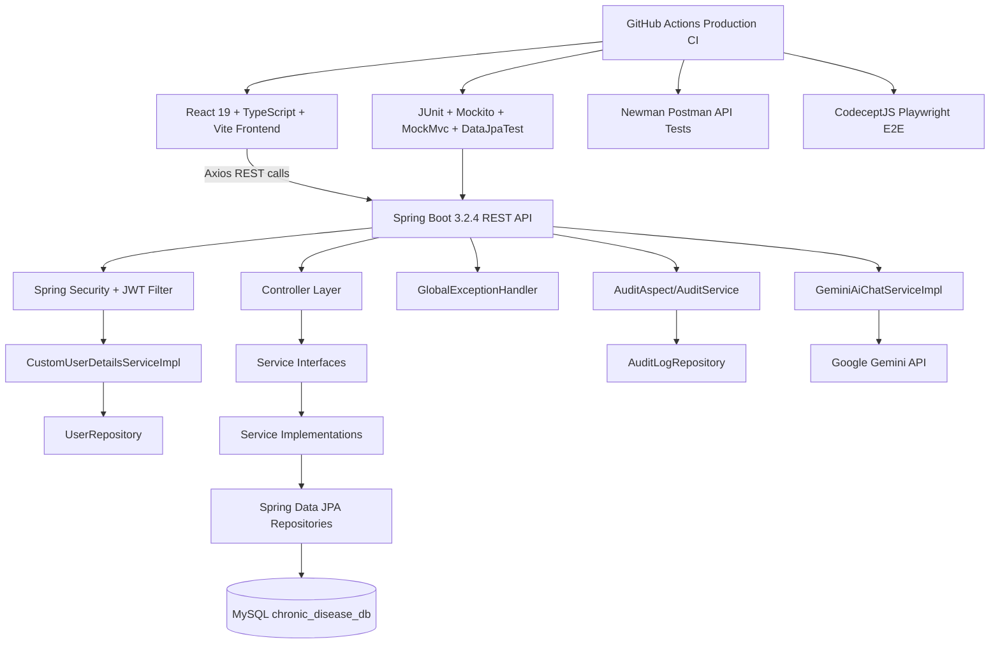
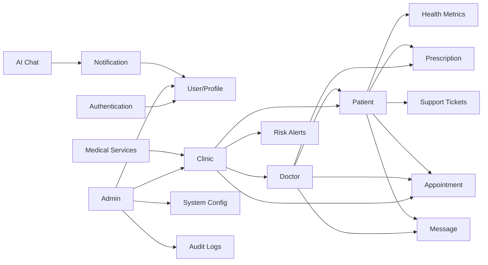
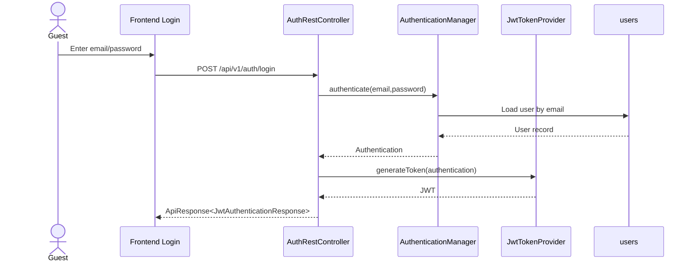
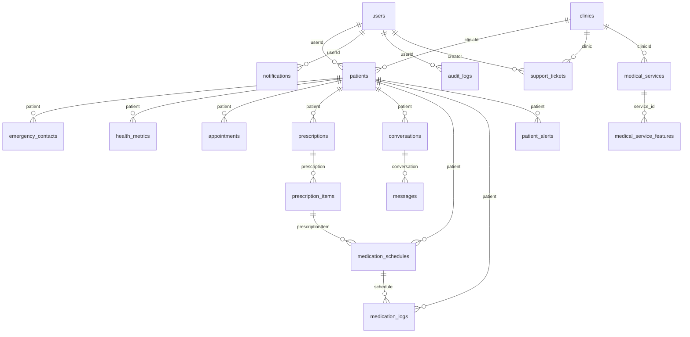
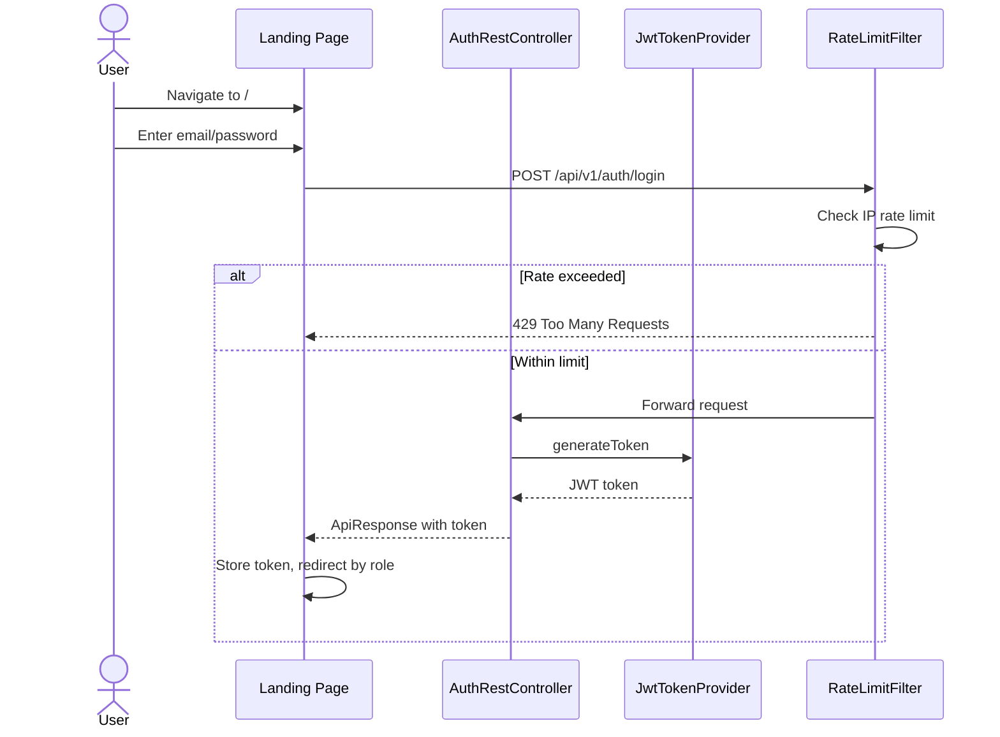
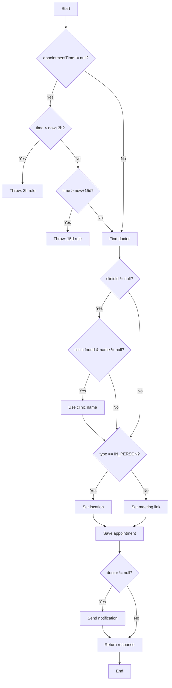
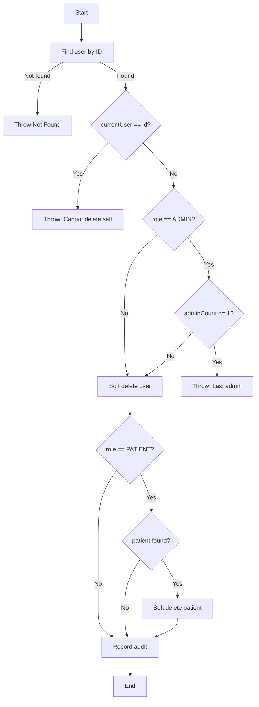
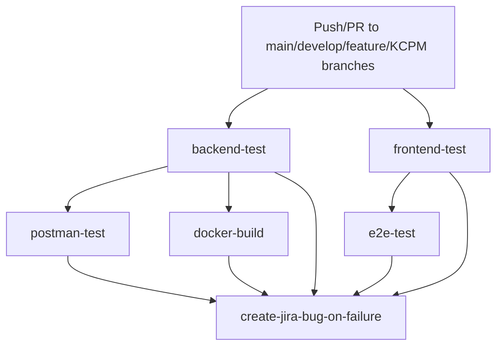

# PHAN TIEP TUC THEO WORKFLOW `createdoc.md`

> Scope note: This chapter is generated from repository evidence only. Items not confidently inferred from source code are marked **Need Confirmation**.

## A. Project Analysis Baseline Before Chapter Generation

### A.1 Dependency Graph



Evidence: `backend/pom.xml` declares Spring Boot Web, Data JPA, Security, Validation, AOP, WebFlux, JJWT, Springdoc, MySQL connector, H2 test database, JaCoCo and Surefire. `frontend/package.json` declares React, Vite, TypeScript, Axios, React Query, Recharts, Excel/PDF libraries and CodeceptJS Playwright. `backend/src/main/resources/application.yml` configures MySQL, JWT, Swagger and Gemini. `.github/workflows/production-ci.yml` defines backend, frontend, Postman, E2E, Docker and Jira failure handling jobs.

### A.2 Module Relationship Graph



### A.3 Detected Business Modules

| Module | Controllers | Services | Entities / Tables | Repositories | Tests |
|---|---|---|---|---|---|
| Authentication | `AuthRestController` | `CustomUserDetailsServiceImpl`, `JwtTokenProvider`, Spring `AuthenticationManager` | `User` / `users` | `UserRepository` | security service and integration tests |
| User/Profile | `UserProfileController`, part of `AdminController` | `AdminUserServiceImpl`, `PatientProfileServiceImpl` | `User`, `Patient`, `EmergencyContact` | `UserRepository`, `PatientRepository`, `EmergencyContactRepository` | user, DTO, mapper and profile tests |
| Admin | `AdminController` | `AdminDashboardServiceImpl`, `AdminClinicServiceImpl`, `AdminUserServiceImpl`, `AdminConfigServiceImpl` | `Clinic`, `User`, `SystemConfig`, `AuditLog` | clinic/user/config/audit repositories | admin controller/security/service tests |
| Clinic | `ClinicDashboardController`, `ClinicReportController`, `RiskAlertController` | clinic dashboard, patient, doctor, report and risk services | `Clinic`, `Patient`, `Appointment`, `PatientAlert`, `HealthMetric` | clinic/patient/appointment/alert repositories | clinic controller/security/service tests |
| Doctor | `DoctorController`, `DashboardController`, `DoctorPatientController`, `DoctorAppointmentController`, `DoctorMessageController`, `PrescriptionController` | doctor dashboard, patient, appointment, message, prescription services | `User`, `Patient`, `Appointment`, `Conversation`, `Message`, `Prescription`, `PrescriptionItem` | user/patient/appointment/conversation/message/prescription repositories | doctor controller/service/security tests |
| Patient | patient dashboard/profile/metric/appointment/prescription/message controllers | patient dashboard, profile, metric, appointment, prescription, message services | `Patient`, `HealthMetric`, `Appointment`, `Prescription`, `MedicationSchedule`, `MedicationLog`, `Conversation`, `Message`, `PatientAlert` | patient/metric/appointment/prescription/schedule/log/message repositories | patient controller/service/DTO tests |
| Notification | `NotificationController` | `NotificationServiceImpl` | `Notification` / `notifications` | `NotificationRepository` | notification controller/service tests |
| Medical Service | `MedicalServiceController` | `MedicalServiceServiceImpl` | `MedicalService`, `medical_service_features` | `MedicalServiceRepository` | medical service tests |
| Support Ticket | `SupportTicketController` | `SupportTicketServiceImpl` | `SupportTicket` / `support_tickets` | `SupportTicketRepository` | support ticket tests |
| AI Chat | `AiChatController` | `GeminiAiChatServiceImpl` | none detected | none detected | AI chat controller/service tests |
| Audit | `AuditAspect`, `AuditService`, admin audit endpoint | `AuditService`, `AdminDashboardServiceImpl.getAuditLogs` | `AuditLog` / `audit_logs` | `AuditLogRepository` | `AuditServiceTest` |

### A.4 Architecture and Source Constraints

The backend follows a layered Spring Boot architecture: REST controllers call service interfaces and implementations, services use Spring Data JPA repositories, and entity classes map to relational tables. This is supported by the package layout under `backend/src/main/java/com/project/controller`, `service`, `service/impl`, `repository`, `entity`, `dto`, `security`, `config`, `exception`, and `mapper`.

The database engine inferred from active configuration is MySQL, because `application.yml` uses `jdbc:mysql://localhost:3306/chronic_disease_db`, `com.mysql.cj.jdbc.Driver`, and `org.hibernate.dialect.MySQLDialect`. H2 is used for tests through `application-test.yml` and `application-h2.yml`. PostgreSQL usage is **Need Confirmation**.

Flyway/Liquibase is not configured in `pom.xml` or `application.yml`; although SQL migration files exist under `backend/src/main/resources/db/migration`, the active dependency list does not include Flyway or Liquibase. Formal migration execution is **Need Confirmation**.

No Redis, RabbitMQ, Kafka, mail sender, backend upload service bean, or WebSocket server configuration was confirmed from the scanned backend source. Frontend file upload/cloud image helpers exist (`frontend/src/utils/cloudinary.ts`), but backend upload service support is **Need Confirmation**.

---

## II. SOFTWARE REQUIREMENT SPECIFICATION

### 2.1 Product Overview

The system is an online chronic disease management application named DamDiep Healthcare, implemented as a React single-page frontend and a Spring Boot REST backend. The source code shows modules for user authentication, administrator management, clinic operations, doctor workflows, patient self-service, health metric tracking, appointment handling, prescriptions, messages, notifications, support tickets, medical services, AI chat, audit logs and CI-backed verification.

The backend exposes secured REST APIs under `/api/v1/**`, `/api/doctors`, and `/v1/clinics/{clinicId}/reports`. Authentication uses JWT generated by `JwtTokenProvider.generateToken`, validated by `JwtAuthenticationFilter`, and enforced globally by `SecurityConfig.filterChain`. Method-level permissions are enforced through `@PreAuthorize` expressions in controllers and through `SecurityService` methods such as `canAccessPatient`, `isClinicManagerOf`, `isDoctorOfClinic`, and `isDoctorSelf`.

### 2.2 Actors

| Actor | Responsibilities | Permissions Confirmed by Code | Related Modules |
|---|---|---|---|
| Guest | Authenticate and access public health check/login endpoints. | `SecurityConfig` permits `/api/v1/auth/**`, `/h2-console/**`, `/swagger-ui/**`, `/v3/api-docs/**`. | Authentication, Swagger health/API docs |
| Admin | Manage global dashboard, clinics, users, reports, audit logs and system config. | `AdminController` has class-level `@PreAuthorize("hasRole('ADMIN')")`; `SecurityConfig` restricts `/api/v1/admin/**` to ADMIN. | Admin, User, Clinic, System Config, Audit, Medical Service |
| Clinic Manager | Operate clinic dashboard, patients, doctors, appointments, profile, reports, risk alerts and clinic medical services. | `ClinicDashboardController` uses `hasAnyRole('CLINIC_MANAGER','ADMIN',...)`; `RiskAlertController` uses CLINIC_MANAGER/ADMIN; medical service writes allow ADMIN/CLINIC_MANAGER. | Clinic, Doctor, Patient, Appointment, Risk Alert, Report, Medical Service |
| Doctor | View doctor dashboard, manage assigned patients, appointments, prescriptions and messages. | Doctor controllers use `hasRole('DOCTOR')`; prescription creation additionally checks `@securityService.canAccessPatient(#request.patientId)`. | Doctor, Appointment, Patient, Prescription, Message |
| Patient | View dashboard/profile, record metrics, create/cancel appointments, view prescriptions, log medication, message doctor and manage alerts. | Patient controllers use `hasRole('PATIENT')`; services check ownership before deleting metrics, dismissing alerts, reading notifications, logging medication or requesting refill. | Patient, Health Metric, Appointment, Prescription, Message, Notification, Support |
| Authenticated User | View notifications, profile and change password. | `/api/v1/users/me`, `/api/v1/users/change-password`, `/api/v1/notifications/**` are authenticated by global security. | User Profile, Notification |

### 2.3 Use Case Diagram

```mermaid
graph TD
    Guest --> UC01[UC-01 Login]
    Admin --> UC02[UC-02 View Admin Dashboard]
    Admin --> UC03[UC-03 Manage Clinics]
    Admin --> UC04[UC-04 Manage Users]
    Admin --> UC05[UC-05 Manage System Config]
    Admin --> UC06[UC-06 View Audit Logs]
    ClinicManager --> UC07[UC-07 View Clinic Dashboard]
    ClinicManager --> UC08[UC-08 Manage Clinic Patients]
    ClinicManager --> UC09[UC-09 Manage Clinic Doctors]
    ClinicManager --> UC10[UC-10 Manage Clinic Appointments]
    ClinicManager --> UC11[UC-11 Monitor Risk Alerts]
    ClinicManager --> UC12[UC-12 View Clinic Reports]
    Doctor --> UC13[UC-13 View Doctor Dashboard]
    Doctor --> UC14[UC-14 Manage Doctor Appointments]
    Doctor --> UC15[UC-15 View Doctor Patients]
    Doctor --> UC16[UC-16 Create Prescriptions]
    Doctor --> UC17[UC-17 Message Patients]
    Patient --> UC18[UC-18 View Patient Dashboard]
    Patient --> UC19[UC-19 Manage Patient Profile]
    Patient --> UC20[UC-20 Record Health Metrics]
    Patient --> UC21[UC-21 Book Appointments]
    Patient --> UC22[UC-22 Manage Prescriptions and Medication Logs]
    Patient --> UC23[UC-23 Message Doctor]
    Patient --> UC24[UC-24 Create Support Ticket]
    AuthUser[Authenticated User] --> UC25[UC-25 Manage Notifications]
    AuthUser --> UC26[UC-26 Change Password]
    AuthUser --> UC27[UC-27 Use AI Chat]
    Admin --> UC28[UC-28 Manage Medical Services]
    ClinicManager --> UC28
```



### 2.4 Use Case Description

#### UC-01 Login

| Field | Description |
|---|---|
| ID | UC-01 |
| Name | Login |
| Actors | Guest |
| Goal | Authenticate a user by email/password and receive a JWT token. |
| Trigger | User submits `POST /api/v1/auth/login`. |
| Pre-condition | User record exists in `users`; password hash is compatible with BCrypt. |
| Post-condition | System returns `JwtAuthenticationResponse` with token and user data. |
| Main Flow | Validate `LoginRequest`; authenticate through `AuthenticationManager`; generate token with `JwtTokenProvider`; return API response. |
| Alternative Flow | `GET /api/v1/auth/health` returns API health without authentication. |
| Exception Flow | Authentication failure is handled by `GlobalExceptionHandler` or `JwtAuthenticationEntryPoint` with 401. |
| Business Rules | Email is username; JWT subject is email; token includes user id claim; expiration uses `jwt.expiration` configured as 86,400,000 ms. |
| Validation Rules | `LoginRequest.email` is `@NotBlank @Email`; password is `@NotBlank`. |
| Related APIs | `GET /api/v1/auth/health`, `POST /api/v1/auth/login`. |
| Related Tables | `users`. |

#### UC-02 View Admin Dashboard

| Field | Description |
|---|---|
| ID | UC-02 |
| Name | View Admin Dashboard |
| Actors | Admin |
| Goal | Retrieve global operational statistics and chart data. |
| Trigger | Admin opens dashboard screen or calls `GET /api/v1/admin/dashboard`. |
| Pre-condition | User has ADMIN role. |
| Post-condition | Dashboard response is returned. |
| Main Flow | `AdminController` calls `AdminDashboardServiceImpl.getDashboardData`; service aggregates users, clinics, appointments and activity data. |
| Alternative Flow | Query parameters `timeRange` and `metric` adjust the aggregation. |
| Exception Flow | Non-admin access returns 403 from Spring Security. |
| Business Rules | Dashboard data is cacheable by `timeRange` and `metric` via `@Cacheable`, but cache provider configuration is **Need Confirmation**. |
| Validation Rules | Query values are accepted as strings; strict enum validation is **Need Confirmation**. |
| Related APIs | `GET /api/v1/admin/dashboard`. |
| Related Tables | `users`, `clinics`, `appointments`, `audit_logs`, `patients`. |

#### UC-03 Manage Clinics

| Field | Description |
|---|---|
| ID | UC-03 |
| Name | Manage Clinics |
| Actors | Admin |
| Goal | Create, view, update and toggle clinic status. |
| Trigger | Admin calls clinic endpoints under `/api/v1/admin/clinics`. |
| Pre-condition | ADMIN role; request DTO passes validation. |
| Post-condition | Clinic and manager user records are created or updated. |
| Main Flow | `AdminClinicServiceImpl` checks duplicate clinic code and duplicate manager email, creates `Clinic`, creates manager `User` with `CLINIC_MANAGER`, encodes password and saves records. |
| Alternative Flow | Admin lists clinics with status/keyword/page filters or reads clinic statistics. |
| Exception Flow | Duplicate clinic code or email throws `IllegalArgumentException`; missing clinic throws `ResourceNotFoundException`. |
| Business Rules | `clinicCode` is unique; manager email must be unique; status toggles ACTIVE/INACTIVE. |
| Validation Rules | `CreateClinicRequest.name` and `clinicCode` are required; name max 200; clinic code max 20; manager name/email/password required. |
| Related APIs | `GET /api/v1/admin/clinics/stats`, `GET /api/v1/admin/clinics`, `GET /api/v1/admin/clinics/{id}`, `POST /api/v1/admin/clinics`, `PUT /api/v1/admin/clinics/{id}`, `PATCH /api/v1/admin/clinics/{id}/toggle-status`. |
| Related Tables | `clinics`, `users`. |

#### UC-04 Manage Users

| Field | Description |
|---|---|
| ID | UC-04 |
| Name | Manage Users |
| Actors | Admin |
| Goal | Create, update, list, toggle and delete user accounts. |
| Trigger | Admin calls `/api/v1/admin/users/**`. |
| Pre-condition | ADMIN role. |
| Post-condition | User record is changed and audit activity is recorded. |
| Main Flow | `AdminUserServiceImpl` validates unique email, validates password policy, encodes password, saves user, and records audit activity. |
| Alternative Flow | Admin filters users by role, status, clinic and keyword. |
| Exception Flow | Duplicate email, last admin deletion, and self-delete attempt are blocked. |
| Business Rules | Cannot delete current logged-in admin; cannot delete last active admin; password rules may require special characters, uppercase and number based on `SystemConfig`. |
| Validation Rules | `CreateUserRequest` requires fullName, email, password, role; email max 100 and valid; password min 8; role is a nonblank string mapped to `UserRole`. |
| Related APIs | `GET /api/v1/admin/users/stats`, `GET /api/v1/admin/users`, `GET /api/v1/admin/users/{id}`, `POST /api/v1/admin/users`, `PUT /api/v1/admin/users/{id}`, `PATCH /api/v1/admin/users/{id}/toggle-status`, `DELETE /api/v1/admin/users/{id}`. |
| Related Tables | `users`, `system_configs`, `audit_logs`. |

#### UC-05 Manage System Config

| Field | Description |
|---|---|
| ID | UC-05 |
| Name | Manage System Config |
| Actors | Admin |
| Goal | Read and update security/configuration flags and regenerate API key. |
| Trigger | Admin calls `/api/v1/admin/config`. |
| Pre-condition | ADMIN role. |
| Post-condition | `SystemConfig` row is created or updated. |
| Main Flow | `AdminConfigServiceImpl.getConfig` seeds default config when absent; update stores config flags; regenerate creates a new API key string. |
| Alternative Flow | None detected. |
| Exception Flow | Validation failure returns 400 through `GlobalExceptionHandler`. |
| Business Rules | Missing config is initialized by service; exact persistence cardinality beyond first row is **Need Confirmation**. |
| Validation Rules | `UpdateSystemConfigRequest` boolean fields are `@NotNull`. |
| Related APIs | `GET /api/v1/admin/config`, `PUT /api/v1/admin/config`, `POST /api/v1/admin/config/regenerate-key`. |
| Related Tables | `system_configs`. |

#### UC-06 View Audit Logs

| Field | Description |
|---|---|
| ID | UC-06 |
| Name | View Audit Logs |
| Actors | Admin |
| Goal | Search and paginate audit records. |
| Trigger | Admin calls `GET /api/v1/admin/audit-logs`. |
| Pre-condition | ADMIN role. |
| Post-condition | Page of `AuditLogResponse` returned. |
| Main Flow | `AdminDashboardServiceImpl.getAuditLogs` queries `AuditLogRepository` with filters. |
| Alternative Flow | `AuditAspect` and `AuditService.recordActivity` write records from annotated actions and service events. |
| Exception Flow | Unauthorized users receive 403. |
| Business Rules | Audit log stores user name, action, module, details and status based on entity fields. |
| Validation Rules | Query filters are optional strings. |
| Related APIs | `GET /api/v1/admin/audit-logs`. |
| Related Tables | `audit_logs`. |

#### UC-07 to UC-28 Summary

| UC | Name | Actors | Related APIs | Core Rules Derived from Code |
|---|---|---|---|---|
| UC-07 | View Clinic Dashboard | Admin, Clinic Manager, Doctor where allowed | `GET /api/v1/clinics/{clinicId}/dashboard` | Access controlled by role and clinic relation checks. |
| UC-08 | Manage Clinic Patients | Admin, Clinic Manager, Doctor where allowed | `/api/v1/clinics/{clinicId}/patients/**` | Patient create/update/delete are mediated by `ClinicPatientServiceImpl`; patient belongs to clinic. |
| UC-09 | Manage Clinic Doctors | Admin, Clinic Manager | `/api/v1/clinics/{clinicId}/doctors/**` | Doctor user email must be unique; doctor belongs to clinic. |
| UC-10 | Manage Clinic Appointments | Admin, Clinic Manager | `/api/v1/clinics/{clinicId}/appointments/**` | Completed or cancelled appointments cannot be updated by `ClinicDashboardServiceImpl.updateAppointment`. |
| UC-11 | Monitor Risk Alerts | Admin, Clinic Manager | `/api/v1/clinics/{clinicId}/risk-alerts/**` | Alerts can be read/dismissed; high-risk patient list is based on `PatientAlert` and patient risk fields. |
| UC-12 | View Clinic Reports | Clinic route users | `/v1/clinics/{clinicId}/reports/**` | Report endpoints return overview and disease detail data. Authorization annotation was not detected on controller, so effective access is **Need Confirmation**. |
| UC-13 | View Doctor Dashboard | Doctor | `GET /api/v1/doctor/dashboard` | Doctor-only access by `@PreAuthorize("hasRole('DOCTOR')")`. |
| UC-14 | Manage Doctor Appointments | Doctor | `/api/v1/doctor/appointments/**` | Doctor may list upcoming/all appointments, update status, create, reschedule and batch-reschedule. |
| UC-15 | View Doctor Patients | Doctor | `/api/v1/doctor/patients/**` | Doctor role required for list/stats; patient detail uses `@securityService.canAccessPatient`. |
| UC-16 | Create Prescriptions | Doctor | `/api/v1/doctor/prescriptions/**` | Doctor can create only for accessible patients; prescription requires diagnosis and at least one item. |
| UC-17 | Message Patients | Doctor | `/api/v1/doctor/messages/**` | Doctor role required; conversations and messages use `Conversation` and `Message`. |
| UC-18 | View Patient Dashboard | Patient | `/api/v1/patient/dashboard/**` | Patient can see dashboard and dismiss own alerts only. |
| UC-19 | Manage Patient Profile | Patient | `/api/v1/patient/profile/**` | Profile update can synchronize patient email into login user email; emergency contacts are patient-owned. |
| UC-20 | Record Health Metrics | Patient, Clinic/Doctor through clinic endpoint | `/api/v1/patient/health-metrics/**`, `/api/v1/clinics/{clinicId}/patients/{patientId}/health-metrics` | Metric type is limited to BLOOD_SUGAR, BLOOD_PRESSURE, HEART_RATE, HBA1C, SPO2; value must be positive. |
| UC-21 | Book Appointments | Patient | `/api/v1/patient/appointments/**` | Appointment time must be at least 3 hours in future and within 15 days; cancellation is owner-restricted. Current code blocks patient self-cancel for CONFIRMED appointments. |
| UC-22 | Manage Prescriptions and Medication Logs | Patient | `/api/v1/patient/prescriptions/**` | Patient sees active/history/today schedule, logs medication for own schedule, and can request refill only for active prescriptions. |
| UC-23 | Message Doctor | Patient | `/api/v1/patient/messages/**` | Patient role required; sends messages through `SendMessageRequest.content @NotBlank`. |
| UC-24 | Create Support Ticket | Authenticated users, role constraints Need Confirmation | `/api/v1/support-tickets/**` | Ticket code generated by service; status can be updated; creator/clinic/all queries exist. Controller-level `@PreAuthorize` was not detected. |
| UC-25 | Manage Notifications | Authenticated User | `/api/v1/notifications/**` | User can read, count unread, mark read/read-all and delete only owned notifications. |
| UC-26 | Change Password | Authenticated User | `PUT /api/v1/users/change-password` | Current and new password required; new password length 8-100. |
| UC-27 | Use AI Chat | Authenticated User | `POST /api/v1/ai/chat` | Request is sent to `GeminiAiChatServiceImpl`; external API key comes from `ai.gemini.api-key`. |
| UC-28 | Manage Medical Services | Admin, Clinic Manager | `/api/v1/medical-services/**` | Writes require ADMIN or CLINIC_MANAGER; price must be greater than 0; clinic manager cannot manage other clinic/system service outside rules. |

### 2.5 Need Confirmation Items for Chapter II

| Item | Reason |
|---|---|
| PostgreSQL deployment | Active backend config uses MySQL; older document text mentions PostgreSQL. |
| Flyway/Liquibase migration execution | Migration files exist but dependencies/configuration were not detected. |
| WebSocket real-time server | Message modules exist, but backend WebSocket configuration was not confirmed. |
| Redis/cache provider | `@Cacheable` exists on admin dashboard, but cache dependency/provider is not configured in `pom.xml`. |
| Mail/Zalo notification | Notification entity/service exists, but mail or Zalo integration was not confirmed. |
| Backend upload service | Frontend has Cloudinary utility; backend upload service was not confirmed. |
| Clinic report authorization | `ClinicReportController` endpoint annotations do not show `@PreAuthorize`; effective access may rely on broader security config or frontend route guards. |

# III. FUNCTIONAL REQUIREMENTS

> Source basis: `backend/src/main/java/com/project/controller`, `backend/src/main/java/com/project/service/impl`, DTO validation classes, entity mappings, and frontend route definitions in `frontend/src/routes/AppRoutes.tsx`. Any behavior not confirmed in code is marked **Need Confirmation**.

## 3.1 Module: Authentication and Session Access

### 3.1.1 Overview

The authentication module provides public health check and login APIs. It authenticates users by email/password and returns a JWT. Security is configured in `SecurityConfig`, token operations are implemented in `JwtTokenProvider`, and user loading is implemented in `CustomUserDetailsServiceImpl`.

### 3.1.2 Functions

| Function ID | Function | Purpose | Trigger | Actors | Inputs | Outputs | Processing | Validation | Business Rules | Exception Handling | APIs | Tables |
|---|---|---|---|---|---|---|---|---|---|---|---|---|
| FR-AUTH-01 | Health check | Verify auth API availability. | User/client calls health endpoint. | Guest | None | Status payload | `AuthRestController.healthCheck` returns service state. | None detected | Endpoint is public. | General exceptions handled globally. | `GET /api/v1/auth/health` | None |
| FR-AUTH-02 | Login | Authenticate and issue JWT. | Login form submit. | Guest | `LoginRequest.email`, `LoginRequest.password` | `JwtAuthenticationResponse` | `AuthenticationManager` authenticates; `JwtTokenProvider.generateToken` signs token; response includes token/user data. | Email `@NotBlank @Email`; password `@NotBlank`. | Email is username; JWT subject is email; token has `id` claim; expiration from `jwt.expiration` 24 hours. | Invalid credentials return 401 through security/exception handlers. | `POST /api/v1/auth/login` | `users` |

### 3.1.3 Navigation

Frontend route `/` renders the landing page. After login, `VelorahLandingPage.tsx` navigates users by role to `/admin`, `/doctor`, `/clinic`, or `/patient`.

### 3.1.4 Workflow



## 3.2 Module: Admin

### 3.2.1 Overview

The Admin module controls system-wide dashboard, clinic management, user management, reports, audit logs and system configuration. All endpoints in `AdminController` require ADMIN role through class-level `@PreAuthorize`.

### 3.2.2 Functions

| Function ID | Function | Purpose | Trigger | Actors | Inputs | Outputs | Processing | Validation | Business Rules | Exception Handling | APIs | Tables |
|---|---|---|---|---|---|---|---|---|---|---|---|---|
| FR-ADM-01 | View admin dashboard | Show global statistics and charts. | Admin opens dashboard. | Admin | `timeRange`, `metric` query params | `AdminDashboardResponse` | `AdminDashboardServiceImpl.getDashboardData` aggregates clinic/user/patient/activity data. | Query strings optional. | Method has `@Cacheable`; cache provider is **Need Confirmation**. | 403 if non-admin. | `GET /api/v1/admin/dashboard` | `users`, `clinics`, `patients`, `appointments`, `audit_logs` |
| FR-ADM-02 | Manage clinics | Create, list, detail, update, toggle status. | Admin opens clinics page or submits modal. | Admin | `CreateClinicRequest`, `UpdateClinicRequest`, status/keyword/page filters | `AdminClinicResponse`, stats/page response | `AdminClinicServiceImpl` validates duplicate code/email, creates clinic and clinic manager user, updates status. | Name required max 200; clinic code required max 20; manager fields required. | Clinic code unique; manager email unique; status toggles ACTIVE/INACTIVE. | Duplicate and missing resource errors handled by global handler. | `/api/v1/admin/clinics/**` | `clinics`, `users` |
| FR-ADM-03 | Manage users | Create, list, detail, update, toggle and delete users. | Admin opens users page or submits action. | Admin | `CreateUserRequest`, `UpdateUserRequest`, role/status/clinic/keyword/page filters | `AdminUserResponse`, stats/page response | `AdminUserServiceImpl` validates email, password policy, role and status, saves user and audit activity. | Email valid max 100; password min 8; status ACTIVE/INACTIVE for update. | Cannot delete current admin; cannot delete last active admin; email must be unique. | Illegal state and validation errors mapped globally. | `/api/v1/admin/users/**` | `users`, `system_configs`, `audit_logs` |
| FR-ADM-04 | View reports | Provide consolidated admin reports. | Admin opens reports page. | Admin | `reportType`, `performanceFilter` | `AdminReportsResponse` | `AdminDashboardServiceImpl.getReportsData` builds report data. | Query values optional. | Report export behavior in frontend exists in pages; server-side export endpoint is **Need Confirmation**. | 403 if non-admin. | `GET /api/v1/admin/reports` | `users`, `clinics`, `patients`, `appointments` |
| FR-ADM-05 | View audit logs | Search audit activity. | Admin opens audit page. | Admin | `userName`, `module`, `keyword`, pageable | Page of `AuditLogResponse` | `AdminDashboardServiceImpl.getAuditLogs` queries audit repository. | Optional filters. | Audit data is produced by `AuditAspect` and explicit service calls. | 403 if non-admin. | `GET /api/v1/admin/audit-logs` | `audit_logs` |
| FR-ADM-06 | Manage system config | Read/update config and regenerate API key. | Admin opens settings page. | Admin | `UpdateSystemConfigRequest` | `SystemConfigResponse`, new key string | `AdminConfigServiceImpl` seeds config if absent, updates flags, regenerates key. | Required booleans in update request. | Password policy depends on config flags. | Validation errors mapped to 400. | `GET/PUT /api/v1/admin/config`, `POST /api/v1/admin/config/regenerate-key` | `system_configs` |

### 3.2.3 Navigation

Admin routes are protected by `ProtectedRoute allowedRoles={['ADMIN']}` and include dashboard, clinics, users, services, reports, audit logs, support and settings. `AdminLayout.tsx` defines the sidebar labels for these routes.

### 3.2.4 Workflow

```mermaid
graph TD
    AdminLogin[Admin authenticated] --> Dashboard[/admin]
    Dashboard --> Clinics[/admin/clinics]
    Dashboard --> Users[/admin/users]
    Dashboard --> Services[/admin/services]
    Dashboard --> Reports[/admin/reports]
    Dashboard --> AuditLogs[/admin/audit-logs]
    Dashboard --> Settings[/admin/settings]
    Clinics --> CreateClinic[Create clinic + manager]
    Users --> CreateUser[Create user]
    Settings --> Config[Update password/API config]
```

## 3.3 Module: Clinic Management

### 3.3.1 Overview

The Clinic module supports clinic dashboard, patient records, doctor records, appointment records, clinic profile, risk alerts, clinic reports, health metric recording for clinic patients and batch appointment rescheduling. Controllers include `ClinicDashboardController`, `ClinicReportController`, and `RiskAlertController`.

### 3.3.2 Functions

| Function ID | Function | Purpose | Trigger | Actors | Inputs | Outputs | Processing | Validation | Business Rules | Exception Handling | APIs | Tables |
|---|---|---|---|---|---|---|---|---|---|---|---|---|
| FR-CLI-01 | View clinic dashboard | Show clinic operations and disease/appointment metrics. | Clinic dashboard route. | Clinic Manager, Admin, Doctor where allowed | `clinicId`, `period` | `ClinicDashboardResponse` | `ClinicDashboardServiceImpl.getDashboardData` aggregates clinic patient/appointment data. | `clinicId` path variable. | Access limited by roles and clinic relation checks. | Unauthorized returns 403. | `GET /api/v1/clinics/{clinicId}/dashboard` | `clinics`, `patients`, `appointments`, `health_metrics` |
| FR-CLI-02 | Manage clinic patients | List, create, update, delete and notify patients. | Patient list/modals. | Clinic Manager, Admin, Doctor where allowed | `CreatePatientRequest`, filters, patient id, notify message | Patient page/void | `ClinicPatientServiceImpl` creates user/patient records, updates patient fields, soft/deletes as implemented, sends notification. | Full name, gender, phone required; full name max 100. | Patient belongs to clinic; doctor assignment stored in `doctor_id`. | Duplicate/missing/unauthorized errors handled globally. | `/api/v1/clinics/{clinicId}/patients/**` | `patients`, `users`, `notifications` |
| FR-CLI-03 | Manage clinic doctors | List, create, update, delete, fetch available doctors. | Doctor list/modals. | Clinic Manager, Admin | `CreateDoctorRequest`, doctor id, filters | Doctor page/snippets/void | `ClinicDoctorServiceImpl` creates doctor users, updates profile fields, deletes doctor. | Doctor request requires name/email/phone/specialty/license fields. | Doctor email must be unique; doctor is attached to clinic. | Duplicate email throws `IllegalArgumentException`. | `/api/v1/clinics/{clinicId}/doctors/**` | `users`, `clinics` |
| FR-CLI-04 | Manage clinic appointments | List, create, update status, update details, batch reschedule. | Clinic appointment route/actions. | Clinic Manager, Admin | `DoctorCreateAppointmentRequest`, status, source/target dates | Appointment page/void/count | `ClinicDashboardServiceImpl` assigns doctor if needed, updates appointment, sends notification, reschedules appointment dates. | Date `yyyy-MM-dd`; time `HH:mm`; type OFFLINE/ONLINE. | Completed/cancelled appointments cannot be updated; no doctor available blocks creation. | Access denied and illegal state errors handled globally. | `/api/v1/clinics/{clinicId}/appointments/**` | `appointments`, `patients`, `notifications` |
| FR-CLI-05 | Manage clinic profile | View/update clinic profile. | Settings route. | Clinic Manager, Admin | `UpdateClinicRequest` | `ClinicResponse`/void | `ClinicDashboardServiceImpl` reads and updates clinic fields. | Name max 200; phone max 20. | Clinic profile is addressed by `clinicId`. | Missing clinic returns not found. | `GET/PUT /api/v1/clinics/{clinicId}/profile` | `clinics` |
| FR-CLI-06 | Monitor risk alerts | View dashboard, high-risk list, mark read, dismiss. | Risk alert route/actions. | Clinic Manager, Admin | `clinicId`, alert id, pageable | `RiskAlertResponse`, page/void | `RiskAlertServiceImpl` queries patient alerts and updates read/dismissed flags. | Alert id required. | Alert is represented by `PatientAlert`; high-risk patients are clinic-scoped. | Missing alert returns runtime/not found depending method. | `/api/v1/clinics/{clinicId}/risk-alerts/**` | `patient_alerts`, `patients` |
| FR-CLI-07 | View clinic reports | Provide clinic report and disease detail. | Reports route. | Clinic Manager/Admin per frontend; backend auth **Need Confirmation** | `clinicId`, `period`, `condition` | `ClinicReportResponse`, disease detail map | `ClinicReportServiceImpl` builds clinic report data. | Query values optional. | Controller lacks direct `@PreAuthorize`; effective authorization is **Need Confirmation**. | General security applies to non-public APIs. | `/v1/clinics/{clinicId}/reports/**` | `clinics`, `patients`, `appointments`, `health_metrics` |

### 3.3.3 Navigation

Clinic routes are protected for `CLINIC_MANAGER` and `ADMIN` in `AppRoutes.tsx`: dashboard, reports, risk alerts, patients, doctors, assignment, appointments, services, settings and support.

### 3.3.4 Workflow

```mermaid
graph TD
    ClinicHome[/clinic] --> Patients[/clinic/patients]
    ClinicHome --> Doctors[/clinic/doctors]
    ClinicHome --> Appointments[/clinic/appointments]
    ClinicHome --> Alerts[/clinic/alerts]
    ClinicHome --> Reports[/clinic/reports]
    Patients --> CreatePatient[Create or update patient]
    Doctors --> CreateDoctor[Create or update doctor]
    Appointments --> CreateAppt[Create/update/reschedule appointment]
    Alerts --> DismissAlert[Read or dismiss alert]
```

## 3.4 Module: Doctor

### 3.4.1 Overview

The Doctor module includes dashboard, patient monitoring, appointments, prescriptions and messaging. The backend enforces DOCTOR role for doctor-specific controllers and performs patient-access checks for sensitive patient detail and prescription creation.

### 3.4.2 Functions

| Function ID | Function | Purpose | Trigger | Actors | Inputs | Outputs | Processing | Validation | Business Rules | Exception Handling | APIs | Tables |
|---|---|---|---|---|---|---|---|---|---|---|---|---|
| FR-DOC-01 | View dashboard | Show doctor statistics and high-risk patients. | Doctor dashboard route. | Doctor | Current doctor identity | `DoctorDashboardResponse` | `DoctorDashboardServiceImpl.getDashboardData` aggregates assigned patient and appointment data. | Authenticated doctor required. | Doctor sees own operational data. | 403 if not DOCTOR. | `GET /api/v1/doctor/dashboard` | `users`, `patients`, `appointments`, `health_metrics` |
| FR-DOC-02 | Manage doctor appointments | List, create, update status, reschedule, batch reschedule. | Doctor appointment screen/actions. | Doctor | `DoctorCreateAppointmentRequest`, status, meeting link, diagnosis summary, dates | `DoctorAppointmentResponse`, count map | `DoctorAppointmentServiceImpl` manipulates appointment records for current doctor. | Patient id required; date/time/type patterns enforced. | Status updates store meeting link and diagnosis summary where provided. | Invalid state/access errors handled globally. | `/api/v1/doctor/appointments/**` | `appointments`, `patients` |
| FR-DOC-03 | View patient panel | List assigned patients, stats, trends and detail. | Doctor patient screen. | Doctor | filters, patient id, metric type, days | `DoctorPatientResponse`, detail/stats | `DoctorPatientServiceImpl` filters patients and computes trends. | Pageable/filter values optional. | Detail access uses `SecurityService.canAccessPatient`. | Access denied returns 403. | `/api/v1/doctor/patients/**` | `patients`, `health_metrics`, `appointments` |
| FR-DOC-04 | Create and manage prescriptions | List doctor prescriptions, stats, create, cancel. | Prescription screen/modal. | Doctor | `PrescriptionRequest`, search/status/page filters | `PrescriptionResponse`, stats/void | `PrescriptionServiceImpl` creates prescription and items, maps responses, can cancel by doctor. | Diagnosis required max 255; at least one item; medication name/dosage required. | Doctor may create only for accessible patient; prescription code generated by service. | Unauthorized creation/cancel returns runtime/access errors. | `/api/v1/doctor/prescriptions/**` | `prescriptions`, `prescription_items`, `patients` |
| FR-DOC-05 | Message patients | List conversations, page messages, send, mark read. | Doctor messages route. | Doctor | conversation id, `SendMessageRequest` | `ConversationResponse`, `MessageResponse` | `DoctorMessageServiceImpl` creates/saves messages and updates read state. | Message content `@NotBlank`. | Sender type is DOCTOR; conversation must be doctor-related. | Unauthorized/missing conversation handled by service/global handler. | `/api/v1/doctor/messages/**` | `conversations`, `messages` |
| FR-DOC-06 | Public/admin doctor CRUD | List doctor directory, create/update/delete doctors. | Doctor directory/admin actions. | Guest/Auth for reads, Admin for writes, doctor self update where allowed | specialty/keyword/page, `CreateDoctorRequest` | `DoctorResponse` | `DoctorServiceImpl` manages `User` records with doctor role/profile. | Create doctor request requires required doctor fields. | Create/delete require ADMIN; update requires ADMIN or doctor self. | 403 for unauthorized writes. | `/api/doctors/**` | `users` |

### 3.4.3 Navigation

Doctor routes are protected for `DOCTOR`: `/doctor`, `/doctor/analytics`, `/doctor/appointments`, `/doctor/messages`, `/doctor/patients`, `/doctor/prescriptions`, and `/doctor/support`.

### 3.4.4 Workflow

```mermaid
graph TD
    DoctorHome[/doctor] --> Appts[/doctor/appointments]
    DoctorHome --> Patients[/doctor/patients]
    DoctorHome --> Prescriptions[/doctor/prescriptions]
    DoctorHome --> Messages[/doctor/messages]
    Patients --> PatientDetail[View detail and metrics]
    Patients --> RecordMetric[Record metric through clinic API]
    Patients --> Advice[Send advice message]
    Prescriptions --> CreateRx[Create prescription]
    Appts --> UpdateStatus[Confirm/complete/reschedule]
```

## 3.5 Module: Patient

### 3.5.1 Overview

The Patient module gives patients access to dashboard, health metrics, appointments, prescriptions, medication logs, profile, emergency contacts, messaging, services and support. Patient routes in frontend are nested under `/patient` and guarded by `ProtectedRoute allowedRoles={['PATIENT']}`.

### 3.5.2 Functions

| Function ID | Function | Purpose | Trigger | Actors | Inputs | Outputs | Processing | Validation | Business Rules | Exception Handling | APIs | Tables |
|---|---|---|---|---|---|---|---|---|---|---|---|---|
| FR-PAT-01 | View dashboard and alerts | Show patient summary and alert list. | Patient dashboard. | Patient | Current patient identity | `PatientDashboardResponse`, alert list | `PatientDashboardServiceImpl` loads current patient, summary data and alerts. | Authenticated patient required. | Patient can dismiss only own alerts. | Unauthorized dismiss returns access denied. | `/api/v1/patient/dashboard/**` | `patients`, `patient_alerts`, `health_metrics`, `appointments` |
| FR-PAT-02 | Manage profile and contacts | View/update profile, manage emergency contacts, download report. | Profile page/actions. | Patient | `UpdatePatientProfileRequest`, `EmergencyContactRequest` | profile/contact DTOs, report bytes | `PatientProfileServiceImpl` updates patient and optionally login user email; manages contacts; builds text report. | Full name required max 100; phone/email patterns; date of birth past/present; contact phone pattern. | Emergency contacts belong to current patient. | Validation errors return 400; access errors return 403. | `/api/v1/patient/profile/**` | `patients`, `users`, `emergency_contacts` |
| FR-PAT-03 | Record health metrics | Create, summarize, chart, list history, delete metrics. | Metrics page/actions. | Patient | `CreateHealthMetricRequest`, metric type, period, pageable | metric DTOs/void | `PatientHealthMetricServiceImpl` evaluates status, saves metric, computes summary/trend/change. | Metric type pattern; positive value; unit required; secondary positive when present. | Supported types: BLOOD_SUGAR, BLOOD_PRESSURE, HEART_RATE, HBA1C, SPO2; deletion requires ownership. | Access denied if metric not owned. | `/api/v1/patient/health-metrics/**` | `health_metrics`, `patients` |
| FR-PAT-04 | Book appointments | Create, list upcoming/history, cancel, toggle reminder, get doctors. | Appointment page/modal. | Patient | `CreateAppointmentRequest`, appointment id, reminder flag | appointment DTOs/void/doctor list | `PatientAppointmentServiceImpl` validates time window, creates appointment, lists by patient, updates reminder/cancel state. | Doctor id and time required; time future; type IN_PERSON/ONLINE. | Appointment time must be at least 3 hours ahead and at most 15 days ahead; cancel restricted to owner and current state. | Confirmed/completed/cancelled cancellation paths throw runtime errors. | `/api/v1/patient/appointments/**` | `appointments`, `patients`, `users` |
| FR-PAT-05 | Manage prescriptions and medication logs | View active/history/today schedule, log medication, request refill. | Prescriptions page/actions. | Patient | `LogMedicationRequest`, prescription id | prescription/schedule DTOs/void | `PatientPrescriptionServiceImpl` loads current patient prescriptions/schedules and saves medication logs. | Schedule id required; status required. | Patient can log only own schedule; refill only active prescriptions. | Unauthorized or non-active refill throws errors. | `/api/v1/patient/prescriptions/**` | `prescriptions`, `prescription_items`, `medication_schedules`, `medication_logs` |
| FR-PAT-06 | Message doctor | List conversations, page messages, send, mark read. | Messages route. | Patient | conversation id, `SendMessageRequest` | conversation/message DTOs | `PatientMessageServiceImpl` manages patient-side messages. | Message content required. | Sender type is PATIENT; conversation must belong to current patient. | Missing/unauthorized conversation handled by service/global handler. | `/api/v1/patient/messages/**` | `conversations`, `messages` |

### 3.5.3 Navigation

Patient nested routes are `/patient`, `/patient/metrics`, `/patient/appointments`, `/patient/prescriptions`, `/patient/messages`, `/patient/profile`, `/patient/services`, and `/patient/support`.

### 3.5.4 Workflow

```mermaid
graph TD
    PatientHome[/patient] --> Metrics[/patient/metrics]
    PatientHome --> Appointments[/patient/appointments]
    PatientHome --> Prescriptions[/patient/prescriptions]
    PatientHome --> Messages[/patient/messages]
    PatientHome --> Profile[/patient/profile]
    Metrics --> AddMetric[Add metric]
    Appointments --> Book[Book appointment]
    Prescriptions --> LogMed[Log medication]
    Messages --> SendMsg[Send message]
    Profile --> Contacts[Emergency contacts]
```

## 3.6 Module: Notification

### 3.6.1 Overview

The Notification module provides authenticated users with notification listing, unread count, read/read-all and delete actions. Notification creation is internal through `NotificationServiceImpl.sendNotification`.

### 3.6.2 Functions

| Function ID | Function | Purpose | Trigger | Actors | Inputs | Outputs | Processing | Validation | Business Rules | Exception Handling | APIs | Tables |
|---|---|---|---|---|---|---|---|---|---|---|---|---|
| FR-NOT-01 | List notifications | Show current user's notifications. | Header dropdown/modal. | Authenticated User | Current user | List of `NotificationResponse` | Service filters by current user id. | Auth required. | User sees own notifications. | Unauthenticated returns 401. | `GET /api/v1/notifications` | `notifications` |
| FR-NOT-02 | Read count | Show unread badge. | Header render/poll. | Authenticated User | Current user | count | Service counts unread rows for current user. | Auth required. | Count excludes read notifications. | Unauthenticated returns 401. | `GET /api/v1/notifications/unread-count` | `notifications` |
| FR-NOT-03 | Mark read/read-all/delete | Manage notification lifecycle. | User action. | Authenticated User | notification id | void | Service checks ownership then updates read flag or deletes. | id required. | Access to other user's notification is forbidden. | AccessDeniedException returns 403. | `PUT /{id}/read`, `PUT /read-all`, `DELETE /{id}` | `notifications` |

## 3.7 Module: Medical Services

### 3.7.1 Overview

Medical services represent services/packages offered at system or clinic scope. The controller allows read access to authenticated users and write access to ADMIN or CLINIC_MANAGER.

### 3.7.2 Functions

| Function ID | Function | Purpose | Trigger | Actors | Inputs | Outputs | Processing | Validation | Business Rules | Exception Handling | APIs | Tables |
|---|---|---|---|---|---|---|---|---|---|---|---|---|
| FR-SVC-01 | Browse services | Show service catalog. | Services pages. | Authenticated users | optional `clinicId` | service list/detail | `MedicalServiceServiceImpl.getAllServices` and `getServiceById`. | id/clinicId optional as endpoint defines. | Reads are authenticated by global security. | Missing service returns not found/runtime. | `GET /api/v1/medical-services`, `GET /api/v1/medical-services/{id}` | `medical_services`, `medical_service_features` |
| FR-SVC-02 | Manage services | Create/update/delete/toggle services and view stats. | Admin/clinic service screens. | Admin, Clinic Manager | `MedicalService` payload, service id | service DTO/entity, stats/void | Service validates write access and payload, stores service, records activity. | Price must be greater than 0. | Clinic manager cannot manage services outside permitted clinic/system rules. | Access denied returns 403; invalid price returns 400. | `POST/PUT/DELETE/PATCH /api/v1/medical-services/**`, `GET /stats` | `medical_services`, `audit_logs` |

## 3.8 Module: Support Ticket

### 3.8.1 Overview

The Support Ticket module provides ticket creation, listing by clinic/creator, lookup by id/code, status update, stats and delete. `SupportTicketController` does not show method-level `@PreAuthorize`; global authentication still applies to non-public endpoints.

### 3.8.2 Functions

| Function ID | Function | Purpose | Trigger | Actors | Inputs | Outputs | Processing | Validation | Business Rules | Exception Handling | APIs | Tables |
|---|---|---|---|---|---|---|---|---|---|---|---|---|
| FR-SUP-01 | Create ticket | Submit a support request. | Support form submit. | Authenticated User, exact role **Need Confirmation** | `SupportTicket` payload | `SupportTicket` | `SupportTicketServiceImpl.createTicket` generates ticket code and saves ticket. | Entity nullable constraints apply. | Ticket code is generated by service. | Invalid data handled by global bad request. | `POST /api/v1/support-tickets` | `support_tickets`, `users`, `clinics` |
| FR-SUP-02 | Query tickets | List all, by clinic, by creator, or lookup by id/code. | Support page/search. | Authenticated User, exact role **Need Confirmation** | status, priority, clinicId, creatorId, ticket id/code, pageable | ticket/page | Repository queries return requested tickets. | Path/query params required as endpoint defines. | Access restrictions beyond global auth are **Need Confirmation**. | Missing ticket throws not found/runtime. | `GET /api/v1/support-tickets/**` | `support_tickets` |
| FR-SUP-03 | Update/delete ticket | Change status/admin note or delete ticket. | Admin/clinic support action. | Admin/Clinic/Doctor/Patient exact permissions **Need Confirmation** | ticket id, status, adminNote | ticket/void | Service updates status/admin note and deletes ticket. | status string accepted by service. | Formal status transition validation is **Need Confirmation** from current code. | Missing ticket handled by service/global handler. | `PUT /{id}/status`, `DELETE /{id}` | `support_tickets` |

## 3.9 Module: AI Chat

### 3.9.1 Overview

The AI Chat module sends chat requests to `GeminiAiChatServiceImpl`, which uses Google Gemini configuration from `application.yml`. The controller endpoint is `/api/v1/ai/chat`.

### 3.9.2 Functions

| Function ID | Function | Purpose | Trigger | Actors | Inputs | Outputs | Processing | Validation | Business Rules | Exception Handling | APIs | Tables |
|---|---|---|---|---|---|---|---|---|---|---|---|---|
| FR-AI-01 | Chat with AI assistant | Generate assistant response. | AI widget submit. | Authenticated User | `AiChatRequest` | `AiChatResponse` | Controller validates request and delegates to Gemini service. | DTO validation exists; exact fields should be read from `AiChatRequest`. | API key/model are configured by `ai.gemini.api-key` and `ai.gemini.model`. | External API failure handling is service-dependent; **Need Confirmation** for exact fallback. | `POST /api/v1/ai/chat` | None |

## 3.10 Cross-Module Functional Rules

| Rule ID | Rule | Evidence |
|---|---|---|
| FR-CROSS-01 | All APIs except auth, H2 console and Swagger/API docs require authentication. | `SecurityConfig.filterChain` permits only `/api/v1/auth/**`, `/h2-console/**`, `/swagger-ui/**`, `/v3/api-docs/**`; all other requests are authenticated. |
| FR-CROSS-02 | Admin APIs require ADMIN role. | `SecurityConfig` and `AdminController @PreAuthorize`. |
| FR-CROSS-03 | Clinic APIs require clinic/admin/doctor role variants and often method-level checks. | `ClinicDashboardController` and `RiskAlertController` annotations. |
| FR-CROSS-04 | Patient APIs require PATIENT role. | Patient controllers have class-level `@PreAuthorize("hasRole('PATIENT')")`. |
| FR-CROSS-05 | Doctor APIs require DOCTOR role. | Doctor controllers have class-level or method-level doctor role annotations. |
| FR-CROSS-06 | DTO validation is enforced with Jakarta Bean Validation and global validation handler. | `@Valid` in controllers and `GlobalExceptionHandler.handleValidationExceptions`. |
| FR-CROSS-07 | Standard API wrapper is `ApiResponse`. | Controllers return `ApiResponse<T>` for most endpoints. |
| FR-CROSS-08 | Passwords are encoded with BCrypt. | `SecurityConfig.passwordEncoder` and user creation services. |

## 3.11 Chapter III Need Confirmation

| Topic | Reason |
|---|---|
| Real-time messaging | Message services exist, but backend WebSocket/STOMP configuration was not confirmed. |
| Server-side export endpoints | Frontend uses Excel/PDF libraries; backend export endpoint was only confirmed for patient profile report bytes. |
| Formal support ticket role matrix | `SupportTicketController` lacks explicit method role annotations. |
| Cache runtime behavior | `@Cacheable` exists, but cache provider/configuration was not confirmed. |
| Cloud upload workflow | Frontend Cloudinary utility exists; backend upload service was not confirmed. |

---

# IV. NON-FUNCTIONAL REQUIREMENTS

> Source basis: `backend/pom.xml`, `application.yml`, `SecurityConfig.java`, `RateLimitFilter.java`, `BaseEntity.java`, `JpaAuditConfig.java`, `.github/workflows/production-ci.yml`, `sonar-project.properties`, entity index annotations.

## 4.1 Performance

| NFR ID | Requirement | Evidence |
|---|---|---|
| NFR-PERF-01 | HikariCP connection pool is configured with maximum 10 connections, minimum idle 2, idle timeout 30 s, max lifetime 600 s and connection timeout 30 s. | `application.yml` `spring.datasource.hikari` block. |
| NFR-PERF-02 | Leak detection threshold is set to 15 s to identify unreleased connections. | `application.yml` `hikari.leak-detection-threshold: 15000`. |
| NFR-PERF-03 | Keepalive time is 30 s to support Neon-style serverless DB connections. | `application.yml` `hikari.keepalive-time: 30000`. |
| NFR-PERF-04 | Database indexes are declared on high-cardinality foreign keys and frequently filtered columns to accelerate queries. | Entity `@Index` annotations on `users` (clinic_id, role, status, created_at, is_deleted), `patients` (clinic_id, doctor_id, risk_level, chronic_condition, composite), `appointments` (doctor_id, status, created_at, is_deleted, composite), `prescriptions` (doctor_id, patient_id, created_at, is_deleted, composite), `health_metrics` (composite patient_id+type+date, patient_id+date), `medical_services` (status, category, created_at), `audit_logs` (created_at, module, user_id), `support_tickets` (status, priority, user_id). |
| NFR-PERF-05 | Frontend uses React lazy loading and code splitting for page components. | `AppRoutes.tsx` uses `lazy(() => import(...))` for all major page components. |
| NFR-PERF-06 | Admin dashboard method uses `@Cacheable` annotation for caching. | `AdminDashboardServiceImpl.getDashboardData` annotation. Cache provider runtime is **Need Confirmation**. |
| NFR-PERF-07 | Postman API tests enforce a per-request timeout of 90 s. | `production-ci.yml` `--timeout-request 90000`. |
| NFR-PERF-08 | CI jobs have timeout limits: backend 25 min, frontend 20 min, Postman 20 min, E2E 30 min, Docker 20 min. | `production-ci.yml` per-job `timeout-minutes`. |

## 4.2 Security

| NFR ID | Requirement | Evidence |
|---|---|---|
| NFR-SEC-01 | Authentication uses stateless JWT with HMAC-SHA secret (minimum 256 bits). Token expiration is 86,400,000 ms (24 hours); refresh expiration is 604,800,000 ms (7 days). | `application.yml` `jwt.secret`, `jwt.expiration`, `jwt.refresh-expiration`. |
| NFR-SEC-02 | Passwords are encoded using BCrypt. | `SecurityConfig.passwordEncoder()` returns `BCryptPasswordEncoder`. |
| NFR-SEC-03 | CSRF is disabled for stateless REST API. | `SecurityConfig.filterChain` `.csrf(csrf -> csrf.disable())`. |
| NFR-SEC-04 | Session creation policy is STATELESS. | `SecurityConfig.filterChain` `.sessionCreationPolicy(SessionCreationPolicy.STATELESS)`. |
| NFR-SEC-05 | Rate limiting is applied to login endpoint: maximum 10 attempts per IP per 60 seconds. Exceeding returns HTTP 429. | `RateLimitFilter.java` with `MAX_ATTEMPTS = 10`, `WINDOW_MS = 60_000`. |
| NFR-SEC-06 | Unauthenticated access to protected endpoints returns 401 via `JwtAuthenticationEntryPoint`. | `SecurityConfig` `exceptionHandling(exception -> exception.authenticationEntryPoint(unauthorizedHandler))`. |
| NFR-SEC-07 | Method-level security is enabled through `@EnableMethodSecurity`. Role-based access is enforced via `@PreAuthorize` at class or method level. | `SecurityConfig` annotation and controller annotations. |
| NFR-SEC-08 | Password policy is configurable through `SystemConfig`: optional special character requirement and optional uppercase+number requirement. | `AdminUserServiceImpl.validatePasswordPolicy` reads `SystemConfig.specialCharRequired` and `upperNumberRequired`. |
| NFR-SEC-09 | Soft delete is implemented in `BaseEntity.isDeleted` and enforced via `@SQLDelete`/`@SQLRestriction` on sensitive entities (e.g., `Prescription`). | `BaseEntity.java` and `Prescription.java`. |
| NFR-SEC-10 | CORS is configured to allow all origin patterns with credentials and standard HTTP methods. | `SecurityConfig.corsConfigurationSource()`. Production CORS restriction is **Need Confirmation**. |
| NFR-SEC-11 | JWT filter extracts and validates token on every request, setting `SecurityContext` authentication. | `JwtAuthenticationFilter.java`. |

## 4.3 Availability

| NFR ID | Requirement | Evidence |
|---|---|---|
| NFR-AVL-01 | Health check endpoint `/api/v1/auth/health` is publicly accessible for monitoring. | `AuthRestController.healthCheck()`. |
| NFR-AVL-02 | Backend is containerized with Docker for deployment portability. | `production-ci.yml` `docker-build` job builds `./backend`. |
| NFR-AVL-03 | Frontend is deployed on Vercel. Backend is deployed on Render. | `production-ci.yml` env vars reference `vercel.app` and `onrender.com`. |
| NFR-AVL-04 | CI pipeline runs on every push to `main`, `develop`, `feature/**` and `KCPM-*` branches. | `production-ci.yml` `on.push.branches`. |

## 4.4 Reliability

| NFR ID | Requirement | Evidence |
|---|---|---|
| NFR-REL-01 | Global exception handler catches all unhandled exceptions and returns structured `ApiResponse` objects. | `GlobalExceptionHandler.java` handles `ResourceNotFoundException`, `AccessDeniedException`, `AuthenticationException`, `MethodArgumentNotValidException`, `IllegalArgumentException`, `DataIntegrityViolationException`, `RuntimeException` and generic `Exception`. |
| NFR-REL-02 | Transactional annotations ensure atomicity on write operations. | `@Transactional` on service create/update/delete methods. |
| NFR-REL-03 | Hibernate `ddl-auto: update` automatically evolves schema to match entity changes. | `application.yml` `spring.jpa.hibernate.ddl-auto: update`. |
| NFR-REL-04 | CI failure summaries are generated and uploaded as artifacts for post-mortem analysis. | `production-ci.yml` failure summary steps for every job. |
| NFR-REL-05 | CI failures on `main`/`develop` automatically create or comment on Jira issues for tracking. | `production-ci.yml` `create-jira-bug-on-failure` job. |

## 4.5 Scalability

| NFR ID | Requirement | Evidence |
|---|---|---|
| NFR-SCL-01 | Connection pool size is configurable through environment variables. | `application.yml` `${DB_URL}`, `${DB_USERNAME}`, `${DB_PASSWORD}` and Hikari settings. |
| NFR-SCL-02 | Server port is configurable via `${PORT:8080}`. | `application.yml` `server.port`. |
| NFR-SCL-03 | Pagination is used for all list endpoints to control response size. | All list endpoints accept `Pageable` or `page`/`size` parameters. |
| NFR-SCL-04 | In-memory rate limiter can be replaced with Redis-based solution for horizontal scaling. | `RateLimitFilter.java` comment: "In production, replace with Redis-based solution." |

## 4.6 Maintainability

| NFR ID | Requirement | Evidence |
|---|---|---|
| NFR-MNT-01 | Layered architecture separates concerns: controller → service → repository → entity. | Package structure under `com.project`. |
| NFR-MNT-02 | Lombok reduces boilerplate with `@Getter`, `@Setter`, `@Builder`, `@RequiredArgsConstructor`. | All entities and service classes. |
| NFR-MNT-03 | MapStruct/manual mapper pattern separates entity-to-DTO transformation. | `mapper` package with `UserMapper`. |
| NFR-MNT-04 | Springdoc OpenAPI generates API documentation from annotations. | `springdoc-openapi-starter-webmvc-ui` dependency and `@Operation`/`@Tag` annotations. |
| NFR-MNT-05 | SonarCloud is configured for static analysis. | `sonar-project.properties` defines source and test paths. |
| NFR-MNT-06 | JaCoCo is configured for code coverage reporting during `verify` phase. | `pom.xml` `jacoco-maven-plugin 0.8.12` with `prepare-agent` and `report` executions. |
| NFR-MNT-07 | JPA Auditing automatically populates `createdAt`, `updatedAt`, `createdBy`, `updatedBy` via `BaseEntity`. | `BaseEntity.java` with `@EntityListeners(AuditingEntityListener.class)`, `JpaAuditConfig.java`. |

## 4.7 Portability

| NFR ID | Requirement | Evidence |
|---|---|---|
| NFR-PRT-01 | Backend runs on Java 17 with Spring Boot 3.2.4. | `pom.xml` `<java.version>17</java.version>`, parent Spring Boot 3.2.4. |
| NFR-PRT-02 | H2 in-memory database is used for test profile, enabling tests without external MySQL. | `application-h2.yml`, `pom.xml` H2 dependency with test scope. |
| NFR-PRT-03 | Frontend is built with Node.js 22, React 19, TypeScript and Vite. | `production-ci.yml` and `frontend/package.json`. |
| NFR-PRT-04 | Docker build support exists for backend containerization. | CI `docker-build` job. |

## 4.8 Logging

| NFR ID | Requirement | Evidence |
|---|---|---|
| NFR-LOG-01 | SLF4J with `@Slf4j` is used throughout service and security classes. | Lombok `@Slf4j` annotation on service implementations. |
| NFR-LOG-02 | `GlobalExceptionHandler` logs warnings for client errors and errors for server exceptions. | `log.warn` for 4xx, `log.error` for 5xx. |
| NFR-LOG-03 | SQL queries are logged in development via `show-sql: true` with formatting. | `application.yml` `spring.jpa.show-sql: true`, `format_sql: true`. |
| NFR-LOG-04 | Audit trail is stored in `audit_logs` table capturing user, action, module, details, IP and status. | `AuditLog.java`, `AuditAspect.java`, `AuditService.recordActivity`. |

## 4.9 Backup and Recovery

| NFR ID | Requirement | Evidence |
|---|---|---|
| NFR-BKP-01 | Soft delete pattern preserves data integrity. Records are flagged `is_deleted = true` rather than physically removed. | `BaseEntity.isDeleted` and service `deleteUser` sets `isDeleted(true)`. |
| NFR-BKP-02 | CI artifacts (test reports, JaCoCo, Newman, E2E) are uploaded for historical access. | `production-ci.yml` `actions/upload-artifact@v4` steps. |
| NFR-BKP-03 | Database backup strategy and disaster recovery procedures are **Need Confirmation**. | No backup configuration was found in source. |

---

# V. DATABASE DESIGN

> Source basis: All entity classes under `backend/src/main/java/com/project/entity/`, `BaseEntity.java` auditing fields, JPA annotations and relationship mappings.

## 5.1 Entity Relationship Diagram



## 5.2 Entity Descriptions

### 5.2.1 users

| Column | Type | Constraints | Description |
|---|---|---|---|
| id | BIGINT | PK, AUTO_INCREMENT | User identifier. |
| email | VARCHAR(100) | UNIQUE, NOT NULL | Login email. |
| password | VARCHAR(255) | NOT NULL | BCrypt-hashed password. |
| role | VARCHAR(50) | NOT NULL, ENUM | ADMIN, DOCTOR, CLINIC_MANAGER, PATIENT. |
| full_name | VARCHAR(100) | | Display name. |
| phone | VARCHAR(20) | | Phone number. |
| avatar_url | VARCHAR(500) | | Profile image URL. |
| clinic_id | BIGINT | FK (logical) | Associated clinic. |
| specialization | VARCHAR(100) | | Doctor specialty. |
| department | VARCHAR(100) | | Doctor department. |
| license_number | VARCHAR(50) | | Doctor license (CCHN). |
| license_image_url | VARCHAR(500) | | Doctor license image. |
| degree | VARCHAR(50) | | Doctor academic degree. |
| bio | TEXT | | Doctor biography. |
| experience | VARCHAR(100) | | Years of experience. |
| max_patients | INT | | Maximum patient capacity. |
| status | VARCHAR(30) | NOT NULL, DEFAULT 'ACTIVE' | ACTIVE or INACTIVE. |
| created_at | DATETIME | Audit, NOT UPDATABLE | Creation timestamp. |
| updated_at | DATETIME | Audit | Last modification timestamp. |
| created_by | BIGINT | Audit, NOT UPDATABLE | Creator user ID. |
| updated_by | BIGINT | Audit | Last modifier user ID. |
| is_deleted | BOOLEAN | NOT NULL, DEFAULT false | Soft delete flag. |

Indexes: `idx_user_clinic_id`, `idx_user_role`, `idx_user_status`, `idx_user_created_at`, `idx_user_is_deleted`.

### 5.2.2 clinics

| Column | Type | Constraints | Description |
|---|---|---|---|
| id | BIGINT | PK, AUTO_INCREMENT | Clinic identifier. |
| clinic_code | VARCHAR(20) | UNIQUE | Unique clinic code. |
| name | VARCHAR(200) | NOT NULL | Clinic name. |
| email | VARCHAR(100) | | Clinic email. |
| description | TEXT | | Clinic description. |
| address | TEXT | | Physical address. |
| phone | VARCHAR(20) | | Phone number. |
| image_url | TEXT | | Clinic image. |
| manager_id | BIGINT | | Clinic manager user ID. |
| status | VARCHAR(30) | NOT NULL, DEFAULT 'ACTIVE' | ACTIVE or INACTIVE. |
| doctor_count | INT | DEFAULT 0 | Denormalized doctor count. |
| patient_count | INT | DEFAULT 0 | Denormalized patient count. |
| high_risk_patient_count | INT | DEFAULT 0 | Denormalized high-risk count. |
| created_at, updated_at, created_by, updated_by, is_deleted | | Inherited from BaseEntity | Audit fields. |

### 5.2.3 patients

| Column | Type | Constraints | Description |
|---|---|---|---|
| id | BIGINT | PK, AUTO_INCREMENT | Patient identifier. |
| user_id | BIGINT | NOT NULL | Login account reference. |
| clinic_id | BIGINT | | Assigned clinic. |
| full_name | VARCHAR(100) | NOT NULL | Patient name. |
| phone | VARCHAR(20) | NOT NULL | Phone number. |
| email | VARCHAR(100) | | Contact email. |
| gender | VARCHAR(10) | NOT NULL | Gender. |
| date_of_birth | DATE | | Birth date. |
| address | TEXT | | Home address. |
| avatar_url | TEXT | | Profile image. |
| patient_code | VARCHAR(50) | UNIQUE | Generated patient code (PT-XXXX). |
| doctor_id | BIGINT | | Assigned doctor user ID. |
| joined_date | DATE | | Registration date. |
| identity_card | VARCHAR(20) | | National ID card. |
| occupation | VARCHAR(100) | | Occupation. |
| ethnicity | VARCHAR(50) | | Ethnicity. |
| health_insurance_number | VARCHAR(50) | | Insurance number. |
| chronic_condition | VARCHAR(100) | | Primary chronic condition. |
| medical_history | TEXT | | Medical history notes. |
| allergies | TEXT | | Known allergies. |
| risk_level | VARCHAR(50) | | Risk classification. |
| treatment_status | VARCHAR(50) | | Current treatment status. |
| profile_status | VARCHAR(50) | | Profile completeness status. |
| room_location | VARCHAR(100) | | Hospital room. |
| clinicalNotes | TEXT | | Clinical notes. |
| blood_type | VARCHAR(10) | | Blood type. |
| height_cm | DECIMAL(5,2) | | Height in centimeters. |
| weight_kg | DECIMAL(5,2) | | Weight in kilograms. |
| Audit fields | | Inherited from BaseEntity | |

Indexes: `idx_patient_clinic_id`, `idx_patient_doctor_id`, `idx_patient_risk_level`, `idx_patient_created_at`, `idx_patient_is_deleted`, `idx_patient_chronic_condition`, `idx_patient_clinic_created_deleted` (composite).

### 5.2.4 appointments

| Column | Type | Constraints | Description |
|---|---|---|---|
| id | BIGINT | PK, AUTO_INCREMENT | Appointment identifier. |
| doctor_id | BIGINT | NOT NULL | Assigned doctor. |
| patient_id | BIGINT | FK NOT NULL | Patient reference. |
| appointment_time | DATETIME | NOT NULL | Scheduled time. |
| end_time | DATETIME | | Expected end time. |
| status | VARCHAR(50) | NOT NULL, ENUM | PENDING, SCHEDULED, COMPLETED, CANCELLED. |
| type | VARCHAR(255) | | IN_PERSON or ONLINE. |
| location | VARCHAR(255) | | Physical location. |
| meeting_link | VARCHAR(500) | | Video call link. |
| reason | TEXT | | Visit reason. |
| diagnosis_summary | TEXT | | Doctor diagnosis notes. |
| doctor_name | VARCHAR(100) | | Cached doctor name. |
| doctor_specialty | VARCHAR(100) | | Cached doctor specialty. |
| doctor_avatar_url | VARCHAR(500) | | Cached doctor avatar. |
| reminder_enabled | BOOLEAN | NOT NULL, DEFAULT false | Reminder toggle. |
| Audit fields | | Inherited from BaseEntity | |

Indexes: `idx_appointment_doctor_id`, `idx_appointment_status`, `idx_appointment_created_at`, `idx_appointment_is_deleted`, `idx_appointment_doctor_created_deleted` (composite).

### 5.2.5 prescriptions

| Column | Type | Constraints | Description |
|---|---|---|---|
| id | BIGINT | PK, AUTO_INCREMENT | Prescription identifier. |
| prescription_code | VARCHAR(20) | UNIQUE, NOT NULL | Generated prescription code. |
| doctor_id | BIGINT | NOT NULL | Prescribing doctor. |
| patient_id | BIGINT | FK NOT NULL | Patient reference. |
| diagnosis | VARCHAR(255) | NOT NULL | Diagnosis text. |
| status | VARCHAR(50) | NOT NULL, ENUM | ACTIVE, EXPIRED, CANCELLED, PENDING_RENEWAL, COMPLETED. |
| notes | TEXT | | Additional notes. |
| Audit fields | | Inherited from BaseEntity | |

Soft delete: `@SQLDelete(sql = "UPDATE prescriptions SET is_deleted = true WHERE id=?")`, `@SQLRestriction("is_deleted = false")`.

### 5.2.6 prescription_items

| Column | Type | Constraints | Description |
|---|---|---|---|
| id | BIGINT | PK, AUTO_INCREMENT | Item identifier. |
| prescription_id | BIGINT | FK NOT NULL | Parent prescription. |
| medication_name | VARCHAR(255) | NOT NULL | Drug name. |
| dosage | VARCHAR(100) | NOT NULL | Dosage information. |
| usage_instructions | VARCHAR(255) | | Usage instructions. |
| created_at | DATETIME | AUTO | Creation timestamp. |
| updated_at | DATETIME | AUTO | Update timestamp. |

### 5.2.7 health_metrics

| Column | Type | Constraints | Description |
|---|---|---|---|
| id | BIGINT | PK, AUTO_INCREMENT | Metric identifier. |
| patient_id | BIGINT | FK NOT NULL | Patient reference. |
| metric_type | VARCHAR(50) | NOT NULL, ENUM | BLOOD_SUGAR, BLOOD_PRESSURE, HEART_RATE, HBA1C, SPO2. |
| value | DECIMAL(10,2) | NOT NULL | Primary measurement value. |
| value_secondary | DECIMAL(10,2) | | Secondary value (e.g., diastolic for blood pressure). |
| unit | VARCHAR(20) | NOT NULL | Measurement unit. |
| status | VARCHAR(50) | | NORMAL, BORDERLINE_HIGH, HIGH, LOW. |
| notes | TEXT | | Additional notes. |
| measured_at | DATETIME | NOT NULL | Measurement timestamp. |
| Audit fields | | Inherited from BaseEntity | |

### 5.2.8 conversations

| Column | Type | Constraints | Description |
|---|---|---|---|
| id | BIGINT | PK, AUTO_INCREMENT | Conversation identifier. |
| patient_id | BIGINT | FK NOT NULL | Patient participant. |
| doctor_id | BIGINT | NOT NULL | Doctor participant. |
| last_message_at | DATETIME | | Last message timestamp. |
| is_active | BOOLEAN | DEFAULT true | Conversation active state. |
| Audit fields | | Inherited from BaseEntity | |

### 5.2.9 messages

| Column | Type | Constraints | Description |
|---|---|---|---|
| id | BIGINT | PK, AUTO_INCREMENT | Message identifier. |
| conversation_id | BIGINT | FK NOT NULL | Parent conversation. |
| sender_id | BIGINT | NOT NULL | Sender user ID. |
| sender_type | VARCHAR(20) | NOT NULL | PATIENT or DOCTOR. |
| content | TEXT | NOT NULL | Message content. |
| message_type | VARCHAR(20) | DEFAULT 'TEXT' | TEXT, IMAGE, FILE. |
| attachment_url | VARCHAR(500) | | Attachment URL. |
| is_read | BOOLEAN | | Read status. |
| sent_at | DATETIME | | Send timestamp. |
| created_at | DATETIME | AUTO | Creation timestamp. |

### 5.2.10 notifications

| Column | Type | Constraints | Description |
|---|---|---|---|
| id | BIGINT | PK, AUTO_INCREMENT | Notification identifier. |
| user_id | BIGINT | NOT NULL | Target user. |
| title | VARCHAR | NOT NULL | Notification title. |
| message | TEXT | NOT NULL | Notification body. |
| type | VARCHAR | NOT NULL | info, warning, success, error. |
| is_read | BOOLEAN | NOT NULL, DEFAULT false | Read status. |
| target_url | VARCHAR | | Navigation target URL. |
| Audit fields | | Inherited from BaseEntity | |

### 5.2.11 emergency_contacts

| Column | Type | Constraints | Description |
|---|---|---|---|
| id | BIGINT | PK, AUTO_INCREMENT | Contact identifier. |
| patient_id | BIGINT | FK NOT NULL | Owner patient. |
| contact_name | VARCHAR(100) | NOT NULL | Contact person name. |
| relationship | VARCHAR(50) | NOT NULL | Relationship to patient. |
| phone | VARCHAR(20) | NOT NULL | Phone number. |
| is_primary | BOOLEAN | | Primary contact flag. |
| Audit fields | | Inherited from BaseEntity | |

### 5.2.12 medication_schedules

| Column | Type | Constraints | Description |
|---|---|---|---|
| id | BIGINT | PK, AUTO_INCREMENT | Schedule identifier. |
| patient_id | BIGINT | FK NOT NULL | Patient reference. |
| prescription_item_id | BIGINT | FK | Linked prescription item. |
| medication_name | VARCHAR(255) | NOT NULL | Drug name. |
| dosage | VARCHAR(100) | NOT NULL | Dosage. |
| scheduled_time | TIME | NOT NULL | Daily scheduled time. |
| frequency | VARCHAR(50) | NOT NULL | DAILY, TWICE_DAILY, THREE_TIMES_DAILY. |
| instructions | TEXT | | Usage instructions. |
| start_date | DATE | NOT NULL | Schedule start date. |
| end_date | DATE | | Schedule end date. |
| is_active | BOOLEAN | DEFAULT true | Active state. |
| Audit fields | | Inherited from BaseEntity | |

### 5.2.13 medication_logs

| Column | Type | Constraints | Description |
|---|---|---|---|
| id | BIGINT | PK, AUTO_INCREMENT | Log identifier. |
| schedule_id | BIGINT | FK NOT NULL | Parent schedule. |
| patient_id | BIGINT | FK NOT NULL | Patient reference. |
| taken_at | DATETIME | NOT NULL | Actual time of action. |
| status | VARCHAR(50) | NOT NULL | TAKEN, MISSED, SKIPPED. |
| notes | TEXT | | Additional notes. |
| created_at | DATETIME | AUTO | Creation timestamp. |

### 5.2.14 patient_alerts

| Column | Type | Constraints | Description |
|---|---|---|---|
| id | BIGINT | PK, AUTO_INCREMENT | Alert identifier. |
| patient_id | BIGINT | FK NOT NULL | Patient reference. |
| alert_type | VARCHAR(50) | NOT NULL | HEALTH_WARNING, MEDICATION_REMINDER, APPOINTMENT_REMINDER. |
| severity | VARCHAR(20) | NOT NULL | INFO, WARNING, CRITICAL. |
| title | VARCHAR(255) | NOT NULL | Alert title. |
| message | TEXT | NOT NULL | Alert message. |
| is_read | BOOLEAN | | Read flag. |
| is_dismissed | BOOLEAN | | Dismissed flag. |
| created_at | DATETIME | AUTO | Creation timestamp. |

### 5.2.15 medical_services

| Column | Type | Constraints | Description |
|---|---|---|---|
| id | BIGINT | PK, AUTO_INCREMENT | Service identifier. |
| name | VARCHAR(200) | NOT NULL | Service name. |
| category | VARCHAR(100) | NOT NULL | Service category. |
| price | DECIMAL(15,2) | NOT NULL | Service price. |
| duration | VARCHAR(100) | NOT NULL | Expected duration. |
| description | TEXT | | Service description. |
| status | VARCHAR(50) | NOT NULL | Business status (e.g., "Đang kinh doanh"). |
| clinic_id | BIGINT | | NULL for global services, otherwise clinic-specific. |
| Audit fields | | Inherited from BaseEntity | |

### 5.2.16 medical_service_features

| Column | Type | Constraints | Description |
|---|---|---|---|
| service_id | BIGINT | FK NOT NULL | Parent medical service (element collection). |
| feature | VARCHAR | | Feature text entry. |

### 5.2.17 support_tickets

| Column | Type | Constraints | Description |
|---|---|---|---|
| id | BIGINT | PK, AUTO_INCREMENT | Ticket identifier. |
| ticketCode | VARCHAR | UNIQUE, NOT NULL | Auto-generated "TKT-XXXXXXXX". |
| subject | VARCHAR | NOT NULL | Subject. |
| category | VARCHAR | NOT NULL | Category (Kỹ thuật, Hỗ trợ nghiệp vụ, etc.). |
| priority | VARCHAR | NOT NULL | Priority (Khẩn cấp, Cao, Trung bình, Thấp). |
| status | VARCHAR | NOT NULL, DEFAULT 'Mới' | Mới, Đang xử lý, Chờ phản hồi, Đã giải quyết, Đã đóng. |
| message | TEXT | NOT NULL | Ticket description. |
| adminNote | TEXT | | Admin response note. |
| user_id | BIGINT | FK | Creator user reference. |
| clinic_id | BIGINT | FK | Related clinic. |
| closedAt | DATETIME | | Close timestamp. |
| Audit fields | | Inherited from BaseEntity | |

### 5.2.18 audit_logs

| Column | Type | Constraints | Description |
|---|---|---|---|
| id | BIGINT | PK, AUTO_INCREMENT | Log identifier. |
| userId | BIGINT | NOT NULL | Actor user ID. |
| userName | VARCHAR | | Actor display name. |
| userAvatar | VARCHAR | | Actor avatar URL. |
| action | VARCHAR | NOT NULL | Action performed. |
| module | VARCHAR | NOT NULL | Module name. |
| details | TEXT | | Action details. |
| ipAddress | VARCHAR | | Client IP address. |
| status | VARCHAR | | success, warning, danger. |
| Audit fields | | Inherited from BaseEntity | |

### 5.2.19 system_configs

| Column | Type | Constraints | Description |
|---|---|---|---|
| id | BIGINT | PK, AUTO_INCREMENT | Config identifier. |
| language | VARCHAR | | UI language. |
| timezone | VARCHAR | | System timezone. |
| maintenanceMode | BOOLEAN | | Maintenance mode flag. |
| specialCharRequired | BOOLEAN | | Password requires special character. |
| upperNumberRequired | BOOLEAN | | Password requires uppercase + number. |
| bpSysThreshold | VARCHAR | | Blood pressure systolic threshold. |
| bpDiaThreshold | VARCHAR | | Blood pressure diastolic threshold. |
| hrThreshold | VARCHAR | | Heart rate threshold. |
| spo2Threshold | VARCHAR | | SpO2 threshold. |
| notifyVitalSigns | BOOLEAN | | Vital signs notification toggle. |
| notifySupportRequests | BOOLEAN | | Support request notification toggle. |
| notifyRevenueReports | BOOLEAN | | Revenue report notification toggle. |
| apiKey | VARCHAR | | System API key for display/regeneration. |
| Audit fields | | Inherited from BaseEntity | |

---

# VI. BUSINESS RULES

> Source basis: Service implementations, entity constraints, security annotations and validation DTOs.

| Rule ID | Category | Rule | Evidence |
|---|---|---|---|
| BR-01 | Unique Constraint | User email must be unique across the system. | `User.email` has `unique = true`; `AdminUserServiceImpl.createUser` checks `findByEmail`. |
| BR-02 | Unique Constraint | Clinic code must be unique. | `Clinic.clinicCode` has `unique = true`; `AdminClinicServiceImpl` validates duplicate. |
| BR-03 | Unique Constraint | Patient code must be unique. | `Patient.patientCode` has `unique = true`. |
| BR-04 | Unique Constraint | Prescription code must be unique. | `Prescription.prescriptionCode` has `unique = true`. |
| BR-05 | Unique Constraint | Support ticket code must be unique, auto-generated as "TKT-" + UUID prefix. | `SupportTicket.ticketCode` has `unique = true`; `@PrePersist onCreate()`. |
| BR-06 | Soft Delete | User deletion is soft — sets `isDeleted = true` instead of physical delete. If user is PATIENT, linked patient record is also soft-deleted. | `AdminUserServiceImpl.deleteUser`. |
| BR-07 | Soft Delete | Prescription deletion is soft via `@SQLDelete` annotation; queries automatically filter by `@SQLRestriction("is_deleted = false")`. | `Prescription.java`. |
| BR-08 | Permission Rule | Cannot delete the currently logged-in admin account. | `AdminUserServiceImpl.deleteUser` checks `currentUserId.equals(id)`. |
| BR-09 | Permission Rule | Cannot delete the last active admin account. | `AdminUserServiceImpl.deleteUser` checks `countByRoleAndIsDeletedFalse(ADMIN) <= 1`. |
| BR-10 | Status Transition | Clinic status toggles between ACTIVE and INACTIVE. | `AdminClinicServiceImpl.toggleClinicStatus`. |
| BR-11 | Status Transition | User status toggles between ACTIVE and INACTIVE. | `AdminUserServiceImpl.toggleUserStatus`. |
| BR-12 | Status Transition | Appointment status values: PENDING → SCHEDULED → COMPLETED; any → CANCELLED. Completed or cancelled appointments cannot be updated further. | `AppointmentStatus` enum; `ClinicDashboardServiceImpl.updateAppointment` blocks update for completed/cancelled. |
| BR-13 | Status Transition | Prescription status values: ACTIVE, EXPIRED, CANCELLED, PENDING_RENEWAL, COMPLETED. | `PrescriptionStatus` enum. |
| BR-14 | Scheduling Rule | Appointment time must be at least 3 hours in the future. | `PatientAppointmentServiceImpl.create` checks `appointmentTime.isBefore(now.plusHours(3))`. |
| BR-15 | Scheduling Rule | Appointment time must be at most 15 days in the future. | `PatientAppointmentServiceImpl.create` checks `appointmentTime.isAfter(now.plusDays(15))`. |
| BR-16 | Permission Rule | Patient can only cancel PENDING appointments. SCHEDULED appointments cannot be self-cancelled (must contact clinic). COMPLETED appointments cannot be cancelled. | `PatientAppointmentServiceImpl.cancel` status checks. |
| BR-17 | Permission Rule | Patient can only cancel, toggle reminder for, and view their own appointments. | `PatientAppointmentServiceImpl` checks `appointment.getPatient().getId().equals(currentPatient.getId())`. |
| BR-18 | Validation Rule | Health metric type is restricted to BLOOD_SUGAR, BLOOD_PRESSURE, HEART_RATE, HBA1C, SPO2. | `MetricType` enum. |
| BR-19 | Validation Rule | Health metric value must be positive. Secondary value (diastolic) must also be positive when present. | DTO validation in metric creation. |
| BR-20 | Validation Rule | Medical service price must be greater than 0. | `MedicalServiceServiceImpl` validation. |
| BR-21 | Validation Rule | Prescription requires a diagnosis (max 255 chars) and at least one prescription item. | DTO validation and `PrescriptionServiceImpl.create`. |
| BR-22 | Validation Rule | Password must be at least 8 characters. Optional special character and uppercase+number requirements are configurable via `SystemConfig`. | `AdminUserServiceImpl.validatePasswordPolicy`. |
| BR-23 | Validation Rule | Login request requires valid `@Email` format and non-blank password. | `LoginRequest` DTO annotations. |
| BR-24 | Security Rule | Login endpoint is rate-limited to 10 requests per IP per 60-second window. | `RateLimitFilter.java`. |
| BR-25 | Security Rule | JWT token has 24-hour expiration; refresh token has 7-day expiration. | `application.yml`. |
| BR-26 | Domain Rule | When admin creates a PATIENT user, a corresponding `Patient` record is automatically created with a generated patient code. | `AdminUserServiceImpl.createUser` creates Patient for PATIENT role. |
| BR-27 | Domain Rule | Notification ownership is enforced — users can only read, mark, or delete their own notifications. | `NotificationServiceImpl` checks `userId` equality. |
| BR-28 | Domain Rule | Patient is scoped to a clinic; available doctors are limited to the same clinic. | `PatientAppointmentServiceImpl.getAvailableDoctors` filters by `clinicId`. |
| BR-29 | Domain Rule | Prescription creation by doctor requires `SecurityService.canAccessPatient` authorization. | `PrescriptionController @PreAuthorize`. |
| BR-30 | Domain Rule | Patient profile update can synchronize the email into the login user account. | `PatientProfileServiceImpl` updates user email alongside patient email. |
| BR-31 | Domain Rule | Medication refill can only be requested for ACTIVE prescriptions. | `PatientPrescriptionServiceImpl.requestRefill`. |
| BR-32 | Audit Rule | Admin actions (create, update, toggle status, delete) are recorded in audit log with actor, action, module, details and status. | `AuditService.recordActivity` called from admin service methods. |
| BR-33 | Notification Rule | Appointment creation by patient sends notification to the assigned doctor. | `PatientAppointmentServiceImpl.create` calls `notificationService.sendNotification`. |
| BR-34 | Domain Rule | IN_PERSON appointments use clinic name as location; ONLINE appointments receive a default meeting link. | `PatientAppointmentServiceImpl.create` conditional assignment. |

---

# VII. SCREEN FLOW

> Source basis: `frontend/src/routes/AppRoutes.tsx`, frontend layout components, and ProtectedRoute configurations.

## 7.1 Overall Application Screen Flow

```mermaid
graph TD
    Landing[/ Landing Page /] -->|Login| AuthCheck{Role?}
    AuthCheck -->|ADMIN| AdminPortal[Admin Portal]
    AuthCheck -->|CLINIC_MANAGER| ClinicPortal[Clinic Portal]
    AuthCheck -->|DOCTOR| DoctorPortal[Doctor Portal]
    AuthCheck -->|PATIENT| PatientPortal[Patient Portal]
    
    AdminPortal --> AD[/admin Dashboard]
    AD --> AC[/admin/clinics]
    AD --> AU[/admin/users]
    AD --> AS[/admin/services]
    AD --> AR[/admin/reports]
    AD --> AAL[/admin/audit-logs]
    AD --> ASup[/admin/support]
    AD --> ASet[/admin/settings]
    
    ClinicPortal --> CD[/clinic Dashboard]
    CD --> CR[/clinic/reports]
    CD --> CRA[/clinic/alerts]
    CD --> CP[/clinic/patients]
    CD --> CDo[/clinic/doctors]
    CD --> CAs[/clinic/assignment]
    CD --> CA[/clinic/appointments]
    CD --> CS[/clinic/services]
    CD --> CSet[/clinic/settings]
    CD --> CSup[/clinic/support]
    
    DoctorPortal --> DD[/doctor Dashboard]
    DD --> DAn[/doctor/analytics]
    DD --> DA[/doctor/appointments]
    DD --> DM[/doctor/messages]
    DD --> DP[/doctor/patients]
    DD --> DPr[/doctor/prescriptions]
    DD --> DSup[/doctor/support]
    
    PatientPortal --> PD[/patient Dashboard]
    PD --> PM[/patient/metrics]
    PD --> PA[/patient/appointments]
    PD --> PPr[/patient/prescriptions]
    PD --> PMg[/patient/messages]
    PD --> PPf[/patient/profile]
    PD --> PS[/patient/services]
    PD --> PSup[/patient/support]
```

## 7.2 Authentication Flow



---

# VIII. SCREEN DESCRIPTION

> Source basis: `AppRoutes.tsx` route definitions, layout components, and corresponding API endpoints.

## 8.1 Landing Page (/)

| Field | Description |
|---|---|
| Purpose | Public entry point with login form and system branding. |
| Displayed Data | System name (DamDiep Healthcare), login form. |
| Actions | Enter email/password, submit login. |
| Validation | Email format, non-empty password. |
| Navigation | Redirects to role-specific dashboard after login. |
| Permissions | Public access. |

## 8.2 Admin Dashboard (/admin)

| Field | Description |
|---|---|
| Purpose | Display global system statistics and operational charts. |
| Displayed Data | Total users, clinics, patients, appointments, activity timeline, performance metrics. |
| Actions | Filter by time range and metric; navigate to sub-modules. |
| Validation | None client-enforced. |
| Navigation | Sidebar links to clinics, users, services, reports, audit logs, support, settings. |
| Permissions | ADMIN only. |

## 8.3 Admin Clinics (/admin/clinics)

| Field | Description |
|---|---|
| Purpose | Manage all clinics in the system. |
| Displayed Data | Clinic list with code, name, status, manager, patient/doctor counts. Stats cards. |
| Actions | Create clinic (with manager), edit clinic, toggle status, search/filter. |
| Validation | Name required (max 200), clinic code required (max 20), manager email/name/password required. |
| Navigation | Detail view per clinic, back to dashboard. |
| Permissions | ADMIN only. |

## 8.4 Admin Users (/admin/users)

| Field | Description |
|---|---|
| Purpose | Manage all user accounts. |
| Displayed Data | User list with name, email, role, status, clinic. Stats by role. |
| Actions | Create user, edit, toggle status, delete, filter by role/status/clinic/keyword. |
| Validation | Full name required, email valid (max 100), password min 8, role required. |
| Navigation | User detail, back to dashboard. |
| Permissions | ADMIN only. |

## 8.5 Admin Settings (/admin/settings)

| Field | Description |
|---|---|
| Purpose | Configure system-wide settings. |
| Displayed Data | Language, timezone, maintenance mode, password policy flags, medical thresholds, notification toggles, API key. |
| Actions | Update config, regenerate API key. |
| Validation | Boolean fields required for update. |
| Navigation | Back to dashboard. |
| Permissions | ADMIN only. |

## 8.6 Admin Audit Logs (/admin/audit-logs)

| Field | Description |
|---|---|
| Purpose | Search and review system audit trail. |
| Displayed Data | Paginated list with user, action, module, details, timestamp, status. |
| Actions | Filter by user name, module, keyword. Paginate. |
| Validation | None enforced. |
| Navigation | Back to dashboard. |
| Permissions | ADMIN only. |

## 8.7 Clinic Dashboard (/clinic)

| Field | Description |
|---|---|
| Purpose | Clinic operations overview and metrics. |
| Displayed Data | Patient counts, appointment summary, disease distribution, risk alerts preview. |
| Actions | Navigate to sub-modules, filter by period. |
| Validation | Clinic ID from session. |
| Navigation | Reports, alerts, patients, doctors, assignment, appointments, services, settings, support. |
| Permissions | CLINIC_MANAGER, ADMIN. |

## 8.8 Doctor Dashboard (/doctor)

| Field | Description |
|---|---|
| Purpose | Doctor's personal operational summary. |
| Displayed Data | Assigned patient count, today's appointments, high-risk patients, schedule. |
| Actions | Navigate to appointments, patients, prescriptions, messages. |
| Validation | Doctor identity from JWT. |
| Navigation | Analytics, appointments, messages, patients, prescriptions, support. |
| Permissions | DOCTOR only. |

## 8.9 Patient Dashboard (/patient)

| Field | Description |
|---|---|
| Purpose | Patient's personal health summary and alert center. |
| Displayed Data | Upcoming appointments, recent metrics, alerts, medication schedule. |
| Actions | Dismiss alerts, navigate to detailed views. |
| Validation | Patient identity from JWT. |
| Navigation | Metrics, appointments, prescriptions, messages, profile, services, support. |
| Permissions | PATIENT only. |

## 8.10 Patient Health Metrics (/patient/metrics)

| Field | Description |
|---|---|
| Purpose | Record, view and track health measurements. |
| Displayed Data | Metric charts, summary stats, trend analysis, measurement history. |
| Actions | Add new metric, view history, delete own metric. |
| Validation | Metric type must be valid enum, value positive, unit required. |
| Navigation | Back to dashboard. |
| Permissions | PATIENT only. |

## 8.11 Patient Appointments (/patient/appointments)

| Field | Description |
|---|---|
| Purpose | Book, view and manage appointments. |
| Displayed Data | Upcoming appointments, appointment history, available doctors. |
| Actions | Book new appointment, cancel pending appointment, toggle reminder. |
| Validation | Doctor required, time 3h–15d in future, type IN_PERSON/ONLINE. |
| Navigation | Back to dashboard. |
| Permissions | PATIENT only. |

## 8.12 Patient Profile (/patient/profile)

| Field | Description |
|---|---|
| Purpose | View and edit personal profile and emergency contacts. |
| Displayed Data | Full profile fields, emergency contact list, downloadable report. |
| Actions | Update profile, add/edit/delete emergency contacts, download report. |
| Validation | Full name max 100, phone/email patterns, date of birth past/present. |
| Navigation | Back to dashboard. |
| Permissions | PATIENT only. |

---

# IX. AUTHORIZATION MATRIX

> Source basis: `SecurityConfig.filterChain`, controller `@PreAuthorize` annotations, `SecurityService` methods.

## 9.1 Module-Level CRUD Matrix

| Module / Resource | Guest | Patient | Doctor | Clinic Manager | Admin |
|---|---|---|---|---|---|
| Auth (Login, Health) | R | — | — | — | — |
| Admin Dashboard | — | — | — | — | R |
| Admin Clinics | — | — | — | — | CRUD |
| Admin Users | — | — | — | — | CRUD |
| Admin System Config | — | — | — | — | RU |
| Admin Audit Logs | — | — | — | — | R |
| Admin Reports | — | — | — | — | R |
| Clinic Dashboard | — | — | R* | R | R |
| Clinic Patients | — | — | R* | CRUD | CRUD |
| Clinic Doctors | — | — | — | CRUD | CRUD |
| Clinic Appointments | — | — | — | CRUD | CRUD |
| Clinic Risk Alerts | — | — | — | RUD | RUD |
| Clinic Reports | — | — | — | R | R |
| Doctor Dashboard | — | — | R | — | — |
| Doctor Appointments | — | — | CRUD | — | — |
| Doctor Patients | — | — | R | — | — |
| Doctor Prescriptions | — | — | CRD | — | — |
| Doctor Messages | — | — | CRU | — | — |
| Patient Dashboard | — | R | — | — | — |
| Patient Profile | — | RU | — | — | — |
| Patient Health Metrics | — | CRD | — | — | — |
| Patient Appointments | — | CRD | — | — | — |
| Patient Prescriptions | — | R | — | — | — |
| Patient Messages | — | CRU | — | — | — |
| Notifications | — | RUD | RUD | RUD | RUD |
| Medical Services | — | R | R | CRU | CRUD |
| Support Tickets | — | CR** | CR** | CRU** | CRUD** |
| AI Chat | — | C | C | C | C |
| User Profile (password) | — | U | U | U | U |
| Doctor Directory | R | R | R | R | CRUD |

Legend: C = Create, R = Read, U = Update, D = Delete, — = No access, * = With clinic relation check, ** = Role-specific permissions **Need Confirmation**.

---

# X. API SPECIFICATION

> Source basis: All controller classes in `backend/src/main/java/com/project/controller/`.

## 10.1 Authentication Module

| Method | URL | Description | Auth | Request DTO | Response DTO | Validation |
|---|---|---|---|---|---|---|
| GET | `/api/v1/auth/health` | API health check. | Public | — | ApiResponse | — |
| POST | `/api/v1/auth/login` | Login and receive JWT. | Public | `LoginRequest` | `ApiResponse<JwtAuthenticationResponse>` | email: @NotBlank @Email; password: @NotBlank |

## 10.2 Admin Module

| Method | URL | Description | Auth | Request DTO | Response DTO | Validation |
|---|---|---|---|---|---|---|
| GET | `/api/v1/admin/dashboard` | Admin dashboard data. | ADMIN | timeRange, metric (query) | `ApiResponse<AdminDashboardResponse>` | Optional strings |
| GET | `/api/v1/admin/clinics/stats` | Clinic statistics. | ADMIN | — | `ApiResponse<AdminClinicStatsResponse>` | — |
| GET | `/api/v1/admin/clinics` | List clinics (paginated). | ADMIN | status, keyword, page, size (query) | `ApiResponse<Page<AdminClinicResponse>>` | — |
| GET | `/api/v1/admin/clinics/{id}` | Clinic detail. | ADMIN | id (path) | `ApiResponse<AdminClinicResponse>` | — |
| POST | `/api/v1/admin/clinics` | Create clinic with manager. | ADMIN | `CreateClinicRequest` | `ApiResponse<AdminClinicResponse>` | @Valid |
| PUT | `/api/v1/admin/clinics/{id}` | Update clinic. | ADMIN | `UpdateClinicRequest` | `ApiResponse<AdminClinicResponse>` | @Valid |
| PATCH | `/api/v1/admin/clinics/{id}/toggle-status` | Toggle clinic status. | ADMIN | id (path) | `ApiResponse<Void>` | — |
| GET | `/api/v1/admin/users/stats` | User statistics. | ADMIN | — | `ApiResponse<AdminUserStatsResponse>` | — |
| GET | `/api/v1/admin/users` | List users (paginated). | ADMIN | role, status, clinicId, keyword, page, size (query) | `ApiResponse<Page<AdminUserResponse>>` | — |
| GET | `/api/v1/admin/users/{id}` | User detail. | ADMIN | id (path) | `ApiResponse<AdminUserResponse>` | — |
| POST | `/api/v1/admin/users` | Create user. | ADMIN | `CreateUserRequest` | `ApiResponse<AdminUserResponse>` | @Valid |
| PUT | `/api/v1/admin/users/{id}` | Update user. | ADMIN | `UpdateUserRequest` | `ApiResponse<AdminUserResponse>` | @Valid |
| PATCH | `/api/v1/admin/users/{id}/toggle-status` | Toggle user status. | ADMIN | id (path) | `ApiResponse<Void>` | — |
| DELETE | `/api/v1/admin/users/{id}` | Delete user (soft). | ADMIN | id (path) | `ApiResponse<Void>` | — |
| GET | `/api/v1/admin/reports` | Admin reports data. | ADMIN | reportType, performanceFilter (query) | `ApiResponse<AdminReportsResponse>` | — |
| GET | `/api/v1/admin/audit-logs` | Audit logs (paginated). | ADMIN | userName, module, keyword, page, size (query) | `ApiResponse<Page<AuditLogResponse>>` | — |
| GET | `/api/v1/admin/config` | Get system config. | ADMIN | — | `ApiResponse<SystemConfigResponse>` | — |
| PUT | `/api/v1/admin/config` | Update system config. | ADMIN | `UpdateSystemConfigRequest` | `ApiResponse<SystemConfigResponse>` | @Valid |
| POST | `/api/v1/admin/config/regenerate-key` | Regenerate API key. | ADMIN | — | `ApiResponse<String>` | — |

## 10.3 Clinic Module

| Method | URL | Description | Auth |
|---|---|---|---|
| GET | `/api/v1/clinics/{clinicId}/dashboard` | Clinic dashboard. | CLINIC_MANAGER, ADMIN, DOCTOR |
| GET/POST/PUT/DELETE | `/api/v1/clinics/{clinicId}/patients/**` | Clinic patient CRUD. | CLINIC_MANAGER, ADMIN, DOCTOR (varies) |
| GET/POST/PUT/DELETE | `/api/v1/clinics/{clinicId}/doctors/**` | Clinic doctor CRUD. | CLINIC_MANAGER, ADMIN |
| GET/POST/PUT | `/api/v1/clinics/{clinicId}/appointments/**` | Clinic appointments. | CLINIC_MANAGER, ADMIN |
| GET/PUT | `/api/v1/clinics/{clinicId}/profile` | Clinic profile. | CLINIC_MANAGER, ADMIN |
| GET/PUT | `/api/v1/clinics/{clinicId}/risk-alerts/**` | Risk alerts. | CLINIC_MANAGER, ADMIN |
| GET | `/v1/clinics/{clinicId}/reports/**` | Clinic reports. | Auth **Need Confirmation** |
| POST/GET | `/api/v1/clinics/{clinicId}/patients/{patientId}/health-metrics` | Patient health metrics (clinic context). | CLINIC_MANAGER, ADMIN, DOCTOR |

## 10.4 Doctor Module

| Method | URL | Description | Auth |
|---|---|---|---|
| GET | `/api/v1/doctor/dashboard` | Doctor dashboard. | DOCTOR |
| GET/POST/PUT/PATCH | `/api/v1/doctor/appointments/**` | Doctor appointments. | DOCTOR |
| GET | `/api/v1/doctor/patients/**` | Doctor patients and stats. | DOCTOR |
| GET/POST/DELETE | `/api/v1/doctor/prescriptions/**` | Prescriptions. | DOCTOR |
| GET/POST/PUT | `/api/v1/doctor/messages/**` | Doctor messages. | DOCTOR |
| GET/POST/PUT/DELETE | `/api/doctors/**` | Doctor directory CRUD. | Public reads, ADMIN writes, DOCTOR self-update |

## 10.5 Patient Module

| Method | URL | Description | Auth |
|---|---|---|---|
| GET | `/api/v1/patient/dashboard/**` | Patient dashboard and alerts. | PATIENT |
| GET/PUT | `/api/v1/patient/profile/**` | Profile and contacts. | PATIENT |
| GET/POST/DELETE | `/api/v1/patient/health-metrics/**` | Health metrics. | PATIENT |
| GET/POST/PUT | `/api/v1/patient/appointments/**` | Appointments. | PATIENT |
| GET/POST | `/api/v1/patient/prescriptions/**` | Prescriptions and medication. | PATIENT |
| GET/POST/PUT | `/api/v1/patient/messages/**` | Messages. | PATIENT |

## 10.6 Common Modules

| Method | URL | Description | Auth |
|---|---|---|---|
| GET | `/api/v1/notifications` | List notifications. | Authenticated |
| GET | `/api/v1/notifications/unread-count` | Unread count. | Authenticated |
| PUT | `/api/v1/notifications/{id}/read` | Mark read. | Authenticated |
| PUT | `/api/v1/notifications/read-all` | Mark all read. | Authenticated |
| DELETE | `/api/v1/notifications/{id}` | Delete notification. | Authenticated |
| GET/POST/PUT/DELETE | `/api/v1/medical-services/**` | Medical services. | Reads: Authenticated; Writes: ADMIN, CLINIC_MANAGER |
| GET/POST/PUT/DELETE | `/api/v1/support-tickets/**` | Support tickets. | Authenticated (role matrix **Need Confirmation**) |
| POST | `/api/v1/ai/chat` | AI chat. | Authenticated |
| GET/PUT | `/api/v1/users/me` | Current user profile. | Authenticated |
| PUT | `/api/v1/users/change-password` | Change password. | Authenticated |

---

# XI. SOFTWARE VERIFICATION

> Source basis: `backend/src/test/java/com/project/`, `pom.xml` test dependencies, `production-ci.yml`, `postman/` directory, `test/` directory structure.

## 11.1 Testing Framework Summary

| Framework / Tool | Purpose | Configuration |
|---|---|---|
| JUnit 5 | Unit and integration test runner. | `spring-boot-starter-test` (includes JUnit 5). |
| Mockito | Mocking dependencies in unit tests. | Included in `spring-boot-starter-test`. |
| MockMvc | Controller integration testing with Spring MVC test support. | `spring-boot-starter-test`. |
| Spring Security Test | Testing security constraints with `@WithMockUser`. | `spring-security-test` dependency. |
| H2 Database | In-memory database for test profile. | `application-h2.yml`, H2 dependency (test scope). |
| JaCoCo | Code coverage measurement and reporting. | `jacoco-maven-plugin 0.8.12` in `pom.xml`. |
| Newman (Postman) | API contract testing against live deployment. | `production-ci.yml` postman-test job. |
| CodeceptJS + Playwright | End-to-end UI testing. | `production-ci.yml` e2e-test job with `npm run test:e2e`. |
| SonarCloud | Static analysis and quality gate. | `sonar-project.properties`. |

## 11.2 Test File Inventory

### 11.2.1 Controller Tests (26 files)

| Test File | Target | Type |
|---|---|---|
| AdminControllerTest | AdminController | Unit (MockMvc) |
| AdminControllerSecurityIntegrationTest | AdminController | Security integration |
| AiChatControllerTest | AiChatController | Unit |
| ClinicDashboardControllerTest | ClinicDashboardController | Unit (MockMvc) |
| ClinicDashboardControllerSecurityIntegrationTest | ClinicDashboardController | Security integration |
| ClinicDashboardSecurityIntegrationTest | ClinicDashboardController | Security integration |
| ClinicReportControllerTest | ClinicReportController | Unit |
| DashboardControllerTest | DashboardController | Unit |
| DoctorAppointmentControllerTest | DoctorAppointmentController | Unit |
| DoctorControllerTest | DoctorController | Unit |
| DoctorControllerSecurityIntegrationTest | DoctorController | Security integration |
| DoctorMessageControllerTest | DoctorMessageController | Unit |
| DoctorPatientControllerTest | DoctorPatientController | Unit |
| MedicalServiceControllerTest | MedicalServiceController | Unit |
| NotificationControllerTest | NotificationController | Unit |
| PaginationBvaTest | Pagination logic | BVA |
| PatientAppointmentControllerTest | PatientAppointmentController | Unit |
| PatientDashboardControllerTest | PatientDashboardController | Unit |
| PatientHealthMetricControllerTest | PatientHealthMetricController | Unit |
| PatientMessageControllerTest | PatientMessageController | Unit |
| PatientProfileControllerSecurityIntegrationTest | PatientProfileController | Security integration |
| PrescriptionControllerTest | PrescriptionController | Unit |
| PrescriptionControllerSecurityIntegrationTest | PrescriptionController | Security integration |
| RiskAlertControllerTest | RiskAlertController | Unit |
| SupportTicketControllerTest | SupportTicketController | Unit |
| UserProfileControllerTest | UserProfileController | Unit |

### 11.2.2 Service Tests (30 files)

| Test File | Target |
|---|---|
| AdminClinicServiceImplTest | AdminClinicServiceImpl |
| AdminConfigServiceImplTest | AdminConfigServiceImpl |
| AdminDashboardServiceImplTest | AdminDashboardServiceImpl |
| AdminUserServiceImplTest | AdminUserServiceImpl |
| AuthUserBvaTest | Authentication BVA |
| ClinicDashboardServiceImplTest | ClinicDashboardServiceImpl |
| ClinicDoctorServiceImplTest | ClinicDoctorServiceImpl |
| ClinicPatientServiceImplTest | ClinicPatientServiceImpl |
| ClinicReportServiceImplTest | ClinicReportServiceImpl |
| ClinicalAnalyticsServiceImplTest | ClinicalAnalyticsServiceImpl |
| CoreBusinessBvaTest | Core business BVA |
| DoctorAppointmentServiceImplTest | DoctorAppointmentServiceImpl |
| DoctorDashboardServiceImplTest | DoctorDashboardServiceImpl |
| DoctorMessageServiceImplTest | DoctorMessageServiceImpl |
| DoctorPatientServiceImplTest | DoctorPatientServiceImpl |
| DoctorServiceImplTest | DoctorServiceImpl |
| GeminiAiChatServiceImplTest | GeminiAiChatServiceImpl |
| MedicalServiceServiceImplTest | MedicalServiceServiceImpl |
| NotificationServiceImplTest | NotificationServiceImpl |
| PatientAppointmentServiceImplTest | PatientAppointmentServiceImpl |
| PatientDashboardServiceImplTest | PatientDashboardServiceImpl |
| PatientHealthMetricServiceImplTest | PatientHealthMetricServiceImpl |
| PatientMessageServiceImplTest | PatientMessageServiceImpl |
| PatientPrescriptionServiceImplTest | PatientPrescriptionServiceImpl |
| PatientProfileServiceImplTest | PatientProfileServiceImpl |
| PrescriptionServiceImplTest | PrescriptionServiceImpl |
| PrescriptionServiceTest | PrescriptionService |
| RiskAlertServiceImplTest | RiskAlertServiceImpl |
| SupportTicketServiceImplTest | SupportTicketServiceImpl |
| JiraBugSyncExtension | JUnit extension for Jira sync |

### 11.2.3 Security Tests (2 files)

| Test File | Target |
|---|---|
| CustomUserDetailsServiceImplTest | CustomUserDetailsServiceImpl |
| SecurityServiceTest | SecurityService |

### 11.2.4 Additional Test Categories

| Category | Files | Location |
|---|---|---|
| DTO tests | Present | `backend/src/test/java/com/project/dto/` |
| Entity tests | Present | `backend/src/test/java/com/project/entity/` |
| Exception tests | Present | `backend/src/test/java/com/project/exception/` |
| Mapper tests | Present | `backend/src/test/java/com/project/mapper/` |
| Repository tests | Present | `backend/src/test/java/com/project/repository/` |
| Specification tests | Present | `backend/src/test/java/com/project/specification/` |
| Utility tests | Present | `backend/src/test/java/com/project/util/` |

## 11.3 API Contract Testing

The Postman collection at `postman/DamDiep_Healthcare_API.postman_collection.json` (256 KB) provides comprehensive API tests run via Newman in CI. The environment file provides base URL configuration. Tests authenticate as admin, manager, doctor and patient roles, and verify response structures and business rules.

## 11.4 End-to-End Testing

CodeceptJS with Playwright runs browser-based E2E tests against the deployed frontend (`vercel.app`). Tests cover login flows for all four roles and key user workflows. E2E runs in headless mode in CI with screenshot capture on failure.

## 11.5 Organized Test Resources

The `test/` directory contains an organized testing structure:

| Directory | Purpose |
|---|---|
| `test/00_index` | Test index and organization. |
| `test/01_bva_ep` | Boundary Value Analysis and Equivalence Partitioning test cases. |
| `test/02_whitebox_backend` | White-box testing documentation and analysis. |
| `test/03_frontend` | Frontend testing artifacts. |
| `test/04_api_postman` | Postman API test resources. |
| `test/05_reports_reviews` | Test reports and code reviews. |
| `test/06_testware_env` | Test environment configuration. |

## 11.6 Boundary Value Analysis (BVA) and Equivalence Partitioning (EP) Specification

> Source basis: `test/01_bva_ep/bva_ep_summary_report.md`, `test/01_bva_ep/junit_bva_ep_traceability.md`, `CoreBusinessBvaTest.java`, `PaginationBvaTest.java`, `AuthUserBvaTest.java`.

### 11.6.1 BVA & EP Coverage Overview
The verification suite implements black-box testing methodologies targeting boundary values ($min-1$, $min$, $min+1$, $max-1$, $max$, $max+1$) and equivalence partitions (both valid and invalid) across all modules (Authentication, User, Patient Profile, Clinic Patients, Appointments, Health Metrics, and Support Tickets). 
* **68 BVA Test Cases** cover input time bounds, pagination size constraints, age and phone formatting limits, diagnostic ranges for vital signs, and text fields limits.
* **56 EP Test Cases** cover RFC-compliant email formats, password complexity levels, account statuses, entity IDs, appointment form completeness, and automated classification rules.
* **JUnit Traceability Matrix** maps the design categories to corresponding executable unit tests under `backend/src/test/java/`.

### 11.6.2 BVA Test Cases Table

| STT | Mã Test Case | Phân hệ / Chức năng | Trường kiểm thử | Loại Biên | Giá trị đầu vào (Input Value) | Kết quả mong đợi (Expected Result) |
|---|---|---|---|---|---|---|
| **1** | **TC-BVA-01** | Đặt lịch khám | Thời gian hẹn (`appointmentTime`) | $min - 1$ | $t_{now} + 2\text{h } 59\text{m}$ | **Thất bại:** Trả lỗi thời gian tối thiểu 3 giờ. |
| **2** | **TC-BVA-02** | Đặt lịch khám | Thời gian hẹn (`appointmentTime`) | $min$ | $t_{now} + 3\text{ giờ}$ | **Thành công:** Lịch hẹn hợp lệ ở trạng thái `PENDING`. |
| **3** | **TC-BVA-03** | Đặt lịch khám | Thời gian hẹn (`appointmentTime`) | $max$ | $t_{now} + 15\text{ ngày}$ | **Thành công:** Lịch hẹn hợp lệ ở trạng thái `PENDING`. |
| **4** | **TC-BVA-04** | Đặt lịch khám | Thời gian hẹn (`appointmentTime`) | $max + 1$ | $t_{now} + 15\text{ ngày } 1\text{m}$ | **Thất bại:** Trả lỗi thời gian tối đa trước 15 ngày. |
| **5** | **TC-BVA-05** | Kê đơn thuốc | Danh sách thuốc (`items`) | $min - 1$ | 0 loại thuốc (Rỗng) | **Thất bại:** Trả lỗi đơn thuốc phải có ít nhất 1 loại. |
| **6** | **TC-BVA-06** | Kê đơn thuốc | Danh sách thuốc (`items`) | $min$ | 1 loại thuốc | **Thành công:** Tạo đơn thuốc hợp lệ. |
| **7** | **TC-BVA-07** | Phân trang API | Số trang (`page`) | $min - 1$ | `0` | **Thất bại:** API báo lỗi Page phải từ 1 trở lên (mismatch). |
| **8** | **TC-BVA-08** | Phân trang API | Số trang (`page`) | $min$ | `1` | **Thành công:** Trả về trang kết quả số 1. |
| **9** | **TC-BVA-09** | Phân trang API | Số trang (`page`) | $max$ | `100` | **Thành công:** Trả về trang kết quả số 100. |
| **10**| **TC-BVA-10** | Phân trang API | Số trang (`page`) | $max + 1$ | `101` | **Thất bại:** API báo lỗi Số trang không vượt quá 100. |
| **11**| **TC-BVA-11** | Phân trang API | Kích thước trang (`size`) | $min - 1$ | `0` | **Thất bại:** API báo lỗi kích thước trang tối thiểu là 1. |
| **12**| **TC-BVA-12** | Phân trang API | Kích thước trang (`size`) | $min$ | `1` | **Thành công:** Trả về trang có đúng 1 bản ghi. |
| **13**| **TC-BVA-13** | Phân trang API | Kích thước trang (`size`) | $max$ | `50` | **Thành công:** Trả về trang có tối đa 50 bản ghi. |
| **14**| **TC-BVA-14** | Phân trang API | Kích thước trang (`size`) | $max + 1$ | `51` | **Thất bại:** API báo lỗi kích thước trang không vượt quá 50. |
| **15**| **TC-BVA-15** | Định danh API | Mã ID người dùng (`id`) | $min - 1$ | `0` | **Thất bại:** API báo lỗi định danh ID phải lớn hơn 0. |
| **16**| **TC-BVA-16** | Tìm kiếm API | Độ dài từ khóa (`keyword`) | $max + 1$ | Chuỗi 101 ký tự | **Thất bại:** API trả về lỗi độ dài từ khóa tối đa 100. |
| **17**| **TC-BVA-17** | Form Đăng ký | Mật khẩu (`password`) | $min - 1$ | Chuỗi 5 ký tự | **Thất bại:** Giao diện báo lỗi Mật khẩu từ 6 ký tự. |
| **18**| **TC-BVA-18** | Form Đăng ký | Mật khẩu (`password`) | $min$ | Chuỗi 6 ký tự | **Thành công:** Cho phép gửi thông tin mật khẩu hợp lệ. |
| **19**| **TC-BVA-19** | Form Đăng ký | Mật khẩu (`password`) | $min + 1$ | Chuỗi 7 ký tự | **Thành công:** Cho phép gửi thông tin mật khẩu hợp lệ. |
| **20**| **TC-BVA-20** | Form Bệnh nhân | Số tuổi (`age`) | $min - 1$ | `-1` | **Thất bại:** Giao diện báo lỗi Tuổi từ 0 đến 150. |
| **21**| **TC-BVA-21** | Form Bệnh nhân | Số tuổi (`age`) | $min$ | `0` (Trẻ sơ sinh) | **Thành công:** Cho phép lưu tuổi bệnh nhân hợp lệ. |
| **22**| **TC-BVA-22** | Form Bệnh nhân | Số tuổi (`age`) | $max$ | `150` | **Thành công:** Cho phép lưu tuổi bệnh nhân hợp lệ. |
| **23**| **TC-BVA-23** | Form Bệnh nhân | Số tuổi (`age`) | $max + 1$ | `151` | **Thất bại:** Giao diện báo lỗi Tuổi từ 0 đến 150. |
| **24**| **TC-BVA-24** | Form Bệnh nhân | Số điện thoại (`phone`) | $min - 1$ | Chuỗi 9 chữ số | **Thất bại:** Giao diện báo lỗi Điện thoại 10 chữ số. |
| **25**| **TC-BVA-25** | Form Bệnh nhân | Số điện thoại (`phone`) | $min / max$ | Chuỗi 10 chữ số | **Thành công:** Lưu số điện thoại hợp lệ. |
| **26**| **TC-BVA-26** | Form Bệnh nhân | Số điện thoại (`phone`) | $max + 1$ | Chuỗi 11 chữ số | **Thất bại:** Giao diện báo lỗi Điện thoại 10 chữ số. |
| **27**| **TC-BVA-27** | Đo Đường huyết | Chỉ số (`BLOOD_SUGAR`) | Biên NORMAL dưới - 1 | `3.9` mmol/L | **Thành công:** Phân loại kết quả trạng thái `LOW`. |
| **28**| **TC-BVA-28** | Đo Đường huyết | Chỉ số (`BLOOD_SUGAR`) | Biên NORMAL dưới | `4.0` mmol/L | **Thành công:** Phân loại kết quả trạng thái `NORMAL`. |
| **29**| **TC-BVA-29** | Đo Đường huyết | Chỉ số (`BLOOD_SUGAR`) | Biên NORMAL trên | `6.0` mmol/L | **Thành công:** Phân loại kết quả trạng thái `NORMAL`. |
| **30**| **TC-BVA-30** | Đo Đường huyết | Chỉ số (`BLOOD_SUGAR`) | Biên NORMAL trên + 1 | `6.1` mmol/L | **Thành công:** Phân loại kết quả `BORDERLINE_HIGH`. |
| **31**| **TC-BVA-31** | Đo Đường huyết | Chỉ số (`BLOOD_SUGAR`) | Biên HIGH dưới | `7.2` mmol/L | **Thành công:** Phân loại kết quả `BORDERLINE_HIGH`. |
| **32**| **TC-BVA-32** | Đo Đường huyết | Chỉ số (`BLOOD_SUGAR`) | Biên HIGH dưới + 1 | `7.3` mmol/L | **Thành công:** Phân loại kết quả trạng thái `HIGH`. |
| **33**| **TC-BVA-33** | Đo HbA1c | Chỉ số (`HBA1C`) | Biên NORMAL trên | `5.6` % | **Thành công:** Phân loại kết quả trạng thái `NORMAL`. |
| **34**| **TC-BVA-34** | Đo HbA1c | Chỉ số (`HBA1C`) | Biên BORDERLINE dưới | `5.7` % | **Thành công:** Phân loại kết quả `BORDERLINE_HIGH`. |
| **35**| **TC-BVA-35** | Đo HbA1c | Chỉ số (`HBA1C`) | Biên BORDERLINE trên | `6.4` % | **Thành công:** Phân loại kết quả `BORDERLINE_HIGH`. |
| **36**| **TC-BVA-36** | Đo HbA1c | Chỉ số (`HBA1C`) | Biên HIGH dưới | `6.5` % | **Thành công:** Phân loại kết quả trạng thái `HIGH`. |
| **37**| **TC-BVA-37** | Đo Nhịp tim | Chỉ số (`HEART_RATE`) | Biên LOW trên | `59` bpm | **Thành công:** Phân loại kết quả trạng thái `LOW`. |
| **38**| **TC-BVA-38** | Đo Nhịp tim | Chỉ số (`HEART_RATE`) | Biên NORMAL dưới | `60` bpm | **Thành công:** Phân loại kết quả trạng thái `NORMAL`. |
| **39**| **TC-BVA-39** | Đo Nhịp tim | Chỉ số (`HEART_RATE`) | Biên NORMAL trên | `100` bpm | **Thành công:** Phân loại kết quả trạng thái `NORMAL`. |
| **40**| **TC-BVA-40** | Đo Nhịp tim | Chỉ số (`HEART_RATE`) | Biên HIGH dưới | `101` bpm | **Thành công:** Phân loại kết quả trạng thái `HIGH`. |
| **41**| **TC-BVA-41** | Đo Chỉ số SpO2 | Chỉ số (`SPO2`) | Biên LOW trên | `89` % | **Thành công:** Phân loại kết quả trạng thái `LOW`. |
| **42**| **TC-BVA-42** | Đo Chỉ số SpO2 | Chỉ số (`SPO2`) | Biên BORDERLINE dưới | `90` % | **Thành công:** Phân loại kết quả `BORDERLINE_LOW`. |
| **43**| **TC-BVA-43** | Đo Chỉ số SpO2 | Chỉ số (`SPO2`) | Biên BORDERLINE trên | `93` % | **Thành công:** Phân loại kết quả `BORDERLINE_LOW`. |
| **44**| **TC-BVA-44** | Đo Chỉ số SpO2 | Chỉ số (`SPO2`) | Biên NORMAL dưới | `94` % | **Thành công:** Phân loại kết quả trạng thái `NORMAL`. |
| **45**| **TC-BVA-45** | Đo Huyết áp | Huyết áp Tâm thu (`sys`) | Biên NORMAL trên | `119` mmHg | **Thành công:** Phân loại kết quả trạng thái `NORMAL`. |
| **46**| **TC-BVA-46** | Đo Huyết áp | Huyết áp Tâm thu (`sys`) | Biên BORDERLINE dưới | `120` mmHg | **Thành công:** Phân loại kết quả `BORDERLINE_HIGH`. |
| **47**| **TC-BVA-47** | Đo Huyết áp | Huyết áp Tâm thu (`sys`) | Biên BORDERLINE trên | `140` mmHg | **Thành công:** Phân loại kết quả `BORDERLINE_HIGH`. |
| **48**| **TC-BVA-48** | Đo Huyết áp | Huyết áp Tâm thu (`sys`) | Biên HIGH dưới | `141` mmHg | **Thành công:** Phân loại kết quả trạng thái `HIGH`. |
| **49**| **TC-BVA-49** | Yêu cầu Hỗ trợ | Độ dài Tiêu đề (`subject`) | $min - 1$ | Chuỗi 4 ký tự | **Thất bại:** Báo lỗi Tiêu đề tối thiểu từ 5 ký tự. |
| **50**| **TC-BVA-50** | Yêu cầu Hỗ trợ | Độ dài Tiêu đề (`subject`) | $min$ | Chuỗi 5 ký tự | **Thành công:** Cho phép tạo yêu cầu hỗ trợ hợp lệ. |
| **51**| **TC-BVA-51** | Đăng ký User | Mật khẩu (`password`) | $min - 1$ | 7 ký tự | **Thất bại:** 400 Validation Error |
| **52**| **TC-BVA-52** | Đăng ký User | Mật khẩu (`password`) | $min$ | 8 ký tự | **Thành công:** 200/201 Thành công |
| **53**| **TC-BVA-53** | Đăng ký User | Email (`email`) | $max + 1$ | 101 ký tự | **Thất bại:** 400 Validation Error |
| **54**| **TC-BVA-54** | Tạo Phòng khám | Tên phòng khám (`name`) | $max + 1$ | 201 ký tự | **Thất bại:** 400 Validation Error |
| **55**| **TC-BVA-55** | Tạo Phòng khám | Mã phòng khám (`clinicCode`) | $max + 1$ | 21 ký tự | **Thất bại:** 400 Validation Error |
| **56**| **TC-BVA-56** | Liên hệ Khẩn | SĐT khẩn cấp (`phone`) | $min - 1$ | 9 ký tự | **Thất bại:** 400 Validation Error |
| **57**| **TC-BVA-57** | Liên hệ Khẩn | SĐT khẩn cấp (`phone`) | $max$ | 20 ký tự hợp lệ | **Thành công:** 200/201 Thành công |
| **58**| **TC-BVA-58** | Đặt lịch khám | Thời gian hẹn (`appointmentTime`) | $min - 1$ | `now+2h59m` | **Thất bại:** 400 Business error |
| **59**| **TC-BVA-59** | Đặt lịch khám | Thời gian hẹn (`appointmentTime`) | $min$ | `now+3h` | **Thành công:** 200/201 Thành công |
| **60**| **TC-BVA-60** | Đặt lịch khám | Thời gian hẹn (`appointmentTime`) | $max + 1$ | `now+15d+1m` | **Thất bại:** 400 Business error |
| **61**| **TC-BVA-61** | Kê đơn thuốc | Danh sách thuốc (`items`) | $min - 1$ | Danh sách rỗng (`items=[]`) | **Thất bại:** 400 Validation Error |
| **62**| **TC-BVA-62** | Kê đơn thuốc | Chẩn đoán (`diagnosis`) | $max + 1$ | 256 ký tự | **Thất bại:** 400 Validation Error |
| **63**| **TC-BVA-63** | Đo sức khỏe | Đường huyết (`BLOOD_SUGAR`) | Biên dưới ($min - 1$) | 3.9 mmol/L | **Thành công:** Phân loại kết quả trạng thái `LOW`. |
| **64**| **TC-BVA-64** | Đo sức khỏe | Đường huyết (`BLOOD_SUGAR`) | Biên dưới ($min$) | 4.0 mmol/L | **Thành công:** Phân loại kết quả trạng thái `NORMAL`. |
| **65**| **TC-BVA-65** | Đo sức khỏe | Huyết áp (`BLOOD_PRESSURE`) | Biên trên ($max$) | 141/90 mmHg | **Thành công:** Phân loại kết quả trạng thái `HIGH`. |
| **66**| **TC-BVA-66** | Phân trang API | Số trang (`page`) | $min - 1$ | `page=-1&size=10` | **Thất bại:** 400 (Spring Validation) |
| **67**| **TC-BVA-67** | Phân trang API | Số trang (`page`) | $min$ | `page=0&size=1` | **Thành công:** 200 Trả về trang đầu tiên |
| **68**| **TC-BVA-68** | Quản lý Dịch vụ | Giá dịch vụ (`price`) | $min$ (Logic) | `0` | **Thất bại:** Báo lỗi giá dịch vụ phải lớn hơn 0. |

### 11.6.3 EP Test Cases Table

| STT | Mã Test Case | Phân hệ / Chức năng | Trường kiểm thử | Loại phân hoạch | Lớp tương đương (Equivalence Class) | Kết quả mong đợi (Expected Result) |
|---|---|---|---|---|---|---|
| **1** | **TC-EP-01** | Xác thực tài khoản | Email (`email`) | Hợp lệ (Valid) | Email đúng định dạng chuẩn RFC | **Thành công:** Đăng nhập/Xác thực thành công. |
| **2** | **TC-EP-02** | Xác thực tài khoản | Email (`email`) | Không hợp lệ | Email thiếu ký tự `@` | **Thất bại:** Báo lỗi sai định dạng email. |
| **3** | **TC-EP-03** | Xác thực tài khoản | Email (`email`) | Không hợp lệ | Email thiếu phần tên miền | **Thất bại:** Báo lỗi sai định dạng email. |
| **4** | **TC-EP-04** | Cấu hình mật khẩu | Mật khẩu (`password`) | Hợp lệ (Valid) | Mật khẩu có độ dài $\ge 8$ ký tự | **Thành công:** Tạo mật khẩu hợp lệ. |
| **5** | **TC-EP-05** | Cấu hình mật khẩu | Mật khẩu (`password`) | Không hợp lệ | Mật khẩu độ dài quá ngắn ($< 8$) | **Thất bại:** Báo lỗi mật khẩu tối thiểu 8 ký tự. |
| **6** | **TC-EP-06** | Cấu hình mật khẩu | Mật khẩu (`password`) | Không hợp lệ | Mật khẩu thiếu chữ in hoa hoặc chữ số | **Thất bại:** Báo lỗi mật khẩu thiếu độ phức tạp. |
| **7** | **TC-EP-07** | Trạng thái người dùng | Trạng thái (`status`) | Hợp lệ (Valid) | Thuộc tập hợp: `ACTIVE`, `INACTIVE` | **Thành công:** Cập nhật trạng thái thành công. |
| **8** | **TC-EP-08** | Trạng thái người dùng | Trạng thái (`status`) | Không hợp lệ | Nằm ngoài vùng hỗ trợ (vd: `SUSPENDED`) | **Thất bại:** Báo lỗi vi phạm ràng buộc trạng thái. |
| **9** | **TC-EP-09** | Chi tiết thực thể | Mã định danh (`id`) | Hợp lệ (Valid) | ID có tồn tại trong hệ thống | **Thành công:** Trả về thông tin thực thể hợp lệ. |
| **10**| **TC-EP-10** | Chi tiết thực thể | Mã định danh (`id`) | Hợp lệ (Valid) | ID số nguyên nhưng không tồn tại trong DB | **Thất bại:** Báo lỗi 404 Resource Not Found. |
| **11**| **TC-EP-11** | Chi tiết thực thể | Mã định danh (`id`) | Không hợp lệ | ID có giá trị $\le 0$ (vd: `0`, `-5`) | **Thất bại:** Báo lỗi 400 Validation Error. |
| **12**| **TC-EP-12** | Chi tiết thực thể | Mã định danh (`id`) | Không hợp lệ | ID sai kiểu dữ liệu định dạng (vd: `"abc"`) | **Thất bại:** Báo lỗi đổi kiểu dữ liệu (Bad Request). |
| **13**| **TC-EP-13** | Đặt lịch hẹn | Form đặt lịch | Hợp lệ (Valid) | Form điền đầy đủ và đúng định dạng | **Thành công:** Tạo lịch hẹn mới (201 Created). |
| **14**| **TC-EP-14** | Đặt lịch hẹn | Bác sĩ khám (`doctorId`)| Không hợp lệ | Trường `doctorId` bị rỗng | **Thất bại:** Báo lỗi ID bác sĩ là bắt buộc. |
| **15**| **TC-EP-15** | Đặt lịch hẹn | Hình thức khám | Không hợp lệ | Trường `appointmentType` rỗng | **Thất bại:** Báo lỗi hình thức khám là bắt buộc. |
| **16**| **TC-EP-16** | Đặt lịch hẹn | Định dạng ngày giờ | Không hợp lệ | Ngày giờ sai format (vd: `2026/07/01 08:30`) | **Thất bại:** Báo lỗi parse LocalDateTime. |
| **17**| **TC-EP-17** | Đặt lịch hẹn | Quy tắc thời gian | Không hợp lệ | Ngày giờ khám nằm ngoài biên `now + 3h` | **Thất bại:** Báo lỗi nghiệp vụ vi phạm thời gian tối thiểu. |
| **18**| **TC-EP-18** | Giao diện đặt lịch | Trạng thái hiển thị | Hợp lệ (Disabled)| Dropdown bác sĩ rỗng, nút xác nhận khóa | **Thành công kiểm soát:** Nút submit ở trạng thái disabled. |
| **19**| **TC-EP-19** | Hủy lịch hẹn | Trạng thái hủy | Không hợp lệ | Hủy lịch khám đã được xác nhận (`SCHEDULED`)| **Thất bại:** Báo lỗi nghiệp vụ, trạng thái không đổi. |
| **20**| **TC-EP-20** | Phân loại sức khỏe | Đường huyết (`BLOOD_SUGAR`) | Hợp lệ (LOW) | Giá trị nhỏ hơn 4.0 mmol/L | **Thành công:** Phân loại kết quả trạng thái `LOW`. |
| **21**| **TC-EP-21** | Phân loại sức khỏe | Đường huyết (`BLOOD_SUGAR`) | Hợp lệ (NORMAL)| Giá trị từ 4.0 đến 6.0 mmol/L | **Thành công:** Phân loại kết quả trạng thái `NORMAL`. |
| **22**| **TC-EP-22** | Phân loại sức khỏe | Đường huyết (`BLOOD_SUGAR`) | Hợp lệ (BORDER) | Giá trị lớn hơn 6.0 đến 7.2 mmol/L | **Thành công:** Phân loại kết quả `BORDERLINE_HIGH`. |
| **23**| **TC-EP-23** | Phân loại sức khỏe | Đường huyết (`BLOOD_SUGAR`) | Hợp lệ (HIGH) | Giá trị lớn hơn 7.2 mmol/L | **Thành công:** Phân loại kết quả trạng thái `HIGH`. |
| **24**| **TC-EP-24** | Phân loại sức khỏe | HbA1c (`HBA1C`) | Hợp lệ (NORMAL)| Giá trị nhỏ hơn 5.7 % | **Thành công:** Phân loại kết quả trạng thái `NORMAL`. |
| **25**| **TC-EP-25** | Phân loại sức khỏe | HbA1c (`HBA1C`) | Hợp lệ (BORDER) | Giá trị từ 5.7 đến 6.4 % | **Thành công:** Phân loại kết quả `BORDERLINE_HIGH`. |
| **26**| **TC-EP-26** | Phân loại sức khỏe | HbA1c (`HBA1C`) | Hợp lệ (HIGH) | Giá trị lớn hơn 6.4 % | **Thành công:** Phân loại kết quả trạng thái `HIGH`. |
| **27**| **TC-EP-27** | Phân loại sức khỏe | Nhịp tim (`HEART_RATE`) | Hợp lệ (LOW) | Giá trị nhỏ hơn 60 bpm | **Thành công:** Phân loại nhịp tim chậm `LOW`. |
| **28**| **TC-EP-28** | Phân loại sức khỏe | Nhịp tim (`HEART_RATE`) | Hợp lệ (NORMAL)| Giá trị từ 60 đến 100 bpm | **Thành công:** Phân loại nhịp tim bình thường `NORMAL`. |
| **29**| **TC-EP-29** | Phân loại sức khỏe | Nhịp tim (`HEART_RATE`) | Hợp lệ (HIGH) | Giá trị lớn hơn 100 bpm | **Thành công:** Phân loại nhịp tim nhanh `HIGH`. |
| **30**| **TC-EP-30** | Phân loại sức khỏe | Chỉ số Oxy SpO2 (`SPO2`)| Hợp lệ (NORMAL)| Giá trị từ 94 % trở lên | **Thành công:** Phân loại nồng độ oxy bình thường `NORMAL`. |
| **31**| **TC-EP-31** | Phân loại sức khỏe | Chỉ số Oxy SpO2 (`SPO2`)| Hợp lệ (BORDER) | Giá trị từ 90 % đến dưới 94 % | **Thành công:** Phân loại nồng độ oxy `BORDERLINE_LOW`. |
| **32**| **TC-EP-32** | Phân loại sức khỏe | Chỉ số Oxy SpO2 (`SPO2`)| Hợp lệ (LOW) | Giá trị nhỏ hơn 90 % | **Thành công:** Phân loại nồng độ oxy nguy hiểm `LOW`. |
| **33**| **TC-EP-33** | Phân loại sức khỏe | Huyết áp (`BLOOD_PRESSURE`)| Hợp lệ (NORMAL)| Tâm thu < 120 VÀ Tâm trương < 80 mmHg | **Thành công:** Phân loại huyết áp bình thường `NORMAL`. |
| **34**| **TC-EP-34** | Phân loại sức khỏe | Huyết áp (`BLOOD_PRESSURE`)| Hợp lệ (BORDER) | Tâm thu <= 140 VÀ Tâm trương <= 90 mmHg | **Thành công:** Phân loại huyết áp `BORDERLINE_HIGH`. |
| **35**| **TC-EP-35** | Phân loại sức khỏe | Huyết áp (`BLOOD_PRESSURE`)| Hợp lệ (HIGH) | Tâm thu > 140 HOẶC Tâm trương > 90 mmHg | **Thành công:** Phân loại huyết áp cao nguy cơ `HIGH`. |
| **36**| **TC-EP-36** | Yêu cầu Hỗ trợ | Phân loại lỗi | Hợp lệ (Valid) | Thuộc: `Kỹ thuật`, `Hỗ trợ nghiệp vụ`, `Hạ tầng` | **Thành công:** Lưu đúng phân loại yêu cầu. |
| **37**| **TC-EP-37** | Cập nhật User | Trạng thái (`status`) | Không hợp lệ (Lowercase) | `active` (chữ thường) | **Thất bại:** 400 Validation Error |
| **38**| **TC-EP-38** | Hủy lịch khám | Trạng thái (`status`) | Không hợp lệ | `COMPLETED` | **Thất bại:** Báo lỗi không thể hủy lịch hẹn đã hoàn tất. |
| **39**| **TC-EP-39** | Tái cấp thuốc | Trạng thái đơn | Hợp lệ (Valid) | `ACTIVE` | **Thành công:** Chuyển trạng thái sang `PENDING_RENEWAL`. |
| **40**| **TC-EP-40** | Tái cấp thuốc | Trạng thái đơn | Không hợp lệ | `EXPIRED` | **Thất bại:** Báo lỗi chỉ đơn thuốc active mới được refill. |
| **41**| **TC-EP-41** | Xóa User Admin | Quyền Admin | Không hợp lệ | Admin đang đăng nhập | **Thất bại:** Báo lỗi không thể xóa tài khoản đang đăng nhập. |
| **42**| **TC-EP-42** | Xóa User Admin | Số lượng Admin | Không hợp lệ | Xóa Admin `ACTIVE` cuối cùng | **Thất bại:** Báo lỗi không thể xóa admin cuối cùng. |
| **43**| **TC-EP-43** | Cấu hình mật khẩu | Ký tự đặc biệt | Không hợp lệ | Mật khẩu thiếu ký tự đặc biệt | **Thất bại:** Báo lỗi mật khẩu phải chứa ký tự đặc biệt. |
| **44**| **TC-EP-44** | Cấu hình mật khẩu | Chữ hoa & số | Không hợp lệ | Mật khẩu thiếu chữ hoa hoặc chữ số | **Thất bại:** Báo lỗi mật khẩu phải chứa chữ hoa và số. |
| **45**| **TC-EP-45** | Gửi tin nhắn | IDs nhận tin | Không hợp lệ | Thiếu cả `Conversation ID` và `Receiver ID` | **Thất bại:** Báo lỗi phải cung cấp một trong hai ID. |
| **46**| **TC-EP-46** | Ủy quyền dữ liệu | ID Bệnh nhân | Không hợp lệ | Hủy lịch của bệnh nhân khác | **Thất bại:** Báo lỗi Access Denied. |
| **47**| **TC-EP-47** | Ủy quyền dữ liệu | ID Bệnh nhân | Không hợp lệ | Ẩn cảnh báo của bệnh nhân khác | **Thất bại:** Báo lỗi Access Denied. |
| **48**| **TC-EP-48** | Ủy quyền dữ liệu | ID Đơn thuốc | Không hợp lệ | Tái cấp thuốc của người khác | **Thất bại:** Báo lỗi Access Denied. |
| **49**| **TC-EP-49** | Đặt lịch tự động | Danh sách bác sĩ | Không hợp lệ | Phòng khám chưa có bác sĩ nào hoạt động | **Thất bại:** Báo lỗi hệ thống chưa có bác sĩ để phân công. |
| **50**| **TC-EP-50** | Cập nhật lịch hẹn | Trạng thái (`status`) | Không hợp lệ | Cập nhật khi lịch đã COMPLETED/CANCELLED | **Thất bại:** Báo lỗi không thể cập nhật lịch hẹn đã hoàn thành hoặc hủy. |
| **51**| **TC-EP-51** | Đăng ký Bệnh nhân | Email (`email`) | Không hợp lệ | Trùng với email đã được sử dụng | **Thất bại:** Báo lỗi email này đã được sử dụng. |
| **52**| **TC-EP-52** | Đăng ký Bác sĩ | Email (`email`) | Không hợp lệ | Trùng với email đã tồn tại | **Thất bại:** Báo lỗi Email already exists. |
| **53**| **TC-EP-53** | Tạo Phòng khám | Mã phòng khám | Không hợp lệ | Trùng với mã phòng khám đã tồn tại | **Thất bại:** Báo lỗi Mã phòng khám đã tồn tại. |
| **54**| **TC-EP-54** | Tạo Phòng khám | Email Quản lý | Không hợp lệ | Trùng với email quản lý đã tồn tại | **Thất bại:** Báo lỗi Email người quản lý đã tồn tại. |
| **55**| **TC-EP-55** | Cập nhật Đơn thuốc| Quyền Bác sĩ | Không hợp lệ | Bác sĩ sửa đơn không phải của mình | **Thất bại:** Báo lỗi Unauthorized. |
| **56**| **TC-EP-56** | Xem thông báo | Quyền người dùng | Không hợp lệ | Truy cập thông báo của người khác | **Thất bại:** Báo lỗi Access Denied. |


### 11.6.4 JUnit BVA/EP Traceability Matrix

| ID | Feature | Target Boundary / Partition | Representative Input | Expected Outcome | Executed JUnit Class & Test Method |
|---|---|---|---|---|---|
| BVA-01 | Patient appointment booking | Lower bound minus one | `appointmentTime = now + 2h59m` | Business validation fails | `CoreBusinessBvaTest.testAppointmentTime_MinMinus1_TC_BVA_CORE_01` |
| BVA-02 | Patient appointment booking | Lower bound | `appointmentTime = now + 3h` | Appointment is created | `CoreBusinessBvaTest.testAppointmentTime_Min_TC_BVA_CORE_02` |
| BVA-03 | Patient appointment booking | Upper bound | `appointmentTime = now + 15d` | Appointment is created | `CoreBusinessBvaTest.testAppointmentTime_Max_TC_BVA_CORE_03` |
| BVA-04 | Patient appointment booking | Upper bound plus one | `appointmentTime = now + 15d + 1m` | Business validation fails | `CoreBusinessBvaTest.testAppointmentTime_MaxPlus1_TC_BVA_CORE_04` |
| BVA-05 | Prescription request | Minimum item count minus one | `items = []` | Validation fails: at least one medication is required | `CoreBusinessBvaTest.testPrescriptionItems_MinMinus1_TC_BVA_CORE_05` |
| BVA-06 | Prescription request | Minimum item count | `items.size = 1` | Validation passes | `CoreBusinessBvaTest.testPrescriptionItems_Min_TC_BVA_CORE_06` |
| BVA-07 | Blood sugar classification | Normal lower bound minus one | `3.9 mmol/L` | Status classified as `LOW` | `CoreBusinessBvaTest.testBloodSugar_MinMinus1_TC_BVA_CORE_07` |
| BVA-08 | Blood sugar classification | Normal lower bound | `4.0 mmol/L` | Status classified as `NORMAL` | `CoreBusinessBvaTest.testBloodSugar_Min_TC_BVA_CORE_08` |
| BVA-09 | Blood sugar classification | Normal upper bound | `6.0 mmol/L` | Status classified as `NORMAL` | `CoreBusinessBvaTest.testBloodSugar_Max_TC_BVA_CORE_09` |
| BVA-10 | Blood sugar classification | Normal upper bound plus one | `6.1 mmol/L` | Status classified as `BORDERLINE_HIGH` | `CoreBusinessBvaTest.testBloodSugar_MaxPlus1_TC_BVA_CORE_10` |
| BVA-11 | Doctor daily trend analysis | Empty day inside range | No metric on one date in trend window | Output keeps `null` for the missing day | `DoctorPatientServiceImplTest.getDailyMetricTrend_averagesRoundsAndKeepsEmptyDays` |
| BVA-12 | Doctor daily trend analysis | Multiple values on same day | `5.11` and `5.28` | Average is rounded to `5.2` | `DoctorPatientServiceImplTest.getDailyMetricTrend_averagesRoundsAndKeepsEmptyDays` |
| BVA-13 | Prescription schedule | Expired schedule | `endDate = yesterday` | Remaining days is clamped to `0` | `PatientPrescriptionServiceImplTest.getTodaySchedule_mapsTakenPendingUpcomingAndRemainingDays` |
| BVA-14 | Prescription mapping | Null created date | `createdAt = null` | Response `createdDate = null` | `DoctorPatientServiceImplTest.getPatientDetail_adherenceRepositoryThrows_returnsZeroAndUnknownDoctor` |
| EP-01 | Patient prescription schedule | Schedule has taken log | Log status `TAKEN` | Today status `TAKEN`, taken time mapped | `PatientPrescriptionServiceImplTest.getTodaySchedule_mapsTakenPendingUpcomingAndRemainingDays` |
| EP-02 | Patient prescription schedule | Schedule has non-taken log | Log status `MISSED` | Falls through to pending/upcoming status logic | `PatientPrescriptionServiceImplTest.getTodaySchedule_mapsTakenPendingUpcomingAndRemainingDays` |
| EP-03 | Patient prescription schedule | Schedule has no log | No matching log for schedule | Status is `PENDING` or `UPCOMING` based on scheduled time | `PatientPrescriptionServiceImplTest.getTodaySchedule_mapsTakenPendingUpcomingAndRemainingDays` |
| EP-04 | Patient prescription access | Missing patient profile | Authenticated user has no patient row | Throws `ResourceNotFoundException` | `PatientPrescriptionServiceImplTest.getCurrentPatient_patientProfileNotFound_throwsException` |
| EP-05 | Medication log ownership | Schedule belongs to another patient | Schedule patient id differs from current patient id | Throws `RuntimeException`; no log saved | `PatientPrescriptionServiceImplTest.logMedication_unauthorizedPatient_throwsException` |
| EP-06 | Prescription refill | Existing prescription | Prescription id exists | Status becomes `PENDING_RENEWAL`, notification is created | `PatientPrescriptionServiceImplTest.requestRefill_success` |
| EP-07 | Prescription refill | Missing prescription | Prescription id does not exist | Throws `ResourceNotFoundException`, no save/notification | `PatientPrescriptionServiceImplTest.requestRefill_prescriptionNotFound_throwsException` |
| EP-08 | Doctor patient detail | Doctor exists | Prescription doctor id resolves to user | Doctor name is mapped | `DoctorPatientServiceImplTest.getPatientDetail_mapsHistoryAndCalculatesPartialAdherence` |
| EP-09 | Doctor patient detail | Doctor missing | Prescription doctor id does not resolve | Doctor name falls back to `N/A` | `DoctorPatientServiceImplTest.getPatientDetail_adherenceRepositoryThrows_returnsZeroAndUnknownDoctor` |
| EP-10 | AI chat configuration | API key missing | `apiKey = null` or blank | Failure response, WebClient is not called | `GeminiAiChatServiceImplTest.chat_nullApiKey`, `chat_missingApiKey` |
| EP-11 | AI chat history role | User role | History role is `user` | Role remains `user` in Gemini payload | `GeminiAiChatServiceImplTest.chat_successWithUserHistoryRole` |
| EP-12 | AI chat history role | Non-user role | History role is `assistant` | Role maps to `model` in Gemini payload | `GeminiAiChatServiceImplTest.chat_successWithHistory` |
| EP-13 | AI chat Gemini response | Valid response | candidates/content/parts/text exists | Success reply is returned | `GeminiAiChatServiceImplTest.chat_successWithHistory` |
| EP-14 | AI chat Gemini response | Empty/null candidates | `candidates = null` or `[]` | Fallback reply is returned | `GeminiAiChatServiceImplTest.chat_nullCandidates`, `chat_emptyCandidates` |
| EP-15 | AI chat Gemini response | Empty/null parts | `parts = null` or `[]` | Fallback reply is returned | `GeminiAiChatServiceImplTest.chat_nullParts`, `chat_emptyParts` |
| EP-16 | AI chat transport | WebClient throws | `Mono.error(new RuntimeException(...))` | Failure response contains error message | `GeminiAiChatServiceImplTest.chat_webClientThrows` |

### 11.6.5 Implementation Gaps & Validation Mismatches
From the code-based BVA/EP analysis, the following structural discrepancies and validation differences have been identified:
1. **Password Length Mismatch:** The React frontend (UI) restricts passwords to a minimum of 6 characters (`CreateUserModal`, `CreatePatientModal`), whereas the Spring Boot backend (`CreateUserRequest`, `ChangePasswordRequest`) requires a minimum of 8 characters. Passwords of 6 or 7 characters will be accepted by the UI but rejected with `400 Bad Request` by the backend.
2. **Pagination Indices:** While the black-box spec models page numbers beginning at 1 (indices 1 to 100), the Spring Boot backend uses the Spring Data Pageable zero-based index. Thus, a request for page 1 gets the second page (index 1), whereas requesting index 0 (which is the actual first page) is correct and fully supported at the API level.
3. **Missing Subject Length Enforcement:** Although BVA cases `TC-BVA-49` and `TC-BVA-50` specify a minimum subject length of 5 characters for support tickets, the backend database schema `SupportTicket.subject` only has `nullable = false` and lacks a `@Size(min = 5)` annotation. Therefore, tickets with shorter subjects are physically tolerated by the database.
4. **Appointment Time Tolerances:** `PatientAppointmentServiceImpl` implements a 10-second buffer for time validations:
   * Lower bound constraint: `appointmentTime.isBefore(now.plusHours(3).minusSeconds(10))`
   * Upper bound constraint: `appointmentTime.isAfter(now.plusDays(15).plusSeconds(10))`
   This prevents test failures caused by small processing delays between client input and server validation.

### 11.6.6 Ghi chú thêm về phân loại sức khỏe (Health Metric Boundaries)

> **Phân loại ngưỡng chỉ số sức khỏe được cấu hình trong hệ thống:**
> *   `BLOOD_SUGAR`: 3.9 (LOW), 4.0 (NORMAL), 6.0 (NORMAL), 6.1 (BORDERLINE), 7.2 (BORDERLINE), 7.3 (HIGH).
> *   `HBA1C`: 5.6 (NORMAL), 5.7 (BORDERLINE), 6.4 (BORDERLINE), 6.5 (HIGH).
> *   `HEART_RATE`: 59 (LOW), 60 (NORMAL), 100 (NORMAL), 101 (HIGH).
> *   `SPO2`: 89 (LOW), 90 (BORDERLINE_LOW), 93 (BORDERLINE_LOW), 94 (NORMAL).
> *   `BLOOD_PRESSURE`: 119/79 (NORMAL), 120/80 (BORDERLINE_HIGH), 140/90 (BORDERLINE_HIGH), 141/90 (HIGH).

---

# XII. WHITE BOX TESTING

> Source basis: `PatientAppointmentServiceImpl.create()` and `AdminUserServiceImpl.deleteUser()` selected for complexity analysis.

## 12.1 Method: PatientAppointmentServiceImpl.create

### 12.1.1 Pseudo Code

```
FUNCTION create(request):
    patient = getCurrentPatient()
    now = currentTime()
    appointmentTime = request.appointmentTime
    
    IF appointmentTime != null THEN                          // D1
        IF appointmentTime < now + 3 hours THEN              // D2
            THROW "Must be at least 3 hours ahead"
        END IF
        IF appointmentTime > now + 15 days THEN              // D3
            THROW "Maximum 15 days ahead"
        END IF
    END IF
    
    doctor = findById(request.doctorId)                      // D4: doctor may be null
    
    finalLocation = "Phòng khám Đa khoa"
    IF patient.clinicId != null THEN                         // D5
        TRY
            clinic = findById(patient.clinicId)
            IF clinic != null AND clinic.name != null THEN   // D6
                finalLocation = clinic.name
            END IF
        CATCH exception
            log warning
        END TRY
    END IF
    
    appointment = build(patient, doctor, appointmentTime, type, location, meetingLink)
    
    IF type == "IN_PERSON" THEN                              // D7
        set location = finalLocation
    ELSE
        set meetingLink = default link
    END IF
    
    saved = save(appointment)
    
    IF doctor != null THEN                                   // D8
        sendNotification(doctor, patient, saved)
    END IF
    
    RETURN mapToResponse(saved)
END FUNCTION
```

### 12.1.2 Decision Nodes

| Node | Condition | True Branch | False Branch |
|---|---|---|---|
| D1 | appointmentTime != null | Validate time bounds | Skip validation |
| D2 | appointmentTime < now+3h | Throw exception | Continue |
| D3 | appointmentTime > now+15d | Throw exception | Continue |
| D4 | doctor found | Set doctor info | doctor = null |
| D5 | patient.clinicId != null | Resolve clinic name | Use fallback |
| D6 | clinic != null && name != null | Use clinic name | Keep fallback |
| D7 | type == "IN_PERSON" | Set location | Set meeting link |
| D8 | doctor != null | Send notification | Skip notification |

### 12.1.3 Control Flow Graph



### 12.1.4 Cyclomatic Complexity

V(G) = E - N + 2P = 8 decision nodes + 1 = **9**

### 12.1.5 Independent Paths

| Path | Description |
|---|---|
| P1 | appointmentTime is null → clinicId is null → ONLINE → doctor is null → return |
| P2 | appointmentTime is null → clinicId is null → IN_PERSON → doctor found → notify → return |
| P3 | appointmentTime valid (within bounds) → clinicId not null → clinic found → IN_PERSON → doctor found → notify → return |
| P4 | appointmentTime too early (< 3h) → throw exception |
| P5 | appointmentTime too late (> 15d) → throw exception |
| P6 | appointmentTime valid → clinicId not null → clinic not found → ONLINE → doctor null → return |
| P7 | appointmentTime valid → clinicId null → IN_PERSON → doctor found → notify → return |
| P8 | appointmentTime valid → clinicId not null → clinic found → ONLINE → doctor found → notify → return |
| P9 | appointmentTime valid → clinicId not null → clinic lookup throws exception → IN_PERSON → doctor null → return |

### 12.1.6 White-box Test Cases

| TC | Input Scenario | Expected Result | Path |
|---|---|---|---|
| WB-APT-01 | appointmentTime=null, type=ONLINE, clinicId=null | Appointment created with meeting link, no notification | P1 |
| WB-APT-02 | appointmentTime=now+1h | IllegalArgumentException: 3 hour rule | P4 |
| WB-APT-03 | appointmentTime=now+20d | IllegalArgumentException: 15 day rule | P5 |
| WB-APT-04 | appointmentTime=now+5h, type=IN_PERSON, clinicId=valid, doctorId=valid | Appointment with clinic name location, notification sent | P3 |
| WB-APT-05 | appointmentTime=now+5h, type=ONLINE, clinicId=null, doctorId=valid | Appointment with meeting link, notification sent | P7 (ONLINE) |
| WB-APT-06 | appointmentTime=now+5h, clinicId=valid but clinic not found, type=ONLINE, doctorId=null | Appointment with default location, no notification | P6 |
| WB-APT-07 | appointmentTime=now+5h, clinicId=valid, clinic lookup exception, type=IN_PERSON | Appointment with fallback location | P9 |
| WB-APT-08 | appointmentTime=null, type=IN_PERSON, clinicId=null, doctorId=valid | Appointment created with default location, notification sent | P2 |
| WB-APT-09 | appointmentTime=now+5h, clinicId=valid, clinic found, type=ONLINE, doctorId=valid | Appointment with meeting link, notification sent | P8 |

Coverage Goal: 100% branch coverage for all 8 decision nodes.

## 12.2 Method: AdminUserServiceImpl.deleteUser

### 12.2.1 Pseudo Code

```
FUNCTION deleteUser(id):
    user = findById(id)                                      // D1: throws if not found
    
    currentUserId = getCurrentUserId()
    IF currentUserId == id THEN                              // D2
        THROW "Cannot delete currently logged-in admin"
    END IF
    
    IF user.role == ADMIN THEN                               // D3
        IF countAdmins <= 1 THEN                             // D4
            THROW "Cannot delete last admin"
        END IF
    END IF
    
    user.setDeleted(true)
    save(user)
    
    IF user.role == PATIENT THEN                             // D5
        patient = findByUserId(user.id)
        IF patient exists THEN                               // D6
            patient.setDeleted(true)
            save(patient)
        END IF
    END IF
    
    recordAuditActivity("Xóa", user.email)
END FUNCTION
```

### 12.2.2 Cyclomatic Complexity

V(G) = 6 decision nodes + 1 = **7**

### 12.2.3 Control Flow Graph



### 12.2.4 White-box Test Cases

| TC | Input Scenario | Expected Result | Path |
|---|---|---|---|
| WB-USR-01 | id=999 (not found) | NoSuchElementException | D1 fail |
| WB-USR-02 | id=currentUserId | IllegalStateException: cannot delete self | D2 true |
| WB-USR-03 | user.role=ADMIN, only 1 admin | IllegalStateException: last admin | D3→D4 true |
| WB-USR-04 | user.role=ADMIN, 2+ admins | Soft delete admin, audit recorded | D3→D4 false |
| WB-USR-05 | user.role=DOCTOR | Soft delete user, no patient cascade, audit | D3 false, D5 false |
| WB-USR-06 | user.role=PATIENT, patient exists | Soft delete user + patient, audit | D5→D6 true |
| WB-USR-07 | user.role=PATIENT, no patient record | Soft delete user only, audit | D5→D6 false |

---

# XIII. TEST COVERAGE

> Source basis: `pom.xml` JaCoCo configuration, CI pipeline artifact uploads.

## 13.1 JaCoCo Configuration

JaCoCo Maven Plugin 0.8.12 is configured with:
- **prepare-agent**: Instruments bytecode for coverage tracking.
- **report**: Generates HTML/XML/CSV coverage reports during `verify` phase.
- Surefire plugin is configured with `-Dnet.bytebuddy.experimental=true @{argLine}` to support Byte Buddy with modern JDK.

## 13.2 Coverage Metrics

JaCoCo reports are generated at `backend/target/site/jacoco/` and uploaded as CI artifacts (`backend-test-reports`). The report tracks:

| Metric | Description |
|---|---|
| Instruction Coverage | Percentage of bytecode instructions executed. |
| Branch Coverage | Percentage of conditional branches taken. |
| Method Coverage | Percentage of methods invoked. |
| Class Coverage | Percentage of classes loaded. |
| Line Coverage | Percentage of source lines executed. |

Exact coverage percentages require running `mvn verify` and examining the generated report. Current coverage values are **Need Confirmation** from latest CI run.

## 13.3 Expected Coverage Gaps

| Area | Reason |
|---|---|
| `GlobalExceptionHandler` catch-all handlers | May not be triggered by unit tests focused on happy paths. |
| `GeminiAiChatServiceImpl` external API calls | Requires mocking external Gemini API. |
| `RateLimitFilter` edge cases | In-memory rate limiter timing-sensitive tests may be fragile. |
| JIT fallback paths in `mapToResponse` | Legacy data fallback paths require specific database state. |
| `AuditAspect` AOP advice | Requires integration test context to trigger aspects. |

---

# XIV. STATIC ANALYSIS

> Source basis: `sonar-project.properties`, `pom.xml`.

## 14.1 Configured Tools

| Tool | Status | Configuration |
|---|---|---|
| SonarCloud | Configured | `sonar-project.properties` defines sources (`backend/src/main`, `frontend/src`), tests (`backend/src/test`), exclusions (`test/resources`, `reporters`, `target`, `node_modules`). |
| PMD | Not configured | No PMD plugin or ruleset found in `pom.xml`. |
| SpotBugs | Not configured | No SpotBugs plugin found in `pom.xml`. |
| Checkstyle | Not configured | No Checkstyle plugin found in `pom.xml`. |
| ESLint | Configured | Frontend runs `npm run lint` in CI. |
| TypeScript Compiler | Configured | Frontend runs `npm run typecheck` in CI. |

## 14.2 SonarCloud Scope

- **Sources**: `backend/src/main`, `frontend/src`
- **Tests**: `backend/src/test`
- **Exclusions**: `test/resources/**/*`, `reporters/**/*`, `backend/target/**/*`, `**/node_modules/**/*`
- **CPD Exclusions**: Same as analysis exclusions.

SonarCloud integration typically requires a `SONAR_TOKEN` secret and additional CI job. A dedicated SonarCloud CI step was not detected in `production-ci.yml`; execution may be handled via external integration or manual trigger. This is **Need Confirmation**.

---

# XV. CI/CD

> Source basis: `.github/workflows/production-ci.yml`.

## 15.1 Pipeline Overview



## 15.2 Job Details

| Job | Name | Runner | Timeout | Dependencies | Description |
|---|---|---|---|---|---|
| backend-test | Backend - Maven Test | ubuntu-latest | 25 min | None | Java 17 setup, `mvn clean verify` with test profile. Uploads Surefire/Failsafe reports and JaCoCo coverage. |
| frontend-test | Frontend - Build and Static Checks | ubuntu-latest | 20 min | None | Node.js 22 setup, `npm ci`, lint, typecheck, build. Uploads lint/typecheck/build logs. |
| postman-test | Postman - Newman API Test | ubuntu-latest | 20 min | backend-test | Installs Newman, runs Postman collection against live API with role-specific credentials. Exports JSON and JUnit reports. |
| e2e-test | E2E - CodeceptJS Playwright | ubuntu-latest | 30 min | frontend-test | Installs Playwright browsers, runs E2E tests against deployed frontend. Captures screenshots on failure. |
| docker-build | Docker - Backend Build | ubuntu-latest | 20 min | backend-test | Builds Docker image for backend. Verifies Dockerfile validity. |
| create-jira-bug-on-failure | Jira - Create or Comment CI Failure | ubuntu-latest | 10 min | All jobs | On failure of any job on main/develop, downloads failure summaries and creates/updates Jira bug issue. |

## 15.3 Pipeline Features

| Feature | Details |
|---|---|
| Concurrency | `cancel-in-progress: true` per branch ref group. |
| Path Filtering | Only triggers on changes in `backend/`, `frontend/`, `postman/`, `test/resource/`, `.github/`. |
| Artifact Upload | Every job uploads reports/logs as GitHub Actions artifacts. |
| Failure Summarization | Each job generates a structured failure summary text file for debugging. |
| Jira Integration | Automated bug creation with `KCPM` project key via `.github/scripts/create-or-comment-jira-ci-issue.js`. |
| Test Credentials | Pre-configured test accounts for admin, manager, doctor and patient roles. |

---

# XVI. BUG LIST

> Source basis: Static code review of service implementations, configuration and entity classes.

| Bug ID | Description | Severity | Priority |
|---|---|---|---|
| BUG-01 | `PatientAppointmentServiceImpl.cancel()` wraps all exceptions including business-rule `RuntimeException` in a new generic `RuntimeException`, losing the specific error message for the client. | Medium | Medium |
| BUG-02 | `PatientAppointmentServiceImpl.create()` sets a hardcoded meeting link `"https://meet.google.com/abc-xyz"` for all ONLINE appointments instead of generating unique links. | Low | Low |
| BUG-03 | `AdminUserServiceImpl.createUser()` generates patient code with `"PT-" + (1000 + (int)(Math.random() * 9000))`, which has collision risk as patient count grows. | Medium | High |
| BUG-04 | `SecurityConfig.corsConfigurationSource()` allows all origin patterns (`*`) with credentials, which is insecure for production deployment. | High | High |
| BUG-05 | `RateLimitFilter` uses in-memory `ConcurrentHashMap` without cleanup, causing potential memory leak over time as entries accumulate for distinct IPs. | Medium | Medium |
| BUG-06 | `ClinicReportController` lacks explicit `@PreAuthorize` annotation; effective authorization relies solely on URL-based security config which may not enforce clinic-specific access. | High | High |
| BUG-07 | `SupportTicketController` lacks method-level `@PreAuthorize` annotations, meaning any authenticated user can potentially access all ticket operations. | High | Medium |
| BUG-08 | `application.yml` configures `ddl-auto: update` which is not safe for production as it may apply unintended schema changes. | High | High |
| BUG-09 | `application.yml` embeds default JWT secret in source code. The fallback secret should not be present in version control. | Critical | Critical |
| BUG-10 | `Clinic` entity uses denormalized counts (`doctorCount`, `patientCount`, `highRiskPatientCount`) that can drift from actual data if updates are made outside the normal service flow. | Medium | Low |
| BUG-11 | `Appointment` entity caches doctor name/specialty/avatar but does not update these when the doctor's profile changes, leading to stale display data. | Low | Low |
| BUG-12 | `@Cacheable` on `AdminDashboardServiceImpl.getDashboardData` requires a cache provider (Redis, Ehcache, etc.) but none is configured in `pom.xml`, so caching may be a no-op. | Medium | Medium |

---

# XVII. CONCLUSION

## 17.1 Architecture Summary

The DamDiep Healthcare system follows a clean three-tier architecture: a React 19 + TypeScript + Vite frontend communicates via REST APIs with a Spring Boot 3.2.4 backend, which persists data in MySQL through Spring Data JPA. Security is implemented with stateless JWT authentication, BCrypt password encoding, role-based access control with four roles (ADMIN, DOCTOR, CLINIC_MANAGER, PATIENT), and method-level authorization via Spring Security. The system supports 11 distinct business modules covering the full lifecycle of chronic disease patient management.

## 17.2 Requirements Summary

The system satisfies 28 identified use cases and 6 functional requirement categories derived from source code analysis. The authentication and authorization mechanism is comprehensive, with class-level and method-level `@PreAuthorize` annotations, ownership checks via `SecurityService`, and a centralized exception handling strategy. Business rules governing appointment scheduling, prescription management, password policy, soft deletion and audit logging are well-implemented in service layer code.

## 17.3 Verification Summary

The project demonstrates strong testing coverage with 58+ backend test files organized across controller, service, security, DTO, entity, mapper, repository and specification test packages. Testing includes unit tests (JUnit 5 + Mockito), integration tests (MockMvc + H2), security tests (@WithMockUser), BVA tests, API contract tests (Newman/Postman with 256 KB collection) and E2E tests (CodeceptJS + Playwright). JaCoCo is configured for coverage reporting and SonarCloud is set up for quality gate analysis.

## 17.4 Quality Assessment

| Aspect | Rating | Notes |
|---|---|---|
| Architecture | Good | Clean layered design with proper separation of concerns. |
| Security | Good with risks | JWT + BCrypt + RBAC + rate limiting, but production CORS and embedded secrets need attention. |
| Testing | Good | Comprehensive test suite across multiple levels. |
| Code quality | Good | Lombok, mappers, structured exception handling. |
| CI/CD | Excellent | Multi-stage pipeline with Jira integration and failure analysis. |
| Documentation | Moderate | Swagger/OpenAPI configured but disabled by default. |

## 17.5 Future Improvements

| Area | Recommendation |
|---|---|
| Security | Restrict CORS origins for production; externalize JWT secret; add HTTPS enforcement. |
| Database | Replace `ddl-auto: update` with Flyway/Liquibase for controlled migrations. |
| Caching | Configure a cache provider (Redis/Ehcache) to activate `@Cacheable` annotations. |
| Real-time | Implement WebSocket/STOMP for real-time messaging and notification push. |
| Patient Code | Replace `Math.random()` patient code generation with a sequence-based approach. |
| Rate Limiting | Replace in-memory rate limiter with Redis-backed solution for horizontal scaling. |
| Static Analysis | Add PMD, SpotBugs and Checkstyle plugins to the Maven build. |
| Monitoring | Add health check endpoints for database connectivity and external API availability. |
| Authorization | Add explicit `@PreAuthorize` to `ClinicReportController` and `SupportTicketController`. |
| Testing | Increase branch coverage for exception handling paths and external API integration. |
