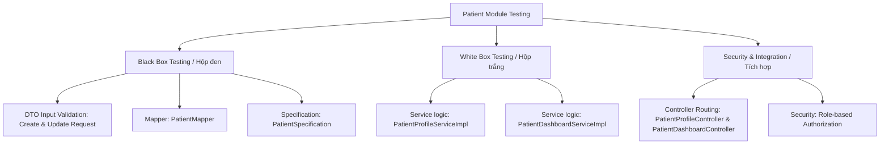
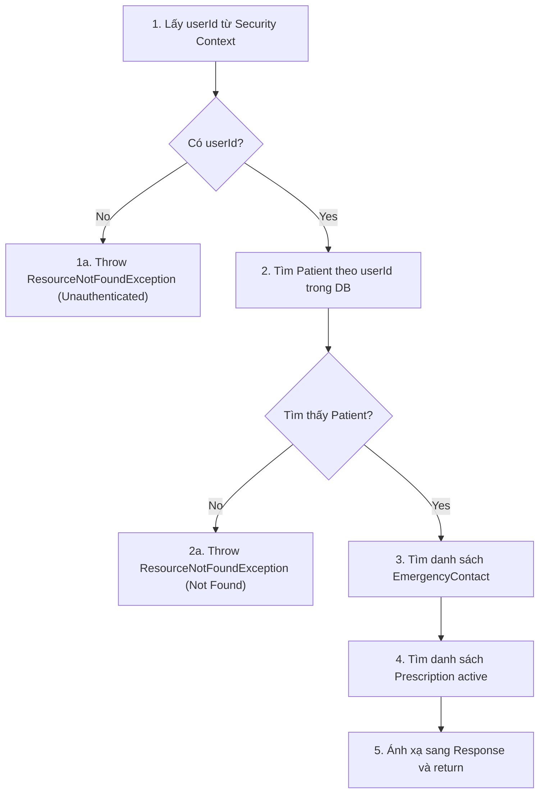

# ĐẶC TẢ KỊCH BẢN KIỂM THỬ (TEST SPECIFICATION) - PHÂN HỆ PATIENT

Tài liệu này đặc tả các ca kiểm thử (Test Cases) cho **10 class** thuộc phân hệ **Patient (Bệnh nhân)** phục vụ môn học Kiểm thử phần mềm. Tài liệu được viết dưới định dạng Markdown (`.md`) để hiển thị trực quan dưới dạng bảng biểu và sơ đồ dòng điều khiển trên GitHub/GitLab.

---

## 🗺️ Sơ đồ thiết kế kiểm thử (Test Strategy Overview)



---

## 1. Kiểm thử hộp trắng (White Box Testing)
*Áp dụng vẽ đồ thị dòng điều khiển (Control Flow Graph - CFG) để phủ hết các nhánh rẽ (Branch Coverage) và câu lệnh (Statement Coverage).*

### 1.1. Hàm `getCurrentPatientProfile()` trong `PatientProfileServiceImpl`

#### Mã nguồn cần kiểm thử:
```java
public PatientProfileResponse getCurrentPatientProfile() {
    Long userId = SecurityUtils.getCurrentUserId()
            .orElseThrow(() -> new ResourceNotFoundException("User not authenticated")); // (1)
    Patient patient = patientRepository.findByUserId(userId)
            .orElseThrow(() -> new ResourceNotFoundException("Patient profile not found")); // (2)
    List<EmergencyContact> contacts = emergencyContactRepository.findByPatientId(patient.getId()); // (3)
    List<Prescription> prescriptions = prescriptionRepository.findByPatientIdAndStatus(patient.getId(), PrescriptionStatus.ACTIVE); // (4)
    return PatientMapper.toResponse(patient, contacts, prescriptions); // (5)
}
```

#### Đồ thị dòng điều khiển (Control Flow Graph - CFG):


#### Bảng ca kiểm thử hộp trắng (White Box Test Cases):

| Mã TC | Mô tả ca kiểm thử | Điều kiện / Dữ liệu đầu vào (Input) | Nhánh đi qua (Path Coverage) | Kết quả mong đợi (Expected Output) |
| :--- | :--- | :--- | :--- | :--- |
| **TC-WB-PPS-01** | Người dùng chưa đăng nhập | `SecurityUtils.getCurrentUserId()` = `Optional.empty()` | `1 -> 1a (Kết thúc)` | Ném ra `ResourceNotFoundException("User not authenticated")` |
| **TC-WB-PPS-02** | Đăng nhập nhưng không có profile bệnh nhân | `userId` = 999, `patientRepository.findByUserId(999)` = `Optional.empty()` | `1 -> 2 -> 2a (Kết thúc)` | Ném ra `ResourceNotFoundException("Patient profile not found")` |
| **TC-WB-PPS-03** | Đăng nhập thành công và lấy profile đầy đủ | `userId` = 1, tìm thấy Patient ID = 100, có danh sách liên hệ khẩn cấp | `1 -> 2 -> 3 -> 4 -> 5` | Trả về `PatientProfileResponse` khớp dữ liệu trong DB |

---

## 2. Kiểm thử hộp đen (Black Box Testing)

### 2.1. DTO Validation: `CreatePatientRequest` & `UpdatePatientProfileRequest`
*Áp dụng phân vùng tương đương (Equivalence Partitioning) và phân tích giá trị biên (Boundary Value Analysis).*

#### Ca kiểm thử cho `CreatePatientRequest`:

| Mã TC | Trường kiểm thử | Dữ liệu đầu vào (Input) | Phân loại | Kết quả mong đợi (Expected Output) |
| :--- | :--- | :--- | :--- | :--- |
| **TC-BB-CPR-01** | `name` | "" (Trống) | Giá trị biên | Lỗi: "Tên bệnh nhân không được để trống" |
| **TC-BB-CPR-02** | `name` | Chuỗi 101 ký tự | Giá trị biên | Lỗi: "Tên không được vượt quá 100 ký tự" |
| **TC-BB-CPR-03** | `gender` | "" (Trống) | Phân vùng | Lỗi: "Giới tính không được để trống" |
| **TC-BB-CPR-04** | `phone` | "" (Trống) | Phân vùng | Lỗi: "Số điện thoại không được để trống" |
| **TC-BB-CPR-05** | Hợp lệ | `name` = "Nguyen Van A", `gender` = "MALE", `phone` = "0987654321" | Phân vùng | Hợp lệ (Không có lỗi) |

#### Ca kiểm thử cho `UpdatePatientProfileRequest`:

| Mã TC | Trường kiểm thử | Dữ liệu đầu vào (Input) | Phân loại | Kết quả mong đợi (Expected Output) |
| :--- | :--- | :--- | :--- | :--- |
| **TC-BB-UPR-01** | `email` | "nguyenvana.com" (Thiếu @) | Phân vùng | Lỗi: "Invalid email address" |
| **TC-BB-UPR-02** | `phone` | "12345" (Quá ngắn) | Giá trị biên | Lỗi: "Invalid phone number" |
| **TC-BB-UPR-03** | `phone` | "0987654321" (10 số) | Hợp lệ | Hợp lệ (Không có lỗi) |

---

### 2.2. Kiểm thử ánh xạ dữ liệu: `PatientMapper`

| Mã TC | Tên ca kiểm thử | Dữ liệu đầu vào (Input) | Kết quả mong đợi (Expected Output) |
| :--- | :--- | :--- | :--- |
| **TC-MAP-01** | Ánh xạ giới tính Nam | `Patient.gender` = "MALE" | `ClinicPatientResponse.gender` = "Nam" |
| **TC-MAP-02** | Ánh xạ giới tính Nữ | `Patient.gender` = "FEMALE" | `ClinicPatientResponse.gender` = "Nữ" |
| **TC-MAP-03** | Tính tuổi từ ngày sinh | `dateOfBirth` = 1996-06-22 (hiện tại là 2026-06-22) | `ClinicPatientResponse.age` = 30 |
| **TC-MAP-04** | Trị số mặc định khi dữ liệu null | Các trường của `Patient` = null | `condition` = "Chưa có chẩn đoán", `riskLevel` = "Ổn định" |

---

## 3. Kiểm thử tích hợp & Bảo mật (Integration & Security Test)
*Kiểm tra khả năng định tuyến của API và bộ lọc phân quyền Spring Security (Role-based Access Control).*

### 3.1. Phân quyền truy cập các API của Bệnh nhân (`PatientProfileController` & `PatientDashboardController`)

| Mã TC | Đường dẫn API | Phương thức | Quyền truy cập (Role) | Kết quả mong đợi (HTTP Status) |
| :--- | :--- | :--- | :--- | :--- |
| **TC-SEC-01** | `/api/v1/patient/profile` | GET | Chưa đăng nhập (Anonymous) | **401 Unauthorized** |
| **TC-SEC-02** | `/api/v1/patient/profile` | GET | Đăng nhập với Role `DOCTOR` | **403 Forbidden** |
| **TC-SEC-03** | `/api/v1/patient/profile` | GET | Đăng nhập với Role `PATIENT` | **200 OK** + JSON dữ liệu |
| **TC-SEC-04** | `/api/v1/patient/profile` | PUT | Đăng nhập với Role `PATIENT`, body hợp lệ | **200 OK** |
| **TC-SEC-05** | `/api/v1/patient/dashboard` | GET | Đăng nhập với Role `PATIENT` | **200 OK** |
| **TC-SEC-06** | `/api/v1/patient/dashboard/alerts/{id}/dismiss` | PUT | Đăng nhập với Role `PATIENT` | **200 OK** |
