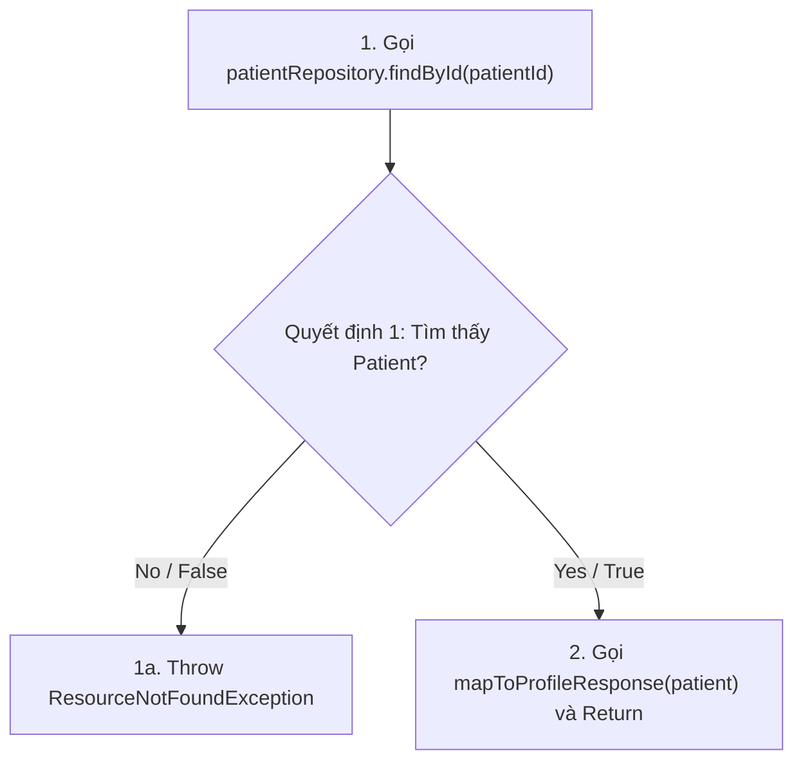
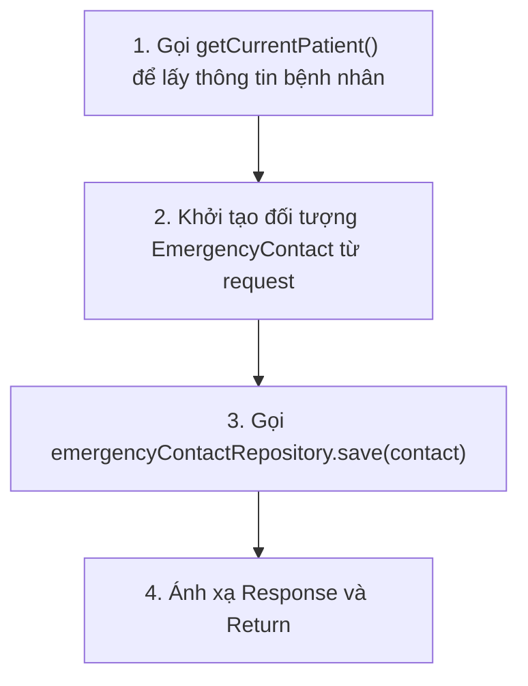
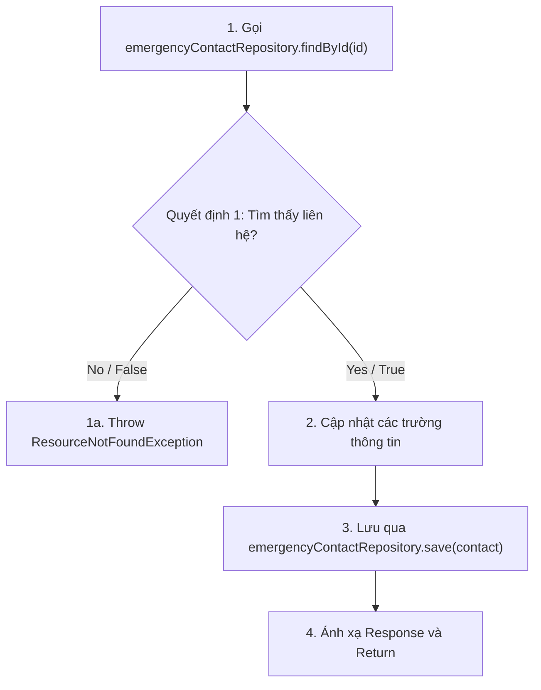
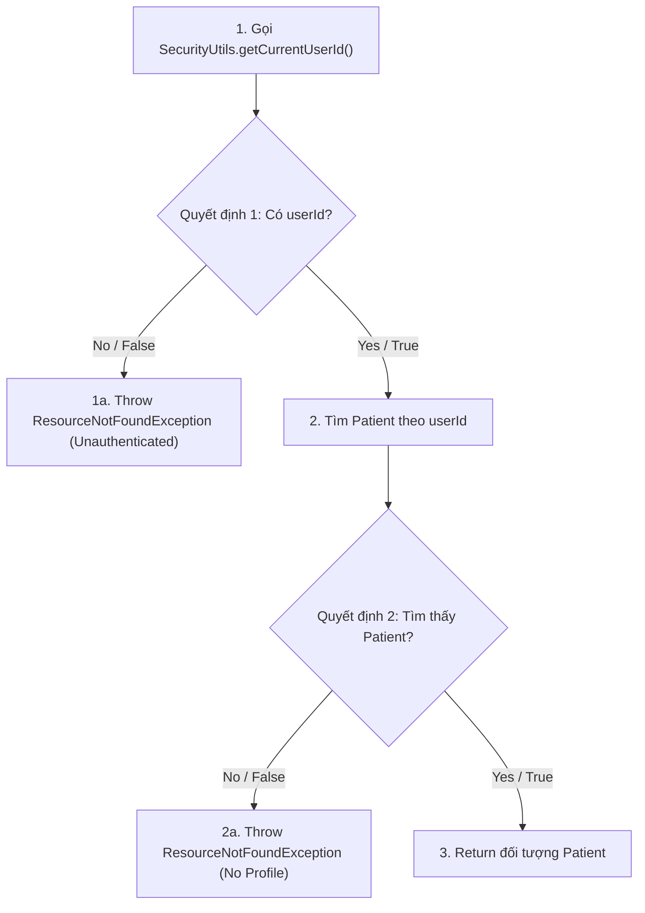
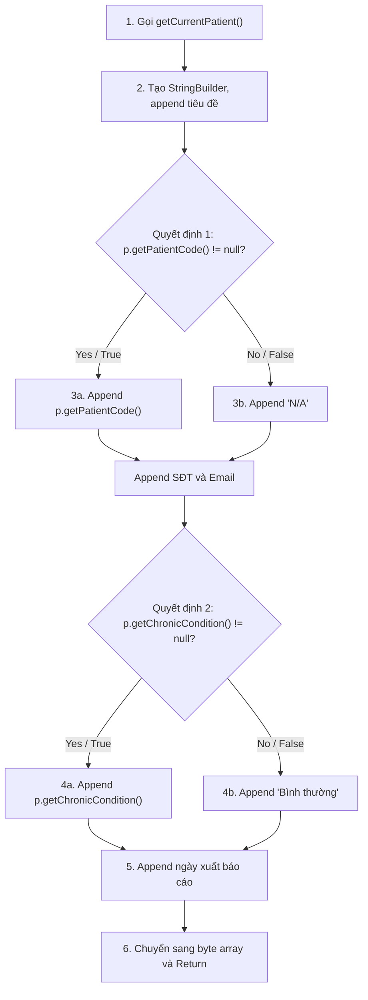

# ĐẶC TẢ KIỂM THỬ HỘP TRẮNG TOÀN DIỆN (COMPREHENSIVE WHITE-BOX TESTING SPECIFICATION)
## PHÂN HỆ: PATIENT PROFILE (PATIENTPROFILESERVICEIMPL)

Tài liệu này cung cấp thiết kế kiểm thử hộp trắng chi tiết cho **6 phương thức** trong `PatientProfileServiceImpl` đáp ứng đầy đủ các tiêu chuẩn kiểm thử:
1. **Control Flow Testing (Kiểm thử dòng điều khiển)**
   - **Statement Testing** (Bao phủ câu lệnh)
   - **Branch / Decision Testing** (Bao phủ nhánh / quyết định)
   - **Branch Condition Testing** (Bao phủ điều kiện đơn)
   - **Branch Condition Combination Testing** (Bao phủ tổ hợp điều kiện)
2. **Data Flow Testing (Kiểm thử dòng dữ liệu)**
   - Định nghĩa các điểm xác định biến (**Def**) và sử dụng biến (**Use**).
   - Thiết kế các đường đi dòng dữ liệu (**DU-path**).

---

## 🗺️ DANH SÁCH 6 PHƯƠNG THỨC KIỂM THỬ
1. `getPatientProfileById(Long patientId)`
2. `updateProfile(UpdatePatientProfileRequest request)`
3. `addEmergencyContact(EmergencyContactRequest request)`
4. `updateEmergencyContact(Long id, EmergencyContactRequest request)`
5. `getCurrentPatient()` (Hàm helper)
6. `generateReport()`

---

## 1. Phương thức `getPatientProfileById(Long patientId)`

### 1.1. Mã nguồn & Đồ thị dòng điều khiển (CFG)
```java
@Override
public PatientProfileResponse getPatientProfileById(Long patientId) {
    Patient patient = patientRepository.findById(patientId) // Node 1
            .orElseThrow(() -> new ResourceNotFoundException("Patient not found: " + patientId)); // Node 1a
    return mapToProfileResponse(patient); // Node 2
}
```



### 1.2. Control Flow Testing

#### A. Statement & Branch/Decision Testing
Do Quyết định 1 chỉ chứa một điều kiện đơn, bao phủ câu lệnh (Statement), bao phủ nhánh (Branch), bao phủ điều kiện (Condition) và tổ hợp điều kiện (Condition Combination) là trùng khớp nhau.

| Mã TC | Dữ liệu đầu vào (Input) | Nhánh đi qua (Path) | Độ bao phủ câu lệnh | Độ bao phủ nhánh | Kết quả mong đợi |
| :--- | :--- | :--- | :--- | :--- | :--- |
| **TC-WB-ID-01** | `patientId` = 999 (Không tồn tại) | `1 -> 1a` | Node 1, Node 1a | Nhánh `False` | Ném ra `ResourceNotFoundException("Patient not found: 999")` |
| **TC-WB-ID-02** | `patientId` = 1 (Tồn tại) | `1 -> 2` | Node 1, Node 2 | Nhánh `True` | Trả về `PatientProfileResponse` của bệnh nhân ID = 1 |

### 1.3. Data Flow Testing (Kiểm thử dòng dữ liệu)
Đặc tả các cặp định nghĩa - sử dụng (Def-Use pairs) của các biến chính:

| Biến | Điểm định nghĩa (Def) | Điểm sử dụng (Use) | Loại sử dụng | DU-path kiểm tra | Mã TC kiểm tra |
| :--- | :--- | :--- | :--- | :--- | :--- |
| `patientId` | Khai báo tham số đầu vào (Dòng 43) | `patientRepository.findById(patientId)` (Dòng 44) | C-use (Tính toán) | `Dòng 43 -> Dòng 44` | TC-WB-ID-01, TC-WB-ID-02 |
| `patient` | Gán từ DB/orElseThrow (Dòng 44) | `mapToProfileResponse(patient)` (Dòng 46) | C-use (Tính toán) | `Dòng 44 -> Dòng 46` | TC-WB-ID-02 |

---

## 2. Phương thức `updateProfile(UpdatePatientProfileRequest request)`

### 2.1. Mã nguồn & Đồ thị dòng điều khiển (CFG)
```java
@Override
@Transactional
public PatientProfileResponse updateProfile(UpdatePatientProfileRequest request) {
    Patient patient = getCurrentPatient(); // Node 1

    patient.setFullName(request.getFullName());
    patient.setGender(request.getGender());
    // ... (Thiết lập các trường cơ bản)
    patient.setAllergies(request.getAllergies()); // Node 2

    if (request.getDateOfBirth() != null) { // Node 3 (Quyết định 1)
        patient.setDateOfBirth(request.getDateOfBirth()); // Node 3a
    }
    if (request.getAvatarUrl() != null && !request.getAvatarUrl().isEmpty()) { // Node 4 (Quyết định 2)
        patient.setAvatarUrl(request.getAvatarUrl()); // Node 4a
    }

    // SYNC info to the User table
    userRepository.findById(patient.getUserId()).ifPresent(user -> { // Node 5 (Quyết định 3)
        if (patient.getEmail() != null && !patient.getEmail().isBlank()) { // Node 6 (Quyết định 4)
            user.setEmail(patient.getEmail()); // Node 6a
        }
        if (patient.getFullName() != null) { // Node 7 (Quyết định 5)
            user.setFullName(patient.getFullName()); // Node 7a
        }
        if (patient.getPhone() != null) { // Node 8 (Quyết định 6)
            user.setPhone(patient.getPhone()); // Node 8a
        }
        if (patient.getAvatarUrl() != null) { // Node 9 (Quyết định 7)
            user.setAvatarUrl(patient.getAvatarUrl()); // Node 9a
        }
        userRepository.save(user); // Node 10
    });

    Patient saved = patientRepository.save(patient); // Node 11
    return mapToProfileResponse(saved); // Node 12
}
```



```mermaid
graph TD
    Node1["1. Gọi getCurrentPatient()"] --> Node2["2. Gán các trường cơ bản"]
    Node2 --> Dec1{"Quyết định 1: request.getDateOfBirth() != null?"}
    
    Dec1 -- Yes / True --> Node3a["3a. patient.setDateOfBirth()"]
    Dec1 -- No / False --> Dec2{"Quyết định 2: request.getAvatarUrl() != null && !isEmpty()?"}
    Node3a --> Dec2
    
    Dec2 -- Yes / True --> Node4a["4a. patient.setAvatarUrl()"]
    Dec2 -- No / False --> Dec3{"Quyết định 3: Tìm thấy User?"}
    Node4a --> Dec3
    
    Dec3 -- Yes / True --> Dec4{"Quyết định 4: patient.getEmail() != null && !isBlank()?"}
    Dec3 -- No / False --> Node11["11. Lưu patient và map response"]
    
    Dec4 -- Yes / True --> Node6a["6a. user.setEmail()"]
    Dec4 -- No / False --> Dec5{"Quyết định 5: patient.getFullName() != null?"}
    Node6a --> Dec5
    
    Dec5 -- Yes / True --> Node7a["7a. user.setFullName()"]
    Dec5 -- No / False --> Dec6{"Quyết định 6: patient.getPhone() != null?"}
    Node7a --> Dec6
    
    Dec6 -- Yes / True --> Node8a["8a. user.setPhone()"]
    Dec6 -- No / False --> Dec7{"Quyết định 7: patient.getAvatarUrl() != null?"}
    Node8a --> Dec7
    
    Dec7 -- Yes / True --> Node9a["9a. user.setAvatarUrl()"]
    Dec7 -- No / False --> Node10["10. userRepository.save(user)"]
    Node9a --> Node10
    
    Node10 --> Node11
    Node11 --> Node12["12. Return Response"]
```

### 2.2. Control Flow Testing

#### A. Statement & Branch/Decision Testing
Thiết kế các ca kiểm thử để đi qua toàn bộ các nút lệnh (Nodes) và nhánh rẽ (True/False):

* **TC-WB-UP-01 (Bao phủ nhánh False)**: Đi qua các nhánh `False` của tất cả các quyết định.
  - Đầu vào: `dateOfBirth` = null, `avatarUrl` = null, `patient.userId` không tồn tại trong DB.
  - Đường đi: `1 -> 2 -> Dec1(No) -> Dec2(No) -> Dec3(No) -> 11 -> 12`.
* **TC-WB-UP-02 (Bao phủ nhánh True)**: Đi qua các nhánh `True` của tất cả các quyết định.
  - Đầu vào: `dateOfBirth` = 1990-01-01, `avatarUrl` = "avatar.png", các trường email, name, phone, avatarUrl của bệnh nhân hợp lệ; `patient.userId` tồn tại.
  - Đường đi: `1 -> 2 -> Dec1(Yes) -> 3a -> Dec2(Yes) -> 4a -> Dec3(Yes) -> Dec4(Yes) -> 6a -> Dec5(Yes) -> 7a -> Dec6(Yes) -> 8a -> Dec7(Yes) -> 9a -> 10 -> 11 -> 12`.

#### B. Branch Condition Testing (Kiểm thử điều kiện nhánh)
Xét quyết định phức tạp **Quyết định 2**: `request.getAvatarUrl() != null && !request.getAvatarUrl().isEmpty()`
Gồm 2 điều kiện đơn:
- $C_1$: `request.getAvatarUrl() != null`
- $C_2$: `!request.getAvatarUrl().isEmpty()`

Để bao phủ điều kiện, ta cần $C_1$ nhận cả $\{T, F\}$ và $C_2$ nhận cả $\{T, F\}$:
- Ca 1: `avatarUrl` = null $\rightarrow C_1 = False$ (Không đánh giá $C_2$ do short-circuit).
- Ca 2: `avatarUrl` = "" $\rightarrow C_1 = True$, $C_2 = False$ (Do chuỗi rỗng $\rightarrow$ `isEmpty()` = true $\rightarrow$ phủ định thành `False`).
- Ca 3: `avatarUrl` = "avatar.png" $\rightarrow C_1 = True$, $C_2 = True$.

Xét quyết định phức tạp **Quyết định 4**: `patient.getEmail() != null && !patient.getEmail().isBlank()`
Gồm 2 điều kiện đơn:
- $C_3$: `patient.getEmail() != null`
- $C_4$: `!patient.getEmail().isBlank()`

Để bao phủ điều kiện:
- Ca 1: `email` = null $\rightarrow C_3 = False$.
- Ca 2: `email` = "   " $\rightarrow C_3 = True$, $C_4 = False$ (Chuỗi trống).
- Ca 3: `email` = "test@care.com" $\rightarrow C_3 = True$, $C_4 = True$.

#### C. Branch Condition Combination Testing (Kiểm thử tổ hợp điều kiện nhánh)
Tổ hợp các giá trị chân trị có thể xảy ra cho các điều kiện đơn trong biểu thức logic:

**Quyết định 2:** `request.getAvatarUrl() != null && !request.getAvatarUrl().isEmpty()`
| Tổ hợp | $C_1$ | $C_2$ | Kết quả Quyết định | Ca kiểm thử phủ tương ứng |
| :--- | :--- | :--- | :--- | :--- |
| **Combo 1** | False | Not Evaluated | False (Do short-circuit) | `request.getAvatarUrl() = null` |
| **Combo 2** | True | False | False | `request.getAvatarUrl() = ""` |
| **Combo 3** | True | True | True | `request.getAvatarUrl() = "avatar.png"` |

**Quyết định 4:** `patient.getEmail() != null && !patient.getEmail().isBlank()`
| Tổ hợp | $C_3$ | $C_4$ | Kết quả Quyết định | Ca kiểm thử phủ tương ứng |
| :--- | :--- | :--- | :--- | :--- |
| **Combo 1** | False | Not Evaluated | False (Do short-circuit) | `patient.getEmail() = null` |
| **Combo 2** | True | False | False | `patient.getEmail() = "    "` |
| **Combo 3** | True | True | True | `patient.getEmail() = "test@care.com"` |

### 2.3. Data Flow Testing (Kiểm thử dòng dữ liệu)
| Biến | Điểm định nghĩa (Def) | Điểm sử dụng (Use) | Loại sử dụng | DU-path kiểm tra | Mã TC kiểm tra |
| :--- | :--- | :--- | :--- | :--- | :--- |
| `patient` | Gọi `getCurrentPatient()` (Dòng 52) | `patient.setFullName()`, ... (Dòng 54-67) | C-use | `Dòng 52 -> Dòng 54` | TC-WB-UP-01 |
| `patient` | Gọi `getCurrentPatient()` (Dòng 52) | `patient.getUserId()` (Dòng 76) | C-use | `Dòng 52 -> Dòng 76` | TC-WB-UP-01, 02 |
| `patient` | Gọi `getCurrentPatient()` (Dòng 52) | `patientRepository.save(patient)` (Dòng 92) | C-use | `Dòng 52 -> Dòng 92` | TC-WB-UP-01, 02 |
| `user` | Lấy từ `userRepository` (Dòng 76) | `user.setEmail()`, `setFullName()` (Dòng 78-87) | C-use | `Dòng 76 -> Dòng 78` | TC-WB-UP-02 |
| `user` | Lấy từ `userRepository` (Dòng 76) | `userRepository.save(user)` (Dòng 89) | C-use | `Dòng 76 -> Dòng 89` | TC-WB-UP-02 |

---

## 3. Phương thức `addEmergencyContact(EmergencyContactRequest request)`

### 3.1. Mã nguồn & Đồ thị dòng điều khiển (CFG)
```java
@Override
@Transactional
public EmergencyContactResponse addEmergencyContact(EmergencyContactRequest request) {
    Patient patient = getCurrentPatient(); // Node 1

    EmergencyContact contact = EmergencyContact.builder()
            .patient(patient)
            .contactName(request.getContactName())
            .relationship(request.getRelationship())
            .phone(request.getPhone())
            .isPrimary(request.isPrimary())
            .build(); // Node 2

    EmergencyContact saved = emergencyContactRepository.save(contact); // Node 3
    return mapToEmergencyContactResponse(saved); // Node 4
}
```



### 3.2. Control Flow Testing
Tương tự phương thức 1, luồng thực thi tuyến tính (không có cấu trúc điều kiện rẽ nhánh rỗng hoặc phức tạp tại thân hàm ngoại trừ trường hợp ngoại lệ từ helper).

| Mã TC | Dữ liệu đầu vào (Input) | Nhánh đi qua (Path) | Kết quả mong đợi |
| :--- | :--- | :--- | :--- |
| **TC-WB-AEC-01** | Đăng nhập hợp lệ, `request` đầy đủ thông tin liên hệ | `1 -> 2 -> 3 -> 4` | Thêm liên hệ thành công, lưu vào DB và trả về đối tượng Response tương ứng |

### 3.3. Data Flow Testing
| Biến | Điểm định nghĩa (Def) | Điểm sử dụng (Use) | Loại sử dụng | DU-path kiểm tra | Mã TC kiểm tra |
| :--- | :--- | :--- | :--- | :--- | :--- |
| `patient` | Lấy từ `getCurrentPatient()` (Dòng 109) | `builder().patient(patient)` (Dòng 112) | C-use | `Dòng 109 -> Dòng 112` | TC-WB-AEC-01 |
| `contact` | Tạo qua Builder (Dòng 111-117) | `save(contact)` (Dòng 119) | C-use | `Dòng 111 -> Dòng 119` | TC-WB-AEC-01 |
| `saved` | Nhận kết quả từ `save()` (Dòng 119) | `mapToEmergencyContactResponse(saved)` (Dòng 121) | C-use | `Dòng 119 -> Dòng 121` | TC-WB-AEC-01 |

---

## 4. Phương thức `updateEmergencyContact(Long id, EmergencyContactRequest request)`

### 4.1. Mã nguồn & Đồ thị dòng điều khiển (CFG)
```java
@Override
public EmergencyContactResponse updateEmergencyContact(Long id, EmergencyContactRequest request) {
    EmergencyContact contact = emergencyContactRepository.findById(id) // Node 1
            .orElseThrow(() -> new ResourceNotFoundException("Emergency contact not found: " + id)); // Node 1a

    contact.setContactName(request.getContactName()); // Node 2
    contact.setRelationship(request.getRelationship());
    contact.setPhone(request.getPhone());
    contact.setPrimary(request.isPrimary());

    EmergencyContact saved = emergencyContactRepository.save(contact); // Node 3
    return mapToEmergencyContactResponse(saved); // Node 4
}
```



### 4.2. Control Flow Testing

#### A. Statement & Branch/Decision Testing
| Mã TC | Dữ liệu đầu vào (Input) | Nhánh đi qua (Path) | Kết quả mong đợi |
| :--- | :--- | :--- | :--- |
| **TC-WB-UEC-01** | `id` = 999 (Không tồn tại trong DB) | `1 -> 1a` | Ném ra ngoại lệ `ResourceNotFoundException("Emergency contact not found: 999")` |
| **TC-WB-UEC-02** | `id` = 1 (Tồn tại trong DB), `request` hợp lệ | `1 -> 2 -> 3 -> 4` | Cập nhật thông tin liên hệ ID 1 thành công |

### 4.3. Data Flow Testing
| Biến | Điểm định nghĩa (Def) | Điểm sử dụng (Use) | Loại sử dụng | DU-path kiểm tra | Mã TC kiểm tra |
| :--- | :--- | :--- | :--- | :--- | :--- |
| `id` | Tham số đầu vào (Dòng 125) | `findById(id)` (Dòng 126) | C-use | `Dòng 125 -> Dòng 126` | TC-WB-UEC-01, 02 |
| `contact` | Lấy từ DB/orElseThrow (Dòng 126) | `contact.setContactName()`, ... (Dòng 129-132) | C-use | `Dòng 126 -> Dòng 129` | TC-WB-UEC-02 |
| `contact` | Lấy từ DB/orElseThrow (Dòng 126) | `save(contact)` (Dòng 134) | C-use | `Dòng 126 -> Dòng 134` | TC-WB-UEC-02 |

---

## 5. Phương thức `getCurrentPatient()` (Hàm Helper)

### 5.1. Mã nguồn & Đồ thị dòng điều khiển (CFG)
```java
private Patient getCurrentPatient() {
    Long userId = SecurityUtils.getCurrentUserId() // Node 1
            .orElseThrow(() -> new ResourceNotFoundException("User not authenticated")); // Node 1a
    return patientRepository.findByUserId(userId) // Node 2
            .orElseThrow(() -> new ResourceNotFoundException("Patient profile not found")); // Node 2a
}
```



### 5.2. Control Flow Testing

#### A. Statement & Branch/Decision Testing
| Mã TC | Trạng thái hệ thống | Nhánh đi qua (Path) | Kết quả mong đợi |
| :--- | :--- | :--- | :--- |
| **TC-WB-GCP-01** | Chưa đăng nhập (SecurityContext rỗng) | `1 -> 1a` | Ném ra `ResourceNotFoundException("User not authenticated")` |
| **TC-WB-GCP-02** | Đăng nhập tài khoản chưa có Profile bệnh nhân | `1 -> 2 -> 2a` | Ném ra `ResourceNotFoundException("Patient profile not found")` |
| **TC-WB-GCP-03** | Đăng nhập tài khoản bệnh nhân hợp lệ | `1 -> 2 -> 3` | Trả về đối tượng `Patient` chính xác tương ứng |

### 5.3. Data Flow Testing
| Biến | Điểm định nghĩa (Def) | Điểm sử dụng (Use) | Loại sử dụng | DU-path kiểm tra | Mã TC kiểm tra |
| :--- | :--- | :--- | :--- | :--- | :--- |
| `userId` | Lấy từ `getCurrentUserId()` (Dòng 159) | `findByUserId(userId)` (Dòng 161) | C-use | `Dòng 159 -> Dòng 161` | TC-WB-GCP-02, 03 |

---

## 6. Phương thức `generateReport()`

### 6.1. Mã nguồn & Đồ thị dòng điều khiển (CFG)
```java
@Override
public byte[] generateReport() {
    Patient p = getCurrentPatient(); // Node 1
    StringBuilder sb = new StringBuilder(); // Node 2
    sb.append("BÁO CÁO SỨC KHỎE CÁ NHÂN\n");
    // ...
    sb.append("Mã BN: ").append(p.getPatientCode() != null ? p.getPatientCode() : "N/A").append("\n"); // Node 3 (Quyết định 1)
    // ...
    sb.append("Tình trạng: ").append(p.getChronicCondition() != null ? p.getChronicCondition() : "Bình thường").append("\n"); // Node 4 (Quyết định 2)
    // ...
    return sb.toString().getBytes(java.nio.charset.StandardCharsets.UTF_8); // Node 6
}
```



### 6.2. Control Flow Testing

#### A. Statement & Branch/Decision Testing
| Mã TC | Trạng thái thuộc tính của Patient | Nhánh đi qua (Path) | Kết quả mong đợi |
| :--- | :--- | :--- | :--- |
| **TC-WB-GR-01** | `patientCode` = null, `chronicCondition` = null | `1 -> 2 -> Dec1(No) -> 3b -> Dec2(No) -> 4b -> 5 -> 6` | Báo cáo hiển thị mã BN là "N/A" và tình trạng là "Bình thường" |
| **TC-WB-GR-02** | `patientCode` = "BN01", `chronicCondition` = "Tiểu đường" | `1 -> 2 -> Dec1(Yes) -> 3a -> Dec2(Yes) -> 4a -> 5 -> 6` | Báo cáo hiển thị mã BN là "BN01" và tình trạng là "Tiểu đường" |

### 6.3. Data Flow Testing
| Biến | Điểm định nghĩa (Def) | Điểm sử dụng (Use) | Loại sử dụng | DU-path kiểm tra | Mã TC kiểm tra |
| :--- | :--- | :--- | :--- | :--- | :--- |
| `p` | Lấy từ `getCurrentPatient()` (Dòng 141) | Các hàm getters `p.getFullName()`, `p.getPatientCode()`,... | C-use | `Dòng 141 -> Dòng 145` | TC-WB-GR-01, 02 |
| `sb` | Khởi tạo `new StringBuilder()` (Dòng 142) | Các hàm gọi `sb.append()` (Dòng 143-151) | C-use | `Dòng 142 -> Dòng 143` | TC-WB-GR-01, 02 |
| `sb` | Khởi tạo `new StringBuilder()` (Dòng 142) | `sb.toString()` (Dòng 153) | C-use | `Dòng 142 -> Dòng 153` | TC-WB-GR-01, 02 |
