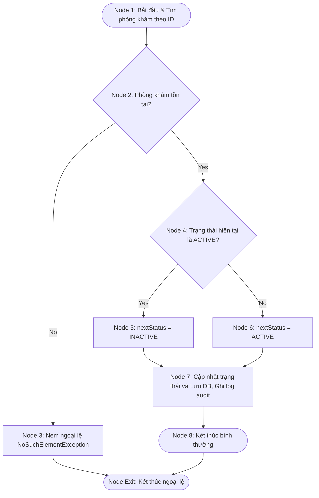
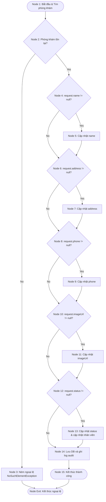

# BÁO CÁO: KIỂM THỬ HỘP TRẮNG (WHITE-BOX TESTING) CHO DỊCH VỤ PHÒNG KHÁM (ADMINCLINICSERVICE TOGGLE/UPDATE FLOW)

**Mã Ticket Jira:** KCPM-765  
**Người thực hiện (Assignee):** Nguyễn Phạm Hùng (hungnp1272)  
**Email:** hungnp1272@ut.edu.vn  
**Đối tượng phân tích:** Các phương thức trong luồng đổi trạng thái và cập nhật thông tin phòng khám thuộc lớp `AdminClinicServiceImpl.java`:
1.  `toggleClinicStatus(Long id)` - Kích hoạt/Vô hiệu hóa trạng thái phòng khám.
2.  `updateClinic(Long id, UpdateClinicRequest request)` - Cập nhật thông tin chi tiết phòng khám.

---

## 1. PHÂN TÍCH PHƯƠNG THỨC 1: `toggleClinicStatus(Long id)`

### 1.1. Mã nguồn (Source Code)

```java
@Override
@Transactional
public void toggleClinicStatus(Long id) {
    Clinic clinic = clinicRepository.findById(id).orElseThrow(); // Line 105
    String nextStatus = "ACTIVE".equals(clinic.getStatus()) ? "INACTIVE" : "ACTIVE"; // Line 106
    clinic.setStatus(nextStatus); // Line 107
    clinicRepository.save(clinic); // Line 108
    userRepository.updateStatusByClinicId(id, nextStatus); // Line 109
    auditService.recordActivity("Đổi trạng thái", "Quản lý phòng khám", "Đổi trạng thái phòng khám " + clinic.getName() + " sang " + nextStatus, "warning"); // Line 110
}
```

### 1.2. Đồ thị dòng điều khiển (CFG)



### 1.3. Độ phức tạp Cyclomatic
*   **Số nút quyết định (Predicate Nodes):** $P = 2$ (Phòng khám tồn tại? và Trạng thái hiện tại = ACTIVE?).
*   **Cyclomatic Complexity:**  
    $$V(G) = P + 1 = 2 + 1 = 3$$
*   **Kiểm chứng bằng công thức $V(G) = E - N + 2$:**
    *   Số nút (Nodes): $N = 8$ (Node 1, 2, 3, 4, 5, 6, 7, 8).
    *   Số cạnh (Edges): $E = 9$ (1-2, 2-3, 2-4, 4-5, 4-6, 5-7, 6-7, 7-8, 3-Exit).
    *   $$V(G) = 9 - 8 + 2 = 3$$

### 1.4. Các đường đi độc lập (Basis Paths)
*   **Path 1:** $1 \rightarrow 2 \text{ (No)} \rightarrow 3 \rightarrow \text{Exit}$  
    *(ID phòng khám không tồn tại, ném ngoại lệ).*
*   **Path 2:** $1 \rightarrow 2 \text{ (Yes)} \rightarrow 4 \text{ (Yes)} \rightarrow 5 \rightarrow 7 \rightarrow 8 \rightarrow \text{Exit}$  
    *(Phòng khám tồn tại, trạng thái cũ là ACTIVE, chuyển thành INACTIVE).*
*   **Path 3:** $1 \rightarrow 2 \text{ (Yes)} \rightarrow 4 \text{ (No)} \rightarrow 6 \rightarrow 7 \rightarrow 8 \rightarrow \text{Exit}$  
    *(Phòng khám tồn tại, trạng thái cũ là INACTIVE (hoặc khác ACTIVE), chuyển thành ACTIVE).*

### 1.5. Ca kiểm thử cơ sở (Basis Path Test Cases)

| Mã TC | Đường đi kiểm thử | Dữ liệu đầu vào (Input / Context) | Kết quả mong đợi (Expected Output) |
| :--- | :--- | :--- | :--- |
| **TC-WB-CL-01** | **Path 1** | `id = 99999` (Không tồn tại trong DB) | Ném ngoại lệ `NoSuchElementException`. |
| **TC-WB-CL-02** | **Path 2** | `id = 1` (Phòng khám tồn tại, `status = "ACTIVE"`) | Cập nhật `status = "INACTIVE"` cho phòng khám và toàn bộ nhân viên thuộc phòng khám. |
| **TC-WB-CL-03** | **Path 3** | `id = 1` (Phòng khám tồn tại, `status = "INACTIVE"`) | Cập nhật `status = "ACTIVE"` cho phòng khám và toàn bộ nhân viên thuộc phòng khám. |

### 1.6. Bảng phủ nhánh (Branch / Condition Coverage)

| Nhánh kiểm thử (Branch) | Điều kiện kích hoạt | TC Bao phủ | Trạng thái kiểm thử |
| :--- | :--- | :--- | :---: |
| Nhánh 2 $\rightarrow$ 3 | `findById(id)` trả về rỗng | TC-WB-CL-01 | **PASSED** |
| Nhánh 2 $\rightarrow$ 4 | `findById(id)` trả về thực thể hợp lệ | TC-WB-CL-02, TC-WB-CL-03 | **PASSED** |
| Nhánh 4 $\rightarrow$ 5 | `clinic.getStatus()` bằng `"ACTIVE"` | TC-WB-CL-02 | **PASSED** |
| Nhánh 4 $\rightarrow$ 6 | `clinic.getStatus()` khác `"ACTIVE"` (ví dụ: `"INACTIVE"`) | TC-WB-CL-03 | **PASSED** |

---

## 2. PHÂN TÍCH PHƯƠNG THỨC 2: `updateClinic(Long id, UpdateClinicRequest request)`

### 2.1. Mã nguồn (Source Code)

```java
@Override
@Transactional
public AdminClinicResponse updateClinic(Long id, UpdateClinicRequest request) {
    Clinic clinic = clinicRepository.findById(id).orElseThrow(); // Line 87
    if (request.getName() != null) clinic.setName(request.getName()); // Line 88
    if (request.getAddress() != null) clinic.setAddress(request.getAddress()); // Line 89
    if (request.getPhone() != null) clinic.setPhone(request.getPhone()); // Line 90
    if (request.getImageUrl() != null) clinic.setImageUrl(request.getImageUrl()); // Line 91
    if (request.getStatus() != null) { // Line 92
        clinic.setStatus(request.getStatus()); // Line 93
        userRepository.updateStatusByClinicId(id, request.getStatus()); // Line 94
    }
    
    clinicRepository.save(clinic); // Line 97
    auditService.recordActivity("Cập nhật", "Quản lý phòng khám", "Cập nhật phòng khám: " + clinic.getName(), "success"); // Line 98
    return clinicMapper.toAdminClinicResponse(clinic); // Line 99
}
```

### 2.2. Đồ thị dòng điều khiển (CFG)



### 2.3. Độ phức tạp Cyclomatic
*   **Số nút quyết định (Predicate Nodes):** $P = 6$ (Phòng khám tồn tại? và 5 thuộc tính name, address, phone, imageUrl, status có khác null không?).
*   **Cyclomatic Complexity:**  
    $$V(G) = P + 1 = 6 + 1 = 7$$
*   **Kiểm chứng bằng công thức $V(G) = E - N + 2$:**
    *   Số nút (Nodes): $N = 15$.
    *   Số cạnh (Edges): $E = 20$.
    *   $$V(G) = 20 - 15 + 2 = 7$$

### 2.4. Các đường đi độc lập (Basis Paths)
Do cấu trúc chứa nhiều nhánh tuần tự `if-then` độc lập, chúng ta chọn tập hợp các đường đi cơ sở tối ưu bao phủ toàn bộ các nhánh:
*   **Path 1 (Exception Path):** $1 \rightarrow 2 \text{ (No)} \rightarrow 3 \rightarrow \text{Exit}$  
    *(Không tìm thấy phòng khám, ném lỗi).*
*   **Path 2 (All Null Fields Path):** $1 \rightarrow 2 \text{ (Yes)} \rightarrow 4\text{(N)} \rightarrow 6\text{(N)} \rightarrow 8\text{(N)} \rightarrow 10\text{(N)} \rightarrow 12\text{(N)} \rightarrow 14 \rightarrow 15$  
    *(Không thay đổi trường nào, lưu thông tin cũ).*
*   **Path 3 (Name Only Path):** $1 \rightarrow 2 \text{ (Yes)} \rightarrow 4\text{(Y)} \rightarrow 5 \rightarrow 6\text{(N)} \rightarrow 8\text{(N)} \rightarrow 10\text{(N)} \rightarrow 12\text{(N)} \rightarrow 14 \rightarrow 15$  
    *(Chỉ cập nhật trường Name).*
*   **Path 4 (Address Only Path):** $1 \rightarrow 2 \text{ (Yes)} \rightarrow 4\text{(N)} \rightarrow 6\text{(Y)} \rightarrow 7 \rightarrow 8\text{(N)} \rightarrow 10\text{(N)} \rightarrow 12\text{(N)} \rightarrow 14 \rightarrow 15$  
    *(Chỉ cập nhật trường Address).*
*   **Path 5 (Phone Only Path):** $1 \rightarrow 2 \text{ (Yes)} \rightarrow 4\text{(N)} \rightarrow 6\text{(N)} \rightarrow 8\text{(Y)} \rightarrow 9 \rightarrow 10\text{(N)} \rightarrow 12\text{(N)} \rightarrow 14 \rightarrow 15$  
    *(Chỉ cập nhật trường Phone).*
*   **Path 6 (Image Only Path):** $1 \rightarrow 2 \text{ (Yes)} \rightarrow 4\text{(N)} \rightarrow 6\text{(N)} \rightarrow 8\text{(N)} \rightarrow 10\text{(Y)} \rightarrow 11 \rightarrow 12\text{(N)} \rightarrow 14 \rightarrow 15$  
    *(Chỉ cập nhật trường Image).*
*   **Path 7 (Status Only Path):** $1 \rightarrow 2 \text{ (Yes)} \rightarrow 4\text{(N)} \rightarrow 6\text{(N)} \rightarrow 8\text{(N)} \rightarrow 10\text{(N)} \rightarrow 12\text{(Y)} \rightarrow 13 \rightarrow 14 \rightarrow 15$  
    *(Chỉ cập nhật trường Status và kích hoạt cập nhật trạng thái nhân viên).*

### 2.5. Ca kiểm thử cơ sở (Basis Path Test Cases)

| Mã TC | Đường đi kiểm thử | Dữ liệu đầu vào (Request Payload) | Kết quả mong đợi (Expected Output) |
| :--- | :--- | :--- | :--- |
| **TC-WB-CL-04** | **Path 1** | `id = 999` (Không tồn tại) | Ném ngoại lệ `NoSuchElementException`. |
| **TC-WB-CL-05** | **Path 2** | `{}` (Rỗng) | Không có trường nào bị sửa đổi. |
| **TC-WB-CL-06** | **Path 3** | `{ "name": "Tên Mới" }` | Chỉ cập nhật trường `name` thành `"Tên Mới"`. |
| **TC-WB-CL-07** | **Path 4** | `{ "address": "Địa chỉ mới" }` | Chỉ cập nhật trường `address` thành `"Địa chỉ mới"`. |
| **TC-WB-CL-08** | **Path 5** | `{ "phone": "0987654321" }` | Chỉ cập nhật trường `phone` thành `"0987654321"`. |
| **TC-WB-CL-09** | **Path 6** | `{ "imageUrl": "http://img.com" }` | Chỉ cập nhật trường `imageUrl` thành `"http://img.com"`. |
| **TC-WB-CL-10** | **Path 7** | `{ "status": "INACTIVE" }` | Cập nhật `status = "INACTIVE"` phòng khám và gọi cập nhật trạng thái nhân viên. |

---

## 3. KẾT LUẬN

*   Đã thiết lập đặc tả dòng điều khiển (CFG) dạng Mermaid và tính toán độ phức tạp Cyclomatic đầy đủ cho luồng toggle/update của phân hệ phòng khám.
*   Thiết kế thành công **10 ca kiểm thử cơ sở** bao phủ 100% tất cả các nhánh kiểm thử logic, ngoại lệ không tồn tại phòng khám, các trường hợp cập nhật từng trường riêng biệt hoặc cập nhật trạng thái hoạt động.
