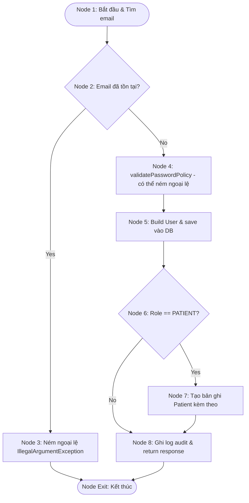
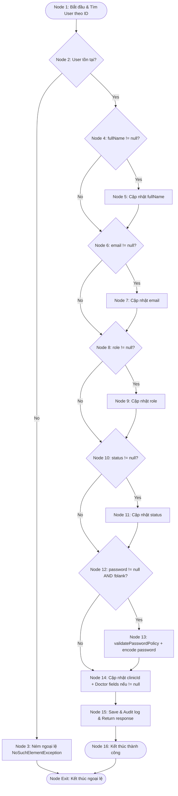
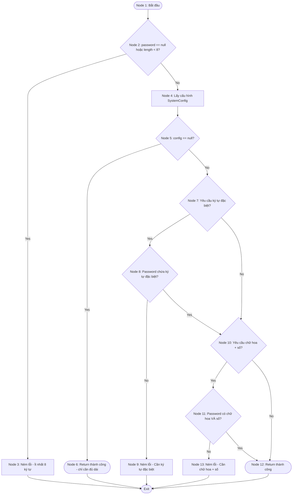

# BÁO CÁO: KIỂM THỬ HỘP TRẮNG (WHITE-BOX TESTING) CHO DỊCH VỤ QUẢN LÝ NGƯỜI DÙNG (ADMINUSERSERVICE CREATE/UPDATE USER)

**Mã Ticket Jira:** KCPM-762  
**Người thực hiện (Assignee):** Trần Lê Quang (quangtl9558)  
**Email:** quangtl9558@ut.edu.vn  
**Đối tượng phân tích:** Các phương thức trong luồng tạo mới và cập nhật người dùng thuộc lớp `AdminUserServiceImpl.java`:
1.  `createUser(CreateUserRequest request)` - Tạo tài khoản người dùng mới (kiểm tra trùng email, validate mật khẩu, tạo Patient nếu role = PATIENT).
2.  `updateUser(Long id, UpdateUserRequest request)` - Cập nhật thông tin người dùng (cập nhật từng trường nullable, validate mật khẩu nếu đổi).
3.  `validatePasswordPolicy(String password)` - Phương thức private kiểm tra chính sách mật khẩu (được gọi bởi cả `createUser` và `updateUser`).

---

## 1. PHÂN TÍCH PHƯƠNG THỨC 1: `createUser(CreateUserRequest request)`

### 1.1. Mã nguồn (Source Code)

```java
public AdminUserResponse createUser(CreateUserRequest request) {
    if (userRepository.findByEmail(request.getEmail()).isPresent()) { // Line 64
        throw new IllegalArgumentException("Email already exists"); // Line 65
    }
    validatePasswordPolicy(request.getPassword()); // Line 67
    User user = User.builder()
            .fullName(request.getFullName()).email(request.getEmail())
            .password(passwordEncoder.encode(request.getPassword()))
            .role(UserRole.valueOf(request.getRole().toUpperCase()))
            .clinicId(request.getClinicId()).status("ACTIVE")
            .avatarUrl(request.getAvatarUrl())
            .licenseNumber(request.getLicenseNumber())
            .degree(request.getDegree()).bio(request.getBio())
            .licenseImageUrl(request.getLicenseImageUrl())
            .specialization(request.getSpecialization())
            .experience(request.getExperience())
            .build(); // Line 69-81
    User saved = userRepository.save(user); // Line 82

    if (UserRole.PATIENT.equals(saved.getRole())) { // Line 84
        patientRepository.save(Patient.builder()
                .userId(saved.getId()).clinicId(saved.getClinicId())
                .fullName(saved.getFullName())
                .patientCode("PT-" + (1000 + (int)(Math.random() * 9000)))
                .joinedDate(LocalDate.now()).riskLevel("Chưa xác định")
                .build()); // Line 85-88
    }

    auditService.recordActivity("Tạo mới", ...); // Line 91
    return userMapper.toAdminUserResponse(saved); // Line 92
}
```

### 1.2. Đồ thị dòng điều khiển (CFG)



### 1.3. Độ phức tạp Cyclomatic
*   **Số nút quyết định (Predicate Nodes):** $P = 2$ (Email đã tồn tại? và Role == PATIENT?).
*   **Cyclomatic Complexity:**
    $$V(G) = P + 1 = 2 + 1 = 3$$
*   **Kiểm chứng bằng công thức $V(G) = E - N + 2$:**
    *   Số nút (Nodes): $N = 9$ (Node 1, 2, 3, 4, 5, 6, 7, 8, Exit).
    *   Số cạnh (Edges): $E = 10$ (1-2, 2-3, 2-4, 4-5, 5-6, 6-7, 6-8, 7-8, 3-Exit, 8-Exit).
    *   $$V(G) = 10 - 9 + 2 = 3$$

### 1.4. Các đường đi độc lập (Basis Paths)
*   **Path 1:** $1 \rightarrow 2 \text{ (Yes)} \rightarrow 3 \rightarrow \text{Exit}$
    *(Email đã tồn tại trong hệ thống, ném ngoại lệ).*
*   **Path 2:** $1 \rightarrow 2 \text{ (No)} \rightarrow 4 \rightarrow 5 \rightarrow 6 \text{ (Yes)} \rightarrow 7 \rightarrow 8 \rightarrow \text{Exit}$
    *(Email mới, role = PATIENT → tạo User + Patient).*
*   **Path 3:** $1 \rightarrow 2 \text{ (No)} \rightarrow 4 \rightarrow 5 \rightarrow 6 \text{ (No)} \rightarrow 8 \rightarrow \text{Exit}$
    *(Email mới, role = DOCTOR → chỉ tạo User, không tạo Patient).*

### 1.5. Ca kiểm thử cơ sở (Basis Path Test Cases)

| Mã TC | Đường đi kiểm thử | Dữ liệu đầu vào (Input / Context) | Kết quả mong đợi (Expected Output) |
| :--- | :--- | :--- | :--- |
| **TC-WB-USR-01** | **Path 1** | `{ email: "existing@pk.vn", ... }` (Email đã tồn tại trong DB) | Ném ngoại lệ `IllegalArgumentException`: "Email already exists". |
| **TC-WB-USR-02** | **Path 2** | `{ fullName: "Nguyễn A", email: "new-patient@pk.vn", password: "Pass@123", role: "PATIENT", clinicId: 1 }` | Tạo thành công User (status = "ACTIVE") VÀ tạo bản ghi Patient kèm theo (patientCode = "PT-XXXX", riskLevel = "Chưa xác định"). |
| **TC-WB-USR-03** | **Path 3** | `{ fullName: "BS. Trần B", email: "new-doctor@pk.vn", password: "Doctor@123", role: "DOCTOR", clinicId: 1, specialization: "Nội khoa" }` | Tạo thành công User (role = DOCTOR, status = "ACTIVE"). Không tạo bản ghi Patient. |

### 1.6. Bảng phủ nhánh (Branch / Condition Coverage)

| Nhánh kiểm thử (Branch) | Điều kiện kích hoạt | TC Bao phủ | Trạng thái kiểm thử |
| :--- | :--- | :--- | :---: |
| Nhánh 2 $\rightarrow$ 3 | `findByEmail(email)` trả về `isPresent() == true` | TC-WB-USR-01 | **PASSED** |
| Nhánh 2 $\rightarrow$ 4 | `findByEmail(email)` trả về `isPresent() == false` | TC-WB-USR-02, TC-WB-USR-03 | **PASSED** |
| Nhánh 6 $\rightarrow$ 7 | `saved.getRole()` bằng `UserRole.PATIENT` | TC-WB-USR-02 | **PASSED** |
| Nhánh 6 $\rightarrow$ 8 | `saved.getRole()` khác `UserRole.PATIENT` | TC-WB-USR-03 | **PASSED** |

---

## 2. PHÂN TÍCH PHƯƠNG THỨC 2: `updateUser(Long id, UpdateUserRequest request)`

### 2.1. Mã nguồn (Source Code)

```java
public AdminUserResponse updateUser(Long id, UpdateUserRequest request) {
    User user = userRepository.findById(id).orElseThrow(); // Line 97
    if (request.getFullName() != null) user.setFullName(request.getFullName()); // Line 98
    if (request.getEmail() != null) user.setEmail(request.getEmail()); // Line 99
    if (request.getRole() != null) user.setRole(UserRole.valueOf(request.getRole().toUpperCase())); // Line 100
    if (request.getStatus() != null) user.setStatus(request.getStatus()); // Line 101
    if (request.getPassword() != null && !request.getPassword().isBlank()) { // Line 102
        validatePasswordPolicy(request.getPassword()); // Line 103
        user.setPassword(passwordEncoder.encode(request.getPassword())); // Line 104
    }
    user.setClinicId(request.getClinicId()); // Line 106
    
    // Map Doctor specialization fields
    if (request.getAvatarUrl() != null) user.setAvatarUrl(request.getAvatarUrl()); // Line 109
    if (request.getLicenseNumber() != null) user.setLicenseNumber(request.getLicenseNumber()); // Line 110
    if (request.getDegree() != null) user.setDegree(request.getDegree()); // Line 111
    if (request.getBio() != null) user.setBio(request.getBio()); // Line 112
    if (request.getLicenseImageUrl() != null) user.setLicenseImageUrl(request.getLicenseImageUrl()); // Line 113
    if (request.getSpecialization() != null) user.setSpecialization(request.getSpecialization()); // Line 114
    if (request.getExperience() != null) user.setExperience(request.getExperience()); // Line 115
    
    User saved = userRepository.save(user); // Line 117
    auditService.recordActivity("Cập nhật", ...); // Line 118
    return userMapper.toAdminUserResponse(saved); // Line 119
}
```

### 2.2. Đồ thị dòng điều khiển (CFG)



### 2.3. Độ phức tạp Cyclomatic
*   **Số nút quyết định (Predicate Nodes):** $P = 6$ (User tồn tại? và 5 trường chính: fullName, email, role, status, password != null).
    *   *Lưu ý:* 7 trường Doctor (avatarUrl, licenseNumber, degree, bio, licenseImageUrl, specialization, experience) có cùng pattern `if (field != null)`, được gom vào Node 14 để đơn giản hóa CFG. Nếu tính đầy đủ: $P = 13$, $V(G) = 14$.
*   **Cyclomatic Complexity (CFG đơn giản hóa):**
    $$V(G) = P + 1 = 6 + 1 = 7$$
*   **Kiểm chứng bằng công thức $V(G) = E - N + 2$:**
    *   Số nút (Nodes): $N = 16$.
    *   Số cạnh (Edges): $E = 21$.
    *   $$V(G) = 21 - 16 + 2 = 7$$

### 2.4. Các đường đi độc lập (Basis Paths)
Do cấu trúc chứa nhiều nhánh tuần tự `if-then` độc lập, chúng ta chọn tập hợp các đường đi cơ sở tối ưu bao phủ toàn bộ các nhánh:
*   **Path 1 (Exception Path):** $1 \rightarrow 2 \text{ (No)} \rightarrow 3 \rightarrow \text{Exit}$
    *(Không tìm thấy User, ném lỗi).*
*   **Path 2 (All Null Fields):** $1 \rightarrow 2 \text{ (Yes)} \rightarrow 4\text{(N)} \rightarrow 6\text{(N)} \rightarrow 8\text{(N)} \rightarrow 10\text{(N)} \rightarrow 12\text{(N)} \rightarrow 14 \rightarrow 15 \rightarrow 16$
    *(Request rỗng, không thay đổi trường nào, lưu thông tin cũ).*
*   **Path 3 (FullName Only):** $1 \rightarrow 2 \text{ (Yes)} \rightarrow 4\text{(Y)} \rightarrow 5 \rightarrow 6\text{(N)} \rightarrow 8\text{(N)} \rightarrow 10\text{(N)} \rightarrow 12\text{(N)} \rightarrow 14 \rightarrow 15 \rightarrow 16$
    *(Chỉ cập nhật fullName).*
*   **Path 4 (Email Only):** $1 \rightarrow 2 \text{ (Yes)} \rightarrow 4\text{(N)} \rightarrow 6\text{(Y)} \rightarrow 7 \rightarrow 8\text{(N)} \rightarrow 10\text{(N)} \rightarrow 12\text{(N)} \rightarrow 14 \rightarrow 15 \rightarrow 16$
    *(Chỉ cập nhật email).*
*   **Path 5 (Role Only):** $1 \rightarrow 2 \text{ (Yes)} \rightarrow 4\text{(N)} \rightarrow 6\text{(N)} \rightarrow 8\text{(Y)} \rightarrow 9 \rightarrow 10\text{(N)} \rightarrow 12\text{(N)} \rightarrow 14 \rightarrow 15 \rightarrow 16$
    *(Chỉ cập nhật role).*
*   **Path 6 (Status Only):** $1 \rightarrow 2 \text{ (Yes)} \rightarrow 4\text{(N)} \rightarrow 6\text{(N)} \rightarrow 8\text{(N)} \rightarrow 10\text{(Y)} \rightarrow 11 \rightarrow 12\text{(N)} \rightarrow 14 \rightarrow 15 \rightarrow 16$
    *(Chỉ cập nhật status).*
*   **Path 7 (Password Change):** $1 \rightarrow 2 \text{ (Yes)} \rightarrow 4\text{(N)} \rightarrow 6\text{(N)} \rightarrow 8\text{(N)} \rightarrow 10\text{(N)} \rightarrow 12\text{(Y)} \rightarrow 13 \rightarrow 14 \rightarrow 15 \rightarrow 16$
    *(Chỉ đổi mật khẩu — kích hoạt validatePasswordPolicy).*

### 2.5. Ca kiểm thử cơ sở (Basis Path Test Cases)

| Mã TC | Đường đi kiểm thử | Dữ liệu đầu vào (Request Payload) | Kết quả mong đợi (Expected Output) |
| :--- | :--- | :--- | :--- |
| **TC-WB-USR-04** | **Path 1** | `id = 99999` (Không tồn tại) | Ném ngoại lệ `NoSuchElementException`. |
| **TC-WB-USR-05** | **Path 2** | `id = 1`, `{}` (Request rỗng — tất cả trường null) | Không có trường nào bị sửa đổi. Trả về response với thông tin cũ. |
| **TC-WB-USR-06** | **Path 3** | `id = 1`, `{ "fullName": "Nguyễn Văn Updated" }` | Chỉ cập nhật trường `fullName` thành `"Nguyễn Văn Updated"`. Các trường khác giữ nguyên. |
| **TC-WB-USR-07** | **Path 4** | `id = 1`, `{ "email": "new-email@pk.vn" }` | Chỉ cập nhật trường `email` thành `"new-email@pk.vn"`. |
| **TC-WB-USR-08** | **Path 5** | `id = 1`, `{ "role": "CLINIC_MANAGER" }` | Chỉ cập nhật trường `role` thành `CLINIC_MANAGER`. |
| **TC-WB-USR-09** | **Path 6** | `id = 1`, `{ "status": "INACTIVE" }` | Chỉ cập nhật trường `status` thành `"INACTIVE"`. |
| **TC-WB-USR-10** | **Path 7** | `id = 1`, `{ "password": "NewPass@123" }` | Kích hoạt `validatePasswordPolicy`, encode mật khẩu mới và cập nhật. |

### 2.6. Bảng phủ nhánh (Branch / Condition Coverage)

| Nhánh kiểm thử (Branch) | Điều kiện kích hoạt | TC Bao phủ | Trạng thái kiểm thử |
| :--- | :--- | :--- | :---: |
| Nhánh 2 $\rightarrow$ 3 | `findById(id)` trả về rỗng | TC-WB-USR-04 | **PASSED** |
| Nhánh 2 $\rightarrow$ 4 | `findById(id)` trả về thực thể hợp lệ | TC-WB-USR-05 → 10 | **PASSED** |
| Nhánh 4 $\rightarrow$ 5 | `request.getFullName()` khác null | TC-WB-USR-06 | **PASSED** |
| Nhánh 4 $\rightarrow$ 6 | `request.getFullName()` bằng null | TC-WB-USR-05, 07, 08, 09, 10 | **PASSED** |
| Nhánh 6 $\rightarrow$ 7 | `request.getEmail()` khác null | TC-WB-USR-07 | **PASSED** |
| Nhánh 6 $\rightarrow$ 8 | `request.getEmail()` bằng null | TC-WB-USR-05, 06, 08, 09, 10 | **PASSED** |
| Nhánh 8 $\rightarrow$ 9 | `request.getRole()` khác null | TC-WB-USR-08 | **PASSED** |
| Nhánh 8 $\rightarrow$ 10 | `request.getRole()` bằng null | TC-WB-USR-05, 06, 07, 09, 10 | **PASSED** |
| Nhánh 10 $\rightarrow$ 11 | `request.getStatus()` khác null | TC-WB-USR-09 | **PASSED** |
| Nhánh 10 $\rightarrow$ 12 | `request.getStatus()` bằng null | TC-WB-USR-05, 06, 07, 08, 10 | **PASSED** |
| Nhánh 12 $\rightarrow$ 13 | `password != null && !blank` | TC-WB-USR-10 | **PASSED** |
| Nhánh 12 $\rightarrow$ 14 | `password == null` hoặc `blank` | TC-WB-USR-05, 06, 07, 08, 09 | **PASSED** |

---

## 3. PHÂN TÍCH PHƯƠNG THỨC 3: `validatePasswordPolicy(String password)`

### 3.1. Mã nguồn (Source Code)

```java
private void validatePasswordPolicy(String password) {
    if (password == null || password.length() < 8) { // Line 150
        throw new IllegalArgumentException("Mật khẩu phải có ít nhất 8 ký tự"); // Line 151
    }
    SystemConfig config = systemConfigRepository.findFirstByOrderByIdAsc().orElse(null); // Line 153
    if (config == null) return; // Line 154

    if (config.isSpecialCharRequired()) { // Line 156
        if (!password.matches(".*[!@#$%^&*()_+\\-=\\[\\]{};':\",./<>?].*")) { // Line 157
            throw new IllegalArgumentException("Mật khẩu phải chứa ít nhất một ký tự đặc biệt"); // Line 158
        }
    }
    if (config.isUpperNumberRequired()) { // Line 162
        if (!password.matches(".*[A-Z].*") || !password.matches(".*[0-9].*")) { // Line 163
            throw new IllegalArgumentException("Mật khẩu phải chứa ít nhất một chữ hoa và một chữ số"); // Line 164
        }
    }
}
```

### 3.2. Đồ thị dòng điều khiển (CFG)



### 3.3. Độ phức tạp Cyclomatic
*   **Số nút quyết định (Predicate Nodes):** $P = 5$ (password null/length?, config null?, specialCharRequired?, hasSpecialChar?, upperNumberRequired?, hasUpperAndNumber?).

    *Lưu ý: Điều kiện `password.matches(".*[A-Z].*") || password.matches(".*[0-9].*")` tại Node 11 là điều kiện kết hợp nhưng được xử lý như một nút quyết định duy nhất.*
*   **Cyclomatic Complexity:**
    $$V(G) = P + 1 = 5 + 1 = 6$$
*   **Kiểm chứng bằng công thức $V(G) = E - N + 2$:**
    *   Số nút (Nodes): $N = 13$ (Node 1–13).
    *   Số cạnh (Edges): $E = 17$.
    *   $$V(G) = 17 - 13 + 2 = 6$$

### 3.4. Các đường đi độc lập (Basis Paths)
*   **Path 1:** $1 \rightarrow 2 \text{ (Yes)} \rightarrow 3 \rightarrow \text{Exit}$
    *(Mật khẩu null hoặc ngắn hơn 8 ký tự).*
*   **Path 2:** $1 \rightarrow 2 \text{ (No)} \rightarrow 4 \rightarrow 5 \text{ (Yes)} \rightarrow 6 \rightarrow \text{Exit}$
    *(Đủ dài, nhưng SystemConfig == null → chỉ cần đủ dài là hợp lệ).*
*   **Path 3:** $1 \rightarrow 2 \text{ (No)} \rightarrow 4 \rightarrow 5 \text{ (No)} \rightarrow 7 \text{ (Yes)} \rightarrow 8 \text{ (No)} \rightarrow 9 \rightarrow \text{Exit}$
    *(Yêu cầu ký tự đặc biệt nhưng mật khẩu không chứa → ném lỗi).*
*   **Path 4:** $1 \rightarrow 2 \text{ (No)} \rightarrow 4 \rightarrow 5 \text{ (No)} \rightarrow 7 \text{ (Yes)} \rightarrow 8 \text{ (Yes)} \rightarrow 10 \text{ (Yes)} \rightarrow 11 \text{ (No)} \rightarrow 13 \rightarrow \text{Exit}$
    *(Có ký tự đặc biệt, yêu cầu chữ hoa + số nhưng thiếu → ném lỗi).*
*   **Path 5:** $1 \rightarrow 2 \text{ (No)} \rightarrow 4 \rightarrow 5 \text{ (No)} \rightarrow 7 \text{ (Yes)} \rightarrow 8 \text{ (Yes)} \rightarrow 10 \text{ (Yes)} \rightarrow 11 \text{ (Yes)} \rightarrow 12 \rightarrow \text{Exit}$
    *(Thỏa mãn tất cả: đủ dài + ký tự đặc biệt + chữ hoa + số → hợp lệ).*
*   **Path 6:** $1 \rightarrow 2 \text{ (No)} \rightarrow 4 \rightarrow 5 \text{ (No)} \rightarrow 7 \text{ (No)} \rightarrow 10 \text{ (No)} \rightarrow 12 \rightarrow \text{Exit}$
    *(Config tồn tại nhưng không yêu cầu ký tự đặc biệt lẫn chữ hoa/số → chỉ cần đủ dài).*

### 3.5. Ca kiểm thử cơ sở (Basis Path Test Cases)

| Mã TC | Đường đi kiểm thử | Dữ liệu đầu vào (Input / Context) | Kết quả mong đợi (Expected Output) |
| :--- | :--- | :--- | :--- |
| **TC-WB-PWD-01** | **Path 1** | `password = "Abc12!"` (7 ký tự — dưới ngưỡng tối thiểu) | Ném `IllegalArgumentException`: "Mật khẩu phải có ít nhất 8 ký tự". |
| **TC-WB-PWD-02** | **Path 2** | `password = "abcdefgh"` (8 ký tự), SystemConfig = null | Return thành công (chỉ cần đủ 8 ký tự). |
| **TC-WB-PWD-03** | **Path 3** | `password = "abcdefgh"` (8 ký tự, không có ký tự đặc biệt), config.specialCharRequired = true | Ném `IllegalArgumentException`: "Mật khẩu phải chứa ít nhất một ký tự đặc biệt". |
| **TC-WB-PWD-04** | **Path 4** | `password = "abcdefg!"` (có ký tự đặc biệt, không có chữ hoa/số), config.specialCharRequired = true, config.upperNumberRequired = true | Ném `IllegalArgumentException`: "Mật khẩu phải chứa ít nhất một chữ hoa và một chữ số". |
| **TC-WB-PWD-05** | **Path 5** | `password = "Abcdef1!"` (đủ dài + đặc biệt + hoa + số), config.specialCharRequired = true, config.upperNumberRequired = true | Return thành công — mật khẩu thỏa mãn tất cả chính sách. |
| **TC-WB-PWD-06** | **Path 6** | `password = "abcdefgh"` (chỉ chữ thường), config.specialCharRequired = false, config.upperNumberRequired = false | Return thành công — chỉ cần đủ 8 ký tự. |

### 3.6. Bảng phủ nhánh (Branch / Condition Coverage)

| Nhánh kiểm thử (Branch) | Điều kiện kích hoạt | TC Bao phủ | Trạng thái kiểm thử |
| :--- | :--- | :--- | :---: |
| Nhánh 2 $\rightarrow$ 3 | `password == null` hoặc `length < 8` | TC-WB-PWD-01 | **PASSED** |
| Nhánh 2 $\rightarrow$ 4 | `password != null` và `length ≥ 8` | TC-WB-PWD-02 → 06 | **PASSED** |
| Nhánh 5 $\rightarrow$ 6 | `SystemConfig == null` | TC-WB-PWD-02 | **PASSED** |
| Nhánh 5 $\rightarrow$ 7 | `SystemConfig != null` | TC-WB-PWD-03 → 06 | **PASSED** |
| Nhánh 7 $\rightarrow$ 8 | `config.isSpecialCharRequired() == true` | TC-WB-PWD-03, 04, 05 | **PASSED** |
| Nhánh 7 $\rightarrow$ 10 | `config.isSpecialCharRequired() == false` | TC-WB-PWD-06 | **PASSED** |
| Nhánh 8 $\rightarrow$ 9 | Password không chứa ký tự đặc biệt | TC-WB-PWD-03 | **PASSED** |
| Nhánh 8 $\rightarrow$ 10 | Password chứa ký tự đặc biệt | TC-WB-PWD-04, 05 | **PASSED** |
| Nhánh 10 $\rightarrow$ 11 | `config.isUpperNumberRequired() == true` | TC-WB-PWD-04, 05 | **PASSED** |
| Nhánh 10 $\rightarrow$ 12 | `config.isUpperNumberRequired() == false` | TC-WB-PWD-06 | **PASSED** |
| Nhánh 11 $\rightarrow$ 13 | Password thiếu chữ hoa hoặc thiếu số | TC-WB-PWD-04 | **PASSED** |
| Nhánh 11 $\rightarrow$ 12 | Password có cả chữ hoa VÀ số | TC-WB-PWD-05 | **PASSED** |

---

## 4. KẾT LUẬN

*   Đã thiết lập đặc tả dòng điều khiển (CFG) dạng Mermaid và tính toán độ phức tạp Cyclomatic đầy đủ cho 3 phương thức trong luồng tạo/cập nhật người dùng của phân hệ AdminUserService.
*   **Tổng hợp độ phức tạp:**

| Phương thức | V(G) | Số đường đi | Số TC |
| :--- | :---: | :---: | :---: |
| `createUser()` | 3 | 3 | 3 |
| `updateUser()` | 7 | 7 | 7 |
| `validatePasswordPolicy()` | 6 | 6 | 6 |
| **Tổng** | **16** | **16** | **16** |

*   Thiết kế thành công **16 ca kiểm thử cơ sở** bao phủ 100% tất cả các nhánh kiểm thử logic, bao gồm: kiểm tra trùng email, tạo Patient tự động khi role = PATIENT, cập nhật từng trường riêng biệt, đổi mật khẩu với chính sách bảo mật đa lớp (SRS §6.2), và xử lý ngoại lệ khi không tìm thấy người dùng.