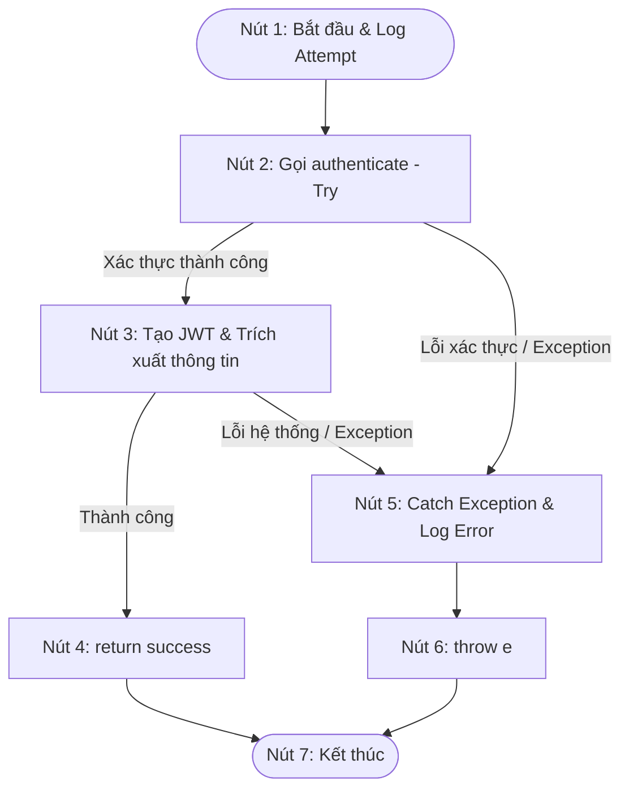

# BÁO CÁO: KIỂM THỬ HỘP TRẮNG (WHITE-BOX TESTING) CHO PHƯƠNG THỨC ĐĂNG NHẬP (AUTH LOGIN)

**Mã Ticket Jira:** KCPM-760  
**Người thực hiện (Assignee):** hungnp1272  
**Mã số Sinh viên:** 089205001272  
**Đối tượng kiểm thử:** Phương thức `authenticateUser` trong lớp `AuthRestController.java`  
**Phương pháp áp dụng:** Kiểm thử đường cơ sở (Basis Path Testing), vẽ đồ thị dòng điều khiển (CFG), tính độ phức tạp Cyclomatic, lập bảng phủ nhánh/điều kiện (Branch/Condition Coverage).

---

## 1. Mã nguồn phương thức kiểm thử

Dưới đây là đoạn mã nguồn thực tế của phương thức `authenticateUser` trong tệp `AuthRestController.java`:

```java
@PostMapping("/login")
public ApiResponse<JwtAuthenticationResponse> authenticateUser(@Valid @RequestBody LoginRequest loginRequest) {
    log.info("Attempting login for user: {}", loginRequest.getEmail());
    try {
        Authentication authentication = authenticationManager.authenticate(
                new UsernamePasswordAuthenticationToken(
                        loginRequest.getEmail(),
                        loginRequest.getPassword()
                )
        );

        SecurityContextHolder.getContext().setAuthentication(authentication);
        String jwt = tokenProvider.generateToken(authentication);
        CustomUserDetails userDetails = (CustomUserDetails) authentication.getPrincipal();
        String role = userDetails.getAuthorities().iterator().next().getAuthority();
        
        log.info("Login successful for user: {}, role: {}", loginRequest.getEmail(), role);
        return ApiResponse.<JwtAuthenticationResponse>success("Login successful", new JwtAuthenticationResponse(jwt, userDetails.getId(), userDetails.getClinicId(), role, userDetails.getFullName(), userDetails.getAvatarUrl()));
    } catch (Exception e) {
        log.error("Login failed for user: {}. Error: {}", loginRequest.getEmail(), e.getMessage());
        throw e;
    }
}
```

---

## 2. Đồ thị dòng điều khiển (Control Flow Graph - CFG)

Các câu lệnh trong phương thức được ánh xạ thành các nút (Nodes) như sau:
* **Nút 1 (Start & Log Attempt):** Bắt đầu phương thức, ghi log nhận yêu cầu đăng nhập.
* **Nút 2 (Try Block - authenticate):** Gọi xác thực tài khoản qua `authenticationManager`. Đây là điểm quyết định có thể phát sinh ngoại lệ (ví dụ: thông tin đăng nhập sai).
* **Nút 3 (JWT Generation & Extraction):** Thiết lập ngữ cảnh bảo mật, tạo token JWT, trích xuất dữ liệu người dùng và vai trò.
* **Nút 4 (Return Success):** Ghi log đăng nhập thành công và trả về phản hồi `ApiResponse` chứa token.
* **Nút 5 (Catch Exception & Log Error):** Bắt các ngoại lệ phát sinh trong khối `try` và thực hiện ghi log lỗi.
* **Nút 6 (Throw Exception):** Ném lại ngoại lệ `e` lên tầng xử lý lỗi chung (ControllerAdvice).
* **Nút 7 (End):** Điểm kết thúc phương thức.

### Đồ thị dòng điều khiển bằng Mermaid:



---

## 3. Độ phức tạp Cyclomatic (Cyclomatic Complexity)

Công thức tính độ phức tạp Cyclomatic $V(G)$:
$$V(G) = E - N + 2P$$

Trong đó:
* **$E$ (Số cạnh - Edges):** 8 cạnh (gồm: $1\to2$, $2\to3$, $2\to5$, $3\to4$, $3\to5$, $4\to7$, $5\to6$, $6\to7$).
* **$N$ (Số nút - Nodes):** 7 nút.
* **$P$ (Số thành phần liên thông - Connected Components):** 1 (do đây là một phương thức đơn lẻ).

Tính toán:
$$V(G) = 8 - 7 + 2(1) = 3$$

*Kiểm chứng bằng số nút quyết định (Decision Nodes):*  
* Có 2 điểm quyết định có khả năng rẽ nhánh (Nút 2 và Nút 3 khi xảy ra lỗi/ngoại lệ). Số nút quyết định $D = 2$.
* $$V(G) = D + 1 = 2 + 1 = 3$$

Kết luận: Độ phức tạp Cyclomatic của phương thức là **3**, tương ứng với **3 đường đi độc lập** qua mã nguồn.

---

## 4. Danh sách các đường đi độc lập (Independent Paths)

* **Path 1:** $1 \to 2 \to 3 \to 4 \to 7$  
  *Mô tả:* Đăng nhập hoàn toàn thành công (xác thực thành công và sinh token thành công).
* **Path 2:** $1 \to 2 \to 5 \to 6 \to 7$  
  *Mô tả:* Lỗi xác thực thông tin đăng nhập (email/mật khẩu sai) dẫn đến ném ngoại lệ ngay tại bước xác thực.
* **Path 3:** $1 \to 2 \to 3 \to 5 \to 6 \to 7$  
  *Mô tả:* Xác thực thành công nhưng phát sinh lỗi hệ thống khi sinh JWT token hoặc ép kiểu dữ liệu người dùng.

---

## 5. Bảng thiết kế các ca kiểm thử đường cơ sở (Basis Path Test Cases)

| STT | Mã TC | Đường đi bao phủ | Mô tả kịch bản test | Dữ liệu đầu vào (Input) | Kết quả mong đợi (Expected Output) |
| :--- | :--- | :--- | :--- | :--- | :--- |
| **1** | **TC-WB-01** | Path 1 | Đăng nhập thành công | Email: `truongquocan@patient.com`<br>Password: `admin123` (Thông tin đúng) | Trả về `ApiResponse` thành công (status 200, "Login successful") kèm theo JWT token. |
| **2** | **TC-WB-02** | Path 2 | Sai thông tin đăng nhập | Email: `truongquocan@patient.com`<br>Password: `wrong_pass` (Sai mật khẩu) | Ném ra ngoại lệ `BadCredentialsException`, ghi log lỗi thất bại. |
| **3** | **TC-WB-03** | Path 3 | Lỗi hệ thống khi tạo Token | Email: `truongquocan@patient.com`<br>Password: `admin123` (Xác thực qua nhưng cấu hình JWT lỗi) | Ném ra ngoại lệ `IllegalArgumentException` (hoặc lỗi hệ thống khác), ghi log lỗi thất bại. |

---

## 6. Bảng phủ Nhánh và Điều kiện (Branch & Condition Coverage)

| Điểm quyết định (Branch/Decision) | Điều kiện kiểm tra | Nhánh rẽ | Các test cases bao phủ | Tỷ lệ phủ nhánh |
| :--- | :--- | :--- | :--- | :--- |
| **Nút 2 (Xác thực)** | `authenticationManager.authenticate` hoàn thành không lỗi | **True** (Xác thực OK) | TC-WB-01, TC-WB-03 | 100% |
| | `authenticationManager.authenticate` ném ngoại lệ | **False** (Xác thực lỗi) | TC-WB-02 | |
| **Nút 3 (Xử lý Token)** | Tạo JWT & lấy User thông tin thành công | **True** (Token OK) | TC-WB-01 | 100% |
| | Tạo JWT hoặc lấy thông tin ném ngoại lệ | **False** (Token lỗi) | TC-WB-03 | |

---

## 7. Kết luận
* Đồ thị dòng điều khiển (CFG) của phương thức đăng nhập đã được xây dựng rõ ràng và logic.
* Độ phức tạp Cyclomatic được xác định chính xác là **3**.
* Thiết lập 3 kịch bản kiểm thử đường cơ sở (Basis Path Test Cases) bảo phủ toàn bộ 100% các nhánh rẽ và điều kiện của hàm.
