# WHITE-BOX GRAPH SPEC - CLINIC VA ADMIN MODULE

## 1. Pham vi

| Nhom | Class/method |
|---|---|
| Clinic patient | `ClinicPatientServiceImpl.createPatient`, `updatePatient`, `deletePatient`, `sendNotificationToPatient`, `getDoctorId` |
| Admin user | `AdminUserServiceImpl.createUser`, `updateUser`, `deleteUser`, `toggleUserStatus`, `validatePasswordPolicy` |

---

## 2. `ClinicPatientServiceImpl.createPatient`

### 2.1 Decision/condition

| ID | Condition | True branch | False branch |
|---|---|---|---|
| D1 | email null/blank | Generate email from phone | Use request email |
| D2 | email already exists | Throw runtime | Continue |
| D3 | password null | Use default `password` | Encode request password |
| D4 | doctor id/request assigned doctor exists | Resolve doctor | No doctor assigned |
| D5 | age parse succeeds | DOB fallback uses age | DOB fallback uses 0 years |
| D6 | dateOfBirth present | Use request DOB | Use `now - age` |
| D7 | primaryCondition present | Use primaryCondition | Use condition |
| D8 | treatmentStatus present | Use request value | Default dang dieu tri |
| D9 | status present | Use request value | Default hoat dong |
| D10 | initialGlucose present | Record blood sugar baseline | Skip |
| D11 | initialBpSystolic present | Record blood pressure baseline | Skip |

### 2.2 CFG

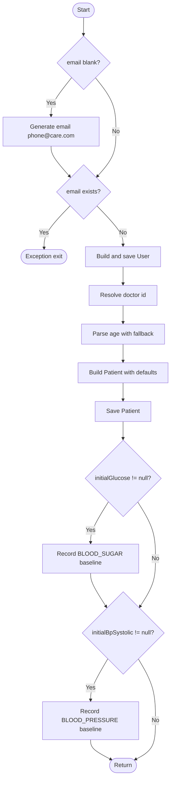

### 2.3 CC va basis paths

| Metric | Value |
|---|---:|
| Nodes `N` | 15 |
| Edges `E` | 19 |
| `V(G)` | `19 - 15 + 2 = 6` |

| TC | Path | Expected |
|---|---|---|
| TC-WB-CLINIC-PAT-CREATE-01 | Email blank | Generated email, user saved |
| TC-WB-CLINIC-PAT-CREATE-02 | Email duplicate | Throw runtime, no save |
| TC-WB-CLINIC-PAT-CREATE-03 | Password null | Encodes default password |
| TC-WB-CLINIC-PAT-CREATE-04 | initialGlucose present | Records blood sugar metric |
| TC-WB-CLINIC-PAT-CREATE-05 | initialBpSystolic present | Records blood pressure metric |
| TC-WB-CLINIC-PAT-CREATE-06 | age invalid and DOB missing | Uses fallback age `0` |

---

## 3. `ClinicPatientServiceImpl.updatePatient`

### 3.1 Decision/condition

| ID | Condition | True branch | False branch |
|---|---|---|---|
| D1 | patient exists | Continue | Throw not found |
| D2 | patient clinic matches | Continue | `AccessDeniedException` |
| D3 | linked user exists | Update user fields | Skip user update |
| D4 | resolved doctor id not null | Assignment logic | Leave doctor unchanged |
| D5 | `drId == -1` | Clear doctor | Validate doctor clinic |
| D6 | doctor exists and same clinic | Assign doctor | Do not assign |
| D7 | assignment date/time and doctor present | Create appointment | Skip appointment |
| D8 | appointment creation throws | Log error | Continue |

### 3.2 CFG

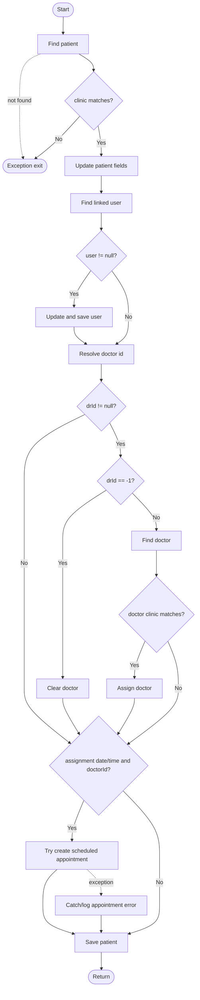

### 3.3 CC va paths

| Metric | Value |
|---|---:|
| Nodes `N` | 20 |
| Edges `E` | 29 |
| `V(G)` | `29 - 20 + 2 = 11` |

| TC | Expected |
|---|---|
| TC-WB-CLINIC-PAT-UPD-01 | Patient not found |
| TC-WB-CLINIC-PAT-UPD-02 | Clinic mismatch denied |
| TC-WB-CLINIC-PAT-UPD-03 | User exists and request has mutable fields |
| TC-WB-CLINIC-PAT-UPD-04 | User missing, still save patient |
| TC-WB-CLINIC-PAT-UPD-05 | `drId == -1`, clear doctor |
| TC-WB-CLINIC-PAT-UPD-06 | Doctor same clinic, assign doctor |
| TC-WB-CLINIC-PAT-UPD-07 | Doctor other clinic, do not assign |
| TC-WB-CLINIC-PAT-UPD-08 | Assignment date/time create appointment |
| TC-WB-CLINIC-PAT-UPD-09 | Appointment creation error is logged, patient still saved |

---

## 4. `ClinicPatientServiceImpl.getDoctorId`

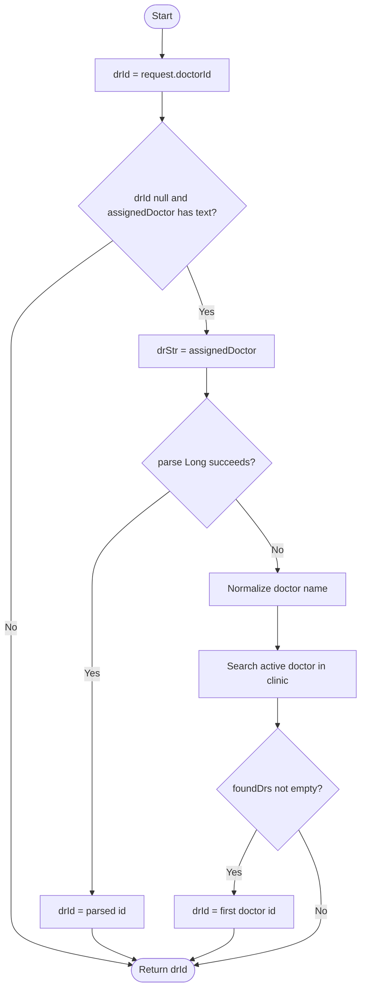

| Path | Expected |
|---|---|
| P1 | request doctorId present -> return it |
| P2 | assignedDoctor numeric -> parsed id |
| P3 | assignedDoctor name found -> matched id |
| P4 | assignedDoctor name not found -> null |

---

## 5. `AdminUserServiceImpl.createUser`

### 5.1 CFG

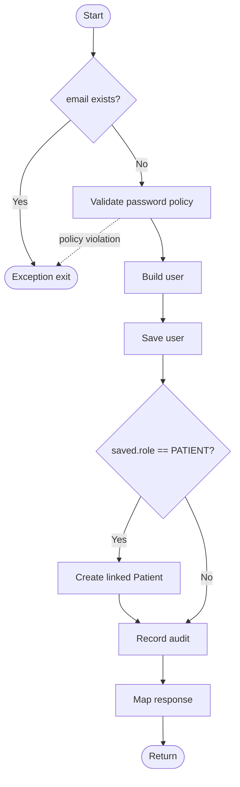

| Metric | Value |
|---|---:|
| Nodes `N` | 10 |
| Edges `E` | 12 |
| `V(G)` | `12 - 10 + 2 = 4` |

| TC | Expected |
|---|---|
| TC-WB-ADMIN-USER-CREATE-01 | Duplicate email -> exception |
| TC-WB-ADMIN-USER-CREATE-02 | Password policy fail -> exception |
| TC-WB-ADMIN-USER-CREATE-03 | Create PATIENT -> linked patient created |
| TC-WB-ADMIN-USER-CREATE-04 | Create DOCTOR/ADMIN -> no linked patient |

---

## 6. `AdminUserServiceImpl.validatePasswordPolicy`

### 6.1 CFG

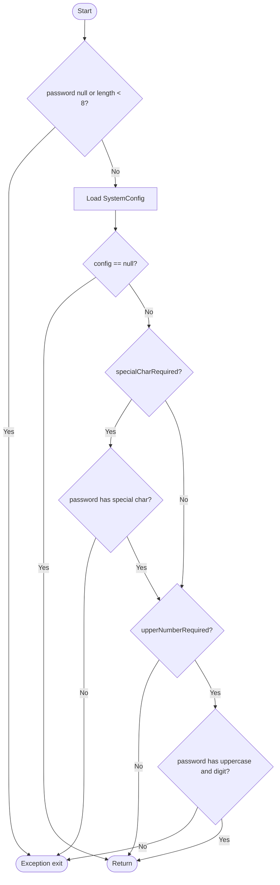

| Metric | Value |
|---|---:|
| Nodes `N` | 10 |
| Edges `E` | 15 |
| `V(G)` | `15 - 10 + 2 = 7` |

| TC | Expected |
|---|---|
| TC-WB-ADMIN-PASS-01 | null/short password -> exception |
| TC-WB-ADMIN-PASS-02 | config null -> pass if length ok |
| TC-WB-ADMIN-PASS-03 | special required missing -> exception |
| TC-WB-ADMIN-PASS-04 | special required present -> continue |
| TC-WB-ADMIN-PASS-05 | upper/number required missing uppercase -> exception |
| TC-WB-ADMIN-PASS-06 | upper/number required missing digit -> exception |
| TC-WB-ADMIN-PASS-07 | all required satisfied -> pass |

---

## 7. `AdminUserServiceImpl.deleteUser`

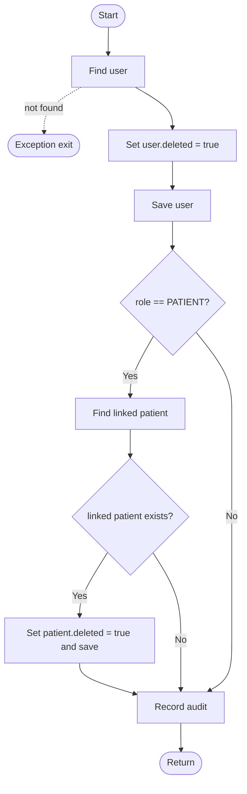

| Path | Expected |
|---|---|
| P1 | User not found |
| P2 | Non-patient user -> only user soft-deleted |
| P3 | Patient user with linked patient -> both soft-deleted |
| P4 | Patient user without linked patient -> only user soft-deleted |

---

## 8. `ClinicPatientServiceImpl.deletePatient`

### 8.1 CFG

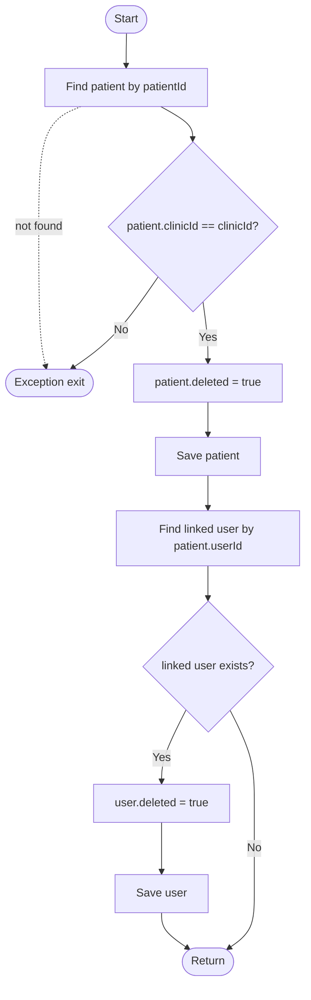

### 8.2 Basis paths

| Path | Expected |
|---|---|
| P1 | Patient not found -> runtime exception |
| P2 | Patient belongs to another clinic -> `AccessDeniedException` |
| P3 | Patient deleted, linked user exists -> both soft-deleted |
| P4 | Patient deleted, linked user missing -> only patient soft-deleted |

---

## 9. `ClinicPatientServiceImpl.sendNotificationToPatient`

### 9.1 CFG

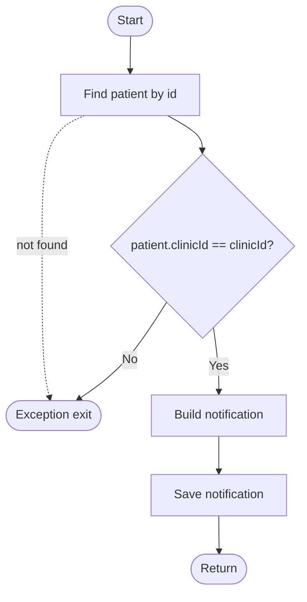

### 9.2 Basis paths

| Path | Expected |
|---|---|
| P1 | Patient not found -> runtime exception |
| P2 | Clinic mismatch -> `AccessDeniedException` |
| P3 | Clinic matches -> notification saved |

---

## 10. `AdminUserServiceImpl.updateUser`

### 10.1 Decision/condition

| ID | Condition | True branch | False branch |
|---|---|---|
| D1 | user exists | Continue | Exception |
| D2 | `fullName != null` | Update fullName | Keep old value |
| D3 | `email != null` | Update email | Keep old value |
| D4 | `role != null` | Parse/update role | Keep old role |
| D5 | `status != null` | Update status | Keep old status |
| D6 | password present and not blank | Validate and encode | Keep old password |
| D7 | doctor profile fields present | Update each present field | Keep missing fields |

### 10.2 CFG

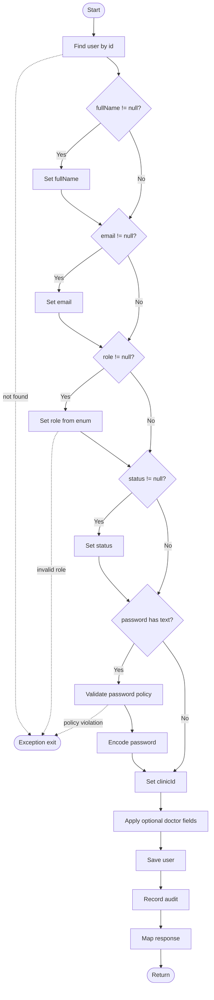

### 10.3 Basis paths

| Path | Expected |
|---|---|
| P1 | User not found -> exception |
| P2 | Invalid role -> exception |
| P3 | Password policy violation -> exception |
| P4 | Only basic fields present -> update and audit |
| P5 | Password blank -> old password retained |
| P6 | Password valid -> encoded password saved |
| P7 | Doctor profile fields present -> fields mapped |

---

## 11. `AdminUserServiceImpl.toggleUserStatus`

### 11.1 CFG

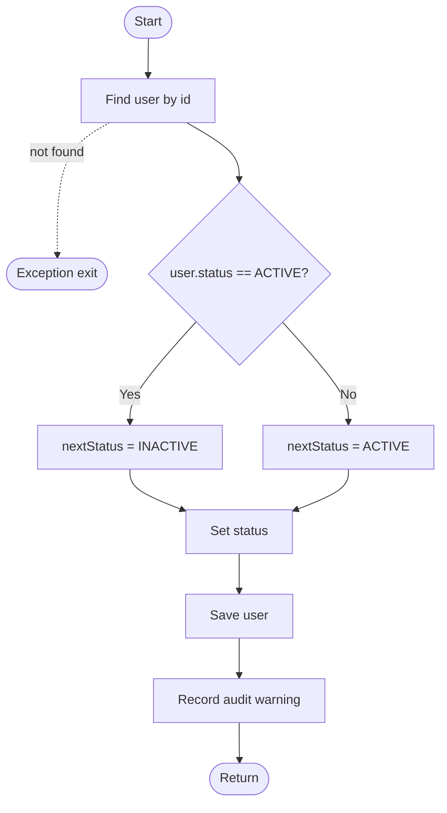

### 11.2 Basis paths

| Path | Expected |
|---|---|
| P1 | User not found -> exception |
| P2 | Current `ACTIVE` -> next `INACTIVE` |
| P3 | Current not `ACTIVE` -> next `ACTIVE` |

---

## 12. `AdminClinicServiceImpl.createClinic`

### 12.1 CFG

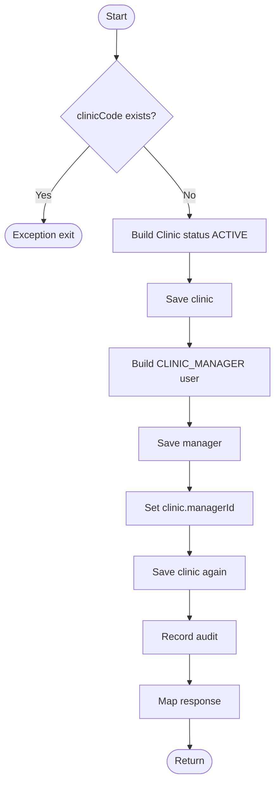

### 12.2 Basis paths

| Path | Expected |
|---|---|
| P1 | Duplicate clinic code -> runtime exception |
| P2 | New clinic -> clinic and manager saved, managerId linked |

---

## 13. `AdminClinicServiceImpl.updateClinic`

### 13.1 CFG

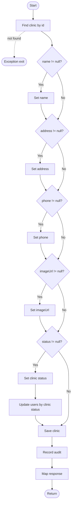

### 13.2 Basis paths

| Path | Expected |
|---|---|
| P1 | Clinic not found -> exception |
| P2 | Only name/address/phone/image changes -> clinic saved |
| P3 | Status present -> clinic status and all clinic users updated |
| P4 | Status null -> no user status update |

---

## 14. `AdminClinicServiceImpl.toggleClinicStatus`

### 14.1 CFG

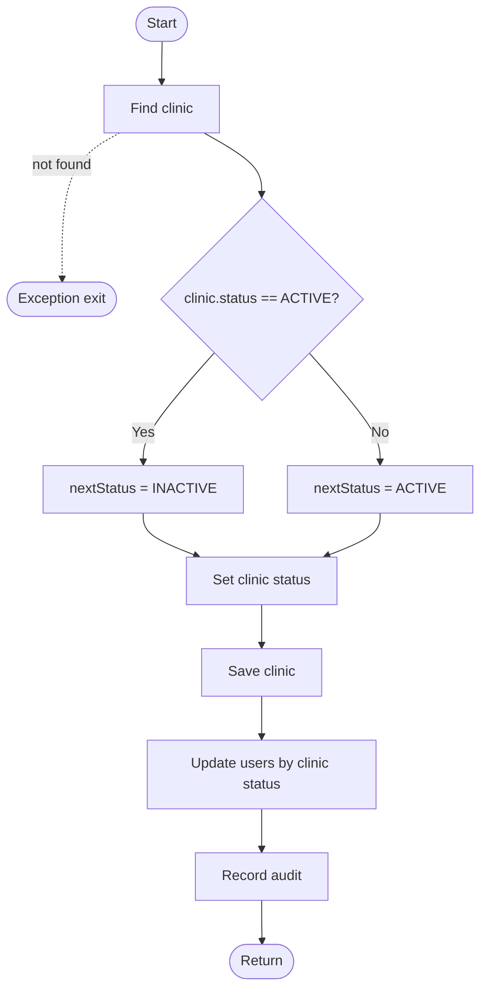

### 14.2 Basis paths

| Path | Expected |
|---|---|
| P1 | Clinic not found -> exception |
| P2 | Current `ACTIVE` -> clinic/users become `INACTIVE` |
| P3 | Current not `ACTIVE` -> clinic/users become `ACTIVE` |

---

## 15. `ClinicDoctorServiceImpl.createDoctor`

### 15.1 CFG

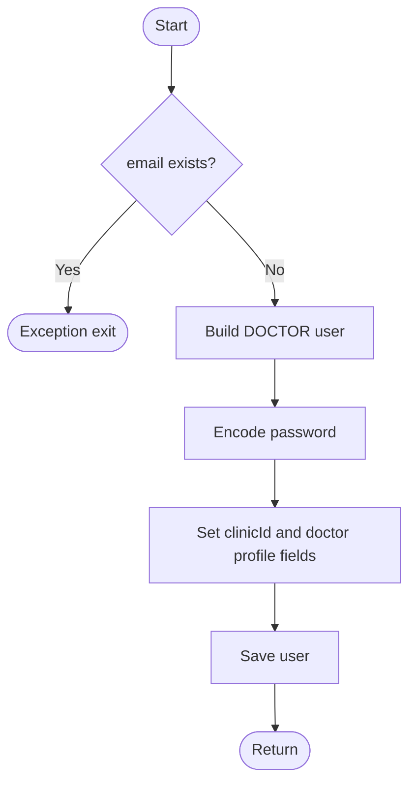

### 15.2 Basis paths

| Path | Expected |
|---|---|
| P1 | Duplicate email -> runtime exception |
| P2 | New email -> doctor user saved |

---

## 16. `ClinicDoctorServiceImpl.updateDoctor`

### 16.1 CFG

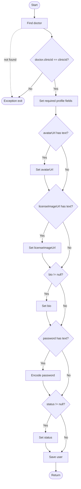

### 16.2 Basis paths

| Path | Expected |
|---|---|
| P1 | Doctor not found -> runtime exception |
| P2 | Clinic mismatch -> `AccessDeniedException` |
| P3 | Optional image/bio/password/status missing -> only required fields updated |
| P4 | Optional fields present -> all mapped and saved |
| P5 | Password present -> encoded password saved |

---

## 17. `ClinicDoctorServiceImpl.deleteDoctor`

### 17.1 CFG

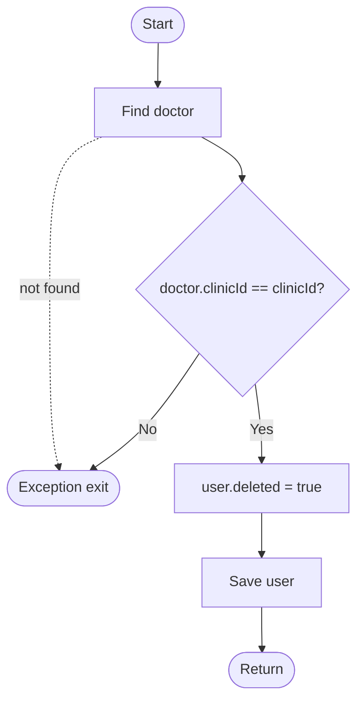

### 17.2 Basis paths

| Path | Expected |
|---|---|
| P1 | Doctor not found -> runtime exception |
| P2 | Clinic mismatch -> `AccessDeniedException` |
| P3 | Clinic matches -> doctor soft-deleted |
