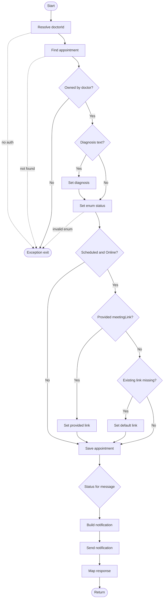
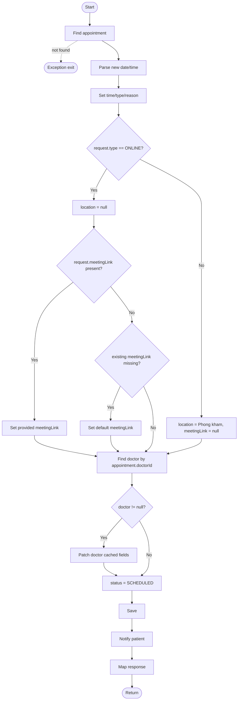
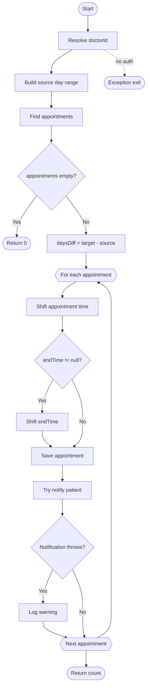
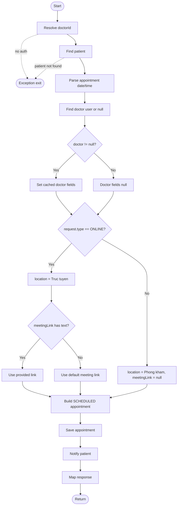
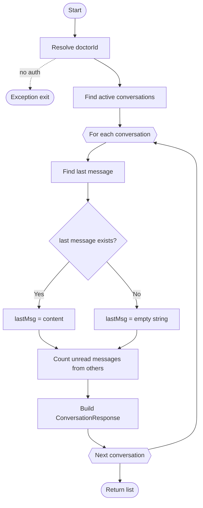
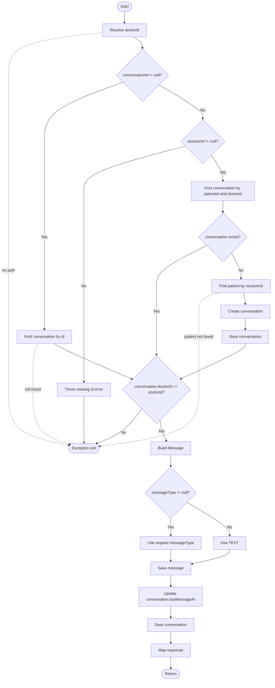
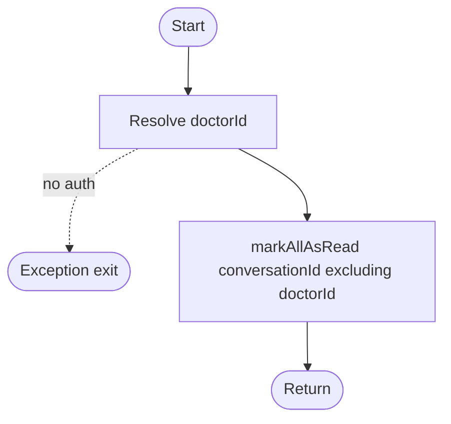

# WHITE-BOX GRAPH SPEC - DOCTOR MODULE

## 1. Pham vi

| Class | Method | Ly do chon |
|---|---|---|
| `DoctorAppointmentServiceImpl` | `updateStatus` | Phan quyen doctor, status transition, meeting link, notification message |
| `DoctorAppointmentServiceImpl` | `rescheduleAppointment` | Doi type online/offline, fallback meeting link, patch doctor info |
| `DoctorAppointmentServiceImpl` | `batchReschedule` | Loop danh sach appointment, notify trong try/catch |

---

## 2. `DoctorAppointmentServiceImpl.updateStatus`

### 2.1 Decision/condition

| ID | Condition | True branch | False/exception branch |
|---|---|---|---|
| D1 | current doctor id exists | Continue | Exception |
| D2 | appointment exists | Continue | `ResourceNotFoundException` |
| D3 | `appointment.doctorId == doctorId` | Continue | Unauthorized |
| D4 | `diagnosisSummary` has text | Set diagnosis | Keep old value |
| D5 | `status` maps to enum | Set status | `IllegalArgumentException` |
| D6 | `status == SCHEDULED && type == ONLINE` | Handle meeting link | Skip meeting link logic |
| D7 | `meetingLink` has text | Use provided link | Check existing link |
| D8 | existing meetingLink missing | Set default link | Keep existing |
| D9 | status message branch | SCHEDULED/CANCELLED/COMPLETED/default | Notification message/type |

### 2.2 CFG

### 2.3 CC va path

| Metric | Value |
|---|---:|
| Nodes `N` | 19 |
| Edges `E` | 28 |
| `V(G)` | `28 - 19 + 2 = 11` |

| TC | Path | Expected |
|---|---|---|
| TC-WB-DOC-APPT-01 | Appointment not found | `ResourceNotFoundException` |
| TC-WB-DOC-APPT-02 | Doctor mismatch | Unauthorized runtime |
| TC-WB-DOC-APPT-03 | Diagnosis blank | Diagnosis unchanged |
| TC-WB-DOC-APPT-04 | Invalid status | `IllegalArgumentException` |
| TC-WB-DOC-APPT-05 | SCHEDULED + ONLINE + provided link | Set provided link, success notification |
| TC-WB-DOC-APPT-06 | SCHEDULED + ONLINE + missing existing link | Set default link |
| TC-WB-DOC-APPT-07 | SCHEDULED + ONLINE + existing link | Keep existing link |
| TC-WB-DOC-APPT-08 | CANCELLED | Warning notification message |
| TC-WB-DOC-APPT-09 | COMPLETED | Info completed message |
| TC-WB-DOC-APPT-10 | Other status | Default update message |

---

## 3. `DoctorAppointmentServiceImpl.rescheduleAppointment`

### 3.1 CFG

### 3.2 CC va basis paths

| Metric | Value |
|---|---:|
| Nodes `N` | 20 |
| Edges `E` | 27 |
| `V(G)` | `27 - 20 + 2 = 9` |

| TC | Path | Expected |
|---|---|---|
| TC-WB-DOC-RESCH-01 | Appointment missing | `ResourceNotFoundException` |
| TC-WB-DOC-RESCH-02 | ONLINE + provided link | location null, provided meetingLink |
| TC-WB-DOC-RESCH-03 | ONLINE + no provided link + existing missing | default meetingLink |
| TC-WB-DOC-RESCH-04 | ONLINE + no provided link + existing present | keep existing meetingLink |
| TC-WB-DOC-RESCH-05 | IN_PERSON | location set, meetingLink null |
| TC-WB-DOC-RESCH-06 | Doctor exists | cached doctor fields patched |
| TC-WB-DOC-RESCH-07 | Doctor missing | cached doctor fields unchanged/null |

---

## 4. `DoctorAppointmentServiceImpl.batchReschedule`

### 4.1 CFG

### 4.2 CC va basis paths

| Metric | Value |
|---|---:|
| Nodes `N` | 18 |
| Edges `E` | 24 |
| `V(G)` | `24 - 18 + 2 = 8` |

| TC | Path | Expected |
|---|---|---|
| TC-WB-DOC-BATCH-01 | No appointments | Return `0`, no save |
| TC-WB-DOC-BATCH-02 | One appointment without endTime | Shift start only |
| TC-WB-DOC-BATCH-03 | Appointment with endTime | Shift start and end |
| TC-WB-DOC-BATCH-04 | Notification success | No warning, returns count |
| TC-WB-DOC-BATCH-05 | Notification throws | Log warning, still returns count |
| TC-WB-DOC-BATCH-06 | Multiple appointments | Loop saves each item |

---

## 5. `DoctorAppointmentServiceImpl.createAppointment`

### 5.1 CFG

### 5.2 Basis paths

| Path | Expected |
|---|---|
| P1 | Missing doctor auth -> exception |
| P2 | Patient not found -> `ResourceNotFoundException` |
| P3 | Doctor user found -> cached fields set |
| P4 | Doctor user missing -> cached fields null |
| P5 | ONLINE with provided link -> use provided link |
| P6 | ONLINE without link -> default meeting link |
| P7 | Non-ONLINE -> location `Phong kham`, meetingLink null |

---

## 6. `DoctorMessageServiceImpl.getConversations`

### 6.1 CFG

### 6.2 Basis paths

| Path | Expected |
|---|---|
| P1 | Missing doctor auth -> exception |
| P2 | No conversations -> empty list |
| P3 | Conversation with last message -> response uses content |
| P4 | Conversation without message -> lastMessage empty |

---

## 7. `DoctorMessageServiceImpl.sendMessage`

### 7.1 CFG

### 7.2 Basis paths

| Path | Expected |
|---|---|
| P1 | Missing auth -> exception |
| P2 | conversationId present but missing -> `ResourceNotFoundException` |
| P3 | no conversationId and no receiverId -> `IllegalArgumentException` |
| P4 | receiverId present, existing conversation found -> send message |
| P5 | receiverId present, patient not found -> `ResourceNotFoundException` |
| P6 | receiverId present, no conversation -> create conversation then send |
| P7 | conversation doctor mismatch -> unauthorized |
| P8 | messageType null -> defaults to `TEXT` |
| P9 | messageType present -> uses request value |

---

## 8. `DoctorMessageServiceImpl.markAsRead`

| Path | Expected |
|---|---|
| P1 | Missing auth -> exception |
| P2 | Authenticated doctor -> messages marked read |
