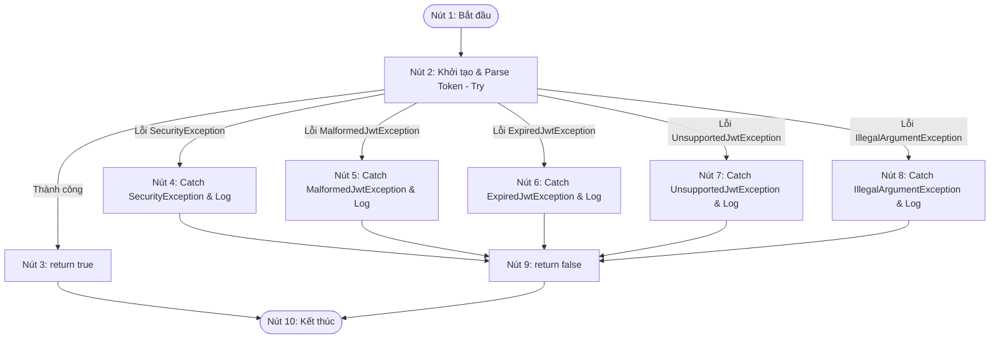

# BÁO CÁO: KIỂM THỬ HỘP TRẮNG (WHITE-BOX TESTING) CHO HÀM XÁC THỰC JWT

**Mã Ticket Jira:** KCPM-761  
**Người thực hiện (Assignee):** Duy Hồ Văn  
**Mã số Sinh viên:** 089205001272  
**Đối tượng kiểm thử:** Phương thức `validateToken` trong lớp `JwtTokenProvider.java`  
**Phương pháp áp dụng:** Kiểm thử đường cơ sở (Basis Path Testing), vẽ đồ thị dòng điều khiển (CFG), tính độ phức tạp Cyclomatic, lập bảng phủ nhánh/điều kiện (Branch/Condition Coverage).

---

## 1. Mã nguồn phương thức kiểm thử

Dưới đây là đoạn mã nguồn thực tế của phương thức `validateToken` trong tệp `JwtTokenProvider.java`:

```java
public boolean validateToken(String authToken) {
    try {
        SecretKey key = Keys.hmacShaKeyFor(jwtSecret.getBytes(StandardCharsets.UTF_8));
        Jwts.parserBuilder().setSigningKey(key).build().parseClaimsJws(authToken);
        return true;
    } catch (io.jsonwebtoken.security.SecurityException ex) {
        log.error("Invalid JWT signature: {}", ex.getMessage());
    } catch (io.jsonwebtoken.MalformedJwtException ex) {
        log.error("Invalid JWT token: {}", ex.getMessage());
    } catch (io.jsonwebtoken.ExpiredJwtException ex) {
        log.error("Expired JWT token: {}", ex.getMessage());
    } catch (io.jsonwebtoken.UnsupportedJwtException ex) {
        log.error("Unsupported JWT token: {}", ex.getMessage());
    } catch (IllegalArgumentException ex) {
        log.error("JWT claims string is empty: {}", ex.getMessage());
    }
    return false;
}
```

---

## 2. Đồ thị dòng điều khiển (Control Flow Graph - CFG)

Các câu lệnh trong phương thức được ánh xạ thành các nút (Nodes) như sau:
* **Nút 1 (Start):** Bắt đầu phương thức `validateToken`.
* **Nút 2 (Try Block):** Khởi tạo key và parse token bằng thư viện `Jwts`.
* **Nút 3 (Return True):** Trả về `true` khi parse thành công không có ngoại lệ.
* **Nút 4 (Catch SecurityException):** Bắt ngoại lệ chữ ký không hợp lệ và ghi log.
* **Nút 5 (Catch MalformedJwtException):** Bắt ngoại lệ cấu trúc token sai định dạng và ghi log.
* **Nút 6 (Catch ExpiredJwtException):** Bắt ngoại lệ token hết hạn và ghi log.
* **Nút 7 (Catch UnsupportedJwtException):** Bắt ngoại lệ cấu trúc token không hỗ trợ và ghi log.
* **Nút 8 (Catch IllegalArgumentException):** Bắt ngoại lệ chuỗi token rỗng/null và ghi log.
* **Nút 9 (Return False):** Điểm trả về `false` chung sau khi gặp bất kỳ ngoại lệ nào.
* **Nút 10 (End):** Kết thúc phương thức.

### Đồ thị dòng điều khiển bằng Mermaid:



---

## 3. Độ phức tạp Cyclomatic (Cyclomatic Complexity)

Công thức tính độ phức tạp Cyclomatic $V(G)$:
$$V(G) = E - N + 2P$$

Trong đó:
* **$E$ (Số cạnh - Edges):** 14 cạnh (gồm: $1\to2$, $2\to3$, $2\to4$, $2\to5$, $2\to6$, $2\to7$, $2\to8$, $3\to10$, $4\to9$, $5\to9$, $6\to9$, $7\to9$, $8\to9$, $9\to10$).
* **$N$ (Số nút - Nodes):** 10 nút.
* **$P$ (Số thành phần liên thông - Connected Components):** 1 (do đây là một phương thức đơn lẻ).

Tính toán:
$$V(G) = 14 - 10 + 2(1) = 6$$

*Kiểm chứng bằng công thức vùng miền hoặc điểm quyết định:*  
Số nút quyết định (Decision Nodes) là 1 nút (Nút 2) nhưng có 5 nhánh rẽ ngoại lệ khác nhau. Do đó số điều kiện quyết định $D = 5$.  
$$V(G) = D + 1 = 5 + 1 = 6$$

Kết luận: Độ phức tạp Cyclomatic của phương thức là **6**, tương ứng với việc hệ thống có **6 đường đi độc lập**.

---

## 4. Danh sách các đường đi độc lập (Independent Paths)

* **Path 1:** $1 \to 2 \to 3 \to 10$
* **Path 2:** $1 \to 2 \to 4 \to 9 \to 10$
* **Path 3:** $1 \to 2 \to 5 \to 9 \to 10$
* **Path 4:** $1 \to 2 \to 6 \to 9 \to 10$
* **Path 5:** $1 \to 2 \to 7 \to 9 \to 10$
* **Path 6:** $1 \to 2 \to 8 \to 9 \to 10$

---

## 5. Bảng thiết kế các ca kiểm thử đường cơ sở (Basis Path Test Cases)

| STT | Mã TC | Đường đi bao phủ | Mô tả kịch bản test | Dữ liệu đầu vào (Input) | Kết quả mong đợi (Expected Output) |
| :--- | :--- | :--- | :--- | :--- | :--- |
| **1** | **TC-WB-01** | Path 1 | Token hợp lệ, không lỗi | Token JWT hợp lệ, còn hạn và đúng chữ ký. | Trả về `true`. |
| **2** | **TC-WB-02** | Path 2 | Token có chữ ký không hợp lệ | Token có phần signature bị sửa đổi. | Ghi log `"Invalid JWT signature"`, trả về `false`. |
| **3** | **TC-WB-03** | Path 3 | Token sai cấu trúc (Malformed) | Chuỗi ngẫu nhiên không đúng chuẩn JWT (`"invalid_token_string"`). | Ghi log `"Invalid JWT token"`, trả về `false`. |
| **4** | **TC-WB-04** | Path 4 | Token đã hết hạn sử dụng | Token có trường `exp` nằm trong quá khứ. | Ghi log `"Expired JWT token"`, trả về `false`. |
| **5** | **TC-WB-05** | Path 5 | Token định dạng không được hỗ trợ | Token JWT sử dụng thuật toán ký không khớp cấu hình. | Ghi log `"Unsupported JWT token"`, trả về `false`. |
| **6** | **TC-WB-06** | Path 6 | Tham số token rỗng hoặc null | Truyền vào chuỗi rỗng `""` hoặc giá trị `null`. | Ghi log `"JWT claims string is empty"`, trả về `false`. |

---

## 6. Bảng phủ Nhánh và Điều kiện (Branch & Condition Coverage)

| Điểm quyết định (Branch/Decision) | Điều kiện kiểm tra | Nhánh rẽ | Các test cases bao phủ | Tỷ lệ phủ nhánh |
| :--- | :--- | :--- | :--- | :--- |
| **Nút 2 (Try Block)** | Quá trình parse Token thành công và không ném ngoại lệ | **True** (Hợp lệ) | TC-WB-01 | 100% |
| | Ném ngoại lệ `SecurityException` | **False** (Ngoại lệ 1) | TC-WB-02 | |
| | Ném ngoại lệ `MalformedJwtException` | **False** (Ngoại lệ 2) | TC-WB-03 | |
| | Ném ngoại lệ `ExpiredJwtException` | **False** (Ngoại lệ 3) | TC-WB-04 | |
| | Ném ngoại lệ `UnsupportedJwtException` | **False** (Ngoại lệ 4) | TC-WB-05 | |
| | Ném ngoại lệ `IllegalArgumentException` | **False** (Ngoại lệ 5) | TC-WB-06 | |

---

## 7. Kết luận
* Quá trình phân tích hộp trắng cho thấy hàm `validateToken` được viết mạch lạc nhưng có nhiều luồng xử lý lỗi khác nhau tương ứng với từng loại ngoại lệ của thư viện `jsonwebtoken`.
* Báo cáo đã hoàn thành việc vẽ đồ thị dòng điều khiển, tính độ phức tạp Cyclomatic ($V(G) = 6$), chỉ ra đầy đủ 6 đường đi độc lập và thiết lập 6 test cases tương ứng bảo phủ 100% các nhánh rẽ và điều kiện của hàm.
