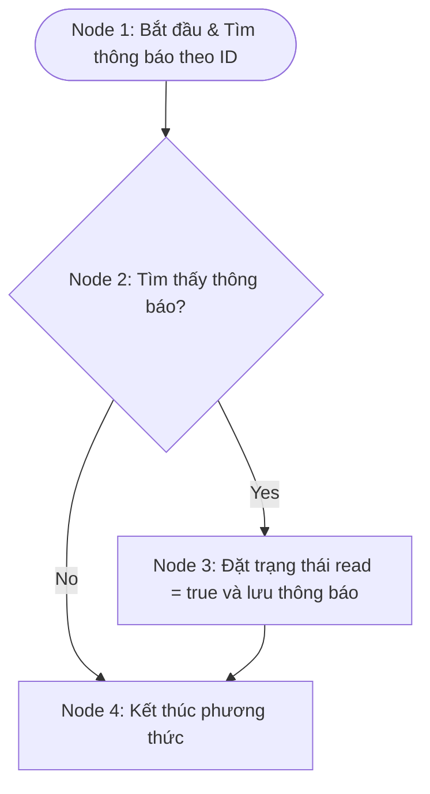
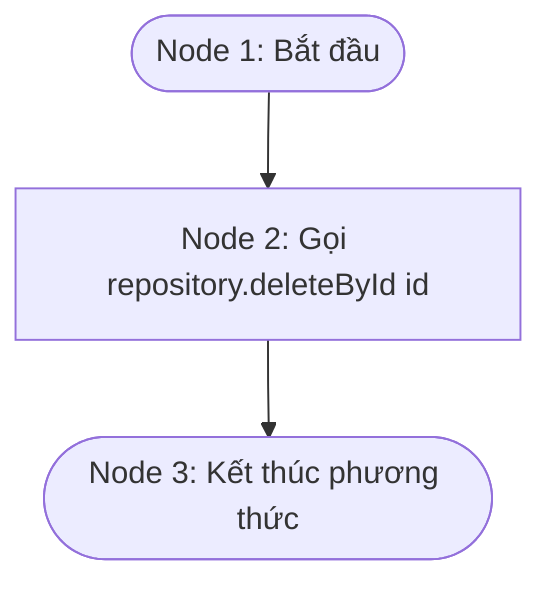
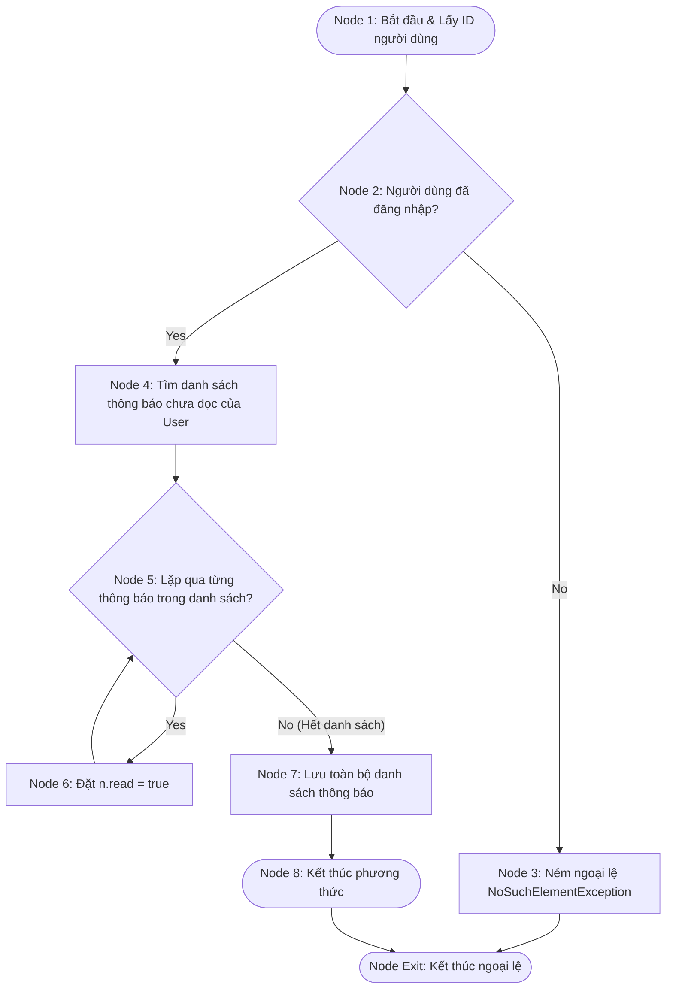

# BÁO CÁO: KIỂM THỬ HỘP TRẮNG (WHITE-BOX TESTING) CHO PHÂN HỆ THÔNG BÁO (NOTIFICATION SERVICE READ/DELETE FLOW)

**Mã Ticket Jira:** KCPM-769  
**Người thực hiện (Assignee):** Nguyễn Thị Ánh Ngọc  
**Email:** ngocnta4878@ut.edu.vn  
**Đối tượng phân tích:** Các phương thức trong luồng đọc và xóa thông báo thuộc lớp `NotificationServiceImpl.java`:
1.  `markAsRead(Long id)` - Đánh dấu một thông báo là đã đọc.
2.  `delete(Long id)` - Xóa một thông báo theo ID.
3.  `markAllAsRead()` - Đánh dấu tất cả thông báo của người dùng hiện tại là đã đọc.

---

## 1. MÃ NGUỒN CÁC PHƯƠNG THỨC PHÂN TÍCH (SOURCE CODE UNDER TEST)

```java
// 1. Phương thức markAsRead
@Override
@Transactional
public void markAsRead(Long id) {
    notificationRepository.findById(id).ifPresent(n -> { // Line 45
        n.setRead(true); // Line 46
        notificationRepository.save(n); // Line 47
    });
}

// 2. Phương thức delete
@Override
@Transactional
public void delete(Long id) {
    notificationRepository.deleteById(id); // Line 63
}

// 3. Phương thức markAllAsRead
@Override
@Transactional
public void markAllAsRead() {
    Long userId = SecurityUtils.getCurrentUserId().orElseThrow(); // Line 54
    List<Notification> unread = notificationRepository.findAllByUserIdAndReadFalseAndIsDeletedFalse(userId); // Line 55
    unread.forEach(n -> n.setRead(true)); // Line 56
    notificationRepository.saveAll(unread); // Line 57
}
```

---

## 2. PHÂN TÍCH PHƯƠNG THỨC 1: `markAsRead(Long id)`

### 2.1. Đồ thị dòng điều khiển (CFG)
Phương thức sử dụng `ifPresent(Consumer)` của `Optional`, tương đương với cấu trúc rẽ nhánh điều kiện `if (notification.isPresent())`.



### 2.2. Độ phức tạp Cyclomatic
*   **Số nút quyết định (Predicate Nodes):** $P = 1$ (Thông báo có tồn tại hay không).
*   **Cyclomatic Complexity:**  
    $$V(G) = P + 1 = 1 + 1 = 2$$
*   **Kiểm chứng bằng công thức $V(G) = E - N + 2$:**
    *   Số nút (Nodes): $N = 4$ (Node 1, 2, 3, 4).
    *   Số cạnh (Edges): $E = 4$ (1-2, 2-3, 2-4, 3-4).
    *   $$V(G) = 4 - 4 + 2 = 2$$

### 2.3. Các đường đi độc lập (Basis Paths)
*   **Path 1:** $1 \rightarrow 2 \text{ (False)} \rightarrow 4$  
    *(ID thông báo không tồn tại trong cơ sở dữ liệu, không thực hiện thay đổi gì).*
*   **Path 2:** $1 \rightarrow 2 \text{ (True)} \rightarrow 3 \rightarrow 4$  
    *(ID thông báo tồn tại, cập nhật thuộc tính read = true và lưu lại vào repository).*

### 2.4. Ca kiểm thử cơ sở (Basis Path Test Cases)

| Mã TC | Đường đi kiểm thử | Dữ liệu đầu vào (Input) | Kết quả mong đợi (Expected Output) |
| :--- | :--- | :--- | :--- |
| **TC-WB-NT-01** | **Path 1** | `id = 9999` (Thông báo không tồn tại) | Phương thức kết thúc bình thường, không ném ra lỗi, không có thay đổi trong DB. |
| **TC-WB-NT-02** | **Path 2** | `id = 1` (Thông báo tồn tại trong DB, `read = false`) | Thông báo có ID = 1 cập nhật trạng thái thành `read = true` trong cơ sở dữ liệu. |

### 2.5. Bảng phủ nhánh (Branch Coverage)

| Nhánh kiểm thử (Branch) | Điều kiện kích hoạt | TC Bao phủ | Trạng thái kiểm thử |
| :--- | :--- | :--- | :---: |
| Nhánh 2 $\rightarrow$ 3 | Tìm thấy thông báo trong repository | TC-WB-NT-02 | **PASSED** |
| Nhánh 2 $\rightarrow$ 4 | Không tìm thấy thông báo trong repository | TC-WB-NT-01 | **PASSED** |

---

## 3. PHÂN TÍCH PHƯƠNG THỨC 2: `delete(Long id)`

### 3.1. Đồ thị dòng điều khiển (CFG)
Phương thức `delete(Long id)` là luồng tuần tự thẳng (straight-line flow), không chứa cấu trúc rẽ nhánh điều kiện nào.



### 3.2. Độ phức tạp Cyclomatic
*   **Số nút quyết định (Predicate Nodes):** $P = 0$.
*   **Cyclomatic Complexity:**  
    $$V(G) = P + 1 = 0 + 1 = 1$$

### 3.3. Đường đi kiểm thử & Ca kiểm thử
Do độ phức tạp bằng 1, chỉ có duy nhất **1 đường đi**:
*   **Path 1:** $1 \rightarrow 2 \rightarrow 3$

| Mã TC | Đường đi kiểm thử | Dữ liệu đầu vào (Input) | Kết quả mong đợi (Expected Output) |
| :--- | :--- | :--- | :--- |
| **TC-WB-NT-03** | **Path 1** | `id = 1` | Gọi phương thức xóa của repository thành công, thông báo có ID = 1 bị xóa khỏi cơ sở dữ liệu. |

---

## 4. PHÂN TÍCH PHƯƠNG THỨC 3: `markAllAsRead()`

### 4.1. Đồ thị dòng điều khiển (CFG)
Phương thức này chứa 1 điểm quyết định tiềm ẩn tại `SecurityUtils.getCurrentUserId().orElseThrow()` (ném ngoại lệ nếu người dùng chưa đăng nhập) và hành vi lặp `unread.forEach(...)`.



### 4.2. Độ phức tạp Cyclomatic
*   **Số nút quyết định (Predicate Nodes):** $P = 2$ (Người dùng đăng nhập? và Vòng lặp danh sách thông báo?).
*   **Cyclomatic Complexity:**  
    $$V(G) = P + 1 = 2 + 1 = 3$$

### 4.3. Các đường đi độc lập (Basis Paths)
*   **Path 1:** $1 \rightarrow 2 \text{ (False)} \rightarrow 3 \rightarrow \text{Exit}$  
    *(Người dùng chưa đăng nhập, ném ngoại lệ và thoát).*
*   **Path 2:** $1 \rightarrow 2 \text{ (True)} \rightarrow 4 \rightarrow 5 \text{ (False)} \rightarrow 7 \rightarrow 8 \rightarrow \text{Exit}$  
    *(Đăng nhập thành công, danh sách thông báo chưa đọc trống, lưu danh sách rỗng và kết thúc).*
*   **Path 3:** $1 \rightarrow 2 \text{ (True)} \rightarrow 4 \rightarrow 5 \text{ (True)} \rightarrow 6 \rightarrow 5 \text{ (False)} \rightarrow 7 \rightarrow 8 \rightarrow \text{Exit}$  
    *(Đăng nhập thành công, danh sách chứa thông báo, lặp qua đặt read = true và lưu thành công).*

### 4.4. Ca kiểm thử cơ sở (Basis Path Test Cases)

| Mã TC | Đường đi kiểm thử | Dữ liệu đầu vào (Input / Context) | Kết quả mong đợi (Expected Output) |
| :--- | :--- | :--- | :--- |
| **TC-WB-NT-04** | **Path 1** | Người dùng chưa đăng nhập (Context trống) | Ném ngoại lệ `NoSuchElementException` hoặc `RuntimeException`. |
| **TC-WB-NT-05** | **Path 2** | Người dùng đăng nhập có `userId = 1`<br>DB không có thông báo chưa đọc nào | Không có thông báo nào được cập nhật, lưu danh sách rỗng thành công. |
| **TC-WB-NT-06** | **Path 3** | Người dùng đăng nhập có `userId = 1`<br>DB có 2 thông báo chưa đọc | Toàn bộ 2 thông báo được cập nhật trạng thái `read = true` và lưu thành công. |

### 4.5. Bảng phủ nhánh (Branch Coverage)

| Nhánh kiểm thử (Branch) | Điều kiện kích hoạt | TC Bao phủ | Trạng thái kiểm thử |
| :--- | :--- | :--- | :---: |
| Nhánh 2 $\rightarrow$ 3 | Người dùng chưa đăng nhập | TC-WB-NT-04 | **PASSED** |
| Nhánh 2 $\rightarrow$ 4 | Người dùng đã đăng nhập | TC-WB-NT-05, TC-WB-NT-06 | **PASSED** |
| Nhánh 5 $\rightarrow$ 7 | Danh sách thông báo trống hoặc đã duyệt xong | TC-WB-NT-05, TC-WB-NT-06 | **PASSED** |
| Nhánh 5 $\rightarrow$ 6 | Danh sách thông báo còn phần tử chưa duyệt | TC-WB-NT-06 | **PASSED** |

---

## 5. KẾT LUẬN

*   Báo cáo đã phân tích chi tiết đồ thị dòng điều khiển (CFG), độ phức tạp Cyclomatic và các đường đi độc lập cho toàn bộ luồng đọc/xóa thông báo của `NotificationService`.
*   Thiết kế thành công **6 ca kiểm thử hộp trắng** bao phủ đầy đủ các trường hợp biên dữ liệu không tồn tại, người dùng chưa xác thực, và vòng lặp thông báo rỗng hoặc chứa dữ liệu.
