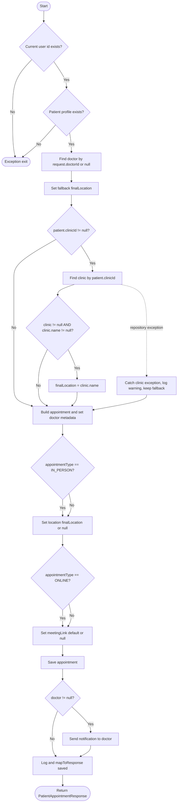

# BÁO CÁO KIỂM THỬ HỘP TRẮNG - PATIENT APPOINTMENT BOOKING FLOW

## 1. Tên kỹ thuật

| Hạng mục | Nội dung |
|---|---|
| Kỹ thuật | White-box Testing |
| Nhóm kỹ thuật | White-box testing |
| Kỹ thuật con áp dụng | Control Flow Graph, Cyclomatic Complexity, Independent Path, Basis Path Testing, Branch Coverage, Condition Coverage |
| Module | Patient Appointment |
| Service/method phân tích | `PatientAppointmentServiceImpl.create(CreateAppointmentRequest request)` |
| Source code | `backend/src/main/java/com/project/service/impl/PatientAppointmentServiceImpl.java` |

**Ghi chú phạm vi:** Trong code hiện tại, `PatientAppointmentService` không có method `reschedule` và không có endpoint `PUT /api/v1/patient/appointments/{id}/reschedule`. Các luồng `reschedule` đang nằm ở `DoctorAppointmentService` và `ClinicDashboardService`, nên báo cáo này chỉ phân tích booking flow của service bệnh nhân để không trộn service khác.

---

## 2. Mục đích áp dụng trong dự án

| Mục tiêu | Nội dung |
|---|---|
| Vấn đề cần kiểm tra | Đảm bảo luồng đặt lịch của bệnh nhân tạo appointment đúng trạng thái, đúng location/meeting link, và xử lý đúng các nhánh liên quan đến patient, clinic, doctor, notification |
| Rủi ro chính | Tạo lịch khi user chưa xác thực, patient profile không tồn tại, clinic không resolve được, doctor không tồn tại, appointment type không hợp lệ |
| Kết quả mong đợi | Xác định đủ đường đi độc lập, lập test case basis path, và chứng minh branch/condition coverage cho method `create` |

---

## 3. Cơ sở test

| Nguồn | Nội dung sử dụng |
|---|---|
| Source Code | `PatientAppointmentServiceImpl.create` và private helper `getCurrentPatient` |
| API Spec | `POST /api/v1/patient/appointments` trong `PatientAppointmentController` |
| DTO Validation | `CreateAppointmentRequest`: `doctorId`, `appointmentTime`, `appointmentType` |
| Business Rule | Appointment mới được tạo với status `PENDING`; `IN_PERSON` có `location`; `ONLINE` có `meetingLink`; có doctor thì gửi notification |
| Repository/Dependency | `PatientRepository`, `UserRepository`, `ClinicRepository`, `AppointmentRepository`, `NotificationService` |

---

## 4. Điều kiện test

| ID | Điều kiện có thể kiểm thử | Loại bao phủ |
|---|---|---|
| C1 | Current user id tồn tại hoặc không tồn tại | Condition/exception |
| C2 | Patient profile tồn tại hoặc không tồn tại | Condition/exception |
| C3 | Patient có `clinicId` hoặc không có `clinicId` | Branch |
| C4 | Clinic repository trả về clinic hợp lệ, clinic null/name null, hoặc ném exception | Branch/exception |
| C5 | Doctor tồn tại hoặc không tồn tại | Branch/condition |
| C6 | `appointmentType = IN_PERSON` | Branch/condition |
| C7 | `appointmentType = ONLINE` | Branch/condition |
| C8 | `appointmentType` khác `IN_PERSON` và `ONLINE` | Negative path |
| C9 | Có doctor thì gửi notification, không có doctor thì bỏ qua notification | Branch |

---

## 5. Cách áp dụng kỹ thuật

Kỹ thuật hộp trắng được áp dụng trực tiếp trên source code của method `create`. Các bước thực hiện:

1. Tách các predicate/decision trong code thành các node điều kiện.
2. Vẽ Control Flow Graph để mô tả luồng xử lý thành công, luồng exception và các nhánh thay đổi dữ liệu.
3. Tính Cyclomatic Complexity bằng công thức `V(G) = E - N + 2P`.
4. Xác định danh sách independent paths từ CFG.
5. Chuyển các path thành basis path test cases.
6. Lập bảng Branch Coverage và Condition Coverage để đối chiếu mức độ bao phủ.

---

## 6. Bảng phân tích kỹ thuật

### 6.1 Branch/condition cần bao phủ

| ID | Code point | Decision/condition | True branch | False/exception branch |
|---|---|---|---|---|
| D1 | `SecurityUtils.getCurrentUserId().orElseThrow(...)` | Current user id tồn tại? | Tiếp tục tìm patient | Ném `ResourceNotFoundException("User not authenticated")` |
| D2 | `patientRepository.findByUserId(userId).orElseThrow(...)` | Patient profile tồn tại? | Tiếp tục tạo lịch | Ném `ResourceNotFoundException("Patient profile not found")` |
| D3 | `if (patient.getClinicId() != null)` | Bệnh nhân có `clinicId`? | Tìm clinic để lấy tên phòng khám | Giữ fallback location |
| D4 | `clinicRepository.findById(...)` trong `try` | Resolve clinic có ném exception? | Log warning, giữ fallback | Tiếp tục kiểm tra clinic |
| D5 | `if (c != null && c.getName() != null)` | Clinic tồn tại và có tên? | Gán `finalLocation = c.getName()` | Giữ fallback location |
| D6 | `request.getAppointmentType().equals("IN_PERSON")` | Lịch trực tiếp? | Gán `location = finalLocation` | Gán `location = null` |
| D7 | `request.getAppointmentType().equals("ONLINE")` | Lịch online? | Gán meeting link mặc định | Gán `meetingLink = null` |
| D8 | `if (doctor != null)` | Có doctor để thông báo? | Gửi notification cho doctor | Bỏ qua notification |

### 6.2 Control Flow Graph

### 6.3 Cyclomatic Complexity

| Thành phần | Giá trị |
|---|---:|
| Số node `N` | 21 |
| Số edge `E` | 27 |
| Số connected component `P` | 1 |
| Công thức | `V(G) = E - N + 2P` |
| Kết quả | `V(G) = 27 - 21 + 2*1 = 8` |

Kiểm tra đối chiếu: `V(G) = số decision chính + 1 = 7 + 1 = 8`.

### 6.4 Independent paths

| Path ID | Independent path | Mục đích bao phủ |
|---|---|---|
| P1 | N1-N2(No)-NX | User chưa authenticated |
| P2 | N1-N2(Yes)-N3(No)-NX | Có user id nhưng không có patient profile |
| P3 | N1-N2(Yes)-N3(Yes)-N4-N5-N6(No)-N11-N12(Yes)-N13-N14(No)-N15-N16-N17(No)-N19-N20 | Không có clinic, không tìm thấy doctor, lịch trực tiếp, không gửi notification |
| P4 | N1-N2(Yes)-N3(Yes)-N4-N5-N6(No)-N11-N12(No)-N13-N14(Yes)-N15-N16-N17(Yes)-N18-N19-N20 | Không có clinic, có doctor, lịch online, gửi notification |
| P5 | N1-N2(Yes)-N3(Yes)-N4-N5-N6(Yes)-N7-N8(Yes)-N9-N11-N12(Yes)-N13-N14(No)-N15-N16-N17(Yes)-N18-N19-N20 | Có clinic hợp lệ, lịch trực tiếp dùng tên clinic |
| P6 | N1-N2(Yes)-N3(Yes)-N4-N5-N6(Yes)-N7-N8(No)-N11-N12(Yes)-N13-N14(No)-N15-N16-N17(Yes)-N18-N19-N20 | Clinic null/name null, dùng fallback location |
| P7 | N1-N2(Yes)-N3(Yes)-N4-N5-N6(Yes)-N7(exception)-N10-N11-N12(Yes)-N13-N14(No)-N15-N16-N17(Yes)-N18-N19-N20 | Lỗi khi resolve clinic, catch và tiếp tục tạo lịch |
| P8 | N1-N2(Yes)-N3(Yes)-N4-N5-N6(No)-N11-N12(No)-N13-N14(No)-N15-N16-N17(Yes)-N18-N19-N20 | Appointment type không được hỗ trợ, không có location và meeting link |

---

## 7. Test case

| Test Case ID | Test Summary | Pre-condition | Test Steps | Test Data | Expected Result | Technique Tag |
|---|---|---|---|---|---|---|
| TC-WB-APPT-01 | User chưa authenticated | `SecurityUtils.getCurrentUserId()` returns empty | Gọi `create(request)` | Request hợp lệ bất kỳ | Throw `ResourceNotFoundException("User not authenticated")`; không gọi `appointmentRepository.save` | P1, D1-F |
| TC-WB-APPT-02 | Không có patient profile | Current user id tồn tại; `patientRepository.findByUserId` returns empty | Gọi `create(request)` | Request hợp lệ bất kỳ | Throw `ResourceNotFoundException("Patient profile not found")`; không save appointment | P2, D1-T, D2-F |
| TC-WB-APPT-03 | Đặt lịch trực tiếp khi không có clinic và không có doctor | Patient có `clinicId = null`; doctor lookup returns empty | Gọi `create(request)` | `{ doctorId: 404, appointmentType: "IN_PERSON" }` | Save appointment `PENDING`; có fallback location; doctor fields null; không gửi notification | P3, D3-F, D6-T, D7-F, D8-F |
| TC-WB-APPT-04 | Đặt lịch online khi không có clinic và có doctor | Patient có `clinicId = null`; doctor tồn tại | Gọi `create(request)` | `{ doctorId: 10, appointmentType: "ONLINE" }` | Save appointment; `location = null`; có `meetingLink`; copy doctor metadata; gửi notification | P4, D3-F, D6-F, D7-T, D8-T |
| TC-WB-APPT-05 | Đặt lịch trực tiếp với clinic hợp lệ | Patient có `clinicId`; clinic có `name`; doctor tồn tại | Gọi `create(request)` | `{ doctorId: 10, appointmentType: "IN_PERSON" }` | Save appointment với `location = clinic.name`; gửi notification | P5, D3-T, D5-T, D6-T, D8-T |
| TC-WB-APPT-06 | Clinic tồn tại nhưng thiếu name | Patient có `clinicId`; clinic có `name = null`; doctor tồn tại | Gọi `create(request)` | `{ doctorId: 10, appointmentType: "IN_PERSON" }` | Save appointment với fallback location; gửi notification | P6, D5-F |
| TC-WB-APPT-07 | Clinic repository ném exception | Patient có `clinicId`; `clinicRepository.findById` throws exception; doctor tồn tại | Gọi `create(request)` | `{ doctorId: 10, appointmentType: "IN_PERSON" }` | Catch exception, log warning, vẫn save appointment với fallback location | P7, D4-EX |
| TC-WB-APPT-08 | Appointment type không được hỗ trợ | Patient không có clinic; doctor tồn tại | Gọi `create(request)` | `{ doctorId: 10, appointmentType: "HOME_VISIT" }` | Save appointment với `location = null`, `meetingLink = null`; ghi nhận rủi ro thiếu enum validation | P8, D6-F, D7-F |
| TC-WB-APPT-09 | Clinic lookup returns empty và doctor không tồn tại | Patient có `clinicId`; clinic repo returns empty; doctor lookup returns empty | Gọi `create(request)` | `{ doctorId: 404, appointmentType: "ONLINE" }` | Save appointment online; doctor fields null; không gửi notification; cover `c != null` false | Extra, C4-F, D8-F |

---

## 8. Độ bao phủ

### 8.1 Branch Coverage

| Branch ID | Branch | TRUE covered by | FALSE/exception covered by | Trạng thái |
|---|---|---|---|---|
| D1 | Current user id exists | TC-WB-APPT-02..09 | TC-WB-APPT-01 | Covered |
| D2 | Patient profile exists | TC-WB-APPT-03..09 | TC-WB-APPT-02 | Covered |
| D3 | `patient.getClinicId() != null` | TC-WB-APPT-05,06,07,09 | TC-WB-APPT-03,04,08 | Covered |
| D4 | Clinic repository exception | TC-WB-APPT-07 | TC-WB-APPT-05,06,09 | Covered |
| D5 | `c != null && c.getName() != null` | TC-WB-APPT-05 | TC-WB-APPT-06,09 | Covered |
| D6 | `appointmentType.equals("IN_PERSON")` | TC-WB-APPT-03,05,06,07 | TC-WB-APPT-04,08,09 | Covered |
| D7 | `appointmentType.equals("ONLINE")` | TC-WB-APPT-04,09 | TC-WB-APPT-03,05,06,07,08 | Covered |
| D8 | `doctor != null` before notification | TC-WB-APPT-04,05,06,07,08 | TC-WB-APPT-03,09 | Covered |

### 8.2 Condition Coverage

| Condition ID | Atomic condition | TRUE covered by | FALSE covered by | Trạng thái |
|---|---|---|---|---|
| C1 | Current user id exists | TC-WB-APPT-02 | TC-WB-APPT-01 | Covered |
| C2 | Patient profile exists | TC-WB-APPT-03 | TC-WB-APPT-02 | Covered |
| C3 | `patient.getClinicId() != null` | TC-WB-APPT-05 | TC-WB-APPT-03 | Covered |
| C4 | `c != null` | TC-WB-APPT-05 | TC-WB-APPT-09 | Covered |
| C5 | `c.getName() != null` | TC-WB-APPT-05 | TC-WB-APPT-06 | Covered |
| C6 | `appointmentType.equals("IN_PERSON")` | TC-WB-APPT-03 | TC-WB-APPT-04 | Covered |
| C7 | `appointmentType.equals("ONLINE")` | TC-WB-APPT-04 | TC-WB-APPT-03 | Covered |
| C8 | `doctor != null` | TC-WB-APPT-04 | TC-WB-APPT-03 | Covered |

### 8.3 Coverage Summary

| Hạng mục | Kết quả |
|---|---|
| Cyclomatic Complexity | `V(G) = 8` |
| Independent paths yêu cầu | 8 |
| Basis path test cases | 8 test chính + 1 test bổ sung condition coverage |
| Branch coverage | Tất cả branch trong phạm vi `create` được bao phủ |
| Condition coverage | Tất cả atomic condition trong phạm vi `create` được bao phủ |
| Phần chưa bao phủ | Patient-side reschedule không có trong source nên không có CFG/test path |

---

## 9. Nhận xét

White-box testing phù hợp với method `create` vì method có nhiều nhánh xử lý phụ thuộc vào patient, clinic, doctor và appointment type. Basis Path Testing giúp đảm bảo mỗi đường đi quan trọng đều có test case đại diện.

Hạn chế của phân tích này là nó chỉ dựa trên source code hiện tại. Các rule nghiệp vụ như giờ đặt lịch tối thiểu, giờ đặt lịch tối đa, hay enum hợp lệ cho `appointmentType` chưa được enforce trong method `create`; các nội dung đó nên được kiểm tra thêm bằng validation/API test hoặc bổ sung logic trong service.

Nếu dự án yêu cầu bệnh nhân được đổi lịch, cần bổ sung `reschedule` vào `PatientAppointmentService` trước, sau đó lập CFG và basis path riêng cho flow đó.
