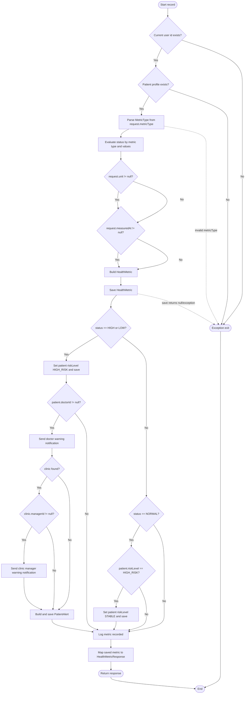
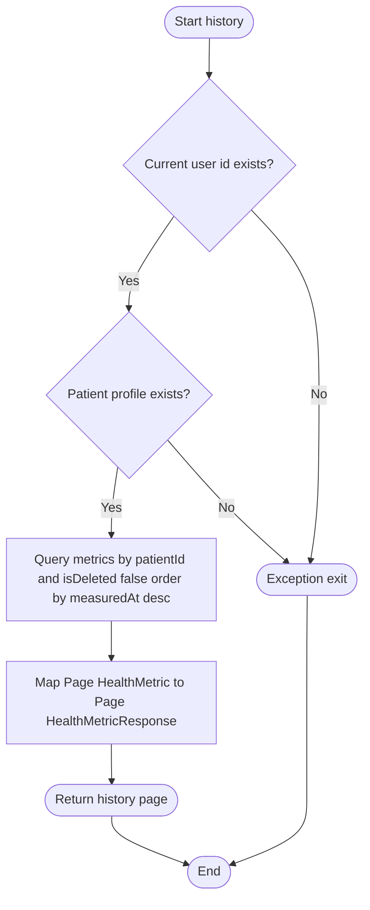

# BÁO CÁO KIỂM THỬ HỘP TRẮNG - PATIENT HEALTH METRIC RECORD/HISTORY FLOW

## 1. Tên kỹ thuật

| Hạng mục | Nội dung |
|---|---|
| Kỹ thuật | White-box Testing |
| Nhóm kỹ thuật | White-box testing |
| Kỹ thuật con áp dụng | Control Flow Graph, Cyclomatic Complexity, Independent Path, Basis Path Testing, Branch Coverage, Condition Coverage |
| Module | Patient Health Metrics |
| Service/method phân tích | `PatientHealthMetricServiceImpl.create(CreateHealthMetricRequest request)` và `PatientHealthMetricServiceImpl.getHistory(Pageable pageable)` |
| Source code | `backend/src/main/java/com/project/service/impl/PatientHealthMetricServiceImpl.java` |

**Ghi chú phạm vi:** Báo cáo chỉ phân tích luồng record/history của `PatientHealthMetricService`. Không trộn các service dashboard, doctor, clinic hoặc risk alert khác. Method `recordMetricForPatient(Long patientId, ...)` dùng chung helper `processAndSave(...)`, nhưng đây là luồng ghi chỉ số cho bệnh nhân cụ thể, không phải endpoint patient self-service; vì vậy chỉ được nhắc như biến thể cùng service, không đưa vào CFG chính.

---

## 2. Mục đích áp dụng trong dự án

| Mục tiêu | Nội dung |
|---|---|
| Vấn đề cần kiểm tra | Đảm bảo bệnh nhân ghi chỉ số sức khỏe đúng loại chỉ số, đúng trạng thái đánh giá, đúng logic cảnh báo, và xem lịch sử chỉ số theo đúng patient hiện tại |
| Rủi ro chính | User chưa xác thực, patient profile không tồn tại, `metricType` không hợp lệ, giá trị bất thường không tạo cảnh báo, doctor/clinic manager không được thông báo, history trả dữ liệu sai bệnh nhân |
| Kết quả mong đợi | Có CFG, Cyclomatic Complexity, independent paths, basis path test cases, branch coverage và condition coverage cho record/history flow |

---

## 3. Cơ sở test

| Nguồn | Nội dung sử dụng |
|---|---|
| Source Code | `create`, `processAndSave`, `getHistory`, `getCurrentPatient`, `evaluateStatus` |
| API Spec | `POST /api/v1/patient/health-metrics`, `GET /api/v1/patient/health-metrics/history` |
| DTO Validation | `CreateHealthMetricRequest`: `metricType`, `value`, `unit`, `valueSecondary`, `measuredAt` |
| Business Rule | Chỉ số mới được lưu cho patient hiện tại; trạng thái bất thường `HIGH/LOW` nâng risk level và tạo cảnh báo; trạng thái `NORMAL` có thể đưa patient từ `HIGH_RISK` về `STABLE` |
| Repository/Dependency | `PatientRepository`, `HealthMetricRepository`, `SystemConfigRepository`, `ClinicRepository`, `NotificationService`, `PatientAlertRepository` |

---

## 4. Điều kiện test

| ID | Điều kiện có thể kiểm thử | Loại bao phủ |
|---|---|---|
| C1 | Current user id tồn tại hoặc không tồn tại | Security/exception |
| C2 | Patient profile tồn tại hoặc không tồn tại | Security/exception |
| C3 | `metricType` hợp lệ hoặc không hợp lệ | Validation/exception |
| C4 | Request có `unit` hoặc không có `unit` | Condition |
| C5 | Request có `measuredAt` hoặc không có `measuredAt` | Condition |
| C6 | `evaluateStatus` trả `HIGH`, `LOW`, `NORMAL`, hoặc trạng thái biên như `BORDERLINE_HIGH/BORDERLINE_LOW` | Branch |
| C7 | Patient có `doctorId` hoặc không có `doctorId` khi chỉ số bất thường | Branch |
| C8 | Clinic có manager hoặc không có manager khi cần gửi cảnh báo clinic | Branch |
| C9 | Patient đang `HIGH_RISK` và chỉ số mới `NORMAL` | Branch |
| C10 | History query chỉ lấy metric của patient hiện tại và `isDeleted = false` | Return path/data scope |

---

## 5. Cách áp dụng kỹ thuật

Kỹ thuật hộp trắng được áp dụng theo source code của service:

1. Phân rã luồng record thành các node: xác thực patient, parse metric type, đánh giá trạng thái, build/save metric, xử lý cảnh báo/risk level, trả response.
2. Phân rã luồng history thành các node: xác thực patient, query repository, map page response, trả kết quả.
3. Vẽ CFG bằng Mermaid cho từng flow.
4. Tính Cyclomatic Complexity bằng công thức `V(G) = E - N + 2P`.
5. Xác định independent paths và chuyển thành Basis Path test cases.
6. Lập bảng Branch Coverage và Condition Coverage bám theo các decision trong code.

---

## 6. Bảng phân tích kỹ thuật

### 6.1 Branch/condition cần bao phủ

| ID | Code point | Decision/condition | True branch | False/exception branch |
|---|---|---|---|---|
| D1 | `SecurityUtils.getCurrentUserId().orElseThrow(...)` | Current user id tồn tại? | Tiếp tục tìm patient | Ném `ResourceNotFoundException("User not authenticated")` |
| D2 | `patientRepository.findByUserId(userId).orElseThrow(...)` | Patient profile tồn tại? | Tiếp tục record/history | Ném `ResourceNotFoundException("No patient profile found for this user.")` |
| D3 | `MetricType.valueOf(request.getMetricType())` | `metricType` hợp lệ? | Tiếp tục đánh giá status | Ném `IllegalArgumentException` |
| D4 | `request.getUnit() != null ? ...` | Request có unit? | Dùng unit từ request | Dùng unit mặc định theo `MetricType` |
| D5 | `request.getMeasuredAt() != null ? ...` | Request có measuredAt? | Dùng thời điểm từ request | Dùng `LocalDateTime.now()` |
| D6 | `"HIGH".equals(status) || "LOW".equals(status)` | Chỉ số bất thường cao/thấp? | Set `HIGH_RISK`, gửi cảnh báo nếu có doctor | Chuyển sang xét `NORMAL` |
| D7 | `patient.getDoctorId() != null` | Patient có doctor phụ trách? | Gửi notification doctor, clinic manager, patient alert | Không gửi notification/alert |
| D8 | `clinicRepository.findById(patient.getClinicId()).ifPresent(...)` | Tìm được clinic? | Xét manager của clinic | Bỏ qua thông báo clinic manager |
| D9 | `clinic.getManagerId() != null` | Clinic có manager? | Gửi notification cho manager | Bỏ qua notification manager |
| D10 | `"NORMAL".equals(status)` | Status là NORMAL? | Xét giảm risk level | Đi thẳng đến log/response |
| D11 | `"HIGH_RISK".equals(patient.getRiskLevel())` | Patient đang HIGH_RISK? | Set `STABLE` và save patient | Giữ risk level hiện tại |

### 6.2 Bảng nhánh đánh giá trạng thái `evaluateStatus`

| MetricType | Điều kiện chính trong code | Status trả về | Test case đại diện |
|---|---|---|---|
| `BLOOD_SUGAR` | `value < 4.0` | `LOW` | TC-WB-HM-06 |
| `BLOOD_SUGAR` | `4.0 <= value <= 6.0` | `NORMAL` | TC-WB-HM-10 |
| `BLOOD_SUGAR` | `6.0 < value <= 7.2` | `BORDERLINE_HIGH` | TC-WB-HM-08 |
| `BLOOD_SUGAR` | `value > 7.2` | `HIGH` | TC-WB-HM-05 |
| `BLOOD_PRESSURE` | `systolic < 120 && diastolic < 80` | `NORMAL` | TC-WB-HM-11 |
| `BLOOD_PRESSURE` | `systolic <= threshold && diastolic <= threshold` | `BORDERLINE_HIGH` | TC-WB-HM-12 |
| `BLOOD_PRESSURE` | Ngoài các khoảng trên | `HIGH` | TC-WB-HM-13 |
| `HEART_RATE` | `60 <= value <= threshold` | `NORMAL` | TC-WB-HM-14 |
| `HEART_RATE` | `value < 60` | `LOW` | TC-WB-HM-15 |
| `HEART_RATE` | `value > threshold` | `HIGH` | TC-WB-HM-16 |
| `HBA1C` | `value < 5.7` | `NORMAL` | TC-WB-HM-17 |
| `HBA1C` | `5.7 <= value <= 6.4` | `BORDERLINE_HIGH` | TC-WB-HM-18 |
| `HBA1C` | `value > 6.4` | `HIGH` | TC-WB-HM-19 |
| `SPO2` | `value >= threshold` | `NORMAL` | TC-WB-HM-20 |
| `SPO2` | `90 <= value < threshold` | `BORDERLINE_LOW` | TC-WB-HM-21 |
| `SPO2` | `value < 90` | `LOW` | TC-WB-HM-22 |

---

## 7. Control Flow Graph

### 7.1 CFG - Record flow `create -> processAndSave`

### 7.2 CFG - History flow `getHistory`

---

## 8. Cyclomatic Complexity

### 8.1 Record flow

| Thành phần | Giá trị |
|---|---:|
| Số node `N` | 25 |
| Số edge `E` | 36 |
| Số connected component `P` | 1 |
| Công thức | `V(G) = E - N + 2P` |
| Kết quả | `V(G) = 36 - 25 + 2*1 = 13` |

Kiểm tra đối chiếu: CFG record có 12 điểm rẽ nhánh/exception chính, nên `V(G) = 12 + 1 = 13`.

### 8.2 History flow

| Thành phần | Giá trị |
|---|---:|
| Số node `N` | 8 |
| Số edge `E` | 9 |
| Số connected component `P` | 1 |
| Công thức | `V(G) = E - N + 2P` |
| Kết quả | `V(G) = 9 - 8 + 2*1 = 3` |

Kiểm tra đối chiếu: CFG history có 2 decision chính, nên `V(G) = 2 + 1 = 3`.

---

## 9. Independent paths

### 9.1 Record flow

| Path ID | Independent path | Mục đích bao phủ |
|---|---|---|
| PR1 | R1-R2(No)-RX-R24 | User chưa xác thực |
| PR2 | R1-R2(Yes)-R3(No)-RX-R24 | Không có patient profile |
| PR3 | R1-R2(Yes)-R3(Yes)-R4(invalid)-RX-R24 | `metricType` không hợp lệ |
| PR4 | R1-R2(Yes)-R3(Yes)-R4-R5-R6(Yes)-R7(Yes)-R8-R9-R10(No)-R18(No)-R21-R22-R23-R24 | Status không bất thường và không NORMAL, ví dụ `BORDERLINE_HIGH` |
| PR5 | R1-R2(Yes)-R3(Yes)-R4-R5-R6(No)-R7(No)-R8-R9-R10(Yes)-R11-R12(No)-R21-R22-R23-R24 | Status HIGH/LOW nhưng patient không có doctor |
| PR6 | R1-R2(Yes)-R3(Yes)-R4-R5-R6(Yes)-R7(No)-R8-R9-R10(Yes)-R11-R12(Yes)-R13-R14(No)-R17-R21-R22-R23-R24 | Có doctor, không tìm được clinic, vẫn tạo patient alert |
| PR7 | R1-R2(Yes)-R3(Yes)-R4-R5-R6(Yes)-R7(Yes)-R8-R9-R10(Yes)-R11-R12(Yes)-R13-R14(Yes)-R15(No)-R17-R21-R22-R23-R24 | Có clinic nhưng không có manager |
| PR8 | R1-R2(Yes)-R3(Yes)-R4-R5-R6(Yes)-R7(Yes)-R8-R9-R10(Yes)-R11-R12(Yes)-R13-R14(Yes)-R15(Yes)-R16-R17-R21-R22-R23-R24 | Có doctor và clinic manager, gửi đầy đủ cảnh báo |
| PR9 | R1-R2(Yes)-R3(Yes)-R4-R5-R6(Yes)-R7(Yes)-R8-R9-R10(No)-R18(Yes)-R19(Yes)-R20-R21-R22-R23-R24 | Status NORMAL và patient đang HIGH_RISK, chuyển về STABLE |
| PR10 | R1-R2(Yes)-R3(Yes)-R4-R5-R6(Yes)-R7(Yes)-R8-R9-R10(No)-R18(Yes)-R19(No)-R21-R22-R23-R24 | Status NORMAL nhưng patient không HIGH_RISK |
| PR11 | R1-R2(Yes)-R3(Yes)-R4-R5-R6(No)-R7(Yes)-R8-R9(save exception)-RX-R24 | Repository save lỗi hoặc trả null |
| PR12 | R1-R2(Yes)-R3(Yes)-R4-R5-R6(No)-R7(No)-R8-R9-R10(No)-R18(No)-R21-R22-R23-R24 | Request thiếu unit và measuredAt, status borderline |
| PR13 | R1-R2(Yes)-R3(Yes)-R4-R5-R6(Yes)-R7(No)-R8-R9-R10(No)-R18(No)-R21-R22-R23-R24 | Request có unit nhưng thiếu measuredAt, status borderline, không đi nhánh cảnh báo |

### 9.2 History flow

| Path ID | Independent path | Mục đích bao phủ |
|---|---|---|
| PH1 | H1-H2(No)-HX-H7 | User chưa xác thực khi xem history |
| PH2 | H1-H2(Yes)-H3(No)-HX-H7 | Có user id nhưng không có patient profile |
| PH3 | H1-H2(Yes)-H3(Yes)-H4-H5-H6-H7 | Lấy history thành công |

---

## 10. Basis Path test cases

| Test Case ID | Test Summary | Pre-condition | Test Steps | Test Data | Expected Result | Technique Tag |
|---|---|---|---|---|---|---|
| TC-WB-HM-01 | Record khi user chưa xác thực | `SecurityUtils.getCurrentUserId()` empty | Gọi `create(request)` | Request hợp lệ bất kỳ | Ném `ResourceNotFoundException("User not authenticated")`; không save metric | PR1, D1-F |
| TC-WB-HM-02 | Record khi không có patient profile | Current user id tồn tại; `patientRepository.findByUserId` empty | Gọi `create(request)` | Request hợp lệ bất kỳ | Ném `ResourceNotFoundException`; không save metric | PR2, D2-F |
| TC-WB-HM-03 | Record với `metricType` không hợp lệ | Patient tồn tại | Gọi `create(request)` | `{ metricType: "BMI", value: 22, unit: "kg/m2" }` | Ném `IllegalArgumentException`; không save metric | PR3, D3-F |
| TC-WB-HM-04 | Record borderline không tạo cảnh báo | Patient tồn tại, risk `STABLE` | Gọi `create(request)` | `{ metricType: "BLOOD_SUGAR", value: 6.5, unit: "mmol/L", measuredAt: fixedTime }` | Save metric status `BORDERLINE_HIGH`; không đổi risk; không gửi notification | PR4 |
| TC-WB-HM-05 | Record HIGH nhưng patient không có doctor | Patient tồn tại, `doctorId = null` | Gọi `create(request)` | `{ metricType: "BLOOD_SUGAR", value: 7.3, unit: null, measuredAt: null }` | Save metric status `HIGH`; set `HIGH_RISK`; không gửi notification/alert vì không có doctor | PR5, D4-F, D5-F, D6-T, D7-F |
| TC-WB-HM-06 | Record LOW có doctor nhưng không tìm được clinic | Patient có doctor, `clinicRepository.findById` empty | Gọi `create(request)` | `{ metricType: "SPO2", value: 88, unit: "%", measuredAt: null }` | Save metric status `LOW`; gửi doctor notification; save patient alert; không gửi manager notification | PR6, D8-F |
| TC-WB-HM-07 | Record HIGH có clinic nhưng không có manager | Patient có doctor/clinic; clinic `managerId = null` | Gọi `create(request)` | `{ metricType: "HEART_RATE", value: 120, unit: "bpm", measuredAt: fixedTime }` | Save metric status `HIGH`; gửi doctor notification; không gửi manager notification; save alert | PR7, D9-F |
| TC-WB-HM-08 | Record HIGH gửi đủ cảnh báo | Patient có doctor/clinic; clinic có manager | Gọi `create(request)` | `{ metricType: "BLOOD_PRESSURE", value: 150, valueSecondary: 95, unit: "mmHg" }` | Save metric; set `HIGH_RISK`; gửi notification cho doctor và manager; save patient alert | PR8, D6-T, D7-T, D8-T, D9-T |
| TC-WB-HM-09 | Record NORMAL đưa patient về STABLE | Patient đang `HIGH_RISK` | Gọi `create(request)` | `{ metricType: "BLOOD_SUGAR", value: 5.5, unit: "mmol/L" }` | Save metric status `NORMAL`; set riskLevel `STABLE`; save patient | PR9, D10-T, D11-T |
| TC-WB-HM-10 | Record NORMAL khi patient đã ổn định | Patient risk `STABLE` | Gọi `create(request)` | `{ metricType: "SPO2", value: 98, unit: "%" }` | Save metric status `NORMAL`; không save patient risk lần nữa | PR10, D11-F |
| TC-WB-HM-11 | Repository save lỗi | Patient tồn tại; `healthMetricRepository.save` throws exception hoặc trả null | Gọi `create(request)` | `{ metricType: "HBA1C", value: 6.0, unit: "%" }` | Method kết thúc bằng exception; không map response | PR11 |
| TC-WB-HM-12 | Record thiếu unit và measuredAt với status borderline | Patient tồn tại | Gọi `create(request)` | `{ metricType: "HBA1C", value: 6.0, unit: null, measuredAt: null }` | Dùng unit mặc định `%`, measuredAt là `now`, status `BORDERLINE_HIGH` | PR12, D4-F, D5-F |
| TC-WB-HM-12B | Record có unit nhưng thiếu measuredAt với status borderline | Patient tồn tại | Gọi `create(request)` | `{ metricType: "BLOOD_SUGAR", value: 6.5, unit: "mmol/L", measuredAt: null }` | Dùng unit từ request, measuredAt là `now`, status `BORDERLINE_HIGH`, không tạo cảnh báo | PR13, D4-T, D5-F |
| TC-WB-HM-13 | History khi user chưa xác thực | `SecurityUtils.getCurrentUserId()` empty | Gọi `getHistory(pageable)` | `page=0,size=10` | Ném `ResourceNotFoundException`; không query history | PH1 |
| TC-WB-HM-14 | History khi không có patient profile | Current user id tồn tại; patient repo empty | Gọi `getHistory(pageable)` | `page=0,size=10` | Ném `ResourceNotFoundException`; không query history | PH2 |
| TC-WB-HM-15 | History thành công | Patient tồn tại; repository trả Page metric | Gọi `getHistory(pageable)` | `page=0,size=10` | Query theo `patient.id` và `isDeleted=false`; trả `Page<HealthMetricResponse>` đã map | PH3 |

### 10.1 Test bổ sung cho condition coverage của `evaluateStatus`

| Test Case ID | MetricType | Test Data | Expected Status | Coverage tag |
|---|---|---|---|---|
| TC-WB-HM-16 | `BLOOD_PRESSURE` | `119/79` | `NORMAL` | BP-NORMAL |
| TC-WB-HM-17 | `BLOOD_PRESSURE` | `130/85` | `BORDERLINE_HIGH` | BP-BORDERLINE |
| TC-WB-HM-18 | `HEART_RATE` | `59` | `LOW` | HR-LOW |
| TC-WB-HM-19 | `HEART_RATE` | `80` | `NORMAL` | HR-NORMAL |
| TC-WB-HM-20 | `HBA1C` | `5.6` | `NORMAL` | HBA1C-NORMAL |
| TC-WB-HM-21 | `HBA1C` | `6.5` | `HIGH` | HBA1C-HIGH |
| TC-WB-HM-22 | `SPO2` | `92` | `BORDERLINE_LOW` | SPO2-BORDERLINE |

---

## 11. Độ bao phủ

### 11.1 Branch Coverage

| Branch ID | Branch | TRUE covered by | FALSE/exception covered by | Trạng thái |
|---|---|---|---|---|
| D1 | Current user id exists | TC-WB-HM-02..15 | TC-WB-HM-01, TC-WB-HM-13 | Covered |
| D2 | Patient profile exists | TC-WB-HM-03..12, TC-WB-HM-15 | TC-WB-HM-02, TC-WB-HM-14 | Covered |
| D3 | `metricType` hợp lệ | TC-WB-HM-04..12 | TC-WB-HM-03 | Covered |
| D4 | `request.getUnit() != null` | TC-WB-HM-04,06,07,08,09,10 | TC-WB-HM-05,12 | Covered |
| D5 | `request.getMeasuredAt() != null` | TC-WB-HM-04,07 | TC-WB-HM-05,06,08,09,10,12 | Covered |
| D6 | Status là `HIGH` hoặc `LOW` | TC-WB-HM-05,06,07,08 | TC-WB-HM-04,09,10,12 | Covered |
| D7 | `patient.getDoctorId() != null` | TC-WB-HM-06,07,08 | TC-WB-HM-05 | Covered |
| D8 | Clinic found | TC-WB-HM-07,08 | TC-WB-HM-06 | Covered |
| D9 | `clinic.getManagerId() != null` | TC-WB-HM-08 | TC-WB-HM-07 | Covered |
| D10 | Status là `NORMAL` | TC-WB-HM-09,10 | TC-WB-HM-04,12 | Covered |
| D11 | Patient risk level là `HIGH_RISK` | TC-WB-HM-09 | TC-WB-HM-10 | Covered |
| H1 | History auth success | TC-WB-HM-14,15 | TC-WB-HM-13 | Covered |
| H2 | History patient profile exists | TC-WB-HM-15 | TC-WB-HM-14 | Covered |

### 11.2 Condition Coverage

| Condition ID | Atomic condition | TRUE covered by | FALSE covered by | Trạng thái |
|---|---|---|---|---|
| C1 | Current user id exists | TC-WB-HM-02 | TC-WB-HM-01 | Covered |
| C2 | Patient profile exists | TC-WB-HM-04 | TC-WB-HM-02 | Covered |
| C3 | `request.getMetricType()` khớp enum `MetricType` | TC-WB-HM-04 | TC-WB-HM-03 | Covered |
| C4 | `request.getUnit() != null` | TC-WB-HM-04 | TC-WB-HM-05 | Covered |
| C5 | `request.getMeasuredAt() != null` | TC-WB-HM-04 | TC-WB-HM-05 | Covered |
| C6 | `"HIGH".equals(status)` | TC-WB-HM-05 | TC-WB-HM-06 | Covered |
| C7 | `"LOW".equals(status)` | TC-WB-HM-06 | TC-WB-HM-05 | Covered |
| C8 | `patient.getDoctorId() != null` | TC-WB-HM-06 | TC-WB-HM-05 | Covered |
| C9 | Clinic lookup returns present | TC-WB-HM-07 | TC-WB-HM-06 | Covered |
| C10 | `clinic.getManagerId() != null` | TC-WB-HM-08 | TC-WB-HM-07 | Covered |
| C11 | `"NORMAL".equals(status)` | TC-WB-HM-09 | TC-WB-HM-04 | Covered |
| C12 | `"HIGH_RISK".equals(patient.getRiskLevel())` | TC-WB-HM-09 | TC-WB-HM-10 | Covered |
| C13 | Blood pressure `systolic < 120` | TC-WB-HM-16 | TC-WB-HM-17 | Covered |
| C14 | Blood pressure `diastolic < 80` | TC-WB-HM-16 | TC-WB-HM-17 | Covered |
| C15 | Heart rate `value < 60` | TC-WB-HM-18 | TC-WB-HM-19 | Covered |
| C16 | SPO2 `value >= threshold` | TC-WB-HM-10 | TC-WB-HM-22 | Covered |

### 11.3 Coverage Summary

| Hạng mục | Kết quả |
|---|---|
| Record flow Cyclomatic Complexity | `V(G) = 13` |
| History flow Cyclomatic Complexity | `V(G) = 3` |
| Record independent paths | 13 |
| History independent paths | 3 |
| Basis path test cases | 16 test chính |
| Test bổ sung condition coverage | 7 test cho nhánh `evaluateStatus` |
| Branch coverage | Bao phủ các nhánh chính của record/history flow |
| Condition coverage | Bao phủ các điều kiện bảo mật, validation, alert/risk và status evaluation quan trọng |
| Phần chưa bao phủ | Không phân tích các flow ngoài `PatientHealthMetricService` như clinic dashboard, doctor analytics hoặc risk alert aggregation |

---

## 12. Nhận xét

White-box testing phù hợp với `PatientHealthMetricService` vì service có nhiều nhánh nghiệp vụ: xác thực patient, đánh giá trạng thái theo loại chỉ số, cập nhật risk level, gửi cảnh báo và truy xuất lịch sử theo phạm vi patient hiện tại.

Record flow có độ phức tạp cao hơn history flow do chứa logic cảnh báo và risk level. History flow đơn giản hơn nhưng vẫn cần test security/data scope để đảm bảo bệnh nhân chỉ xem dữ liệu của chính mình và không lấy metric đã bị soft delete.

Một điểm rủi ro cần ghi nhận là `metricType` đang parse bằng `MetricType.valueOf(...)`; nếu request gửi sai enum thì service ném `IllegalArgumentException`. Ngoài ra, DTO yêu cầu `unit` không blank ở controller, nhưng service vẫn có fallback unit khi `unit = null`; unit test trực tiếp service nên kiểm tra cả nhánh fallback này.
