# WHITE-BOX GRAPH SPEC - PATIENT MODULE

## 1. Pham vi

| Class | Method | Ly do chon |
|---|---|---|
| `PatientAppointmentServiceImpl` | `create` | Tao lich co validation thoi gian, clinic fallback, doctor notification |
| `PatientAppointmentServiceImpl` | `cancel` | Co ownership check, status guard, try/catch bao loi |
| `PatientHealthMetricServiceImpl` | `processAndSave` | Xu ly metric, risk level, notification doctor/clinic/patient |
| `PatientHealthMetricServiceImpl` | `evaluateStatus` | Switch theo `MetricType`, nhieu nguong bien |
| `PatientHealthMetricServiceImpl` | `delete` | Ownership check va soft delete |

---

## 2. `PatientAppointmentServiceImpl.create`

### 2.1 Decision/condition

| ID | Code point | True branch | False/exception branch |
|---|---|---|---|
| D1 | Current patient resolve | Co patient | NX: user/patient not found |
| D2 | `appointmentTime != null` | Check lower/upper bound | Bo qua validation thoi gian |
| D3 | `appointmentTime.isBefore(now.plusHours(3))` | NX: qua som | Tiep tuc |
| D4 | `appointmentTime.isAfter(now.plusDays(15))` | NX: qua xa | Tiep tuc |
| D5 | `patient.getClinicId() != null` | Resolve clinic | Dung fallback location |
| D6 | Clinic lookup throws | Catch/log, dung fallback | Tiep tuc kiem tra clinic |
| D7 | `clinic != null && clinic.name != null` | Lay ten clinic | Dung fallback |
| D8 | `appointmentType == IN_PERSON` | Set location | location null |
| D9 | `appointmentType == ONLINE` | Set meeting link | meetingLink null |
| D10 | `doctor != null` | Gui notification | Khong gui |

### 2.2 CFG

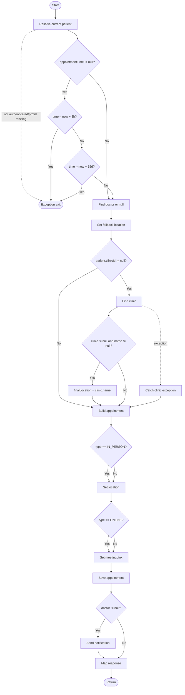

### 2.3 Cyclomatic Complexity

| Metric | Value |
|---|---:|
| Nodes `N` | 23 |
| Edges `E` | 33 |
| Components `P` | 1 |
| `V(G)` | `33 - 23 + 2 = 12` |

Decision cross-check: 10 decision/error branches + 1 base path = about 11-12 paths depending whether `getCurrentPatient` is expanded. This spec expands it as an exception edge, so `V(G)=12`.

### 2.4 Independent paths

| Path | Noi dung |
|---|---|
| P1 | Patient resolve fail -> exception |
| P2 | appointmentTime qua som -> exception |
| P3 | appointmentTime qua xa -> exception |
| P4 | appointmentTime null, khong clinic, khong doctor |
| P5 | Valid time, co clinic hop le, IN_PERSON, co doctor |
| P6 | Valid time, co clinic nhung lookup exception |
| P7 | Valid time, co clinic nhung clinic/name null |
| P8 | ONLINE, co doctor, meeting link mac dinh |
| P9 | Appointment type khac IN_PERSON/ONLINE |
| P10 | Doctor null, khong gui notification |

### 2.5 Basis path test case

| TC | Path | Input/fixture | Expected |
|---|---|---|---|
| TC-WB-PAT-APPT-01 | P1 | SecurityUtils empty hoac patient missing | Throw `ResourceNotFoundException`, khong save |
| TC-WB-PAT-APPT-02 | P2 | `appointmentTime = now + 2h59m` | Throw business error lower bound |
| TC-WB-PAT-APPT-03 | P3 | `appointmentTime = now + 15d + 1m` | Throw business error upper bound |
| TC-WB-PAT-APPT-04 | P4/P10 | Patient clinic null, doctor missing | Save `PENDING`, no notification |
| TC-WB-PAT-APPT-05 | P5 | Clinic co name, type `IN_PERSON`, doctor exists | Location = clinic name, notify doctor |
| TC-WB-PAT-APPT-06 | P6 | Clinic repository throws | Save with fallback location |
| TC-WB-PAT-APPT-07 | P8 | Type `ONLINE` | meetingLink default, location null |
| TC-WB-PAT-APPT-08 | P9 | Type `HOME_VISIT` | Save with null location/link; note validation gap |

---

## 3. `PatientAppointmentServiceImpl.cancel`

### 3.1 Decision/condition

| ID | Condition | True branch | False branch |
|---|---|---|---|
| D1 | current patient exists | Continue | Catch/rethrow runtime |
| D2 | appointment exists | Continue | Catch/rethrow runtime |
| D3 | appointment belongs to patient | Continue | Throw unauthorized |
| D4 | status == COMPLETED | Throw cannot cancel | Continue |
| D5 | status == SCHEDULED | Throw cannot self-cancel | Continue |
| D6 | any exception in try | Wrap with system error | Normal save |

### 3.2 CFG

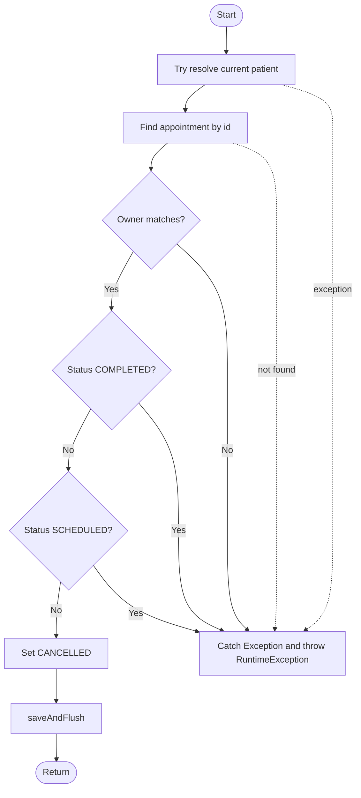

### 3.3 CC va path

| Metric | Value |
|---|---:|
| Nodes `N` | 10 |
| Edges `E` | 15 |
| `V(G)` | `15 - 10 + 2 = 7` |

| Path | Expected test |
|---|---|
| P1 | current patient missing |
| P2 | appointment not found |
| P3 | appointment cua patient khac |
| P4 | appointment COMPLETED |
| P5 | appointment SCHEDULED |
| P6 | appointment PENDING -> CANCELLED |
| P7 | repository save throws -> wrapped system error |

---

## 4. `PatientHealthMetricServiceImpl.processAndSave`

### 4.1 Decision/condition

| ID | Condition | True branch | False branch |
|---|---|---|---|
| D1 | `MetricType.valueOf` valid | Continue | `IllegalArgumentException` |
| D2 | `request.unit != null` | Use request unit | Use default unit |
| D3 | `measuredAt != null` | Use request time | Use now |
| D4 | status HIGH or LOW | Update patient risk and alert | Check NORMAL branch |
| D5 | `patient.doctorId != null` | Notify doctor/clinic/patient | Only patient risk saved |
| D6 | clinic exists | Check manager | Skip clinic notification |
| D7 | `clinic.managerId != null` | Notify manager | Skip manager notification |
| D8 | status NORMAL | Maybe stabilize patient | No risk transition |
| D9 | patient risk HIGH_RISK | Set STABLE | Leave current risk |
| D10 | `valueSecondary != null` | Include secondary value | Only primary value |

### 4.2 CFG

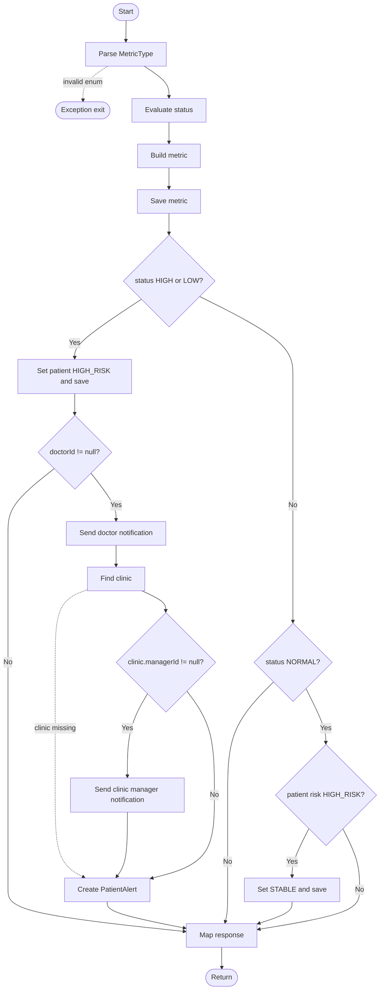

### 4.3 CC va basis paths

| Metric | Value |
|---|---:|
| Nodes `N` | 19 |
| Edges `E` | 27 |
| `V(G)` | `27 - 19 + 2 = 10` |

| TC | Path | Expected |
|---|---|---|
| TC-WB-HM-PROC-01 | Invalid metric type | Throw `IllegalArgumentException` |
| TC-WB-HM-PROC-02 | HIGH/LOW, doctor null | Patient risk set HIGH_RISK, no notification |
| TC-WB-HM-PROC-03 | HIGH/LOW, doctor exists, clinic manager exists | Send doctor + manager + patient alert |
| TC-WB-HM-PROC-04 | HIGH/LOW, clinic missing/no manager | Send doctor + patient alert only |
| TC-WB-HM-PROC-05 | NORMAL and patient HIGH_RISK | Patient risk becomes STABLE |
| TC-WB-HM-PROC-06 | NORMAL and patient not HIGH_RISK | No risk update |
| TC-WB-HM-PROC-07 | BORDERLINE_* | Save metric, no risk transition |
| TC-WB-HM-PROC-08 | unit null/measuredAt null | Default unit/time |
| TC-WB-HM-PROC-09 | secondary value present | Message contains `primary/secondary` |

---

## 5. `PatientHealthMetricServiceImpl.evaluateStatus`

### 5.1 Status partition

| MetricType | Branches |
|---|---|
| `BLOOD_SUGAR` | `<4 LOW`, `<=6 NORMAL`, `<=7.2 BORDERLINE_HIGH`, `>7.2 HIGH` |
| `BLOOD_PRESSURE` | `<120 && <80 NORMAL`, `<=sysThreshold && <=diaThreshold BORDERLINE_HIGH`, otherwise HIGH |
| `HEART_RATE` | `60..threshold NORMAL`, `<60 LOW`, `>threshold HIGH` |
| `HBA1C` | `<5.7 NORMAL`, `<=6.4 BORDERLINE_HIGH`, `>6.4 HIGH` |
| `SPO2` | `>=threshold NORMAL`, `>=90 BORDERLINE_LOW`, `<90 LOW` |

### 5.2 CFG rut gon

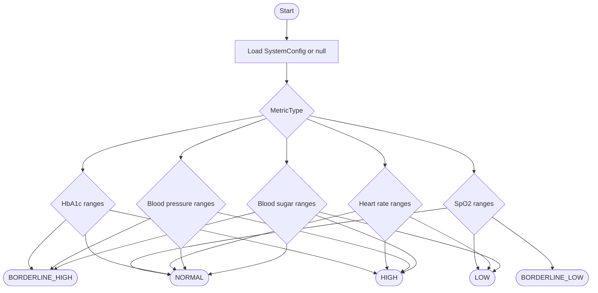

### 5.3 Boundary test data

| Metric | Values |
|---|---|
| BLOOD_SUGAR | `3.9`, `4.0`, `6.0`, `6.1`, `7.2`, `7.3` |
| BLOOD_PRESSURE | `119/79`, `120/80`, threshold, threshold + 1 |
| HEART_RATE | `59`, `60`, threshold, threshold + 1 |
| HBA1C | `5.6`, `5.7`, `6.4`, `6.5` |
| SPO2 | threshold, threshold - 1, `90`, `89` |

---

## 6. `PatientHealthMetricServiceImpl.delete`

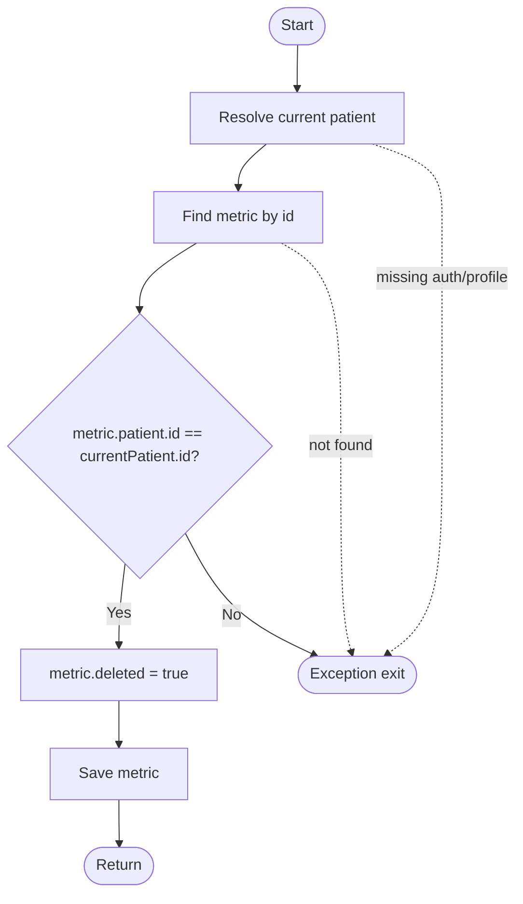

| Path | Expected |
|---|---|
| P1 | Missing current patient -> exception |
| P2 | Metric not found -> `ResourceNotFoundException` |
| P3 | Metric belongs to another patient -> `AccessDeniedException` |
| P4 | Owner metric -> soft delete and save |

---

## 7. `PatientAppointmentServiceImpl.toggleReminder`

| Path | Expected |
|---|---|
| P1 | Missing current patient -> exception |
| P2 | Appointment not found -> `ResourceNotFoundException` |
| P3 | Appointment belongs to another patient -> unauthorized |
| P4 | Owner appointment -> reminder flag saved |

---

## 8. `PatientPrescriptionServiceImpl.getTodaySchedule`

### 8.1 CFG

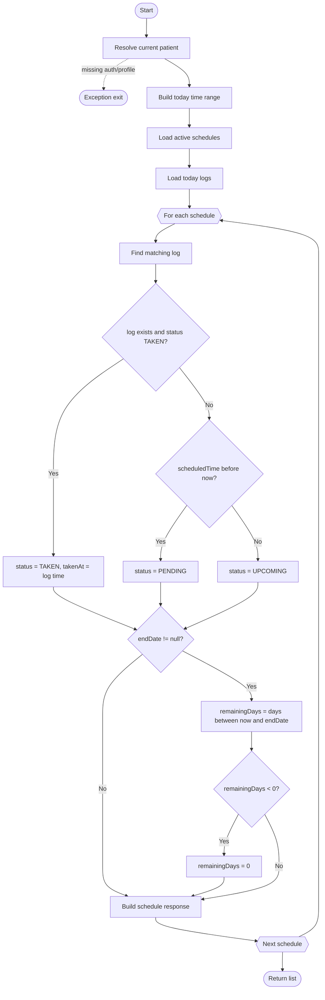

### 8.2 Basis paths

| Path | Expected |
|---|---|
| P1 | Current patient missing -> exception |
| P2 | Matching TAKEN log -> status `TAKEN`, `takenAt` populated |
| P3 | No taken log and schedule time before now -> status `PENDING` |
| P4 | No taken log and schedule time after now -> status `UPCOMING` |
| P5 | `endDate` null -> remainingDays `0` |
| P6 | `endDate` in future -> positive remainingDays |
| P7 | `endDate` in past -> remainingDays clamped to `0` |

---

## 9. `PatientPrescriptionServiceImpl.logMedication`

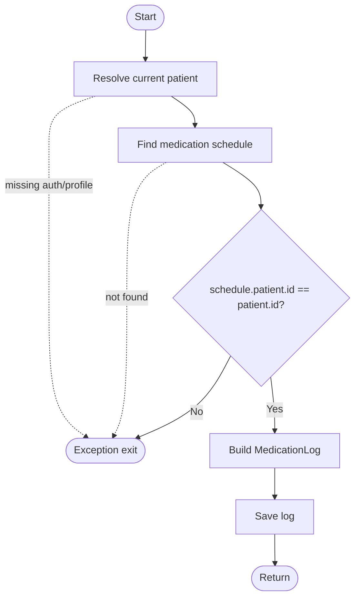

| Path | Expected |
|---|---|
| P1 | Patient missing -> exception |
| P2 | Schedule not found -> `ResourceNotFoundException` |
| P3 | Schedule belongs to another patient -> unauthorized |
| P4 | Owner schedule -> medication log saved |

---

## 10. `PatientPrescriptionServiceImpl.requestRefill`

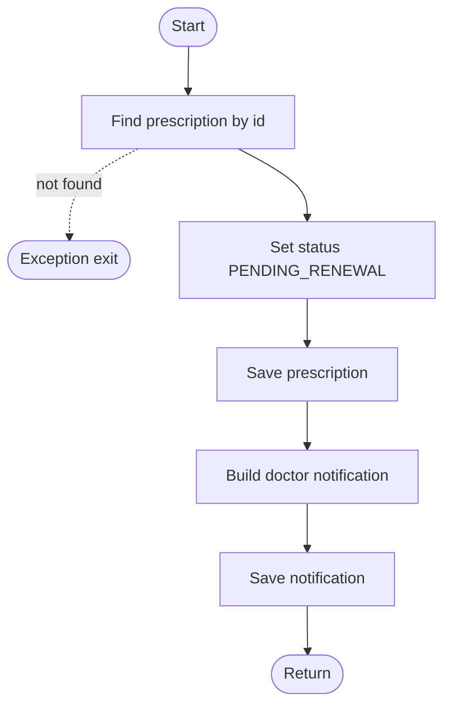

| Path | Expected |
|---|---|
| P1 | Prescription missing -> `ResourceNotFoundException` |
| P2 | Prescription found -> status updated and doctor notified |

---

## 11. `PatientProfileServiceImpl.updateProfile`

### 11.1 CFG

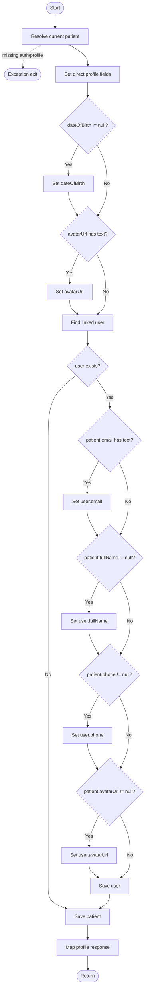

### 11.2 Basis paths

| Path | Expected |
|---|---|
| P1 | Current patient missing -> exception |
| P2 | DOB/avatar absent -> direct fields only |
| P3 | DOB/avatar present -> patient fields updated |
| P4 | Linked user missing -> only patient saved |
| P5 | Linked user exists with email/name/phone/avatar -> user synced |
| P6 | Email blank -> user email not overwritten |

---

## 12. `PatientProfileServiceImpl.mapToProfileResponse`

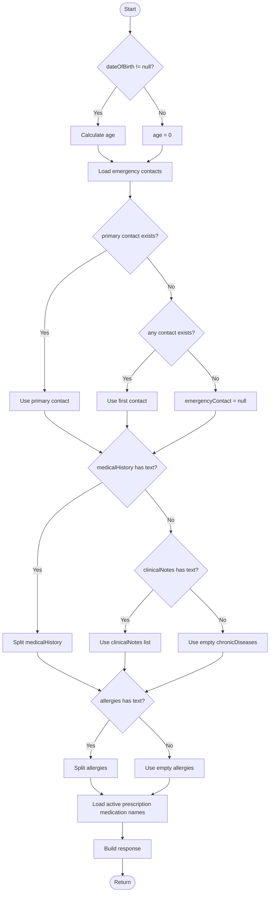

| Path | Expected |
|---|---|
| P1 | DOB present -> age calculated |
| P2 | DOB null -> age `0` |
| P3 | Primary emergency contact exists -> use primary |
| P4 | No primary but contact exists -> use first |
| P5 | No contacts -> emergencyContact null |
| P6 | medicalHistory text -> split list |
| P7 | no medicalHistory but clinicalNotes text -> one-item list |
| P8 | allergies text -> split list |

---

## 13. `PatientProfileServiceImpl.addEmergencyContact`

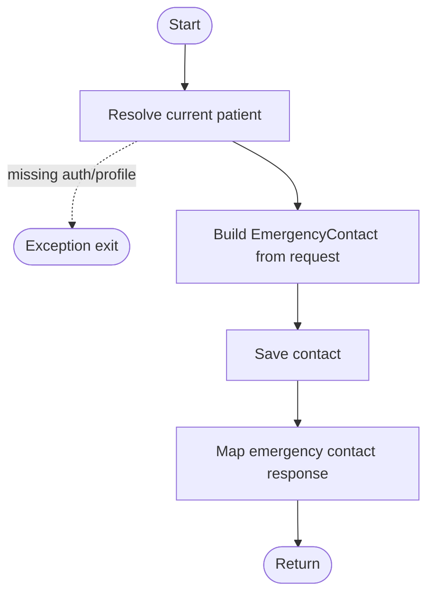

| Path | Expected |
|---|---|
| P1 | Current patient missing -> exception |
| P2 | Current patient exists -> contact saved and response returned |

---

## 14. `PatientProfileServiceImpl.updateEmergencyContact`

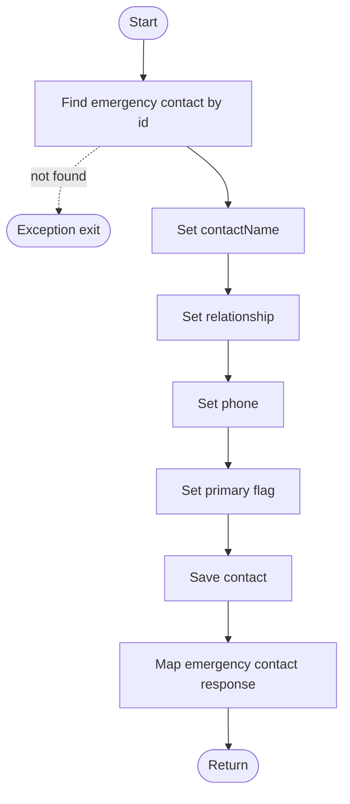

| Path | Expected |
|---|---|
| P1 | Contact not found -> `ResourceNotFoundException` |
| P2 | Contact found -> all fields updated and saved |
