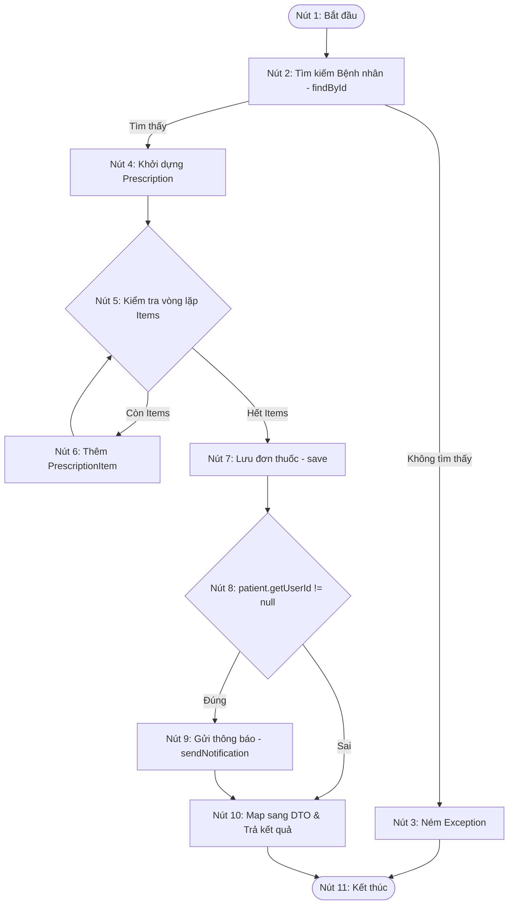

# BÁO CÁO: KIỂM THỬ HỘP TRẮNG (WHITE-BOX TESTING) CHO QUY TRÌNH KÊ ĐƠN THUỐC (PRESCRIPTION SERVICE)

**Mã Ticket Jira:** KCPM-766  
**Người thực hiện (Assignee):** Duy Hồ Văn  
**Mã số Sinh viên:** 054205001151  
**Đối tượng kiểm thử:** Phương thức `createPrescription` trong lớp `PrescriptionServiceImpl.java`  
**Phương pháp áp dụng:** Kiểm thử đường cơ sở (Basis Path Testing), vẽ đồ thị dòng điều khiển (CFG), tính độ phức tạp Cyclomatic, lập bảng phủ nhánh (Branch Coverage).

---

## 1. Mã nguồn phương thức kiểm thử

Dưới đây là mã nguồn thực tế của phương thức `createPrescription` được lấy từ tệp `PrescriptionServiceImpl.java`:

```java
@Override
@Transactional
public PrescriptionResponse createPrescription(Long doctorId, PrescriptionRequest request) {
    Patient patient = patientRepository.findById(request.getPatientId())
            .orElseThrow(() -> new ResourceNotFoundException("Patient not found"));

    Prescription prescription = Prescription.builder()
            .doctorId(doctorId)
            .patient(patient)
            .diagnosis(request.getDiagnosis())
            .status(PrescriptionStatus.ACTIVE)
            .notes(request.getNotes())
            .prescriptionCode("#RX-" + (int)(Math.random() * 10000))
            .build();
            
    request.getItems().forEach(itemDto -> {
        prescription.addItem(PrescriptionItem.builder()
                .medicationName(itemDto.getMedicationName())
                .dosage(itemDto.getDosage())
                .usageInstructions(itemDto.getUsageInstructions())
                .build());
    });
    
    Prescription saved = Objects.requireNonNull(prescriptionRepository.save(prescription));
    
    // Notify Patient
    if (patient.getUserId() != null) {
        notificationService.sendNotification(patient.getUserId(), 
            "Đơn thuốc mới: " + saved.getPrescriptionCode(),
            "Bác sĩ đã kê đơn thuốc mới cho bạn. Vui lòng kiểm tra chi tiết trong hồ sơ.",
            "prescription",
            "/patient/profile");
    }
    
    return prescriptionMapper.toResponseDTO(saved);
}
```

---

## 2. Đồ thị dòng điều khiển (Control Flow Graph - CFG)

Các bước thực thi của hàm `createPrescription` được phân tích thành các nút (Nodes) như sau:
* **Nút 1 (Start):** Bắt đầu phương thức `createPrescription`.
* **Nút 2 (Find Patient):** Thực hiện tìm kiếm thông tin bệnh nhân qua `patientRepository.findById`.
* **Nút 3 (Throw Exception):** Bệnh nhân không tồn tại, ném ra ngoại lệ `ResourceNotFoundException`.
* **Nút 4 (Build Prescription):** Bệnh nhân tồn tại, bắt đầu khởi dựng đối tượng `Prescription`.
* **Nút 5 (Loop Check):** Kiểm tra điều kiện vòng lặp duyệt danh sách thuốc `request.getItems()`.
* **Nút 6 (Add Item):** Khởi dựng `PrescriptionItem` và add vào đơn thuốc (Thân vòng lặp).
* **Nút 7 (Save Prescription):** Lưu đơn thuốc vào cơ sở dữ liệu.
* **Nút 8 (Check User ID):** Kiểm tra điều kiện rẽ nhánh `patient.getUserId() != null`.
* **Nút 9 (Send Notification):** Gọi `notificationService.sendNotification` gửi thông báo cho bệnh nhân.
* **Nút 10 (Map & Return):** Chuyển đổi dữ liệu sang DTO và trả kết quả.
* **Nút 11 (Exit):** Kết thúc phương thức.

### Đồ thị dòng điều khiển bằng Mermaid:



---

## 3. Độ phức tạp Cyclomatic (Cyclomatic Complexity)

Độ phức tạp Cyclomatic $V(G)$ được tính theo công thức:
$$V(G) = E - N + 2P$$

Trong đó:
* **$E$ (Số cạnh - Edges):** 13 cạnh (gồm: $1\to2$, $2\to3$, $2\to4$, $3\to11$, $4\to5$, $5\to6$, $6\to5$, $5\to7$, $7\to8$, $8\to9$, $8\to10$, $9\to10$, $10\to11$).
* **$N$ (Số nút - Nodes):** 11 nút.
* **$P$ (Số thành phần liên thông):** 1.

Tính toán:
$$V(G) = 13 - 11 + 2(1) = 4$$

*Kiểm chứng bằng số nút quyết định (Decision Nodes):*  
Các nút có nhánh rẽ trong hàm là:
1. Kiểm tra tồn tại bệnh nhân (Nút 2)
2. Điều kiện vòng lặp duyệt Items (Nút 5)
3. Kiểm tra user ID để gửi thông báo (Nút 8)

Tổng số điểm quyết định $D = 3$.  
$$V(G) = D + 1 = 3 + 1 = 4$$

Kết luận: Độ phức tạp Cyclomatic bằng **4**, nghĩa là có **4 đường đi độc lập** cần bao phủ.

---

## 4. Danh sách các đường đi độc lập (Independent Paths)

* **Path 1:** $1 \to 2 \to 3 \to 11$
* **Path 2:** $1 \to 2 \to 4 \to 5 \to 7 \to 8 \to 10 \to 11$ (Không có items thuốc, `userId` của bệnh nhân là null).
* **Path 3:** $1 \to 2 \to 4 \to 5 \to 6 \to 5 \to 7 \to 8 \to 10 \to 11$ (Có items thuốc, `userId` của bệnh nhân là null).
* **Path 4:** $1 \to 2 \to 4 \to 5 \to 7 \to 8 \to 9 \to 10 \to 11$ (Không có items thuốc, `userId` của bệnh nhân khác null).

---

## 5. Bảng thiết kế các ca kiểm thử đường cơ sở (Basis Path Test Cases)

| STT | Mã TC | Đường đi bao phủ | Mô tả kịch bản test | Dữ liệu đầu vào (Input) | Kết quả mong đợi (Expected Output) |
| :--- | :--- | :--- | :--- | :--- | :--- |
| **1** | **TC-WB-01** | Path 1 | Tạo đơn thuốc cho bệnh nhân không tồn tại | `patientId` không hợp lệ (không tồn tại trong DB). | Ném ra `ResourceNotFoundException` với thông báo `"Patient not found"`. |
| **2** | **TC-WB-02** | Path 2 | Tạo đơn thuốc trống (0 items) cho bệnh nhân không liên kết tài khoản user | `patientId` hợp lệ, danh sách `items` rỗng, bệnh nhân có `userId = null`. | Đơn thuốc được lưu thành công, không gửi thông báo, trả về DTO. |
| **3** | **TC-WB-03** | Path 3 | Tạo đơn thuốc có danh sách thuốc cho bệnh nhân không liên kết tài khoản user | `patientId` hợp lệ, danh sách `items` có 1 phần tử, bệnh nhân có `userId = null`. | Đơn thuốc được lưu với 1 item thành công, không gửi thông báo, trả về DTO. |
| **4** | **TC-WB-04** | Path 4 | Tạo đơn thuốc trống cho bệnh nhân có liên kết tài khoản user | `patientId` hợp lệ, danh sách `items` rỗng, bệnh nhân có `userId = 12L`. | Đơn thuốc được lưu thành công, gọi `sendNotification` gửi thông báo cho bệnh nhân có ID 12. |

---

## 6. Bảng phủ Nhánh và Điều kiện (Branch Coverage Table)

| Điểm quyết định (Branch/Decision) | Điều kiện kiểm tra | Nhánh rẽ | Các test cases bao phủ | Tỷ lệ phủ nhánh |
| :--- | :--- | :--- | :--- | :--- |
| **Nút 2 (Find Patient)** | Tìm thấy bệnh nhân hợp lệ | **True** | TC-WB-02, TC-WB-03, TC-WB-04 | 100% |
| | Không tìm thấy bệnh nhân | **False** | TC-WB-01 | |
| **Nút 5 (Loop Check)** | Danh sách Items còn phần tử | **True** | TC-WB-03 | 100% |
| | Danh sách Items rỗng / hết phần tử | **False** | TC-WB-02, TC-WB-04 | |
| **Nút 8 (Check User ID)** | `patient.getUserId() != null` | **True** | TC-WB-04 | 100% |
| | `patient.getUserId() == null` | **False** | TC-WB-02, TC-WB-03 | |

---

## 7. Kết luận
* Luồng xử lý `createPrescription` được bảo phủ hoàn toàn bằng **4 kịch bản kiểm thử đường cơ sở**.
* Các kịch bản trên đảm bảo kiểm thử toàn diện các khía cạnh nghiệp vụ: lỗi thiếu bệnh nhân, vòng lặp thêm thuốc và nghiệp vụ tự động gửi thông báo khi bệnh nhân có tài khoản người dùng trên hệ thống.
