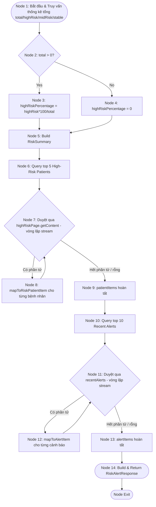
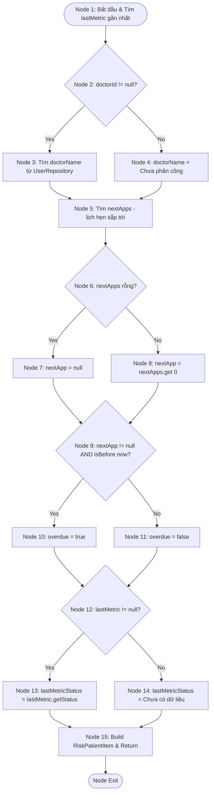

# BÁO CÁO: KIỂM THỬ HỘP TRẮNG (WHITE-BOX TESTING) CHO DỊCH VỤ CẢNH BÁO RỦI RO (RISKALERTSERVICE ALERT DASHBOARD FLOW)

**Mã Ticket Jira:** KCPM-767  
**Người thực hiện (Assignee):** Trần Lê Quang (quangtl9558)  
**Email:** quangtl9558@ut.edu.vn  
**Đối tượng phân tích:** Luồng hiển thị bảng điều khiển cảnh báo rủi ro thuộc lớp `RiskAlertServiceImpl.java`:
1.  `getRiskAlertDashboard(Long clinicId)` - Phương thức chính tổng hợp dữ liệu dashboard: thống kê rủi ro, danh sách bệnh nhân nguy cơ cao, danh sách cảnh báo gần đây.
2.  `mapToRiskPatientItem(Patient p, Long clinicId)` - Phương thức private ánh xạ dữ liệu bệnh nhân sang `RiskPatientItem`, được gọi lặp lại trong `getRiskAlertDashboard()` cho từng bệnh nhân nguy cơ cao (chứa các nhánh quyết định quan trọng của luồng).

---

## 1. PHÂN TÍCH PHƯƠNG THỨC 1: `getRiskAlertDashboard(Long clinicId)`

### 1.1. Mã nguồn (Source Code)

```java
public RiskAlertResponse getRiskAlertDashboard(Long clinicId) {
    LocalDateTime now = LocalDateTime.now();
    LocalDateTime thirtyDaysAgo = now.minusDays(30);

    long total = patientRepository.countByClinicIdAndIsDeletedFalse(clinicId); // Line 42
    long highRisk = patientRepository.countByClinicIdAndRiskLevelAndIsDeletedFalse(clinicId, "Rủi ro cao");
    long midRisk = patientRepository.countByClinicIdAndRiskLevelAndIsDeletedFalse(clinicId, "Trung bình");
    long stableCount = patientRepository.countByClinicIdAndRiskLevelAndIsDeletedFalse(clinicId, "Ổn định");

    List<Long> unmonitoredIds = healthMetricRepository.findPatientIdsInClinicWithNoMetricsSince(clinicId, thirtyDaysAgo);
    long unmonitoredCount = unmonitoredIds.size();
    long overdueCount = appointmentRepository.countOverdueByClinicId(clinicId, now);

    RiskAlertResponse.RiskSummary summary = RiskAlertResponse.RiskSummary.builder()
            .totalPatients(total).highRiskCount(highRisk).mediumRiskCount(midRisk)
            .stableCount(stableCount).unmonitoredCount(unmonitoredCount)
            .overdueAppointments(overdueCount)
            .highRiskPercentage(total > 0 ? (double) highRisk * 100 / total : 0) // Line 59
            .build();

    Pageable topFive = PageRequest.of(0, 5);
    Page<Patient> highRiskPage = patientRepository.findByClinicIdAndFilters(clinicId, null, null, "Rủi ro cao", null, null, topFive);
    List<RiskAlertResponse.RiskPatientItem> patientItems = highRiskPage.getContent().stream()
            .map(p -> mapToRiskPatientItem(p, clinicId))
            .collect(Collectors.toList()); // Line 66-68

    Pageable topTen = PageRequest.of(0, 10);
    List<PatientAlert> recentAlerts = patientAlertRepository.findRecentAlertsByClinic(clinicId, topTen);
    List<RiskAlertResponse.AlertItem> alertItems = recentAlerts.stream()
            .map(this::mapToAlertItem)
            .collect(Collectors.toList()); // Line 74-76

    return RiskAlertResponse.builder()
            .summary(summary).highRiskPatients(patientItems).recentAlerts(alertItems)
            .build(); // Line 78-82
}
```

### 1.2. Đồ thị dòng điều khiển (CFG)



### 1.3. Độ phức tạp Cyclomatic
*   **Số nút quyết định (Predicate Nodes):** $P = 3$ (total > 0?, vòng lặp highRiskPage, vòng lặp recentAlerts).
*   **Cyclomatic Complexity:**
    $$V(G) = P + 1 = 3 + 1 = 4$$
*   **Kiểm chứng bằng công thức $V(G) = E - N + 2$:**
    *   Số nút (Nodes): $N = 15$ (Node 1–14, Exit).
    *   Số cạnh (Edges): $E = 17$ (1-2, 2-3, 2-4, 3-5, 4-5, 5-6, 6-7, 7-8, 8-7, 7-9, 9-10, 10-11, 11-12, 12-11, 11-13, 13-14, 14-Exit).
    *   $$V(G) = 17 - 15 + 2 = 4$$

### 1.4. Các đường đi độc lập (Basis Paths)
*   **Path 1:** $1 \rightarrow 2 \text{ (Yes)} \rightarrow 3 \rightarrow 5 \rightarrow 6 \rightarrow 7 \text{ (rỗng)} \rightarrow 9 \rightarrow 10 \rightarrow 11 \text{ (rỗng)} \rightarrow 13 \rightarrow 14 \rightarrow \text{Exit}$
    *(total > 0, không có bệnh nhân nguy cơ cao nào, không có cảnh báo nào).*
*   **Path 2:** $1 \rightarrow 2 \text{ (No)} \rightarrow 4 \rightarrow 5 \rightarrow 6 \rightarrow 7 \text{ (rỗng)} \rightarrow 9 \rightarrow 10 \rightarrow 11 \text{ (rỗng)} \rightarrow 13 \rightarrow 14 \rightarrow \text{Exit}$
    *(total = 0, tránh chia cho 0, highRiskPercentage = 0).*
*   **Path 3:** $1 \rightarrow 2 \text{ (Yes)} \rightarrow 3 \rightarrow 5 \rightarrow 6 \rightarrow 7 \text{ (Yes)} \rightarrow 8 \rightarrow 7 \text{ (rỗng)} \rightarrow 9 \rightarrow 10 \rightarrow 11 \text{ (rỗng)} \rightarrow 13 \rightarrow 14 \rightarrow \text{Exit}$
    *(Có ít nhất 1 bệnh nhân nguy cơ cao, không có cảnh báo).*
*   **Path 4:** $1 \rightarrow 2 \text{ (Yes)} \rightarrow 3 \rightarrow 5 \rightarrow 6 \rightarrow 7 \text{ (rỗng)} \rightarrow 9 \rightarrow 10 \rightarrow 11 \text{ (Yes)} \rightarrow 12 \rightarrow 11 \text{ (rỗng)} \rightarrow 13 \rightarrow 14 \rightarrow \text{Exit}$
    *(Không có bệnh nhân nguy cơ cao, có ít nhất 1 cảnh báo gần đây).*

### 1.5. Ca kiểm thử cơ sở (Basis Path Test Cases)

| Mã TC | Đường đi kiểm thử | Dữ liệu đầu vào (Input / Context) | Kết quả mong đợi (Expected Output) |
| :--- | :--- | :--- | :--- |
| **TC-WB-RA-01** | **Path 1** | `clinicId = 1`, `total = 20`, `highRiskPage = []`, `recentAlerts = []` | `RiskSummary.highRiskPercentage` được tính đúng theo `highRisk*100/total`; `highRiskPatients = []`, `recentAlerts = []`. |
| **TC-WB-RA-02** | **Path 2** | `clinicId = 2`, `total = 0` (phòng khám chưa có bệnh nhân) | `RiskSummary.highRiskPercentage = 0` (tránh `ArithmeticException` chia cho 0). |
| **TC-WB-RA-03** | **Path 3** | `clinicId = 1`, `total = 20`, `highRiskPage = [Patient A]`, `recentAlerts = []` | `highRiskPatients` chứa 1 phần tử đã map từ `mapToRiskPatientItem`; `recentAlerts = []`. |
| **TC-WB-RA-04** | **Path 4** | `clinicId = 1`, `total = 20`, `highRiskPage = []`, `recentAlerts = [Alert X]` | `highRiskPatients = []`; `recentAlerts` chứa 1 phần tử đã map từ `mapToAlertItem`. |

### 1.6. Bảng phủ nhánh (Branch / Condition Coverage)

| Nhánh kiểm thử (Branch) | Điều kiện kích hoạt | TC Bao phủ | Trạng thái kiểm thử |
| :--- | :--- | :--- | :---: |
| Nhánh 2 $\rightarrow$ 3 | `total > 0` | TC-WB-RA-01, 03, 04 | **PASSED** |
| Nhánh 2 $\rightarrow$ 4 | `total == 0` | TC-WB-RA-02 | **PASSED** |
| Nhánh 7 (có phần tử) | `highRiskPage.getContent()` không rỗng | TC-WB-RA-03 | **PASSED** |
| Nhánh 7 (rỗng) | `highRiskPage.getContent()` rỗng | TC-WB-RA-01, 02, 04 | **PASSED** |
| Nhánh 11 (có phần tử) | `recentAlerts` không rỗng | TC-WB-RA-04 | **PASSED** |
| Nhánh 11 (rỗng) | `recentAlerts` rỗng | TC-WB-RA-01, 02, 03 | **PASSED** |

---

## 2. PHÂN TÍCH PHƯƠNG THỨC 2: `mapToRiskPatientItem(Patient p, Long clinicId)`

### 2.1. Mã nguồn (Source Code)

```java
private RiskAlertResponse.RiskPatientItem mapToRiskPatientItem(Patient p, Long clinicId) {
    HealthMetric lastMetric = healthMetricRepository.findRecentByPatientId(p.getId(), PageRequest.of(0, 1))
            .stream().findFirst().orElse(null); // Line 114

    String doctorName = "Chưa phân công";
    Long doctorId = p.getDoctorId();
    if (doctorId != null) { // Line 119
        doctorName = userRepository.findById(doctorId)
                .map(User::getFullName)
                .orElse("Chưa phân công"); // Line 120-122
    }

    List<Appointment> nextApps = appointmentRepository.findNextAppointmentsByPatient(clinicId, p.getId(), PageRequest.of(0, 1));
    Appointment nextApp = nextApps.isEmpty() ? null : nextApps.get(0); // Line 125-126

    boolean overdue = nextApp != null && nextApp.getAppointmentTime().isBefore(LocalDateTime.now()); // Line 128

    return RiskAlertResponse.RiskPatientItem.builder()
            .patientId(p.getId()).fullName(p.getFullName())
            .patientCode(p.getPatientCode()).avatarUrl(p.getAvatarUrl())
            .chronicCondition(p.getChronicCondition()).riskLevel(p.getRiskLevel())
            .lastMetricStatus(lastMetric != null ? lastMetric.getStatus() : "Chưa có dữ liệu") // Line 137
            .lastMetricDate(lastMetric != null ? lastMetric.getMeasuredAt() : null) // Line 138
            .doctorName(doctorName)
            .alertCount(patientAlertRepository.countUnreadAlertsByPatientId(p.getId()))
            .nextAppointment(nextApp != null ? nextApp.getAppointmentTime() : null) // Line 141
            .appointmentOverdue(overdue)
            .build();
}
```

### 2.2. Đồ thị dòng điều khiển (CFG)



### 2.3. Độ phức tạp Cyclomatic
*   **Số nút quyết định (Predicate Nodes):** $P = 4$ (doctorId != null?, nextApps rỗng?, overdue condition, lastMetric != null?).
*   **Cyclomatic Complexity:**
    $$V(G) = P + 1 = 4 + 1 = 5$$
*   **Kiểm chứng bằng công thức $V(G) = E - N + 2$:**
    *   Số nút (Nodes): $N = 16$ (Node 1–15, Exit).
    *   Số cạnh (Edges): $E = 19$.
    *   $$V(G) = 19 - 16 + 2 = 5$$

### 2.4. Các đường đi độc lập (Basis Paths)
*   **Path 1:** $1 \rightarrow 2 \text{ (No)} \rightarrow 4 \rightarrow 5 \rightarrow 6 \text{ (Yes)} \rightarrow 7 \rightarrow 9 \text{ (No)} \rightarrow 11 \rightarrow 12 \text{ (No)} \rightarrow 14 \rightarrow 15 \rightarrow \text{Exit}$
    *(Không có bác sĩ phụ trách, không có lịch hẹn sắp tới, không có chỉ số sức khỏe nào).*
*   **Path 2:** $1 \rightarrow 2 \text{ (Yes)} \rightarrow 3 \rightarrow 5 \rightarrow 6 \text{ (Yes)} \rightarrow 7 \rightarrow 9 \text{ (No)} \rightarrow 11 \rightarrow 12 \text{ (No)} \rightarrow 14 \rightarrow 15 \rightarrow \text{Exit}$
    *(Có bác sĩ phụ trách, không có lịch hẹn sắp tới).*
*   **Path 3:** $1 \rightarrow 2 \text{ (No)} \rightarrow 4 \rightarrow 5 \rightarrow 6 \text{ (No)} \rightarrow 8 \rightarrow 9 \text{ (Yes)} \rightarrow 10 \rightarrow 12 \text{ (No)} \rightarrow 14 \rightarrow 15 \rightarrow \text{Exit}$
    *(Có lịch hẹn sắp tới nhưng đã trễ hạn (overdue = true)).*
*   **Path 4:** $1 \rightarrow 2 \text{ (No)} \rightarrow 4 \rightarrow 5 \rightarrow 6 \text{ (No)} \rightarrow 8 \rightarrow 9 \text{ (No)} \rightarrow 11 \rightarrow 12 \text{ (No)} \rightarrow 14 \rightarrow 15 \rightarrow \text{Exit}$
    *(Có lịch hẹn sắp tới nhưng chưa tới hạn (overdue = false)).*
*   **Path 5:** $1 \rightarrow 2 \text{ (No)} \rightarrow 4 \rightarrow 5 \rightarrow 6 \text{ (Yes)} \rightarrow 7 \rightarrow 9 \text{ (No)} \rightarrow 11 \rightarrow 12 \text{ (Yes)} \rightarrow 13 \rightarrow 15 \rightarrow \text{Exit}$
    *(Có dữ liệu chỉ số sức khỏe gần nhất, không có lịch hẹn).*

### 2.5. Ca kiểm thử cơ sở (Basis Path Test Cases)

| Mã TC | Đường đi kiểm thử | Dữ liệu đầu vào (Input / Context) | Kết quả mong đợi (Expected Output) |
| :--- | :--- | :--- | :--- |
| **TC-WB-RA-05** | **Path 1** | `Patient{ doctorId: null }`, `nextApps = []`, `lastMetric = null` | `doctorName = "Chưa phân công"`, `nextAppointment = null`, `appointmentOverdue = false`, `lastMetricStatus = "Chưa có dữ liệu"`, `lastMetricDate = null`. |
| **TC-WB-RA-06** | **Path 2** | `Patient{ doctorId: 5 }`, `User{id:5, fullName:"BS. Trần B"}`, `nextApps = []` | `doctorName = "BS. Trần B"`, `nextAppointment = null`, `appointmentOverdue = false`. |
| **TC-WB-RA-07** | **Path 3** | `Patient{ doctorId: null }`, `nextApps = [Appointment{ time: yesterday }]` | `nextApp` tồn tại, `appointmentOverdue = true` (lịch hẹn trong quá khứ). |
| **TC-WB-RA-08** | **Path 4** | `Patient{ doctorId: null }`, `nextApps = [Appointment{ time: tomorrow }]` | `nextApp` tồn tại, `appointmentOverdue = false` (lịch hẹn trong tương lai). |
| **TC-WB-RA-09** | **Path 5** | `Patient{ doctorId: null }`, `nextApps = []`, `lastMetric = HealthMetric{status: "HIGH", measuredAt: now}` | `lastMetricStatus = "HIGH"`, `lastMetricDate = now` (không null). |

### 2.6. Bảng phủ nhánh (Branch / Condition Coverage)

| Nhánh kiểm thử (Branch) | Điều kiện kích hoạt | TC Bao phủ | Trạng thái kiểm thử |
| :--- | :--- | :--- | :---: |
| Nhánh 2 $\rightarrow$ 3 | `doctorId != null` | TC-WB-RA-06 | **PASSED** |
| Nhánh 2 $\rightarrow$ 4 | `doctorId == null` | TC-WB-RA-05, 07, 08, 09 | **PASSED** |
| Nhánh 6 $\rightarrow$ 7 | `nextApps.isEmpty() == true` | TC-WB-RA-05, 06, 09 | **PASSED** |
| Nhánh 6 $\rightarrow$ 8 | `nextApps.isEmpty() == false` | TC-WB-RA-07, 08 | **PASSED** |
| Nhánh 9 $\rightarrow$ 10 (overdue=true) | `nextApp != null AND appointmentTime.isBefore(now)` | TC-WB-RA-07 | **PASSED** |
| Nhánh 9 $\rightarrow$ 11 (overdue=false) | `nextApp == null` HOẶC `appointmentTime` chưa tới | TC-WB-RA-05, 06, 08, 09 | **PASSED** |
| Nhánh 12 $\rightarrow$ 13 | `lastMetric != null` | TC-WB-RA-09 | **PASSED** |
| Nhánh 12 $\rightarrow$ 14 | `lastMetric == null` | TC-WB-RA-05, 06, 07, 08 | **PASSED** |

---

## 3. KẾT LUẬN

*   Đã thiết lập đặc tả dòng điều khiển (CFG) dạng Mermaid và tính toán độ phức tạp Cyclomatic đầy đủ cho luồng hiển thị dashboard cảnh báo rủi ro (Alert Dashboard Flow) của phân hệ RiskAlertService.
*   **Tổng hợp độ phức tạp:**

| Phương thức | V(G) | Số đường đi | Số TC |
| :--- | :---: | :---: | :---: |
| `getRiskAlertDashboard()` | 4 | 4 | 4 |
| `mapToRiskPatientItem()` | 5 | 5 | 5 |
| **Tổng** | **9** | **9** | **9** |

*   Thiết kế thành công **9 ca kiểm thử cơ sở** bao phủ 100% tất cả các nhánh kiểm thử logic, bao gồm: xử lý chia cho 0 khi tính tỷ lệ phần trăm rủi ro cao, xử lý danh sách rỗng (bệnh nhân/cảnh báo), gán bác sĩ mặc định khi chưa phân công, xác định trạng thái quá hạn lịch hẹn (`appointmentOverdue`), và xử lý dữ liệu chỉ số sức khỏe khi bệnh nhân chưa từng đo (`lastMetric = null`).