# WHITE-BOX GRAPH SPEC - SECURITY, CONFIG, SUPPORT MODULE

## 1. Pham vi

| Class | Method |
|---|---|
| `JwtTokenProvider` | `validateToken` |
| `RateLimitFilter` | `doFilter`, `getClientIp` |
| `RiskAlertServiceImpl` | `getRiskAlertDashboard`, `mapToRiskPatientItem`, `dismissAlert`, `markAlertAsRead` |

---

## 2. `JwtTokenProvider.validateToken`

### 2.1 Decision/exception paths

| ID | Path | Expected |
|---|---|---|
| D1 | Token parses successfully | Return `true` |
| D2 | `SecurityException` | Log invalid signature, return `false` |
| D3 | `MalformedJwtException` | Log malformed token, return `false` |
| D4 | `ExpiredJwtException` | Log expired token, return `false` |
| D5 | `UnsupportedJwtException` | Log unsupported token, return `false` |
| D6 | `IllegalArgumentException` | Log empty claims, return `false` |

### 2.2 CFG

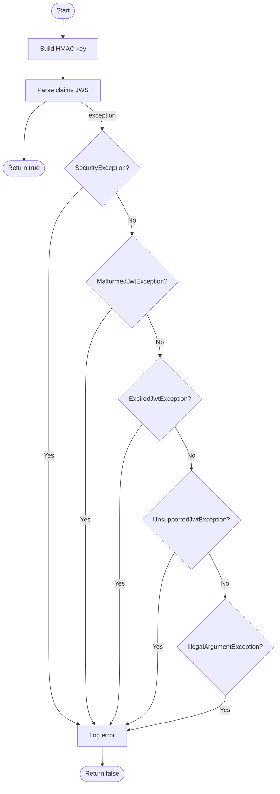

### 2.3 CC va basis paths

| Metric | Value |
|---|---:|
| Nodes `N` | 11 |
| Edges `E` | 16 |
| `V(G)` | `16 - 11 + 2 = 7` |

| TC | Token fixture | Expected |
|---|---|---|
| TC-WB-JWT-01 | Valid signed token | `true` |
| TC-WB-JWT-02 | Token signed by wrong secret | `false` |
| TC-WB-JWT-03 | Malformed string | `false` |
| TC-WB-JWT-04 | Expired token | `false` |
| TC-WB-JWT-05 | Unsupported token | `false` |
| TC-WB-JWT-06 | Empty/null token | `false` |

---

## 3. `RateLimitFilter.doFilter`

### 3.1 Decision/condition

| ID | Condition | True branch | False branch |
|---|---|---|---|
| D1 | path contains `/api/v1/auth/login` | Check method | Pass chain |
| D2 | method POST | Apply rate limit | Pass chain |
| D3 | rate info missing/window expired | Reset count to 1 | Increment count |
| D4 | count > 10 | Return 429 | Continue chain |
| D5 | `X-Forwarded-For` present | Use first forwarded IP | Use remote addr |

### 3.2 CFG

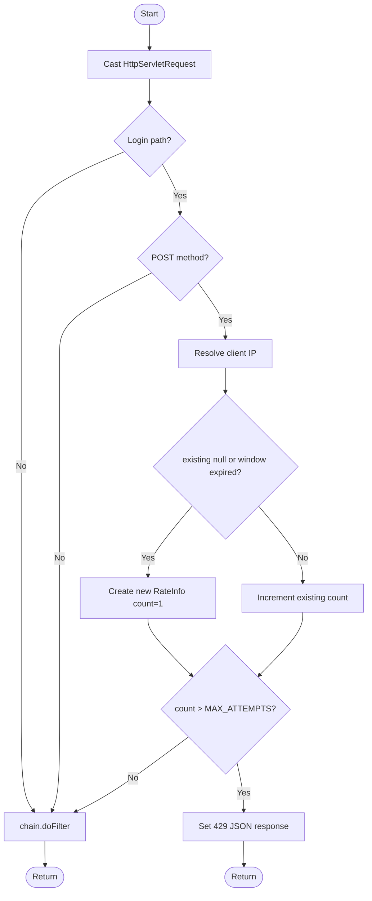

### 3.3 CC va basis paths

| Metric | Value |
|---|---:|
| Nodes `N` | 13 |
| Edges `E` | 17 |
| `V(G)` | `17 - 13 + 2 = 6` |

| TC | Expected |
|---|---|
| TC-WB-RATE-01 | Non-login path -> chain called |
| TC-WB-RATE-02 | Login path but GET -> chain called |
| TC-WB-RATE-03 | First POST login in window -> chain called |
| TC-WB-RATE-04 | 11th POST login same IP -> 429, chain not called |
| TC-WB-RATE-05 | Window expired -> count reset |
| TC-WB-RATE-06 | `X-Forwarded-For: a, b` -> client IP `a` |

---

## 4. `RiskAlertServiceImpl.getRiskAlertDashboard`

### 4.1 Decision/condition

| ID | Condition | True branch | False branch |
|---|---|---|
| D1 | `total > 0` | Calculate high risk percentage | Percentage = 0 |
| D2 | high risk patients present | Map each patient | Empty list |
| D3 | recent alerts present | Map each alert | Empty list |
| D4 | map patient has last metric | Use status/date | Default no data |
| D5 | patient has doctorId | Lookup doctor name | Default unassigned |
| D6 | next appointments empty | nextApp null | first appointment |
| D7 | nextApp before now | overdue true | overdue false |

### 4.2 CFG dashboard rut gon

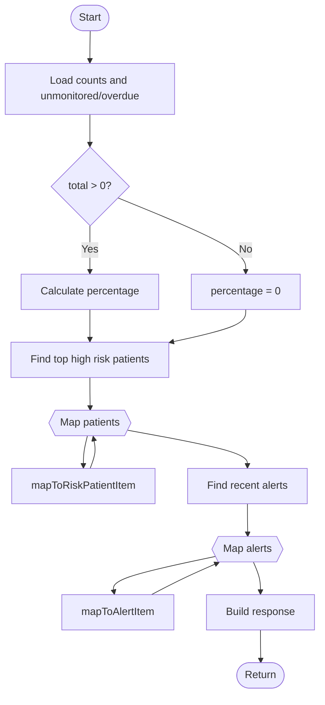

| Metric | Value |
|---|---:|
| Nodes `N` | 13 |
| Edges `E` | 16 |
| `V(G)` | `16 - 13 + 2 = 5` |

### 4.3 `mapToRiskPatientItem` CFG

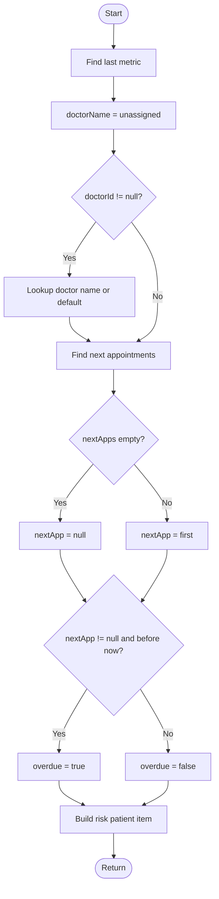

| TC | Expected |
|---|---|
| TC-WB-RISK-01 | total = 0 -> percentage 0 |
| TC-WB-RISK-02 | total > 0 -> percentage computed |
| TC-WB-RISK-03 | patient without metric -> default last metric status |
| TC-WB-RISK-04 | patient with doctorId and doctor exists -> doctor name |
| TC-WB-RISK-05 | doctorId null/missing doctor -> unassigned |
| TC-WB-RISK-06 | no next appointment -> overdue false |
| TC-WB-RISK-07 | next appointment before now -> overdue true |

---

## 5. `RiskAlertServiceImpl.dismissAlert` va `markAlertAsRead`

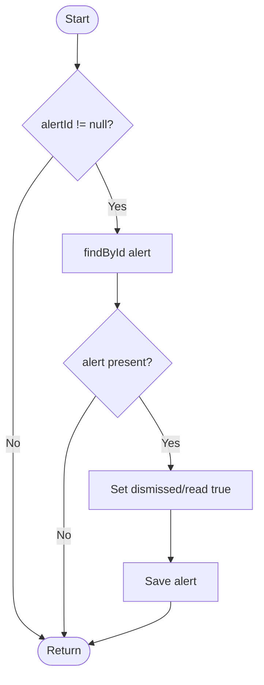

| Path | Expected |
|---|---|
| P1 | `alertId = null` -> no repository action |
| P2 | Alert not found -> no save |
| P3 | Alert found -> flag changed and saved |

---

## 6. `JwtAuthenticationFilter.doFilterInternal`

### 6.1 CFG

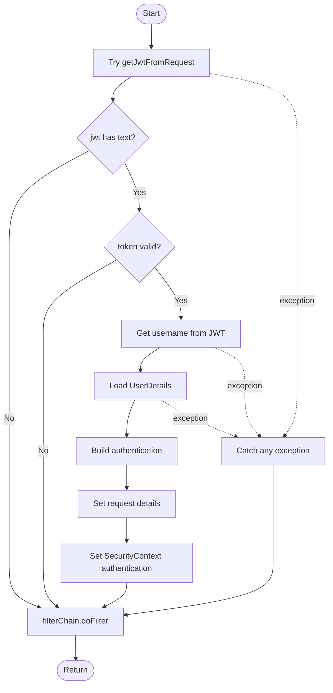

### 6.2 `getJwtFromRequest` CFG

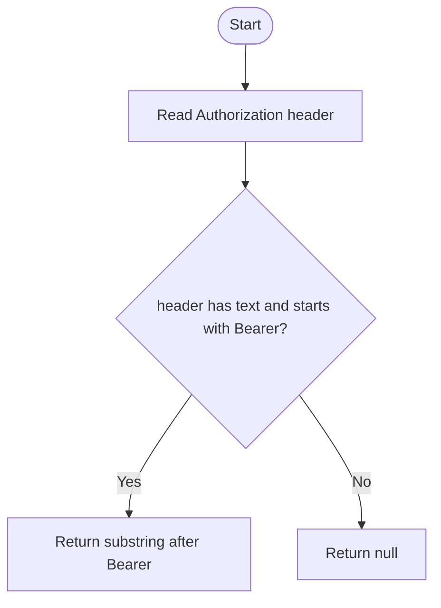

| Path | Expected |
|---|---|
| P1 | No Authorization header -> no auth set, chain continues |
| P2 | Non-Bearer header -> no auth set, chain continues |
| P3 | Bearer token invalid -> no auth set, chain continues |
| P4 | Bearer token valid -> SecurityContext authentication set |
| P5 | Token/user loading throws -> swallowed, chain continues |

---

## 7. `SecurityService.canAccessPatient`

### 7.1 CFG

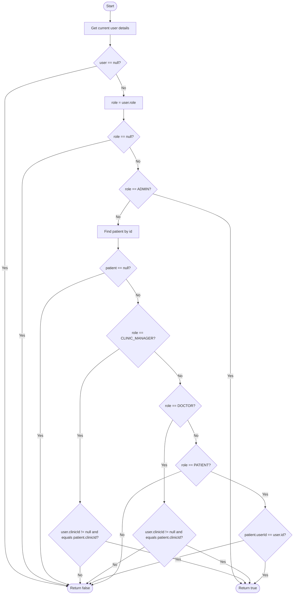

### 7.2 Basis paths

| Path | Expected |
|---|---|
| P1 | No authenticated user -> false |
| P2 | Role null -> false |
| P3 | ADMIN -> true without patient lookup dependency |
| P4 | Patient not found -> false |
| P5 | CLINIC_MANAGER same clinic -> true |
| P6 | CLINIC_MANAGER different/null clinic -> false |
| P7 | DOCTOR same clinic -> true |
| P8 | DOCTOR different/null clinic -> false |
| P9 | PATIENT owns profile -> true |
| P10 | PATIENT not owner -> false |
| P11 | Unknown role -> false |

---

## 8. `SecurityService.isClinicManagerOf`, `isDoctorOfClinic`, `isDoctorSelf`

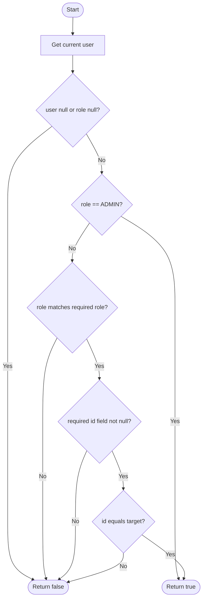

| Method | Required role/id |
|---|---|
| `isClinicManagerOf` | `CLINIC_MANAGER`, compare `user.clinicId` to `clinicId`; ADMIN shortcut true |
| `isDoctorOfClinic` | `DOCTOR`, compare `user.clinicId` to `clinicId`; ADMIN shortcut true |
| `isDoctorSelf` | `DOCTOR`, compare `user.id` to `doctorId`; no ADMIN shortcut in source |

---

## 9. `AuditAspect.logAudit`

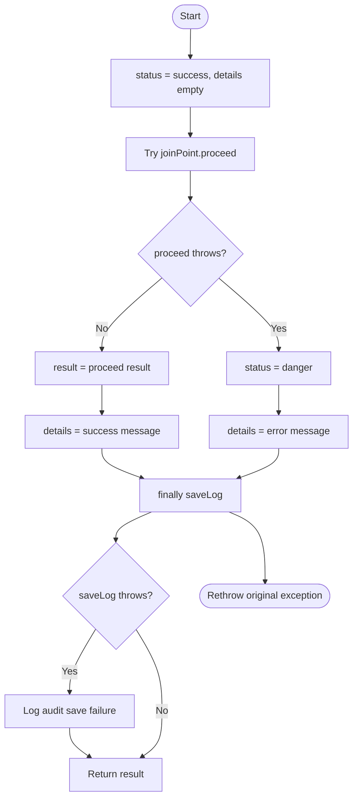

| Path | Expected |
|---|---|
| P1 | Proceed succeeds, audit save succeeds -> returns result |
| P2 | Proceed throws -> audit recorded danger, original exception rethrown |
| P3 | Audit save throws -> error logged, business result/exception flow preserved |

---

## 10. `SupportTicketServiceImpl.createTicket`

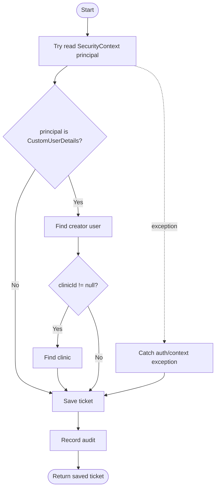

| Path | Expected |
|---|---|
| P1 | Principal CustomUserDetails and clinicId present -> creator/clinic attached |
| P2 | Principal CustomUserDetails but clinicId null -> only creator attached |
| P3 | Principal not expected type -> ticket still saved |
| P4 | SecurityContext access throws -> fallback save still succeeds |

---

## 11. `SupportTicketServiceImpl.updateTicketStatus`

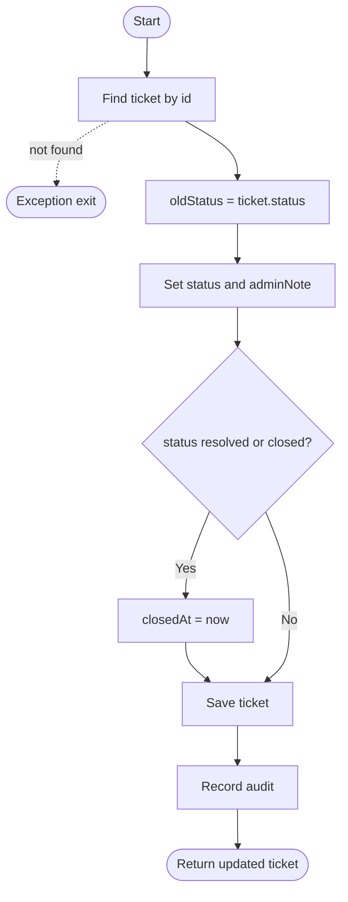

| Path | Expected |
|---|---|
| P1 | Ticket not found -> runtime exception |
| P2 | Status resolved/closed -> `closedAt` set |
| P3 | Other status -> `closedAt` unchanged |

---

## 12. `SupportTicketServiceImpl` filter methods

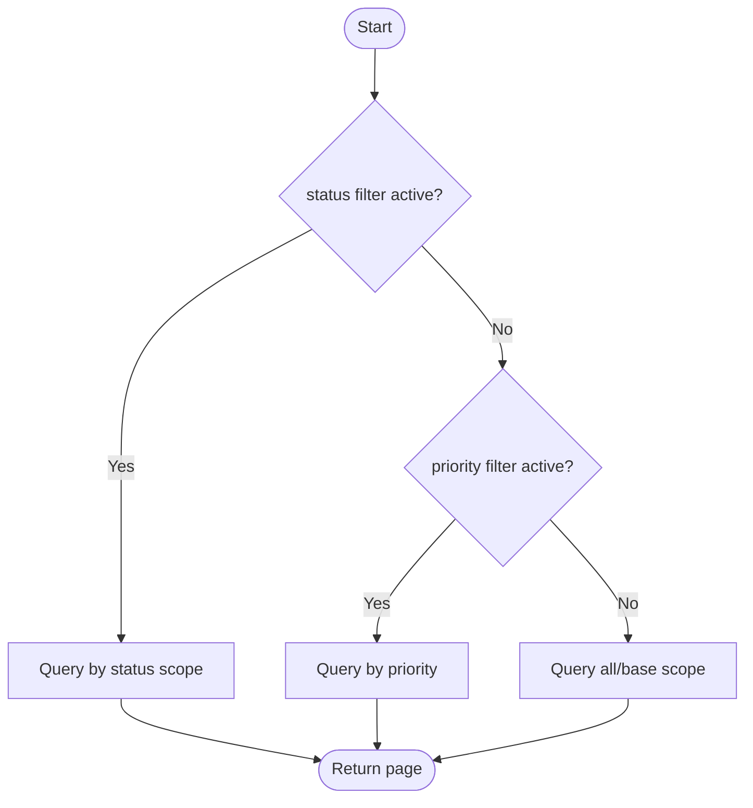

| Method | Branch detail |
|---|---|
| `getTicketsByClinic` | Active status -> `findByClinicIdAndStatus`; otherwise `findByClinicId` |
| `getTicketsByCreator` | Active status -> `findByCreatorIdAndStatus`; otherwise `findByCreatorId` |
| `getAllTickets` | Active status wins; else active priority; else `findAll` |

---

## 13. `NotificationServiceImpl.markAsRead` va `markAllAsRead`

### 13.1 `markAsRead`

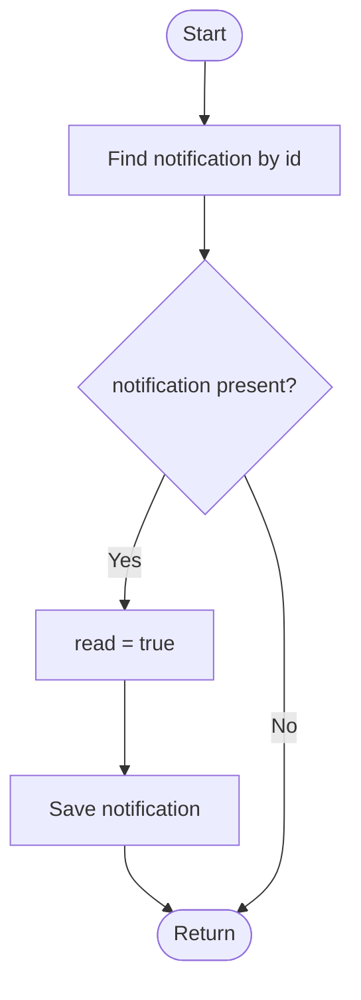

### 13.2 `markAllAsRead`

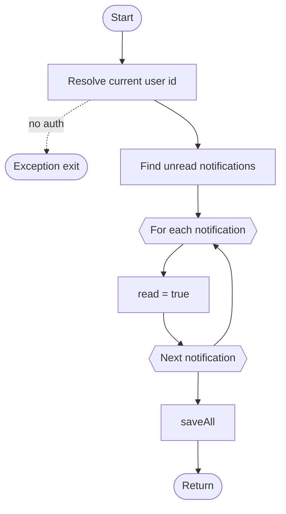

| Path | Expected |
|---|---|
| P1 | `markAsRead` notification missing -> no save |
| P2 | `markAsRead` notification exists -> save read true |
| P3 | `markAllAsRead` no auth -> exception |
| P4 | `markAllAsRead` empty list -> saveAll empty |
| P5 | `markAllAsRead` unread list -> every item read true |

---

## 14. `PrescriptionServiceImpl.getDoctorPrescriptions`

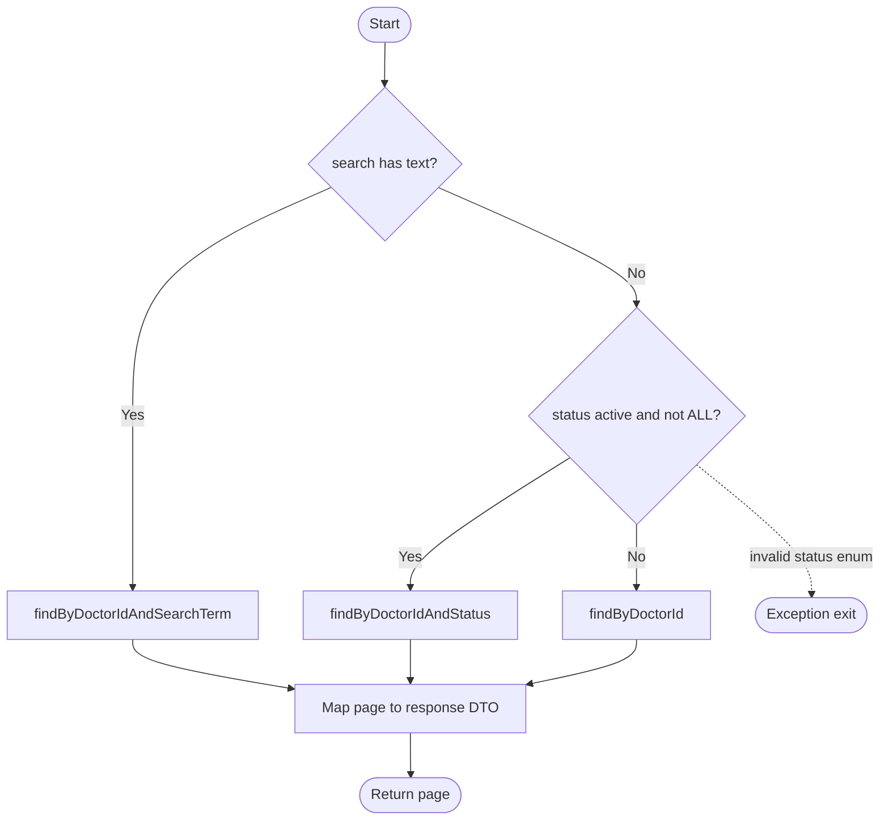

| Path | Expected |
|---|---|
| P1 | Search text present -> search query wins |
| P2 | Status present and not `ALL` -> status query |
| P3 | Empty search/status or status `ALL` -> all doctor prescriptions |
| P4 | Invalid status enum -> `IllegalArgumentException` |

---

## 15. `PrescriptionServiceImpl.createPrescription`

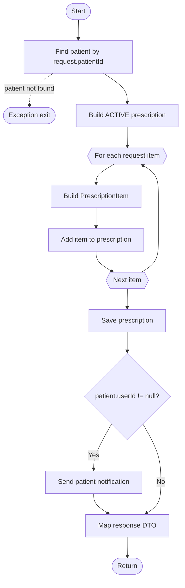

| Path | Expected |
|---|---|
| P1 | Patient not found -> `ResourceNotFoundException` |
| P2 | Empty items -> prescription saved without items; validation gap if controller allows |
| P3 | One or more items -> each item added |
| P4 | Patient has userId -> notification sent |
| P5 | Patient userId null -> no notification |

---

## 16. `PrescriptionServiceImpl.cancelPrescription`

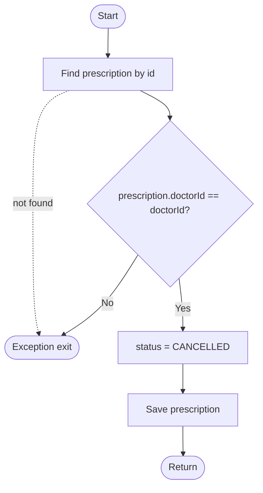

| Path | Expected |
|---|---|
| P1 | Prescription not found -> `ResourceNotFoundException` |
| P2 | Doctor mismatch -> unauthorized |
| P3 | Owner doctor -> status `CANCELLED` saved |

---

## 17. `MedicalServiceServiceImpl.createService`

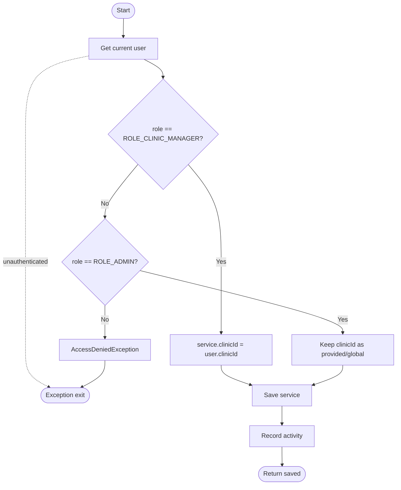

| Path | Expected |
|---|---|
| P1 | Unauthenticated -> runtime exception |
| P2 | Clinic manager -> clinicId forced to manager clinic |
| P3 | Admin -> clinicId retained as provided/global |
| P4 | Other role -> access denied |

---

## 18. `MedicalServiceServiceImpl.validateWriteAccess`

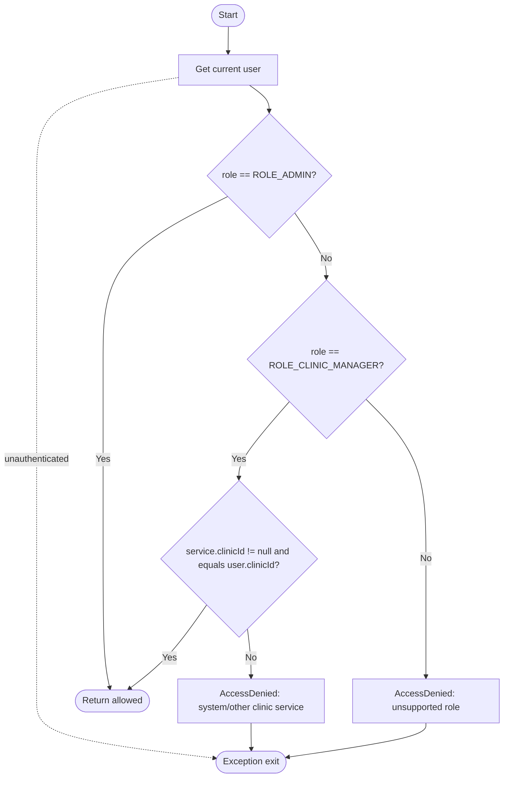

| Path | Expected |
|---|---|
| P1 | Admin -> allowed |
| P2 | Clinic manager owns service -> allowed |
| P3 | Clinic manager on global/other clinic service -> access denied |
| P4 | Other role -> access denied |

---

## 19. `MedicalServiceServiceImpl.toggleStatus`

```mermaid
flowchart TD
    N1([Start])
    N2[Get service by id]
    NX([Exception exit])
    N3[Validate write access]
    N4{status == Dang kinh doanh?}
    N5[newStatus = Ngung kinh doanh]
    N6[newStatus = Dang kinh doanh]
    N7[Set status]
    N8[Save service]
    N9[Record activity]
    NE([Return updated])

    N1 --> N2
    N2 -. not found .-> NX
    N2 --> N3
    N3 -. denied .-> NX
    N3 --> N4
    N4 -- Yes --> N5 --> N7
    N4 -- No --> N6 --> N7
    N7 --> N8 --> N9 --> NE
```

| Path | Expected |
|---|---|
| P1 | Service not found -> runtime exception |
| P2 | Access denied -> exception |
| P3 | Current active -> becomes inactive |
| P4 | Current inactive/other -> becomes active |

---

## 20. `MedicalServiceServiceImpl.getServiceStats`

```mermaid
flowchart TD
    N1([Start])
    N2[Try load all services]
    N3[Count total and active]
    N4[Sum non-null prices]
    N5[Build last 30 days range]
    N6[Try count new patient registrations]
    N7{count query throws?}
    N8[Log count error, keep 0]
    N9[Build full stats response]
    N10{outer block throws?}
    N11[Log stats failure]
    N12[Build fallback response]
    NE([Return])

    N1 --> N2 --> N3 --> N4 --> N5 --> N6 --> N7
    N2 -. exception .-> N10
    N3 -. exception .-> N10
    N4 -. exception .-> N10
    N7 -- Yes --> N8 --> N9
    N7 -- No --> N9
    N9 --> NE
    N10 -- Yes --> N11 --> N12 --> NE
```

| Path | Expected |
|---|---|
| P1 | Normal stats -> totals, active count, total value, new registrations |
| P2 | New registrations query fails -> response still returned with registration count `0` |
| P3 | Outer stats failure -> fallback response with growth `+0%` |
