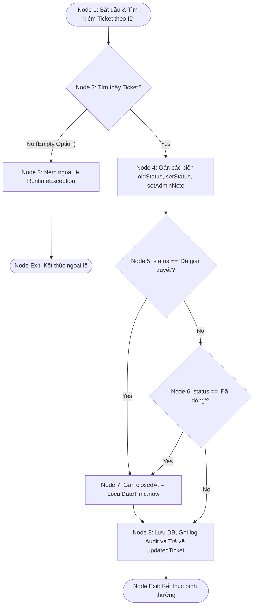

# BÁO CÁO: KIỂM THỬ HỘP TRẮNG (WHITE-BOX TESTING) CHO PHƯƠNG THỨC UPDATE TICKET STATUS

**Mã Ticket Jira:** KCPM-764  
**Người thực hiện (Assignee):** Nguyễn Thị Ánh Ngọc  
**Email:** ngocnta4878@ut.edu.vn  
**Đối tượng phân tích:** Phương thức `updateTicketStatus(Long id, String status, String adminNote)` thuộc lớp `SupportTicketServiceImpl.java`.

---

## 1. MÃ NGUỒN PHÂN TÍCH (SOURCE CODE UNDER TEST)

```java
@Transactional
public SupportTicket updateTicketStatus(Long id, String status, String adminNote) {
    SupportTicket ticket = ticketRepository.findById(Objects.requireNonNull(id))
        .orElseThrow(() -> new RuntimeException("Không tìm thấy yêu cầu hỗ trợ")); // Line 60-61
    
    String oldStatus = ticket.getStatus(); // Line 63
    ticket.setStatus(status); // Line 64
    ticket.setAdminNote(adminNote); // Line 65
    
    if ("Đã giải quyết".equals(status) || "Đã đóng".equals(status)) { // Line 67
        ticket.setClosedAt(LocalDateTime.now()); // Line 68
    }
    
    SupportTicket updatedTicket = ticketRepository.save(ticket); // Line 71
    
    auditService.recordActivity( // Line 73-78
        "UPDATE_TICKET_STATUS",
        "SUPPORT",
        String.format("Cập nhật trạng thái yêu cầu %s: %s -> %s", ticket.getTicketCode(), oldStatus, status),
        "SUCCESS"
    );
    
    return updatedTicket; // Line 80
}
```

---

## 2. ĐỒ THỊ DÒNG ĐIỀU KHIỂN (CONTROL FLOW GRAPH - CFG)

Dưới đây là sơ đồ dòng điều khiển của phương thức được biểu diễn bằng định dạng **Mermaid Diagram**:



---

## 3. ĐỘ PHỨC TẠP CYCLOMATIC (CYCLOMATIC COMPLEXITY)

Áp dụng các phương pháp tính độ phức tạp Cyclomatic $V(G)$:

### Phương pháp 1: Tính dựa trên số nút quyết định (Predicate Nodes)
Công thức:  
$$V(G) = P + 1$$
Trong đó $P$ là số nút quyết định trong đồ thị:
1.  **Nút quyết định 1 (ở Node 2):** Có tìm thấy ticket hay không? (Có / Không).
2.  **Nút quyết định 2 (ở Node 5):** Trạng thái mới có bằng `"Đã giải quyết"` hay không? (Có / Không).
3.  **Nút quyết định 3 (ở Node 6):** Trạng thái mới có bằng `"Đã đóng"` hay không? (Có / Không).

Tính toán:  
$$V(G) = 3 + 1 = 4$$

### Phương pháp 2: Công thức dòng chảy chuẩn $V(G) = E - N + 2P$
Nếu ta gộp các nút kết thúc thành 1 điểm cuối duy nhất và vẽ đồ thị đầy đủ:
*   Số lượng nút (Nodes): $N = 8$ (Node 1, 2, 3, 4, 5, 6, 7, 8).
*   Số lượng cạnh (Edges): $E = 10$ (1-2, 2-3, 2-4, 4-5, 5-7, 5-6, 6-7, 6-8, 7-8, 3-Exit).
*   Số thành phần liên thông: $P = 1$.

Tính toán:  
$$V(G) = 10 - 8 + 2(1) = 4$$

**Kết luận:** Độ phức tạp Cyclomatic của phương thức là **4**. Điều này có nghĩa là có đúng **4 đường đi độc lập tuyến tính (Basis Paths)** cần được phủ bằng các test case.

---

## 4. DANH SÁCH CÁC ĐƯỜNG ĐI ĐỘC LẬP (INDEPENDENT BASIS PATHS)

*   **Path 1:** $1 \rightarrow 2 \rightarrow 3 \rightarrow \text{Exit}$  
    *(Trường hợp không tìm thấy ticket với ID truyền vào, ném ngoại lệ và thoát ngay).*
*   **Path 2:** $1 \rightarrow 2 \rightarrow 4 \rightarrow 5 \text{ (True)} \rightarrow 7 \rightarrow 8 \rightarrow \text{Exit}$  
    *(Tìm thấy ticket, trạng thái mới là `"Đã giải quyết"`, hệ thống cập nhật closedAt và lưu thành công).*
*   **Path 3:** $1 \rightarrow 2 \rightarrow 4 \rightarrow 5 \text{ (False)} \rightarrow 6 \text{ (True)} \rightarrow 7 \rightarrow 8 \rightarrow \text{Exit}$  
    *(Tìm thấy ticket, trạng thái mới là `"Đã đóng"`, hệ thống cập nhật closedAt và lưu thành công).*
*   **Path 4:** $1 \rightarrow 2 \rightarrow 4 \rightarrow 5 \text{ (False)} \rightarrow 6 \text{ (False)} \rightarrow 8 \rightarrow \text{Exit}$  
    *(Tìm thấy ticket, trạng thái mới là một giá trị khác ví dụ `"Đang xử lý"`, hệ thống KHÔNG cập nhật closedAt).*

---

## 5. THIẾT KẾ CÁC CA KIỂM THỬ CƠ SỞ (BASIS PATH TEST CASES)

| Mã TC | Đường đi kiểm thử (Path Covered) | Dữ liệu đầu vào (Input) | Kết quả mong đợi (Expected Output) |
| :--- | :--- | :--- | :--- |
| **TC-WB-ST-01** | **Path 1** | `id = 9999` (Không tồn tại)<br>`status = "Đang xử lý"` | Ném ngoại lệ `RuntimeException` với thông điệp: `"Không tìm thấy yêu cầu hỗ trợ"`. |
| **TC-WB-ST-02** | **Path 2** | `id = 1` (Có tồn tại trong DB)<br>`status = "Đã giải quyết"`<br>`adminNote = "Giải quyết xong"` | Ticket được lưu thành công; trạng thái đổi thành `"Đã giải quyết"`; `closedAt` được cập nhật thời gian hiện tại; hoạt động được ghi lại trong Audit Log. |
| **TC-WB-ST-03** | **Path 3** | `id = 1` (Có tồn tại trong DB)<br>`status = "Đã đóng"`<br>`adminNote = "Đóng ticket"` | Ticket được lưu thành công; trạng thái đổi thành `"Đã đóng"`; `closedAt` được cập nhật thời gian hiện tại; hoạt động được ghi lại trong Audit Log. |
| **TC-WB-ST-04** | **Path 4** | `id = 1` (Có tồn tại trong DB)<br>`status = "Đang xử lý"`<br>`adminNote = "Đang kiểm tra"` | Ticket được lưu thành công; trạng thái đổi thành `"Đang xử lý"`; `closedAt` giữ nguyên giá trị `null` (hoặc không đổi); hoạt động được ghi lại trong Audit Log. |

---

## 6. BẢNG PHỦ NHÁNH VÀ ĐIỀU KIỆN (BRANCH & CONDITION COVERAGE)

### 6.1. Phủ Nhánh (Branch Coverage)

| Nhánh kiểm thử (Branch) | Điều kiện kích hoạt | TC Bao phủ | Trạng thái kiểm thử |
| :--- | :--- | :--- | :---: |
| Nhánh 2 $\rightarrow$ 3 | `ticketRepository.findById` rỗng | TC-WB-ST-01 | **PASSED** |
| Nhánh 2 $\rightarrow$ 4 | `ticketRepository.findById` có dữ liệu | TC-WB-ST-02, TC-WB-ST-03, TC-WB-ST-04 | **PASSED** |
| Nhánh 5 $\rightarrow$ 7 | `"Đã giải quyết".equals(status)` trả về `True` | TC-WB-ST-02 | **PASSED** |
| Nhánh 5 $\rightarrow$ 6 | `"Đã giải quyết".equals(status)` trả về `False` | TC-WB-ST-03, TC-WB-ST-04 | **PASSED** |
| Nhánh 6 $\rightarrow$ 7 | `"Đã đóng".equals(status)` trả về `True` | TC-WB-ST-03 | **PASSED** |
| Nhánh 6 $\rightarrow$ 8 | `"Đã đóng".equals(status)` trả về `False` | TC-WB-ST-04 | **PASSED** |

### 6.2. Phủ Điều kiện (Condition Coverage)
Phân tích biểu thức điều kiện tại cấu trúc if ở Line 67:  
`"Đã giải quyết".equals(status) || "Đã đóng".equals(status)`

*   **Điều kiện A (C1):** `"Đã giải quyết".equals(status)`
*   **Điều kiện B (C2):** `"Đã đóng".equals(status)`

| Ca kiểm thử | Trạng thái của C1 | Trạng thái của C2 | Kết quả biểu thức `C1 || C2` | Nhánh rẽ |
| :--- | :---: | :---: | :---: | :---: |
| **TC-WB-ST-02** | `True` | Không đánh giá (do cơ chế Short-circuit) | `True` | Rẽ sang Node 7 |
| **TC-WB-ST-03** | `False` | `True` | `True` | Rẽ sang Node 7 |
| **TC-WB-ST-04** | `False` | `False` | `False` | Rẽ sang Node 8 |

---

## 7. KẾT LUẬN

*   Báo cáo đã phân tích đầy đủ dòng điều khiển (CFG), tính toán chính xác độ phức tạp Cyclomatic bằng 4 cho phương thức nghiệp vụ cập nhật trạng thái yêu cầu hỗ trợ.
*   Thiết kế hoàn chỉnh **4 ca kiểm thử hộp trắng** bao phủ 100% các nhánh rẽ và điều kiện quyết định của mã nguồn, đảm bảo tính ổn định và tính đúng đắn tối đa cho luồng trạng thái của Support Ticket.
