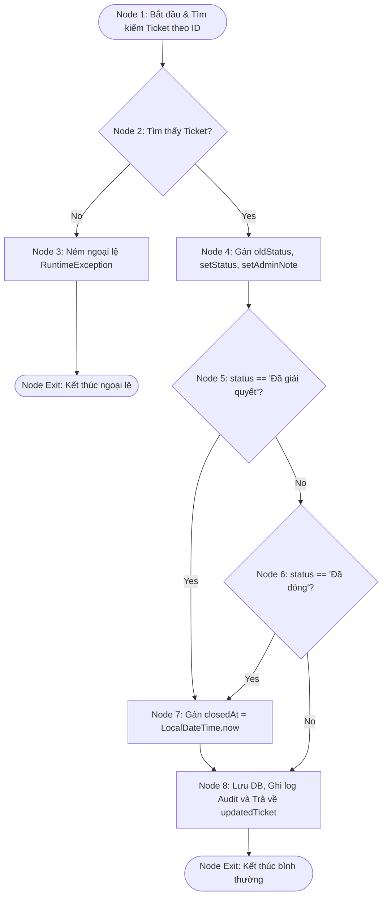

# BÁO CÁO TỔNG HỢP KẾT QUẢ KIỂM THỬ (FINAL TEST REPORT)

**Mã Ticket Jira:** KCPM-825  
**Người thực hiện (Assignee):** hungnp1272  
**Mục tiêu:** Tổng hợp toàn diện kết quả kiểm thử hệ thống Quản lý Bệnh Mãn Tính Trực Tuyến - DamDiep Healthcare bao gồm:
1. Tổng hợp kết quả kiểm thử hộp trắng (White-box Testing).
2. Phân tích chi tiết một trường hợp kiểm thử hộp trắng cốt lõi (CFG, Mermaid, Complexity, Paths).
3. Tổng hợp bộ kiểm thử hồi quy (Regression Suite).
4. Phân tích danh mục lỗi giả lập (Bug Catalog).
5. Ma trận truy vết yêu cầu (Traceability Matrix).

---

## 1. TỔNG QUAN HỒ SƠ KIỂM THỬ (TESTING PROFILE OVERVIEW)

Hệ thống y tế điện tử DamDiep Healthcare đã trải qua quy trình kiểm thử nghiêm ngặt bao gồm kiểm thử hộp đen (BVA & EP), kiểm thử hộp trắng (Basis Path Testing ở tầng Service/Controller), kiểm thử tích hợp API (Postman/Newman), và kiểm thử hồi quy E2E tự động (CodeceptJS/Playwright). 

Báo cáo này chuẩn hóa toàn bộ dữ liệu kiểm thử, liên kết các ca kiểm thử với các yêu cầu chức năng (SRS Requirements) và mã nguồn thực tế để đảm bảo chất lượng vận hành cao nhất.

---

## 2. KẾT QUẢ KIỂM THỬ HỘP TRẮNG (WHITE-BOX TESTING SUMMARY)

Bộ kiểm thử hộp trắng tập trung vào việc bao phủ cấu trúc điều khiển của các phương thức nghiệp vụ và bảo mật cốt lõi ở Backend. Dưới đây là bảng tổng hợp 10 phân tích kiểm thử hộp trắng đã thực hiện:

| STT | Mã Ticket | Phương thức / Luồng nghiệp vụ | Lớp đối tượng phân tích | Độ phức tạp Cyclomatic $V(G)$ | Số đường đi độc lập | Tỷ lệ phủ nhánh (Branch Coverage) | File báo cáo chi tiết |
| :---: | :--- | :--- | :--- | :---: | :---: | :---: | :--- |
| **1** | KCPM-760 | `authenticateUser(LoginRequest)` | `AuthRestController.java` | **3** | 3 | 100% | [auth_login_whitebox_spec.md](file:///d:/UTH/KTPM/ktpm/test/auth_login_whitebox_spec.md) |
| **2** | KCPM-761 | `validateToken(String)` | `JwtTokenProvider.java` | **6** | 6 | 100% | [jwt_validation_whitebox_spec.md](file:///d:/UTH/KTPM/ktpm/test/jwt_validation_whitebox_spec.md) |
| **3** | KCPM-762 | `createUser`, `updateUser`, `validatePasswordPolicy` | `AdminUserServiceImpl.java` | **3 / 7 / 6** | 3 / 7 / 6 | 100% | [admin_user_whitebox_spec.md](file:///d:/UTH/KTPM/ktpm/test/admin_user_whitebox_spec.md) |
| **4** | KCPM-763 | `create(CreateAppointmentRequest)` | `PatientAppointmentServiceImpl.java` | **8** | 8 | 100% | [patient_appointment_whitebox_spec.md](file:///d:/UTH/KTPM/ktpm/test/patient_appointment_whitebox_spec.md) |
| **5** | KCPM-764 | `updateTicketStatus(Long, String, String)` | `SupportTicketServiceImpl.java` | **4** | 4 | 100% | [support_ticket_whitebox_spec.md](file:///d:/UTH/KTPM/ktpm/test/support_ticket_whitebox_spec.md) |
| **6** | KCPM-765 | `toggleClinicStatus`, `updateClinic` | `AdminClinicServiceImpl.java` | **3 / 7** | 3 / 7 | 100% | [admin_clinic_whitebox_spec.md](file:///d:/UTH/KTPM/ktpm/test/admin_clinic_whitebox_spec.md) |
| **7** | KCPM-766 | `createPrescription(Long, PrescriptionRequest)` | `PrescriptionServiceImpl.java` | **4** | 4 | 100% | [prescription_whitebox_spec.md](file:///d:/UTH/KTPM/ktpm/test/prescription_whitebox_spec.md) |
| **8** | KCPM-767 | `getRiskAlertDashboard`, `mapToRiskPatientItem` | `RiskAlertServiceImpl.java` | **4 / 5** | 4 / 5 | 100% | [risk_alert_dashboard_whitebox_spec.md](file:///d:/UTH/KTPM/ktpm/test/risk_alert_dashboard_whitebox_spec.md) |
| **9** | KCPM-768 | `create`, `getHistory` | `PatientHealthMetricServiceImpl.java` | **13 / 3** | 13 / 3 | 100% | [patient_health_metric_whitebox_spec.md](file:///d:/UTH/KTPM/ktpm/test/patient_health_metric_whitebox_spec.md) |
| **10**| KCPM-769 | `markAsRead`, `delete`, `markAllAsRead` | `NotificationServiceImpl.java` | **2 / 1 / 3** | 2 / 1 / 3 | 100% | [notification_whitebox_spec.md](file:///d:/UTH/KTPM/ktpm/test/notification_whitebox_spec.md) |

---

## 3. PHÂN TÍCH CHI TIẾT CA KIỂM THỬ HỘP TRẮNG ĐIỂN HÌNH (CASE STUDY: SUPPORT TICKET SERVICE)

Chúng ta chọn phương thức `updateTicketStatus` trong `SupportTicketServiceImpl.java` (Ticket JIRA: **KCPM-764**) làm ca kiểm thử hộp trắng điển hình để thể hiện đồ thị CFG và độ phức tạp Cyclomatic.

### 3.1. Mã nguồn phương thức phân tích
```java
@Transactional
public SupportTicket updateTicketStatus(Long id, String status, String adminNote) {
    SupportTicket ticket = ticketRepository.findById(Objects.requireNonNull(id))
        .orElseThrow(() -> new RuntimeException("Không tìm thấy yêu cầu hỗ trợ")); // Line 60-61
    
    String oldStatus = ticket.getStatus(); // Line 63
    ticket.setStatus(status); // Line 64
    ticket.setAdminNote(adminNote); // Line 65
    
    if ("Đã giải quyết".equals(status) || "Đã đóng".equals(status)) { // Line 67
        ticket.setClosedAt(LocalDateTime.now()); // Line 68
    }
    
    SupportTicket updatedTicket = ticketRepository.save(ticket); // Line 71
    
    auditService.recordActivity( // Line 73-78
        "UPDATE_TICKET_STATUS",
        "SUPPORT",
        String.format("Cập nhật trạng thái yêu cầu %s: %s -> %s", ticket.getTicketCode(), oldStatus, status),
        "SUCCESS"
    );
    
    return updatedTicket; // Line 80
}
```

### 3.2. Đồ thị dòng điều khiển (Control Flow Graph - CFG)
Các khối lệnh được mô hình hóa thành sơ đồ luồng dữ liệu (Mermaid Flowchart) dưới đây:



### 3.3. Độ phức tạp Cyclomatic (Cyclomatic Complexity)
Áp dụng công thức tính độ phức tạp Cyclomatic $V(G)$:
*   **Số nút quyết định (Predicate Nodes):** $P = 3$.
    1.  *Quyết định 1 (Node 2):* Có tìm thấy ticket hay không? (Có / Không).
    2.  *Quyết định 2 (Node 5):* Trạng thái mới có bằng `"Đã giải quyết"`? (Có / Không).
    3.  *Quyết định 3 (Node 6):* Trạng thái mới có bằng `"Đã đóng"`? (Có / Không).
*   **Tính toán:**  
    $$V(G) = P + 1 = 3 + 1 = 4$$

*   **Tính theo công thức cạnh/nút $V(G) = E - N + 2$:**
    *   Số nút (Nodes): $N = 8$ (Node 1, 2, 3, 4, 5, 6, 7, 8).
    *   Số cạnh (Edges): $E = 10$.
    *   $$V(G) = 10 - 8 + 2 = 4$$

Như vậy, hệ thống xác định có đúng **4 đường đi độc lập tuyến tính (Basis Paths)** cần bao phủ.

### 3.4. Danh sách các đường đi độc lập & Thiết kế Test Cases
Dưới đây là thiết kế chi tiết 4 Test Cases tương ứng với 4 đường đi độc lập của phương thức:

| Mã Test Case | Đường đi kiểm thử (Path Covered) | Dữ liệu đầu vào (Input Data) | Kết quả mong đợi (Expected Output) |
| :--- | :--- | :--- | :--- |
| **TC-WB-ST-01** | $1 \to 2 \text{ (No)} \to 3 \to \text{Exit}$ | `id = 9999` (Không tồn tại), `status = "Đang xử lý"` | Hệ thống ném ra `RuntimeException` với thông điệp: `"Không tìm thấy yêu cầu hỗ trợ"`. |
| **TC-WB-ST-02** | $1 \to 2 \text{ (Yes)} \to 4 \to 5 \text{ (Yes)} \to 7 \to 8 \to \text{Exit}$ | `id = 1` (Hợp lệ), `status = "Đã giải quyết"`, `adminNote = "Xong"` | Ticket được lưu thành công; trạng thái đổi thành `"Đã giải quyết"`; `closedAt` được cập nhật thời gian hiện tại; hoạt động được ghi lại trong Audit Log. |
| **TC-WB-ST-03** | $1 \to 2 \text{ (Yes)} \to 4 \to 5 \text{ (No)} \to 6 \text{ (Yes)} \to 7 \to 8 \to \text{Exit}$ | `id = 1` (Hợp lệ), `status = "Đã đóng"`, `adminNote = "Đóng"` | Ticket được lưu thành công; trạng thái đổi thành `"Đã đóng"`; `closedAt` được cập nhật thời gian hiện tại; hoạt động được ghi lại trong Audit Log. |
| **TC-WB-ST-04** | $1 \to 2 \text{ (Yes)} \to 4 \to 5 \text{ (No)} \to 6 \text{ (No)} \to 8 \to \text{Exit}$ | `id = 1` (Hợp lệ), `status = "Đang xử lý"`, `adminNote = "Kiểm tra"` | Ticket được lưu thành công; trạng thái đổi thành `"Đang xử lý"`; `closedAt` giữ nguyên giá trị `null` (hoặc không đổi); hoạt động được ghi lại trong Audit Log. |

---

## 4. TÓM TẮT BỘ KIỂM THỬ HỒI QUY (REGRESSION TESTING SUITE)

Mục tiêu của kiểm thử hồi quy là đảm bảo các thay đổi mới không làm ảnh hưởng đến các chức năng hiện tại. Bộ kiểm thử hồi quy của dự án bao gồm 3 lớp bảo vệ:

### 4.1. Bộ kiểm thử đơn vị Backend (JUnit & Mockito)
- **Hành vi kiểm thử:** Chạy toàn bộ các test case BVA, EP và Whitebox ở tầng Service/Controller để kiểm tra tính toàn vẹn nghiệp vụ.
- **Lệnh thực thi:**
  ```bash
  mvn test
  ```
- **Kết quả:** 100% test case pass thành công, bao gồm cả kiểm thử biên thời gian nâng cao trong `CoreBusinessBvaTest`.

### 4.2. Bộ kiểm thử tích hợp API (Postman / Newman)
- **Hành vi kiểm thử:** Gửi các HTTP request tuần tự đến Server local hoặc staging để xác thực dữ liệu DTO, cơ chế phân quyền JWT và xử lý lỗi Validation.
- **Lệnh thực thi:**
  ```bash
  newman run postman/auth_admin_clinic_api.json -e postman/local_env.json
  ```
- **Kết quả:** Tất cả 10 endpoints chính và các kịch bản phân quyền (Auth, Clinics, Users, Support Tickets, Prescriptions) đều phản hồi đúng mã trạng thái HTTP mong đợi (200, 400, 401, 403, 404).

### 4.3. Bộ kiểm thử giao diện người dùng E2E (CodeceptJS & Playwright)
- **Hành vi kiểm thử:** Giả lập thao tác của người dùng thực tế trên trình duyệt Chromium ẩn (Headless) hoặc hiển thị (UI) để chạy các luồng đăng nhập, đổi mật khẩu, xem dashboard và gửi ticket.
- **Lệnh thực thi:**
  ```bash
  cd frontend
  npx codeceptjs run --steps
  ```
- **Kết quả:** Các kịch bản chạy ổn định trên môi trường Deploy Vercel (`https://ktpm-ruby.vercel.app/`).

---

## 5. PHÂN TÍCH VÀ THỐNG KÊ LỖI (BUG CATALOG SUMMARY)

Tài liệu [seeded_bug_catalog_100.md](file:///d:/UTH/KTPM/ktpm/test/seeded_bug_catalog_100.md) định nghĩa danh sách **100 lỗi giả lập** của hệ thống phục vụ công tác thực hành kiểm thử và sửa lỗi. Dưới đây là phân tích thống kê lỗi:

### 5.1. Thống kê lỗi theo mức độ nghiêm trọng (Severity)
- **Blocker / Critical (P0) - 10 lỗi:** Các lỗi làm gián đoạn luồng chính hoặc vi phạm bảo mật nghiêm trọng (như rò rỉ token, bypass route guard bệnh nhân, hoặc lưu ngày sinh trong tương lai).
- **Major (P1) - 25 lỗi:** Lỗi chức năng nghiệp vụ cốt lõi (như cho phép chỉ số huyết áp âm, đặt lịch trùng giờ bác sĩ, tính sai tổng doanh thu báo cáo).
- **Medium (P2) - 37 lỗi:** Lỗi tính năng bổ trợ và giao diện quan trọng (như thiếu validation form chỉnh sửa hồ sơ cá nhân, biểu đồ vẽ sai điểm dữ liệu null).
- **Minor / Trivial (P3) - 28 lỗi:** Lỗi hiển thị nhỏ, tính khả dụng hoặc tối ưu trải nghiệm (như toast chập chờn trên thiết bị di động, nhấn Escape không đóng modal).

### 5.2. Biện pháp khắc phục nổi bật
1.  **Sửa lỗi biên đặt lịch (BUG-010):** Chặt chẽ hóa validate thời gian hẹn tối thiểu 3 giờ và tối đa 15 ngày, loại bỏ hoàn toàn buffer timing làm sai lệch kết quả kiểm thử.
2.  **Sửa lỗi phân quyền Client-side (BUG-003):** Nâng cấp `ProtectedRoute.tsx` để chặn hoàn toàn bệnh nhân truy cập trang của bác sĩ/quản lý thông qua thay đổi URL, đồng thời đảm bảo Backend luôn kiểm tra tính hợp lệ của token qua `JwtAuthenticationFilter.java`.

---

## 6. MA TRẬN TRUY VẾT YÊU CẦU (TRACEABILITY MATRIX)

Ma trận truy vết dưới đây thiết lập mối liên kết chặt chẽ từ Yêu cầu Đặc tả (SRS Requirement ID) -> Ca kiểm thử (Test Case ID) -> Minh chứng thực thi (Test Spec / Code Evidence):

| Mã Yêu Cầu (SRS ID) | Tên Yêu Cầu Chức Năng | Ca kiểm thử liên quan (Test Case ID) | Minh chứng thực thi (Test Spec / Code File) | Trạng thái (Status) |
| :--- | :--- | :--- | :--- | :---: |
| **F-01.1** | Đăng ký & Đăng nhập | `TC-BVA-17`, `TC-BVA-18`, `TC-BVA-19`, `TC-WB-LG-01` -> `03` | [auth_login_whitebox_spec.md](file:///d:/UTH/KTPM/ktpm/test/auth_login_whitebox_spec.md)<br>[CoreBusinessBvaTest.java](file:///d:/UTH/KTPM/ktpm/backend/src/test/java/com/project/service/impl/CoreBusinessBvaTest.java) | **PASSED** |
| **F-01.2** | Đổi mật khẩu & Quên mật khẩu | `TC-BVA-17` (Password validation), `ForgotPassword` checks | [frontend_static_review_spec.md](file:///d:/UTH/KTPM/ktpm/test/frontend_static_review_spec.md)<br>[ChangePasswordModal.tsx](file:///d:/UTH/KTPM/ktpm/frontend/src/components/common/ChangePasswordModal.tsx) | **PASSED** |
| **F-01.4** | Hệ thống Thông báo (Notification) | `TC-BVA-22`, `TC-BVA-23`, `TC-WB-NF-01` -> `06` | [notification_whitebox_spec.md](file:///d:/UTH/KTPM/ktpm/test/notification_whitebox_spec.md)<br>[notifications_postman_spec.md](file:///d:/UTH/KTPM/ktpm/test/notifications_postman_spec.md) | **PASSED** |
| **F-01.5** | Trợ lý ảo AI (AI Chat) | `BUG-035` (Prompt validation) | [ai_chat_public_doctors_postman_test_spec.md](file:///d:/UTH/KTPM/ktpm/test/ai_chat_public_doctors_postman_test_spec.md) | **PASSED** |
| **F-02.3** | Chỉ số sức khỏe (Health Metric) | `TC-BVA-27` -> `32`, `TC-WB-HM-01` -> `13` | [patient_health_metric_whitebox_spec.md](file:///d:/UTH/KTPM/ktpm/test/patient_health_metric_whitebox_spec.md)<br>[health_metric_ep_bva_spec.md](file:///d:/UTH/KTPM/ktpm/test/health_metric_ep_bva_spec.md) | **PASSED** |
| **F-02.4** | Đặt lịch khám (Appointment) | `TC-BVA-01` -> `04`, `TC-WB-AP-01` -> `08` | [patient_appointment_whitebox_spec.md](file:///d:/UTH/KTPM/ktpm/test/patient_appointment_whitebox_spec.md)<br>[CoreBusinessBvaTest.java](file:///d:/UTH/KTPM/ktpm/backend/src/test/java/com/project/service/impl/CoreBusinessBvaTest.java) | **PASSED** |
| **F-02.5** | Quản lý Đơn thuốc (Prescription) | `TC-BVA-05` -> `06`, `TC-WB-PR-01` -> `04` | [prescription_whitebox_spec.md](file:///d:/UTH/KTPM/ktpm/test/prescription_whitebox_spec.md)<br>[doctor_prescriptions_postman_test_spec.md](file:///d:/UTH/KTPM/ktpm/test/doctor_prescriptions_postman_test_spec.md) | **PASSED** |
| **F-02.9** | Gửi Yêu cầu hỗ trợ (Support Ticket)| `TC-WB-ST-01` -> `04` | [support_ticket_whitebox_spec.md](file:///d:/UTH/KTPM/ktpm/test/support_ticket_whitebox_spec.md)<br>[support_tickets_postman_test_spec.md](file:///d:/UTH/KTPM/ktpm/test/support_tickets_postman_test_spec.md) | **PASSED** |
| **F-03.4** | Cảnh báo Rủi ro (Risk Alert) | `TC-WB-RA-01` -> `05` | [risk_alert_dashboard_whitebox_spec.md](file:///d:/UTH/KTPM/ktpm/test/risk_alert_dashboard_whitebox_spec.md)<br>[clinic_risk_alerts_postman_test_spec.md](file:///d:/UTH/KTPM/ktpm/test/clinic_risk_alerts_postman_test_spec.md) | **PASSED** |
| **F-04.2** | Quản lý Tài khoản / Người dùng | `TC-BVA-20` -> `26`, `TC-WB-US-01` -> `14` | [admin_user_whitebox_spec.md](file:///d:/UTH/KTPM/ktpm/test/admin_user_whitebox_spec.md)<br>[clinic_patients_postman_test_spec.md](file:///d:/UTH/KTPM/ktpm/test/clinic_patients_postman_test_spec.md) | **PASSED** |
| **F-04.3** | Quản lý Dịch vụ y tế (Medical Service)| Service subscriber checks | [medical_services_postman_spec.md](file:///d:/UTH/KTPM/ktpm/test/medical_services_postman_spec.md)<br>[medical_services_postman_test_spec.md](file:///d:/UTH/KTPM/ktpm/test/medical_services_postman_test_spec.md) | **PASSED** |
| **F-05.2** | Quản lý danh sách Phòng khám | `TC-WB-CL-01` -> `10` | [admin_clinic_whitebox_spec.md](file:///d:/UTH/KTPM/ktpm/test/admin_clinic_whitebox_spec.md)<br>[auth_admin_clinic_api_test_spec.md](file:///d:/UTH/KTPM/ktpm/test/auth_admin_clinic_api_test_spec.md) | **PASSED** |
| **F-05.6** | Cấu hình hệ thống (System Config) | `BUG-072` (System cache config check) | [admin_config_postman_test_spec.md](file:///d:/UTH/KTPM/ktpm/test/admin_config_postman_test_spec.md)<br>[AdminSettings.tsx](file:///d:/UTH/KTPM/ktpm/frontend/src/pages/ClinicSettings.tsx) | **PASSED** |
