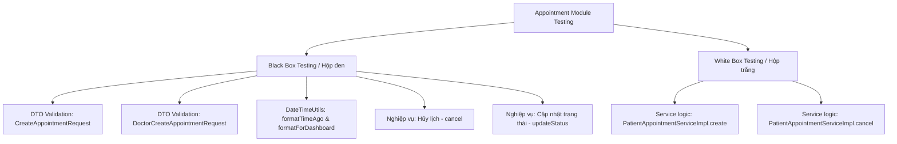

# ĐẶC TẢ KỊCH BẢN KIỂM THỬ (TEST SPECIFICATION) - PHÂN HỆ APPOINTMENT MANAGEMENT

Tài liệu này đặc tả các ca kiểm thử hộp đen (Black Box Testing) cho **phân hệ Quản lý lịch hẹn (Appointment Management)** phục vụ môn học Kiểm thử phần mềm. Tài liệu áp dụng kỹ thuật **Phân vùng tương đương (Equivalence Partitioning)** và **Phân tích giá trị biên (Boundary Value Analysis - BVA)** trên các ràng buộc dữ liệu đầu vào, quy tắc nghiệp vụ trạng thái và tiện ích xử lý thời gian.

Tài liệu được viết dưới định dạng Markdown (`.md`) để hiển thị trực quan dưới dạng bảng biểu trên GitHub/GitLab.

**Phạm vi mã nguồn:**

| Thành phần | Class / File |
| :--- | :--- |
| API Bệnh nhân | `PatientAppointmentController` |
| API Bác sĩ | `DoctorAppointmentController` |
| Nghiệp vụ | `PatientAppointmentServiceImpl`, `DoctorAppointmentServiceImpl` |
| DTO | `CreateAppointmentRequest`, `DoctorCreateAppointmentRequest` |
| Entity / Enum | `Appointment`, `AppointmentStatus` |
| Tiện ích | `DateTimeUtils` |

---

## 🗺️ Sơ đồ thiết kế kiểm thử (Test Strategy Overview)

---

## 1. Phân tích ràng buộc và vùng tương đương

### 1.1. `CreateAppointmentRequest` — Bệnh nhân đặt lịch

| Trường | Ràng buộc | Vùng hợp lệ (Valid) | Vùng không hợp lệ (Invalid) |
| :--- | :--- | :--- | :--- |
| `doctorId` | `@NotNull` | Long > 0, ID tồn tại trong DB | `null` |
| `appointmentTime` | `@NotNull` | `LocalDateTime` hợp lệ (ISO-8601) | `null`, chuỗi parse lỗi |
| `appointmentType` | `@NotBlank` | `"IN_PERSON"`, `"ONLINE"` | `null`, `""`, `"  "`, giá trị khác enum |

**Giá trị biên:** ranh giới null/không-null; blank/non-blank; biên thời gian `T00:00` và `T23:59`.

---

### 1.2. `DoctorCreateAppointmentRequest` — Bác sĩ tạo / dời lịch

| Trường | Ràng buộc | Vùng hợp lệ (Valid) | Vùng không hợp lệ (Invalid) |
| :--- | :--- | :--- | :--- |
| `patientId` | `@NotNull` | Long hợp lệ, bệnh nhân tồn tại | `null` |
| `appointmentDate` | `@NotBlank` + parse `yyyy-MM-dd` | `"2026-06-26"` | `null`, `""`, `"26-06-2026"`, `"2026-13-01"` |
| `appointmentTime` | `@NotBlank` + parse `HH:mm` | `"00:00"` … `"23:59"` | `null`, `""`, `"24:00"`, `"9:00"` |
| `type` | `@NotBlank` | `"ONLINE"`, `"OFFLINE"` | `null`, `""` |
| `meetingLink` | Tùy chọn | URL không rỗng | `""` (dùng fallback mặc định) |

**Giá trị biên thời gian:** `00:00`, `23:59`, `24:00` (invalid); ngày cuối/tháng (`2026-06-30`, `2026-07-01`).

---

### 1.3. `DateTimeUtils.formatTimeAgo()` — Ngưỡng thời gian

| Vùng | Điều kiện (giây) | Giá trị biên |
| :--- | :--- | :--- |
| V0 – Null | `time == null` | `null` |
| V1 – Giây | `[0, 59]` | 0, 59, **60** |
| V2 – Phút | `[60, 3599]` | 59, **60**, 3599, **3600** |
| V3 – Giờ | `[3600, 86399]` | 3599, **3600**, 86399, **86400** |
| V4 – Ngày | `≥ 86400` | 86399, **86400**, 172800 |

---

### 1.4. `DateTimeUtils.formatForDashboard()` — Ngưỡng ngày

| Vùng | Điều kiện | Giá trị biên |
| :--- | :--- | :--- |
| Null | `dateTime == null` | `null` |
| Hôm nay | `date == today` | `today 00:00`, `today 23:59` |
| Ngày mai | `date == today + 1` | `today+1 00:00` |
| Khác | còn lại | `today+2`, `today-1` |

---

### 1.5. Quy tắc hủy lịch — `PatientAppointmentServiceImpl.cancel()`

| Trạng thái (`AppointmentStatus`) | Hành vi |
| :--- | :--- |
| `PENDING` | **Cho phép hủy** → chuyển sang `CANCELLED` |
| `SCHEDULED` | **Từ chối** — đã được bác sĩ xác nhận |
| `COMPLETED` | **Từ chối** — lịch đã hoàn tất |
| `CANCELLED` | Không có guard riêng — set lại `CANCELLED` |

---

### 1.6. Quy tắc cập nhật trạng thái — `DoctorAppointmentServiceImpl.updateStatus()`

| Trường / Điều kiện | Ràng buộc |
| :--- | :--- |
| `status` | Enum hợp lệ: `PENDING`, `SCHEDULED`, `COMPLETED`, `CANCELLED` |
| `meetingLink` | Khi `status = SCHEDULED` và `type = ONLINE`: dùng link truyền vào hoặc fallback mặc định |
| `diagnosisSummary` | Chỉ gán khi không null và không blank |

---

## 2. Kiểm thử hộp đen (Black Box Testing)

*Áp dụng phân vùng tương đương (Equivalence Partitioning) và phân tích giá trị biên (Boundary Value Analysis).*

---

### 2.1. DTO Validation: `CreateAppointmentRequest`

**API:** `POST /api/v1/patient/appointments`  
**Controller:** `PatientAppointmentController.create()`

| Mã TC | Trường kiểm thử | Dữ liệu đầu vào (Input) | Phân loại | Kết quả mong đợi (Expected Output) |
| :--- | :--- | :--- | :--- | :--- |
| **TC-BB-CAR-01** | `doctorId` | `doctorId = null`, `appointmentTime = "2026-07-01T10:00"`, `appointmentType = "IN_PERSON"` | Giá trị biên | HTTP **400**, message: *"Doctor ID is required"* |
| **TC-BB-CAR-02** | `doctorId` | `doctorId = 1` (ID hợp lệ tồn tại), các trường còn lại hợp lệ | Hợp lệ | HTTP **201**, lịch tạo thành công, `status = PENDING` |
| **TC-BB-CAR-03** | `appointmentTime` | `appointmentTime = null`, `doctorId = 1`, `appointmentType = "ONLINE"` | Giá trị biên | HTTP **400**, message: *"Appointment time is required"* |
| **TC-BB-CAR-04** | `appointmentTime` | `appointmentTime = "2026-07-01T00:00"` (biên đầu ngày) | Giá trị biên | HTTP **201**, lưu thành công |
| **TC-BB-CAR-05** | `appointmentTime` | `appointmentTime = "2026-07-01T23:59"` (biên cuối ngày) | Giá trị biên | HTTP **201**, lưu thành công |
| **TC-BB-CAR-06** | `appointmentType` | `appointmentType = ""` (chuỗi rỗng) | Giá trị biên | HTTP **400**, message: *"Appointment type is required"* |
| **TC-BB-CAR-07** | `appointmentType` | `appointmentType = "IN_PERSON"` | Phân vùng hợp lệ | HTTP **201**, `location ≠ null`, `meetingLink = null` |
| **TC-BB-CAR-08** | `appointmentType` | `appointmentType = "ONLINE"` | Phân vùng hợp lệ | HTTP **201**, `location = null`, `meetingLink` có giá trị mặc định |
| **TC-BB-CAR-09** | `appointmentType` | `appointmentType = "HYBRID"` (ngoài enum) | Phân vùng không hợp lệ | HTTP **201** (DTO không ràng buộc enum), `location = null`, `meetingLink = null` |

---

### 2.2. DTO Validation: `DoctorCreateAppointmentRequest`

**API:** `POST /api/v1/doctor/appointments`  
**Controller:** `DoctorAppointmentController.createAppointment()`

| Mã TC | Trường kiểm thử | Dữ liệu đầu vào (Input) | Phân loại | Kết quả mong đợi (Expected Output) |
| :--- | :--- | :--- | :--- | :--- |
| **TC-BB-DCAR-01** | `patientId` | `patientId = null` | Giá trị biên | HTTP **400**, message: *"Patient ID is required"* |
| **TC-BB-DCAR-02** | `appointmentDate` | `appointmentDate = ""` (chuỗi rỗng) | Giá trị biên | HTTP **400**, message: *"Appointment date is required"* |
| **TC-BB-DCAR-03** | `appointmentDate` | `appointmentDate = "2026-06-30"` (định dạng đúng) | Hợp lệ | HTTP **200**, `status = SCHEDULED` |
| **TC-BB-DCAR-04** | `appointmentDate` | `appointmentDate = "30/06/2026"` (sai định dạng) | Phân vùng không hợp lệ | HTTP **400/500** (lỗi parse `LocalDate`) |
| **TC-BB-DCAR-05** | `appointmentDate` | `appointmentDate = "2026-02-30"` (ngày không tồn tại) | Phân vùng không hợp lệ | HTTP **400/500** (lỗi parse) |
| **TC-BB-DCAR-06** | `appointmentTime` | `appointmentTime = ""` (chuỗi rỗng) | Giá trị biên | HTTP **400**, message: *"Appointment time is required"* |
| **TC-BB-DCAR-07** | `appointmentTime` | `appointmentTime = "00:00"` (biên min hợp lệ) | Giá trị biên | HTTP **200**, lưu thành công |
| **TC-BB-DCAR-08** | `appointmentTime` | `appointmentTime = "23:59"` (biên max hợp lệ) | Giá trị biên | HTTP **200**, lưu thành công |
| **TC-BB-DCAR-09** | `appointmentTime` | `appointmentTime = "24:00"` (vượt biên) | Giá trị biên | HTTP **400/500** (lỗi parse `LocalTime`) |
| **TC-BB-DCAR-10** | `type` | `type = ""` (chuỗi rỗng) | Giá trị biên | HTTP **400**, message: *"Type is required"* |
| **TC-BB-DCAR-11** | `type` | `type = "ONLINE"`, `meetingLink = "https://zoom.us/x"` | Phân vùng hợp lệ | HTTP **200**, link được lưu đúng |
| **TC-BB-DCAR-12** | `type` | `type = "ONLINE"`, `meetingLink = ""` | Giá trị biên (empty) | HTTP **200**, dùng fallback `"https://meet.google.com/abc-xyz"` |
| **TC-BB-DCAR-13** | `type` | `type = "OFFLINE"` | Phân vùng hợp lệ | HTTP **200**, `location = "Phòng khám"`, `meetingLink = null` |

---

### 2.3. Tiện ích thời gian: `DateTimeUtils.formatTimeAgo()`

| Mã TC | Trường kiểm thử | Dữ liệu đầu vào (Input) | Phân loại | Kết quả mong đợi (Expected Output) |
| :--- | :--- | :--- | :--- | :--- |
| **TC-BB-DTU-01** | `time` | `time = null` | Giá trị biên | Trả về `"Vừa xong"` |
| **TC-BB-DTU-02** | Khoảng cách (giây) | `time = now()` (0 giây trước) | Giá trị biên min | Trả về `"0 giây trước"` |
| **TC-BB-DTU-03** | Khoảng cách (giây) | `time = now() - 59 giây` | Giá trị biên max vùng V1 | Trả về `"59 giây trước"` |
| **TC-BB-DTU-04** | Khoảng cách (giây) | `time = now() - 60 giây` | Giá trị biên chuyển vùng V1→V2 | Trả về `"1 phút trước"` |
| **TC-BB-DTU-05** | Khoảng cách (giây) | `time = now() - 3599 giây` | Giá trị biên max vùng V2 | Trả về `"59 phút trước"` |
| **TC-BB-DTU-06** | Khoảng cách (giây) | `time = now() - 3600 giây` | Giá trị biên chuyển vùng V2→V3 | Trả về `"1 giờ trước"` |
| **TC-BB-DTU-07** | Khoảng cách (giây) | `time = now() - 86399 giây` | Giá trị biên max vùng V3 | Trả về `"23 giờ trước"` |
| **TC-BB-DTU-08** | Khoảng cách (giây) | `time = now() - 86400 giây` | Giá trị biên chuyển vùng V3→V4 | Trả về `"1 ngày trước"` |
| **TC-BB-DTU-09** | Khoảng cách (giây) | `time = now() - 172800 giây` (2 ngày) | Phân vùng V4 | Trả về `"2 ngày trước"` |

---

### 2.4. Tiện ích thời gian: `DateTimeUtils.formatForDashboard()`

| Mã TC | Trường kiểm thử | Dữ liệu đầu vào (Input) | Phân loại | Kết quả mong đợi (Expected Output) |
| :--- | :--- | :--- | :--- | :--- |
| **TC-BB-DFD-01** | `dateTime` | `dateTime = null` | Giá trị biên | Trả về `""` (chuỗi rỗng) |
| **TC-BB-DFD-02** | Ngày so với hôm nay | `dateTime = today at 00:00` | Phân vùng "Hôm nay" | Trả về `"Hôm nay HH:mm"` |
| **TC-BB-DFD-03** | Ngày so với hôm nay | `dateTime = today at 23:59` | Giá trị biên cuối ngày | Trả về `"Hôm nay 23:59"` |
| **TC-BB-DFD-04** | Ngày so với hôm nay | `dateTime = today + 1 ngày at 09:00` | Phân vùng "Ngày mai" | Trả về `"Ngày mai 09:00"` |
| **TC-BB-DFD-05** | Ngày so với hôm nay | `dateTime = today + 2 ngày at 10:00` | Phân vùng khác | Trả về `"dd/MM HH:mm"` (ví dụ: `"28/06 10:00"`) |
| **TC-BB-DFD-06** | Ngày so với hôm nay | `dateTime = today - 1 ngày at 14:30` | Phân vùng quá khứ | Trả về `"dd/MM HH:mm"` |

---

### 2.5. Nghiệp vụ hủy lịch: `PatientAppointmentServiceImpl.cancel()`

**API:** `PUT /api/v1/patient/appointments/{id}/cancel`  
**Controller:** `PatientAppointmentController.cancel()`

| Mã TC | Trường kiểm thử | Dữ liệu đầu vào (Input) | Phân loại | Kết quả mong đợi (Expected Output) |
| :--- | :--- | :--- | :--- | :--- |
| **TC-BB-CAN-01** | `status` | Lịch có `status = PENDING`, patient đúng chủ sở hữu | Phân vùng hợp lệ | HTTP **200**, `status` chuyển sang `CANCELLED` |
| **TC-BB-CAN-02** | `status` | Lịch có `status = SCHEDULED` | Giá trị biên (không cho hủy) | HTTP **500**, message: *"Lịch hẹn đã được bác sĩ xác nhận, không thể tự hủy..."* |
| **TC-BB-CAN-03** | `status` | Lịch có `status = COMPLETED` | Giá trị biên (không cho hủy) | HTTP **500**, message: *"Không thể hủy lịch hẹn đã hoàn tất."* |
| **TC-BB-CAN-04** | Quyền sở hữu | Patient A gọi hủy lịch thuộc Patient B | Phân vùng không hợp lệ | HTTP **500**, message: *"Bạn không có quyền hủy lịch hẹn này."* |
| **TC-BB-CAN-05** | `id` | `id = 999999` (không tồn tại trong DB) | Giá trị biên | HTTP **500**, message: *"Lịch hẹn không tồn tại với ID: 999999"* |

---

### 2.6. Nghiệp vụ cập nhật trạng thái: `DoctorAppointmentServiceImpl.updateStatus()`

**API:** `PUT /api/v1/doctor/appointments/{id}/status`  
**Controller:** `DoctorAppointmentController.updateStatus()`

| Mã TC | Trường kiểm thử | Dữ liệu đầu vào (Input) | Phân loại | Kết quả mong đợi (Expected Output) |
| :--- | :--- | :--- | :--- | :--- |
| **TC-BB-US-01** | `status` | `status = "SCHEDULED"`, lịch `type = ONLINE`, `meetingLink = "https://zoom.us/abc"` | Phân vùng hợp lệ | HTTP **200**, `status = SCHEDULED`, link được cập nhật |
| **TC-BB-US-02** | `status` | `status = "SCHEDULED"`, lịch `type = ONLINE`, `meetingLink = ""` (rỗng), chưa có link cũ | Giá trị biên (empty) | HTTP **200**, dùng fallback `"https://meet.google.com/abc-xyz"` |
| **TC-BB-US-03** | `status` | `status = "SCHEDULED"`, lịch `type = IN_PERSON` | Phân vùng hợp lệ | HTTP **200**, không thay đổi `meetingLink` |
| **TC-BB-US-04** | `status` | `status = "COMPLETED"`, `diagnosisSummary = "Viêm họng cấp"` | Phân vùng hợp lệ | HTTP **200**, `status = COMPLETED`, lưu chẩn đoán |
| **TC-BB-US-05** | `status` | `status = "CANCELLED"` | Phân vùng hợp lệ | HTTP **200**, `status = CANCELLED`, gửi thông báo warning |
| **TC-BB-US-06** | `status` | `status = "INVALID_STATUS"` | Phân vùng không hợp lệ | HTTP **500** (lỗi `IllegalArgumentException` từ `valueOf`) |
| **TC-BB-US-07** | Quyền truy cập | Bác sĩ A cập nhật lịch của Bác sĩ B | Phân vùng không hợp lệ | HTTP **500**, message: *"Unauthorized to modify this appointment"* |
| **TC-BB-US-08** | `diagnosisSummary` | `diagnosisSummary = "   "` (chỉ khoảng trắng) | Giá trị biên (blank) | HTTP **200**, không ghi đè `diagnosisSummary` cũ |

---

## 3. Tổng hợp số lượng ca kiểm thử BVA

| Nhóm | Mã prefix | Số lượng TC |
| :--- | :--- | :---: |
| `CreateAppointmentRequest` | TC-BB-CAR | 9 |
| `DoctorCreateAppointmentRequest` | TC-BB-DCAR | 13 |
| `DateTimeUtils.formatTimeAgo()` | TC-BB-DTU | 9 |
| `DateTimeUtils.formatForDashboard()` | TC-BB-DFD | 6 |
| Hủy lịch (`cancel`) | TC-BB-CAN | 5 |
| Cập nhật trạng thái (`updateStatus`) | TC-BB-US | 8 |
| **Tổng cộng** | | **50** |

---

## 4. Ghi chú triển khai

1. Các TC có prefix **TC-BB-CAR** và **TC-BB-DCAR** cần gọi API thật hoặc mock Spring `@Valid` validation layer trước khi vào Service.
2. Các TC **TC-BB-DTU** / **TC-BB-DFD** là unit test thuần, gọi trực tiếp static method của `DateTimeUtils`.
3. Các TC **TC-BB-CAN** / **TC-BB-US** cần setup dữ liệu seed (patient, doctor, appointment) với trạng thái tương ứng trước khi thực thi.
4. Một số giá trị ngoài enum (ví dụ `appointmentType = "HYBRID"`) không bị DTO chặn nhưng tạo hành vi nghiệp vụ edge case — phù hợp để bổ sung kiểm thử hộp trắng ở tài liệu riêng.
