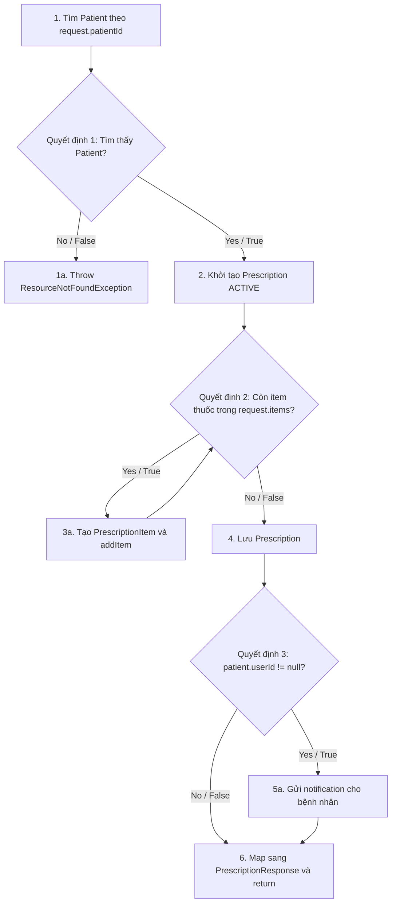
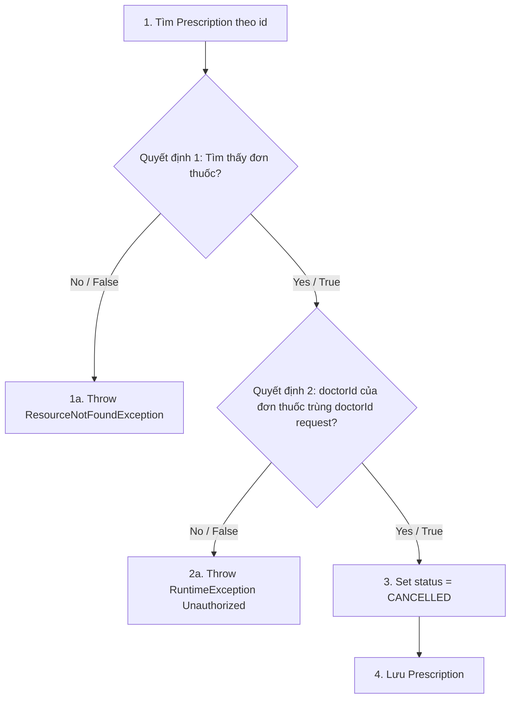
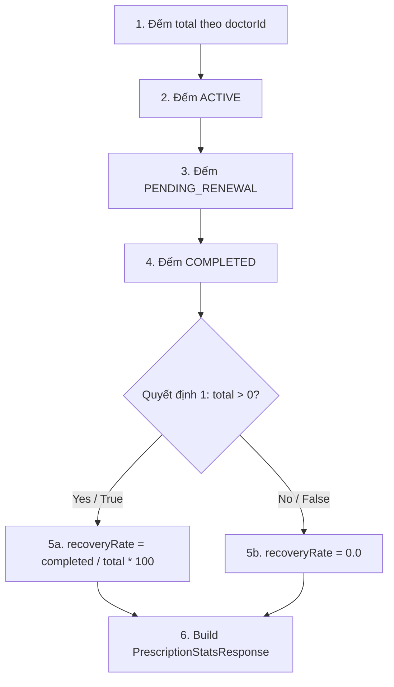
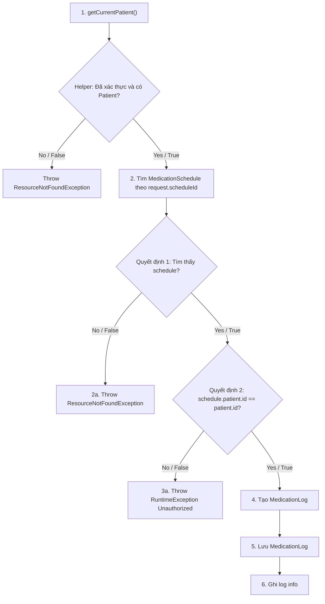
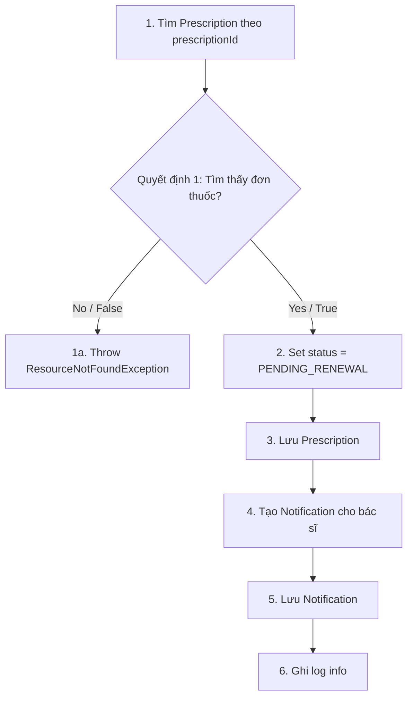
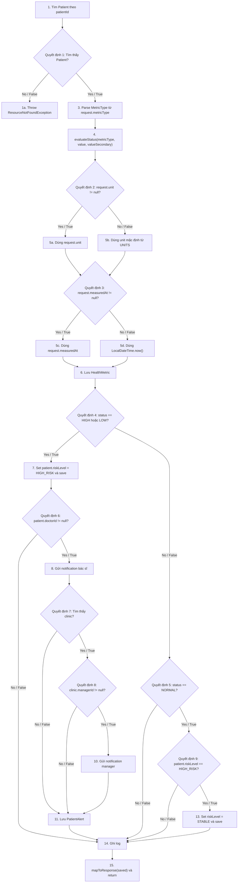

# ĐẶC TẢ KIỂM THỬ HỘP TRẮNG TOÀN DIỆN (WHITE-BOX TESTING SPECIFICATION)
## PHÂN HỆ: PRESCRIPTIONS & HEALTH METRICS

Tài liệu này cung cấp thiết kế kiểm thử hộp trắng cho **6 phương thức** thuộc `PrescriptionServiceImpl`, `PatientPrescriptionServiceImpl` và `PatientHealthMetricServiceImpl`.

1. **Control Flow Testing**
   - Statement Testing
   - Branch / Decision Testing
   - Branch Condition Testing
   - Branch Condition Combination Testing
2. **Data Flow Testing**
   - Xác định điểm định nghĩa biến (**Def**) và điểm sử dụng biến (**Use**).
   - Thiết kế các đường đi dòng dữ liệu (**DU-path**).

---

## DANH SÁCH 6 PHƯƠNG THỨC KIỂM THỬ

1. `createPrescription(Long doctorId, PrescriptionRequest request)`
2. `cancelPrescription(Long id, Long doctorId)`
3. `getPrescriptionStats(Long doctorId)`
4. `logMedication(LogMedicationRequest request)`
5. `requestRefill(Long prescriptionId)`
6. `recordMetricForPatient(Long patientId, CreateHealthMetricRequest request)`

---

## 1. Phương thức `createPrescription(Long doctorId, PrescriptionRequest request)`

### 1.1. Mã nguồn & Đồ thị dòng điều khiển (CFG)

```java
@Override
@Transactional
public PrescriptionResponse createPrescription(Long doctorId, PrescriptionRequest request) {
    Patient patient = patientRepository.findById(request.getPatientId()) // Node 1
            .orElseThrow(() -> new ResourceNotFoundException("Patient not found")); // Node 1a

    Prescription prescription = Prescription.builder() // Node 2
            .doctorId(doctorId)
            .patient(patient)
            .diagnosis(request.getDiagnosis())
            .status(PrescriptionStatus.ACTIVE)
            .notes(request.getNotes())
            .prescriptionCode("#RX-" + (int)(Math.random() * 10000))
            .build();

    request.getItems().forEach(itemDto -> { // Node 3
        prescription.addItem(PrescriptionItem.builder() // Node 3a
                .medicationName(itemDto.getMedicationName())
                .dosage(itemDto.getDosage())
                .usageInstructions(itemDto.getUsageInstructions())
                .build());
    });

    Prescription saved = Objects.requireNonNull(prescriptionRepository.save(prescription)); // Node 4

    if (patient.getUserId() != null) { // Node 5
        notificationService.sendNotification(...); // Node 5a
    }

    return prescriptionMapper.toResponseDTO(saved); // Node 6
}
```



### 1.2. Control Flow Testing

#### A. Statement & Branch/Decision Testing

| Mã TC | Dữ liệu đầu vào (Input) | Nhánh đi qua (Path) | Độ bao phủ câu lệnh | Độ bao phủ nhánh | Kết quả mong đợi |
| :--- | :--- | :--- | :--- | :--- | :--- |
| **TC-WB-CP-01** | `request.patientId = 999` không tồn tại | `1 -> 1a` | Node 1, Node 1a | Dec1 = False | Ném `ResourceNotFoundException("Patient not found")` |
| **TC-WB-CP-02** | Patient tồn tại, `items` có 1 thuốc, `patient.userId != null` | `1 -> 2 -> DecLoop(Yes) -> 3a -> DecLoop(No) -> 4 -> Dec3(Yes) -> 5a -> 6` | Node 1-6 | Dec1 True, DecLoop True/False, Dec3 True | Tạo đơn thuốc `ACTIVE`, lưu item, gửi notification, trả về `PrescriptionResponse` |
| **TC-WB-CP-03** | Patient tồn tại, `items` có 1 thuốc, `patient.userId = null` | `1 -> 2 -> DecLoop(Yes) -> 3a -> DecLoop(No) -> 4 -> Dec3(No) -> 6` | Node 1-4, Node 6 | Dec3 False | Tạo đơn thuốc thành công nhưng không gửi notification |
| **TC-WB-CP-04** | Patient tồn tại, `items` có nhiều thuốc | `1 -> 2 -> DecLoop(Yes) -> 3a -> DecLoop(Yes) -> 3a -> DecLoop(No) -> 4 -> ... -> 6` | Node 3a lặp nhiều lần | DecLoop lặp | Mỗi item trong request được chuyển thành `PrescriptionItem` |

#### B. Branch Condition Testing

Quyết định 3: `patient.getUserId() != null`

| Điều kiện | Giá trị cần phủ | Ca kiểm thử |
| :--- | :--- | :--- |
| `patient.getUserId() != null` | True | TC-WB-CP-02 |
| `patient.getUserId() != null` | False | TC-WB-CP-03 |

Vòng lặp item: `request.getItems().forEach(...)`

| Trường hợp | Ý nghĩa | Ca kiểm thử |
| :--- | :--- | :--- |
| 1 item | Thực thi thân vòng lặp một lần | TC-WB-CP-02 |
| Nhiều item | Thực thi thân vòng lặp nhiều lần | TC-WB-CP-04 |

#### C. Branch Condition Combination Testing

| Tổ hợp | Patient tồn tại | Có ít nhất 1 item | `patient.userId != null` | Kết quả |
| :--- | :---: | :---: | :---: | :--- |
| Combo 1 | False | Không xét | Không xét | Ném `ResourceNotFoundException` |
| Combo 2 | True | True | True | Lưu đơn + gửi notification |
| Combo 3 | True | True | False | Lưu đơn, bỏ qua notification |

### 1.3. Data Flow Testing

| Biến | Điểm định nghĩa (Def) | Điểm sử dụng (Use) | Loại sử dụng | DU-path kiểm tra | Mã TC kiểm tra |
| :--- | :--- | :--- | :--- | :--- | :--- |
| `doctorId` | Tham số đầu vào | `.doctorId(doctorId)` | C-use | `Param -> Node 2` | TC-WB-CP-02, 03 |
| `request` | Tham số đầu vào | `request.getPatientId()`, `getDiagnosis()`, `getItems()` | C-use | `Param -> Node 1/2/3` | TC-WB-CP-01, 02 |
| `patient` | Lấy từ `patientRepository.findById()` | `.patient(patient)`, `patient.getUserId()` | C-use/P-use | `Node 1 -> Node 2 -> Node 5` | TC-WB-CP-02, 03 |
| `prescription` | Builder tạo mới | `prescription.addItem()`, `save(prescription)` | C-use | `Node 2 -> Node 3a -> Node 4` | TC-WB-CP-02, 04 |
| `itemDto` | Phần tử trong `request.items` | Getter medication/dosage/instructions | C-use | `Node 3 -> Node 3a` | TC-WB-CP-02, 04 |
| `saved` | Kết quả `save()` | `toResponseDTO(saved)`, `saved.getPrescriptionCode()` | C-use | `Node 4 -> Node 5a/6` | TC-WB-CP-02 |

---

## 2. Phương thức `cancelPrescription(Long id, Long doctorId)`

### 2.1. Mã nguồn & Đồ thị dòng điều khiển (CFG)

```java
@Override
@Transactional
public void cancelPrescription(Long id, Long doctorId) {
    Prescription prescription = prescriptionRepository.findById(id) // Node 1
            .orElseThrow(() -> new ResourceNotFoundException("Prescription not found")); // Node 1a

    if (!prescription.getDoctorId().equals(doctorId)) { // Node 2
         throw new RuntimeException("Unauthorized"); // Node 2a
    }

    prescription.setStatus(PrescriptionStatus.CANCELLED); // Node 3
    prescriptionRepository.save(prescription); // Node 4
}
```



### 2.2. Control Flow Testing

| Mã TC | Dữ liệu đầu vào (Input) | Nhánh đi qua (Path) | Kết quả mong đợi |
| :--- | :--- | :--- | :--- |
| **TC-WB-CANRX-01** | `id = 999` không tồn tại | `1 -> 1a` | Ném `ResourceNotFoundException("Prescription not found")` |
| **TC-WB-CANRX-02** | Đơn tồn tại nhưng `prescription.doctorId = 2`, `doctorId = 99` | `1 -> Dec1(True) -> Dec2(False) -> 2a` | Ném `RuntimeException("Unauthorized")`, không lưu |
| **TC-WB-CANRX-03** | Đơn tồn tại và đúng bác sĩ | `1 -> Dec1(True) -> Dec2(True) -> 3 -> 4` | Chuyển status sang `CANCELLED` và lưu |

### 2.3. Data Flow Testing

| Biến | Điểm định nghĩa (Def) | Điểm sử dụng (Use) | Loại sử dụng | DU-path kiểm tra | Mã TC kiểm tra |
| :--- | :--- | :--- | :--- | :--- | :--- |
| `id` | Tham số đầu vào | `prescriptionRepository.findById(id)` | C-use | `Param -> Node 1` | TC-WB-CANRX-01, 03 |
| `doctorId` | Tham số đầu vào | `prescription.getDoctorId().equals(doctorId)` | P-use | `Param -> Node 2` | TC-WB-CANRX-02, 03 |
| `prescription` | Lấy từ repository | `getDoctorId()`, `setStatus()`, `save()` | P-use/C-use | `Node 1 -> Node 2 -> Node 3 -> Node 4` | TC-WB-CANRX-02, 03 |

---

## 3. Phương thức `getPrescriptionStats(Long doctorId)`

### 3.1. Mã nguồn & Đồ thị dòng điều khiển (CFG)

```java
@Override
@Transactional(readOnly = true)
public PrescriptionStatsResponse getPrescriptionStats(Long doctorId) {
    long total = prescriptionRepository.countByDoctorId(doctorId); // Node 1
    long active = prescriptionRepository.countByDoctorIdAndStatus(doctorId, PrescriptionStatus.ACTIVE); // Node 2
    long pending = prescriptionRepository.countByDoctorIdAndStatus(doctorId, PrescriptionStatus.PENDING_RENEWAL); // Node 3
    long completed = prescriptionRepository.countByDoctorIdAndStatus(doctorId, PrescriptionStatus.COMPLETED); // Node 4

    double recoveryRate = total > 0 ? ((double) completed / total) * 100 : 0.0; // Node 5

    return PrescriptionStatsResponse.builder() // Node 6
            .totalPrescriptions(total)
            .activePrescriptions(active)
            .pendingRenewals(pending)
            .completedPrescriptions(completed)
            .recoveryRate(Math.round(recoveryRate * 10.0) / 10.0)
            .build();
}
```



### 3.2. Control Flow Testing

| Mã TC | Dữ liệu đầu vào (Input) | Nhánh đi qua (Path) | Kết quả mong đợi |
| :--- | :--- | :--- | :--- |
| **TC-WB-STATS-01** | `total = 0`, `completed = 0` | `1 -> 2 -> 3 -> 4 -> Dec1(False) -> 5b -> 6` | `recoveryRate = 0.0`, không chia cho 0 |
| **TC-WB-STATS-02** | `total = 10`, `active = 4`, `pending = 1`, `completed = 5` | `1 -> 2 -> 3 -> 4 -> Dec1(True) -> 5a -> 6` | Trả stats đúng, `recoveryRate = 50.0` |
| **TC-WB-STATS-03** | `total = 3`, `completed = 2` | `1 -> 2 -> 3 -> 4 -> Dec1(True) -> 5a -> 6` | Làm tròn 1 chữ số thập phân: `66.7` |

### 3.3. Data Flow Testing

| Biến | Điểm định nghĩa (Def) | Điểm sử dụng (Use) | Loại sử dụng | DU-path kiểm tra | Mã TC kiểm tra |
| :--- | :--- | :--- | :--- | :--- | :--- |
| `doctorId` | Tham số đầu vào | Các hàm `countByDoctorId...` | C-use | `Param -> Node 1/2/3/4` | TC-WB-STATS-01, 02 |
| `total` | Kết quả `countByDoctorId()` | Điều kiện `total > 0`, builder `.totalPrescriptions(total)` | P-use/C-use | `Node 1 -> Node 5 -> Node 6` | TC-WB-STATS-01, 02 |
| `completed` | Kết quả count COMPLETED | Công thức recoveryRate, builder | C-use | `Node 4 -> Node 5 -> Node 6` | TC-WB-STATS-02, 03 |
| `recoveryRate` | Tính tại Node 5 | `Math.round(recoveryRate * 10.0)` | C-use | `Node 5 -> Node 6` | TC-WB-STATS-01, 03 |

---

## 4. Phương thức `logMedication(LogMedicationRequest request)`

### 4.1. Mã nguồn & Đồ thị dòng điều khiển (CFG)

```java
@Override
@Transactional
public void logMedication(LogMedicationRequest request) {
    Patient patient = getCurrentPatient(); // Node 1
    MedicationSchedule schedule = medicationScheduleRepository.findById(request.getScheduleId()) // Node 2
            .orElseThrow(() -> new ResourceNotFoundException("Schedule not found: " + request.getScheduleId())); // Node 2a

    if (!schedule.getPatient().getId().equals(patient.getId())) { // Node 3
        throw new RuntimeException("Unauthorized to log medication for this schedule"); // Node 3a
    }

    MedicationLog medicationLog = MedicationLog.builder() // Node 4
            .schedule(schedule)
            .patient(patient)
            .takenAt(LocalDateTime.now())
            .status(request.getStatus())
            .notes(request.getNotes())
            .build();

    medicationLogRepository.save(medicationLog); // Node 5
    log.info(...); // Node 6
}
```



### 4.2. Control Flow Testing

| Mã TC | Trạng thái hệ thống / Input | Nhánh đi qua (Path) | Kết quả mong đợi |
| :--- | :--- | :--- | :--- |
| **TC-WB-LM-01** | Chưa xác thực hoặc không có patient profile | `1 -> AuthErr` | Ném `ResourceNotFoundException` từ `getCurrentPatient()` |
| **TC-WB-LM-02** | Patient hợp lệ, `scheduleId` không tồn tại | `1 -> 2 -> Dec1(False) -> 2a` | Ném `ResourceNotFoundException("Schedule not found: ...")` |
| **TC-WB-LM-03** | Schedule tồn tại nhưng thuộc patient khác | `1 -> 2 -> Dec1(True) -> Dec2(False) -> 3a` | Ném `RuntimeException("Unauthorized to log medication for this schedule")` |
| **TC-WB-LM-04** | Schedule thuộc đúng patient, `status = "TAKEN"` | `1 -> 2 -> Dec1(True) -> Dec2(True) -> 4 -> 5 -> 6` | Tạo và lưu `MedicationLog` với `takenAt = now`, status/notes từ request |
| **TC-WB-LM-05** | Schedule đúng patient, `status = "MISSED"` hoặc `"SKIPPED"` | `1 -> 2 -> Dec1(True) -> Dec2(True) -> 4 -> 5 -> 6` | Vẫn lưu log với status tương ứng |

### 4.3. Data Flow Testing

| Biến | Điểm định nghĩa (Def) | Điểm sử dụng (Use) | Loại sử dụng | DU-path kiểm tra | Mã TC kiểm tra |
| :--- | :--- | :--- | :--- | :--- | :--- |
| `request` | Tham số đầu vào | `getScheduleId()`, `getStatus()`, `getNotes()` | C-use | `Param -> Node 2/4` | TC-WB-LM-02, 04 |
| `patient` | Kết quả `getCurrentPatient()` | So quyền, builder `.patient(patient)` | P-use/C-use | `Node 1 -> Node 3 -> Node 4` | TC-WB-LM-03, 04 |
| `schedule` | Kết quả repository | So quyền, builder `.schedule(schedule)` | P-use/C-use | `Node 2 -> Node 3 -> Node 4` | TC-WB-LM-03, 04 |
| `medicationLog` | Builder tạo mới | `medicationLogRepository.save(medicationLog)` | C-use | `Node 4 -> Node 5` | TC-WB-LM-04 |

---

## 5. Phương thức `requestRefill(Long prescriptionId)`

### 5.1. Mã nguồn & Đồ thị dòng điều khiển (CFG)

```java
@Override
@Transactional
public void requestRefill(Long prescriptionId) {
    Prescription prescription = prescriptionRepository.findById(prescriptionId) // Node 1
            .orElseThrow(() -> new ResourceNotFoundException("Prescription not found: " + prescriptionId)); // Node 1a
    prescription.setStatus(PrescriptionStatus.PENDING_RENEWAL); // Node 2
    prescriptionRepository.save(prescription); // Node 3

    Notification notification = Notification.builder() // Node 4
            .userId(prescription.getDoctorId())
            .title("Yêu cầu tái cấp thuốc")
            .message("Bệnh nhân " + prescription.getPatient().getFullName() + ...)
            .type("info")
            .read(false)
            .targetUrl("/doctor/patients/" + prescription.getPatient().getId())
            .build();
    notificationRepository.save(notification); // Node 5

    log.info("Prescription refill requested: id={}", prescriptionId); // Node 6
}
```



### 5.2. Control Flow Testing

| Mã TC | Dữ liệu đầu vào (Input) | Nhánh đi qua (Path) | Kết quả mong đợi |
| :--- | :--- | :--- | :--- |
| **TC-WB-RR-01** | `prescriptionId = 999` không tồn tại | `1 -> 1a` | Ném `ResourceNotFoundException("Prescription not found: 999")` |
| **TC-WB-RR-02** | Đơn thuốc tồn tại, có doctorId và patient | `1 -> Dec1(True) -> 2 -> 3 -> 4 -> 5 -> 6` | Chuyển status sang `PENDING_RENEWAL`, lưu đơn, tạo notification cho bác sĩ |

### 5.3. Data Flow Testing

| Biến | Điểm định nghĩa (Def) | Điểm sử dụng (Use) | Loại sử dụng | DU-path kiểm tra | Mã TC kiểm tra |
| :--- | :--- | :--- | :--- | :--- | :--- |
| `prescriptionId` | Tham số đầu vào | `findById(prescriptionId)`, `log.info()` | C-use | `Param -> Node 1/6` | TC-WB-RR-01, 02 |
| `prescription` | Kết quả repository | `setStatus()`, `save()`, `getDoctorId()`, `getPatient()` | C-use | `Node 1 -> Node 2 -> Node 3 -> Node 4` | TC-WB-RR-02 |
| `notification` | Builder tạo mới | `notificationRepository.save(notification)` | C-use | `Node 4 -> Node 5` | TC-WB-RR-02 |

---

## 6. Phương thức `recordMetricForPatient(Long patientId, CreateHealthMetricRequest request)`

### 6.1. Mã nguồn & Đồ thị dòng điều khiển (CFG)

```java
@Override
@Transactional
@CacheEvict(value = "clinic_dashboard", allEntries = true)
public HealthMetricResponse recordMetricForPatient(Long patientId, CreateHealthMetricRequest request) {
    Patient patient = patientRepository.findById(patientId) // Node 1
            .orElseThrow(() -> new ResourceNotFoundException("Patient not found with id: " + patientId)); // Node 1a
    return processAndSave(patient, request); // Node 2
}

private HealthMetricResponse processAndSave(Patient patient, CreateHealthMetricRequest request) {
    MetricType metricType = MetricType.valueOf(request.getMetricType()); // Node 3
    String status = evaluateStatus(metricType, request.getValue(), request.getValueSecondary()); // Node 4

    HealthMetric metric = HealthMetric.builder() // Node 5
            .patient(patient)
            .metricType(metricType)
            .value(request.getValue())
            .valueSecondary(request.getValueSecondary())
            .unit(request.getUnit() != null ? request.getUnit() : UNITS.getOrDefault(metricType, ""))
            .status(status)
            .notes(request.getNotes())
            .measuredAt(request.getMeasuredAt() != null ? request.getMeasuredAt() : LocalDateTime.now())
            .build();

    HealthMetric saved = Objects.requireNonNull(healthMetricRepository.save(metric)); // Node 6

    if ("HIGH".equals(status) || "LOW".equals(status)) { // Node 7
        patient.setRiskLevel("HIGH_RISK"); // Node 7a
        patientRepository.save(patient); // Node 7b

        if (patient.getDoctorId() != null) { // Node 8
            notificationService.sendNotification(patient.getDoctorId(), ...); // Node 8a
            clinicRepository.findById(patient.getClinicId()).ifPresent(clinic -> { // Node 9
                if (clinic.getManagerId() != null) { // Node 10
                    notificationService.sendNotification(clinic.getManagerId(), ...); // Node 10a
                }
            });
            patientAlertRepository.save(patientAlert); // Node 11
        }
    } else if ("NORMAL".equals(status)) { // Node 12
        if ("HIGH_RISK".equals(patient.getRiskLevel())) { // Node 13
            patient.setRiskLevel("STABLE"); // Node 13a
            patientRepository.save(patient); // Node 13b
        }
    }

    log.info(...); // Node 14
    return mapToResponse(saved); // Node 15
}
```



### 6.2. Control Flow Testing

#### A. Statement & Branch/Decision Testing

| Mã TC | Dữ liệu đầu vào / trạng thái | Nhánh đi qua (Path) | Kết quả mong đợi |
| :--- | :--- | :--- | :--- |
| **TC-WB-RM-01** | `patientId = 999` không tồn tại | `1 -> 1a` | Ném `ResourceNotFoundException("Patient not found with id: 999")` |
| **TC-WB-RM-02** | Patient tồn tại, `metricType = BLOOD_SUGAR`, `value = 5.5`, `unit != null`, `measuredAt != null`, risk hiện tại khác `HIGH_RISK` | `1 -> 3 -> 4 -> Unit(True) -> Measured(True) -> 6 -> Risk(False) -> Normal(True) -> Stable(False) -> 14 -> 15` | Lưu metric `NORMAL`, không đổi risk level |
| **TC-WB-RM-03** | Patient tồn tại, `metricType = BLOOD_SUGAR`, `value = 8.0`, `unit = null`, `measuredAt = null`, `doctorId = null` | `1 -> 3 -> 4 -> Unit(False) -> Measured(False) -> 6 -> Risk(True) -> 7 -> Doctor(False) -> 14 -> 15` | Lưu metric `HIGH`, dùng unit mặc định, set `HIGH_RISK`, không gửi notification |
| **TC-WB-RM-04** | Metric HIGH/LOW, `doctorId != null`, clinic không tồn tại | `... -> Risk(True) -> 7 -> Doctor(True) -> 8 -> Clinic(False) -> 11 -> 14 -> 15` | Gửi notification bác sĩ, lưu `PatientAlert`, không gửi manager |
| **TC-WB-RM-05** | Metric HIGH/LOW, `doctorId != null`, clinic tồn tại, `managerId != null` | `... -> Risk(True) -> 7 -> Doctor(True) -> 8 -> Clinic(True) -> Manager(True) -> 10 -> 11 -> 14 -> 15` | Gửi notification bác sĩ, manager và lưu patient alert |
| **TC-WB-RM-06** | Metric HIGH/LOW, clinic tồn tại nhưng `managerId = null` | `... -> Clinic(True) -> Manager(False) -> 11 -> 14 -> 15` | Không gửi notification manager |
| **TC-WB-RM-07** | `status = NORMAL`, `patient.riskLevel = HIGH_RISK` | `... -> Risk(False) -> Normal(True) -> Stable(True) -> 13 -> 14 -> 15` | Chuyển risk level sang `STABLE` |
| **TC-WB-RM-08** | `status = BORDERLINE_HIGH` hoặc `BORDERLINE_LOW` | `... -> Risk(False) -> Normal(False) -> 14 -> 15` | Lưu metric, không đổi risk level, không gửi cảnh báo |
| **TC-WB-RM-09** | `request.metricType = "INVALID"` | `1 -> 3` | Ném `IllegalArgumentException` từ `MetricType.valueOf()` |

#### B. Branch Condition Testing

Quyết định 4: `"HIGH".equals(status) || "LOW".equals(status)`

| Điều kiện | Giá trị cần phủ | Ca kiểm thử |
| :--- | :--- | :--- |
| `status == HIGH` | True | TC-WB-RM-03, 04, 05 |
| `status == LOW` | True | Có thể dùng `HEART_RATE = 50` hoặc `SPO2 = 85` |
| Cả hai đều False | False | TC-WB-RM-02, 08 |

Quyết định 6: `patient.getDoctorId() != null`

| Điều kiện | Giá trị cần phủ | Ca kiểm thử |
| :--- | :--- | :--- |
| `doctorId != null` | True | TC-WB-RM-04, 05 |
| `doctorId != null` | False | TC-WB-RM-03 |

Quyết định 9: `"HIGH_RISK".equals(patient.getRiskLevel())`

| Điều kiện | Giá trị cần phủ | Ca kiểm thử |
| :--- | :--- | :--- |
| Risk hiện tại là `HIGH_RISK` | True | TC-WB-RM-07 |
| Risk hiện tại khác `HIGH_RISK` | False | TC-WB-RM-02 |

#### C. Branch Condition Combination Testing

| Tổ hợp | `status` | `doctorId` | Clinic tồn tại | `managerId` | Risk hiện tại | Kết quả |
| :--- | :--- | :---: | :---: | :---: | :--- | :--- |
| Combo 1 | `HIGH` | null | Không xét | Không xét | Bất kỳ | Set `HIGH_RISK`, không gửi thông báo |
| Combo 2 | `HIGH`/`LOW` | Not null | False | Không xét | Bất kỳ | Gửi bác sĩ + patient alert |
| Combo 3 | `HIGH`/`LOW` | Not null | True | null | Bất kỳ | Gửi bác sĩ + patient alert, không gửi manager |
| Combo 4 | `HIGH`/`LOW` | Not null | True | Not null | Bất kỳ | Gửi bác sĩ + manager + patient alert |
| Combo 5 | `NORMAL` | Không xét | Không xét | Không xét | `HIGH_RISK` | Set `STABLE` |
| Combo 6 | `NORMAL` | Không xét | Không xét | Không xét | Khác `HIGH_RISK` | Không đổi risk |
| Combo 7 | `BORDERLINE_HIGH`/`BORDERLINE_LOW` | Không xét | Không xét | Không xét | Bất kỳ | Chỉ lưu metric |

### 6.3. Data Flow Testing

| Biến | Điểm định nghĩa (Def) | Điểm sử dụng (Use) | Loại sử dụng | DU-path kiểm tra | Mã TC kiểm tra |
| :--- | :--- | :--- | :--- | :--- | :--- |
| `patientId` | Tham số đầu vào | `patientRepository.findById(patientId)` | C-use | `Param -> Node 1` | TC-WB-RM-01, 02 |
| `request` | Tham số đầu vào | `getMetricType()`, `getValue()`, `getUnit()`, `getMeasuredAt()` | C-use/P-use | `Param -> Node 3/4/5` | TC-WB-RM-02, 03 |
| `patient` | Lấy từ repository | `processAndSave(patient, request)`, builder `.patient(patient)`, cập nhật risk | C-use | `Node 1 -> Node 2 -> Node 5/7/13` | TC-WB-RM-02, 07 |
| `metricType` | `MetricType.valueOf()` | `evaluateStatus()`, `UNITS.getOrDefault()`, notification title | C-use | `Node 3 -> Node 4/5/8` | TC-WB-RM-02, 05 |
| `status` | `evaluateStatus()` | Builder `.status(status)`, điều kiện risk/normal | P-use/C-use | `Node 4 -> Node 5 -> Node 7/12` | TC-WB-RM-02, 03, 08 |
| `metric` | Builder tạo mới | `healthMetricRepository.save(metric)` | C-use | `Node 5 -> Node 6` | TC-WB-RM-02 |
| `saved` | Kết quả `save(metric)` | Nội dung message, `mapToResponse(saved)` | C-use | `Node 6 -> Node 8/11/15` | TC-WB-RM-04, 05 |
| `patientAlert` | Builder tạo mới | `patientAlertRepository.save(patientAlert)` | C-use | `Node 11 builder -> Node 11 save` | TC-WB-RM-04, 05 |

---

## 7. Tổng hợp bộ ca kiểm thử hộp trắng

| Nhóm phương thức | Prefix TC | Số ca chính |
| :--- | :--- | :---: |
| `createPrescription` | TC-WB-CP | 4 |
| `cancelPrescription` | TC-WB-CANRX | 3 |
| `getPrescriptionStats` | TC-WB-STATS | 3 |
| `logMedication` | TC-WB-LM | 5 |
| `requestRefill` | TC-WB-RR | 2 |
| `recordMetricForPatient` | TC-WB-RM | 9 |
| **Tổng cộng** | | **26** |

---

## 8. Ghi chú triển khai

1. Các test service nên mock repository/mapper/notification bằng Mockito để kiểm chứng số lần gọi `save()` và `sendNotification()`.
2. Với `createPrescription`, DTO validation đã đảm bảo `items` không null và có ít nhất một phần tử ở tầng controller; unit test service vẫn nên có ca nhiều item để phủ vòng lặp.
3. Với `recordMetricForPatient`, cần tách dữ liệu theo loại chỉ số để ép `evaluateStatus()` trả về `NORMAL`, `HIGH`, `LOW`, `BORDERLINE_HIGH` và `BORDERLINE_LOW`.
4. Với các nhánh notification, kiểm tra cả trường hợp `doctorId = null`, clinic không tồn tại, clinic có manager và clinic không có manager.
